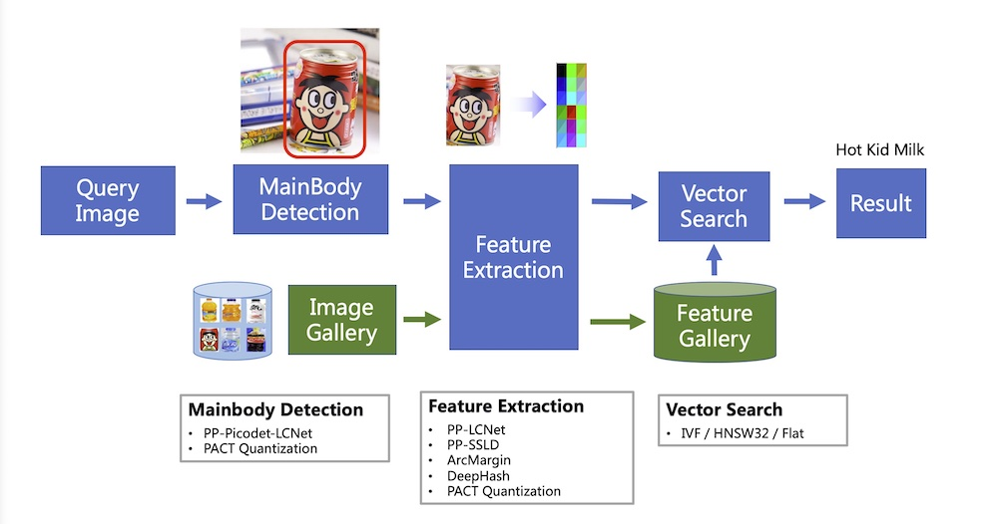
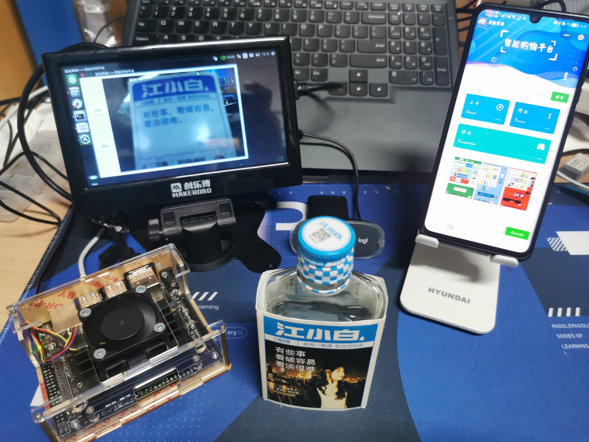
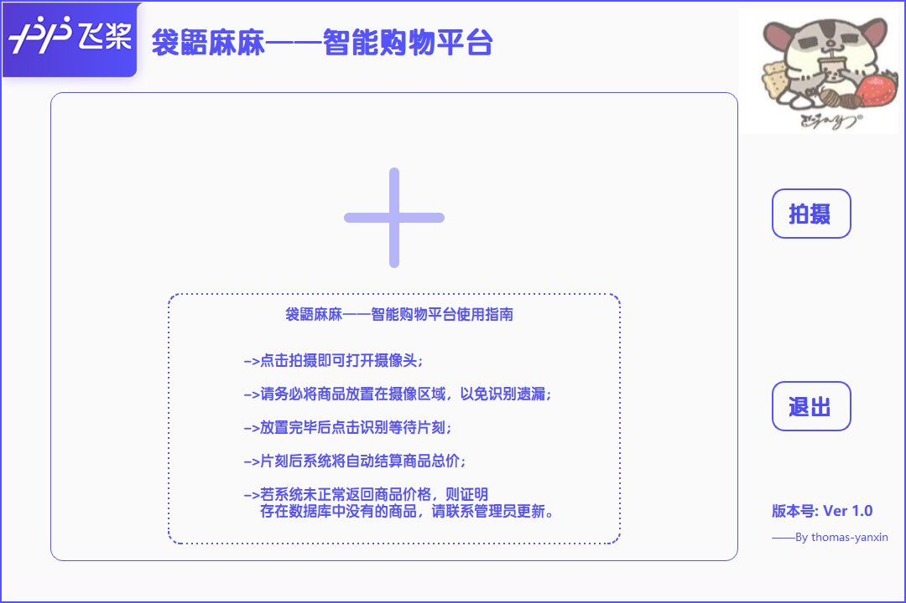
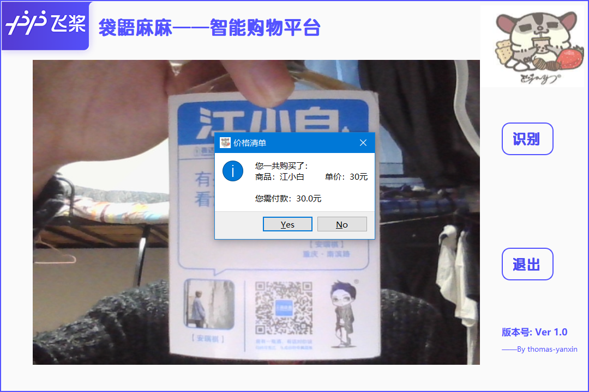
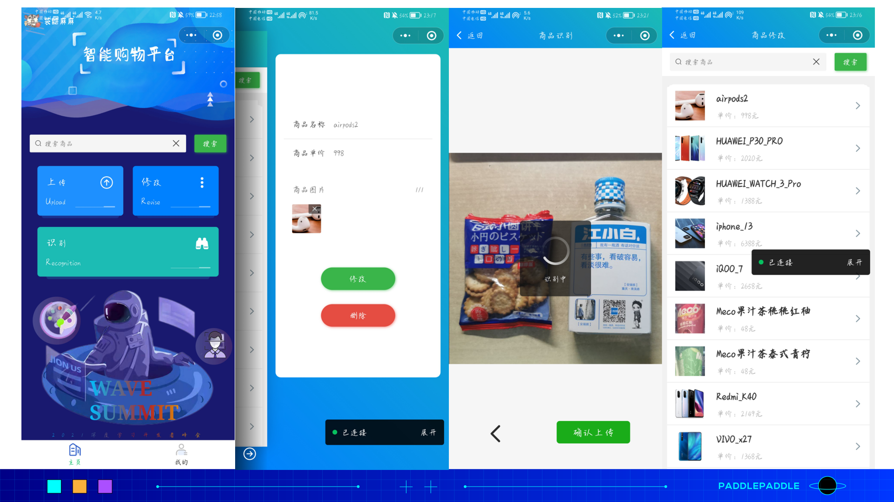

# 袋鼯麻麻——智能购物平台

## 项目背景
<font size=3 >目前在零售行业的实际运营过程中，会产生巨大的人力成本，例如导购、保洁、结算等，而其中，尤其需要花费大量的人力成本和时间成本在识别商品并对其进行价格结算的过程中，并且在此过程中，顾客也因此而需要排队等待。这样一来零售行业人力成本较大、工作效率极低，二来也使得顾客的购物体验下降。  
  
随着计算机视觉技术的发展，以及无人化、自动化超市运营理念的提出，利用图像识别技术及目标检测技术实现产品的自动识别及自动化结算的需求呼之欲出，及自动结账系统（Automatic checkout, ACO）。基于计算机视觉的自动结账系统能有效降低零售行业的运营成本，提高顾客结账效率，从而进一步提升用户在购物过程中的体验感与幸福感。  </font>

## 实现功能
<font size=3 >“**袋鼯麻麻——智能购物平台**”具体实现在零售过程中对用户购买商品的自动结算。即：利用PaddleClas团队开源的图像识别技术，精准地定位顾客购买的商品，并进行智能化、自动化的价格结算。当顾客将自己选购的商品放置在制定区域内时，“**袋鼯麻麻——智能购物平台**”能够精准地定位识别每一个商品，并且能够返回完整地购物清单及顾客应付的实际商品总价格，极大地降低零售行业实际运营过程中巨大的人力成本，提升零售行业无人化、自动化、智能化水平。  </font>  

<div align="center">

</div>

## 整体架构
<div align="center">

</div>


## 技术路线
<font size=3 >**袋鼯麻麻——智能购物平台** 基于[PaddleClas](https://github.com/PaddlePaddle/PaddleClas)作为主要的功能开发套件，利用其开源的[PP-ShiTu](https://arxiv.org/pdf/2111.00775.pdf)进行核心功能的开发，并通过PaddleInference将其部署于Jetson Nano，并基于[QPT](https://github.com/QPT-Family/QPT)打包.exe打通Windows系统，开发一套符合实际应用需求的工业级智能零售购物平台。  </font>

### [图像识别PP-ShiTu](https://arxiv.org/pdf/2111.00775.pdf)介绍

PP-ShiTu是一个实用的轻量级通用图像识别系统，主要由主体检测、特征学习和向量检索三个模块组成。该系统从骨干网络选择和调整、损失函数的选择、数据增强、学习率变换策略、正则化参数选择、预训练模型使用以及模型裁剪量化8个方面，采用多种策略，对各个模块的模型进行优化，最终得到在CPU上仅0.2s即可完成10w+库的图像识别的系统。

<div align="center">

</div>

<font size=3 >整个图像识别系统分为三步（[详情见PP-ShiTu训练模块](https://github.com/PaddlePaddle/PaddleClas/blob/release/2.3/docs/zh_CN/models_training/recognition.md)）：  
（1）通过一个目标检测模型，检测图像物体候选区域；  
（2）对每个候选区域进行特征提取；  
（3）与检索库中图像进行特征匹配，提取识别结果。

对于新的未知类别，无需重新训练模型，只需要在检索库补入该类别图像，重新建立检索库，就可以识别该类别。  </font>

### 数据集介绍
【The first one】:[Products-10K Large Scale Product Recognition Dataset](https://arxiv.org/abs/2006.12634)  

【The second one】:[RP2K: A Large-Scale Retail Product Dataset for Fine-Grained Image Classification](https://www.pinlandata.com/rp2k_dataset)  

**袋鼯麻麻——智能购物平台**基于上述两个数据集，并对此两种数据集进行适应性处理。  

目前处理后的数据集已在[AIStudio](https://aistudio.baidu.com/aistudio/datasetdetail/108651)开源。 </font>


## 部署方式
本项目已打通**Jetson Nano、Windows、linux**系统  
本项目全部代码百度网盘链接：https://pan.baidu.com/s/1hVMobt-SKIL6DZwhNohDAg   
               提取码：zcj9

<font size=3 >
  
  - Windows 端  
  
    使用[QPT](https://github.com/QPT-Family/QPT)打包的百度网盘 链接：https://pan.baidu.com/s/14YVSIioxWsyXQdNV_-Ydig   
  
     提取码：jpnl
  
    解压后运行**启动程序.exe**即可
  - Linux 端  
    Download本项目代码后，进入client文件夹内，执行以下代码即可运行：
    ```
      python client.py
     ```
  
  - 图像识别部分部署详情请见[PP-ShiTu部署](https://github.com/PaddlePaddle/PaddleClas/blob/release/2.3/docs/zh_CN/inference_deployment/python_deploy.md#%E4%B8%BB%E4%BD%93%E6%A3%80%E6%B5%8B%E3%80%81%E7%89%B9%E5%BE%81%E6%8F%90%E5%8F%96%E5%92%8C%E5%90%91%E9%87%8F%E6%A3%80%E7%B4%A2%E4%B8%B2%E8%81%94)
  
  - 微信小程序端
   打开微信开发者工具，导入系统文件夹下AIContainer文件夹并运行，即可运行小程序端；

## [bilibili](https://www.bilibili.com/video/BV19q4y1G7bx#reply5654379507)效果演示
- 主界面
  <div align="center"></div>
  
- 端侧界面  
 
<div align="center"></div>

<div align="center"></div>

- 小程序界面
  <div align="center">

</div>

## 特别鸣谢
  - [PaddleClas](https://github.com/PaddlePaddle/PaddleClas) 提供了图像识别核心功能开发；
  - [QPT打包工具](https://github.com/QPT-Family/QPT) 提供了Windows端.exe打包；

## 合作开发者
  [Scxw010516](https://github.com/Scxw010516)  、  [DXD-agumo](https://github.com/DXD-agumo)
