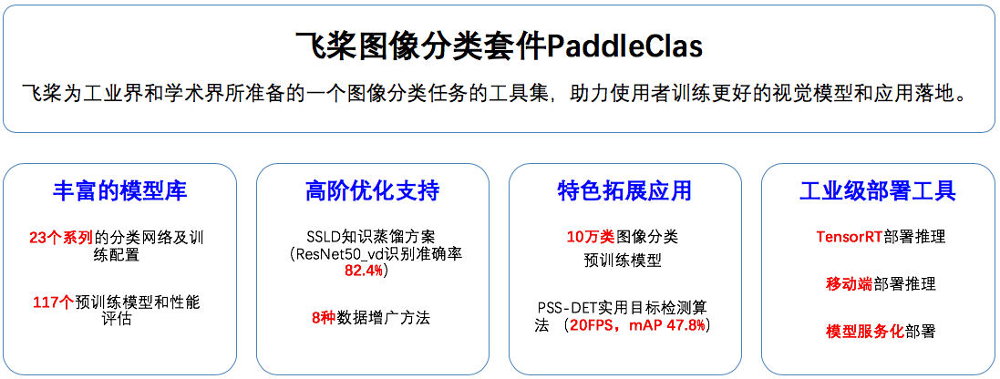
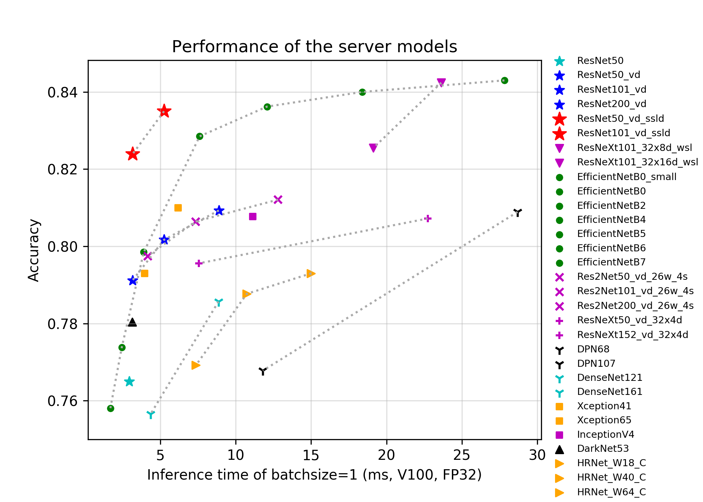
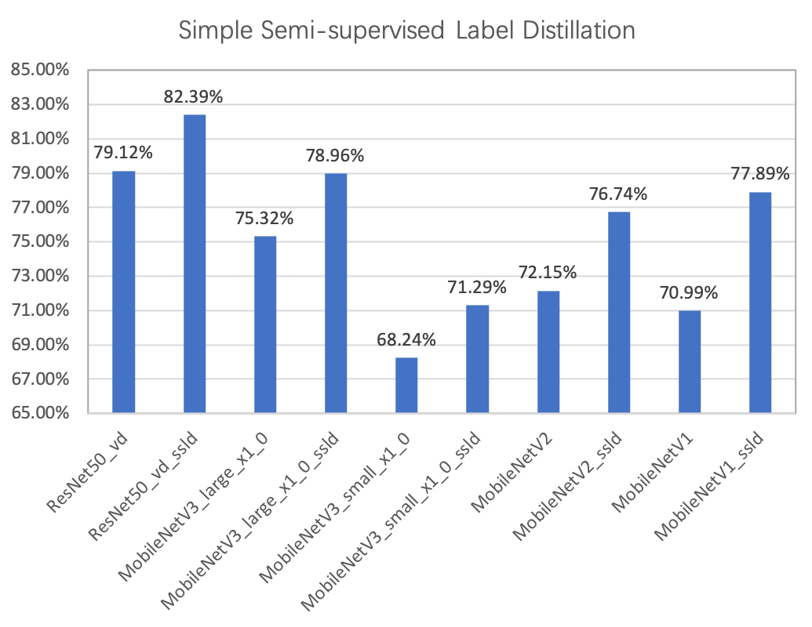

# PaddleClas

**文档教程**：https://paddleclas.readthedocs.io （正在持续更新中）

## 简介

    

## 丰富的模型库

基于ImageNet1k分类数据集，PaddleClas提供ResNet、ResNet_vd、EfficientNet、Res2Net、HRNet、MobileNetV3等23种系列的分类网络结构的简单介绍、论文指标复现配置，以及在复现过程中的训练技巧。与此同时，也提供了对应的117个图像分类预训练模型，并且基于TensorRT评估了服务器端模型的GPU预测时间，以及在骁龙855（SD855）上评估了移动端模型的CPU预测时间和存储大小。支持的***预训练模型列表、下载地址以及更多信息***请见文档教程中的[**模型库章节**](https://paddleclas.readthedocs.io/zh_CN/latest/models/models_intro.html)。

    

上图对比了一些最新的面向服务器端应用场景的模型，在使用V100，FP32和TensorRT预测一张图像的时间和其准确率，图中准确率82.4%的ResNet50_vd_ssld和83.7%的ResNet101_vd_ssld，是采用PaddleClas提供的SSLD知识蒸馏方案训练的模型。图中相同颜色和符号的点代表同一系列不同规模的模型。不同模型的简介、FLOPS、Parameters以及详细的GPU预测时间请参考文档教程中的[**模型库章节**](https://paddleclas.readthedocs.io/zh_CN/latest/models/models_intro.html)。

上图对比了一些最新的面向移动端应用场景的模型，在骁龙855（SD855）上预测一张图像的时间和其准确率，包括MobileNetV1系列、MobileNetV2系列、MobileNetV3系列和ShuffleNetV2系列。图中准确率79%的MV3_large_x1_0_ssld（M是MobileNet的简称），71.3%的MV3_small_x1_0_ssld、76.74%的MV2_ssld和77.89%的MV1_ssld，是采用PaddleClas提供的SSLD蒸馏方法训练的模型。MV3_large_x1_0_ssld_int8是进一步进行INT8量化的模型。不同模型的简介、FLOPS、Parameters和模型存储大小请参考文档教程中的[**模型库章节**](https://paddleclas.readthedocs.io/zh_CN/latest/models/models_intro.html)。

- TODO
- [ ] EfficientLite、GhostNet、RegNet论文指标复现和性能评估

## 高阶优化支持
除了提供丰富的分类网络结构和预训练模型，PaddleClas也支持了一系列有助于图像分类任务效果和效率提升的算法或工具。
### SSLD知识蒸馏

知识蒸馏是指使用教师模型(teacher model)去指导学生模型(student model)学习特定任务，保证小模型在参数量不变的情况下，得到比较大的效果提升，甚至获得与大模型相似的精度指标。PaddleClas提供了一种简单的半监督标签知识蒸馏方案（SSLD，Simple Semi-supervised Label Distillation），使用该方案，模型效果普遍提升3%以上，一些蒸馏模型提升效果如下图所示：

以在ImageNet1K蒸馏模型为例，SSLD知识蒸馏方案框架图如下，该方案的核心关键点包括教师模型的选择、loss计算方式、迭代轮数、无标签数据的使用、以及ImageNet1k蒸馏finetune，每部分的详细介绍以及实验介绍请参考文档教程中的[**知识蒸馏章节**](https://paddleclas.readthedocs.io/zh_CN/latest/advanced_tutorials/distillation/index.html)。

### 数据增广

在图像分类任务中，图像数据的增广是一种常用的正则化方法，可以有效提升图像分类的效果，尤其对于数据量不足或者模型网络较大的场景。常用的数据增广可以分为3类，图像变换类、图像裁剪类和图像混叠类，如下图所示。图像变换类是指对全图进行一些变换，例如AutoAugment，RandAugment。图像裁剪类是指对图像以一定的方式遮挡部分区域的变换，例如CutOut，RandErasing，HideAndSeek，GridMask。图像混叠类是指多张图进行混叠一张新图的变换，例如Mixup，Cutmix。

PaddleClas提供了上述8种数据增广算法的复现和在统一实验环境下的效果评估。下图展示了不同数据增广方式在ResNet50上的表现, 与标准变换相比，采用数据增广，识别准确率最高可以提升1%。每种数据增广方法的详细介绍、对比的实验环境请参考文档教程中的[**数据增广章节**](https://paddleclas.readthedocs.io/zh_CN/latest/advanced_tutorials/image_augmentation/index.html)。

## 开始使用
PaddleClas的安装说明、模型训练、预测、评估以及模型微调（finetune）请参考文档教程中的[**初级使用章节**](https://paddleclas.readthedocs.io/zh_CN/latest/tutorials/index.html)，SSLD知识蒸馏和数据增广的高阶使用正在持续更新中。

## 特色拓展应用

### 10万类图像分类预训练模型
在实际应用中，由于训练数据匮乏，往往将ImageNet1K数据集训练的分类模型作为预训练模型，进行图像分类的迁移学习。然而ImageNet1K数据集的类别只有1000种，预训练模型的特征迁移能力有限。因此百度自研了一个有语义体系的、粒度有粗有细的10w级别的Tag体系，通过人工或半监督方式，至今收集到 5500w+图片训练数据；该系统是国内甚至世界范围内最大规模的图片分类体系和训练集合。PaddleClas提供了在该数据集上训练的ResNet50_vd的模型。下表显示了一些实际应用场景中，使用ImageNet预训练模型和上述10万类图像分类预训练模型的效果比对，使用10万类图像分类预训练模型，识别准确率最高可以提升30%。
    
| 数据集   | 数据统计                | ImageNet预训练模型 | 10万类图像分类预训练模型 |
|:--:|:--:|:--:|:--:|
| 花卉    | class_num:102 train/val:5789/2396      | 0.7779        | 0.9892        |
| 手绘简笔画 | class_num:18 train/val:1007/432        | 0.8785        | 0.9107        |
| 植物叶子  | class_num:6 train/val:5256/2278        | 0.8212        | 0.8385        |
| 集装箱车辆 | class_num:115 train/val:4879/2094       | 0.623         | 0.9524        |
| 椅子    | class_num:5 train/val:169/784         | 0.8557        | 0.9077        |
| 地质    | class_num:4 train/val:671/296         | 0.5719        | 0.6781        |

10万类图像分类预训练模型下载地址如下，更多的相关内容请参考文档教程中的[**图像分类迁移学习章节**](https://paddleclas.readthedocs.io/zh_CN/latest/application/transfer_learning.html#id1)。

- [**10万类预训练模型下载地址**](https://paddle-imagenet-models-name.bj.bcebos.com/ResNet50_vd_10w_pretrained.tar)

### 通用目标检测

近年来，学术界和工业界广泛关注图像中目标检测任务，而图像分类的网络结构以及预训练模型效果直接影响目标检测的效果。PaddleClas基于82.39%的ResNet50_vd的预训练模型，结合PaddleDetection中丰富的检测算子，提供了一种面向服务器端应用的目标检测方案，PSS-DET (Practical Server Side Detection)。该方案融合了多种只增加少许计算量，但是可以有效提升两阶段Faster RCNN目标检测效果的策略，包括检测模型剪裁、使用分类效果更优的预训练模型、DCNv2、Cascade RCNN、AutoAugment、Libra sampling以及多尺度训练。其中基于82.39%的R50_vd_ssld预训练模型，与79.12%的R50_vd的预训练模型相比，检测效果可以提升1.5%。在COCO目标检测数据集上测试PSS-DET，当V100单卡预测速度为61FPS时，mAP是41.6%，预测速度为20FPS时，mAP是47.8%。详情请参考[**通用目标检测章节**](https://paddleclas.readthedocs.io/zh_CN/latest/application/object_detection.html)。

- TODO
- [ ] PaddleClas在OCR任务中的应用
- [ ] PaddleClas在人脸检测和识别中的应用

## 工业级应用部署工具
PaddlePaddle提供了一系列实用工具，便于工业应用部署PaddleClas，具体请参考文档教程中的[**实用工具章节**](https://paddleclas.readthedocs.io/zh_CN/latest/extension/index.html)。

- TensorRT预测
- Paddle-Lite
- 模型服务化部署
- 模型量化
- 多机训练
- Paddle Hub

## 护航视觉挑战赛
PaddleClas的建设源于百度实际视觉业务应用的淬炼和视觉前沿能力的探索，助力多个视觉重点赛事取得领先成绩，并且持续推进更多的前沿视觉问题的解决和落地应用。更多内容请关注文档教程中的[**赛事支持章节**](https://paddleclas.readthedocs.io/zh_CN/latest/competition_support.html)

- 2018年Kaggle Open Images V4图像目标检测挑战赛冠军
- 2019年Kaggle Open Images V5图像目标检测挑战赛亚军
- 2019年Kaggle地标检索挑战赛亚军
- 2019年Kaggle地标识别挑战赛亚军
- 首届多媒体信息识别技术竞赛中印刷文本OCR、人脸识别和地标识别三项任务A级证书

## 许可证书
本项目的发布受<a href="https://github.com/PaddlePaddle/PaddleCLS/blob/master/LICENSE">Apache 2.0 license</a>许可认证。

## 版本更新

## 如何贡献代码
我们非常欢迎你为PaddleClas贡献代码，也十分感谢你的反馈。
