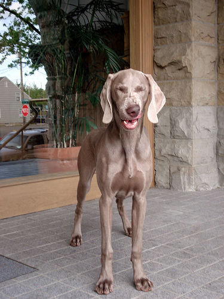

# An Energy and GPU-Computation Efficient Backbone Network for Real-Time Object Detection

## 目录

* [1. 简介](#1-简介)
* [2. 数据集和复现精度](#2-数据集和复现精度)
* [3. 准备数据与环境](#3-准备数据与环境)
   * [3.1 准备环境](#31-准备环境)
   * [3.2 准备数据](#32-准备数据)
   * [3.3 准备模型](#33-准备模型)
* [4. 开始使用](#4-开始使用)
   * [4.1 模型训练](#41-模型训练)
   * [4.2 模型评估](#42-模型评估)
   * [4.3 模型预测](#43-模型预测)
* [5. 模型推理部署](#5-模型推理部署)
* [6. 自动化测试脚本](#6-自动化测试脚本)
* [7. LICENSE](#7-license)
* [8. 参考链接与文献](#8-参考链接与文献)


## 1. 简介

这是一个PaddlePaddle实现的VoVNet（An Energy and GPU-Computation Efficient Backbone Network for Real-Time Object Detection）。

Figure 1: **在ImageNet-1K验证集上与不同的vision backbones进行比较。**

**论文:** [An Energy and GPU-Computation Efficient Backbone Network for Real-Time Object Detection](https://arxiv.org/abs/1904.09730)

**参考repo:** [VoVNet.pytorch](https://github.com/stigma0617/VoVNet.pytorch)


脚本任务：https://aistudio.baidu.com/aistudio/clusterprojectdetail/4492577

在此非常感谢`stigma0617`等人贡献的[VoVNet.pytorch](https://github.com/stigma0617/VoVNet.pytorch) ，提高了本repo复现论文的效率。


## 2. 数据集和复现精度

数据集为ImageNet，训练集包含1281167张图像，验证集包含50000张图像。

```
│imagenet/
├──train/
│  ├── n01440764
│  │   ├── n01440764_10026.JPEG
│  │   ├── n01440764_10027.JPEG
│  │   ├── ......
│  ├── ......
├──val/
│  ├── n01440764
│  │   ├── ILSVRC2012_val_00000293.JPEG
│  │   ├── ILSVRC2012_val_00002138.JPEG
│  │   ├── ......
│  ├── ......
```

您可以从[ImageNet 官网](https://image-net.org/)申请下载数据。

| 模型      | top1 acc (参考精度) | top1 acc (复现精度) | 权重 \| 训练日志 |
|:---------:|:------:|:----------:|:----------:|
| VoVNet-39| 0.7677   | 0.7680   | best_model.pdparams \| train.log |

权重及训练日志下载地址：[百度网盘](https://pan.baidu.com/s/1s7EAQiRnbPnWDRjA1VgPfw?pwd=w1xt)

## 3. 准备数据与环境


### 3.1 准备环境

硬件和框架版本等环境的要求如下：

- 硬件：4 * V100
- 框架：
  - PaddlePaddle = 2.3.1

* 下载代码

```bash
git clone https://github.com/renmada/PaddleClas
cd PaddleClas
git checkout -b vovnet
```

* 安装requirements

```bash
pip install -r requirements.txt
```

### 3.2 准备数据

如果您已经ImageNet1k数据集，那么该步骤可以跳过，如果您没有，则可以从[ImageNet官网](https://image-net.org/download.php)申请下载。

如果只是希望快速体验模型训练功能，可以参考：[飞桨训推一体认证（TIPC）开发文档](https://github.com/PaddlePaddle/models/blob/tipc/docs/tipc_test/README.md)


### 3.3 准备模型


如果您希望直接体验评估或者预测推理过程，可以直接根据第2章的内容下载提供的预训练模型，直接体验模型评估、预测、推理部署等内容。


## 4. 开始使用


### 4.1 模型训练

* 单机多卡训练
使用torch初始化转换的权重作为初始化权重
```shell
export CUDA_VISIBLE_DEVICES=0,1,2,3
python -m paddle.distributed.launch --gpus="0,1,2,3" \
    tools/train.py \
    -c ./ppcls/configs/ImageNet/VoVNet/VoVNet39.yaml \
    -o Global.pretrained_model=$TORCH_INIT \
    -o Global.seed=128
```

### 4.2 模型评估

```shell
export CUDA_VISIBLE_DEVICES=0,1,2,3
python -m paddle.distributed.launch --gpus="0,1,2,3" \
    tools/eval.py \
    -c ./ppcls/configs/ImageNet/VoVNet/VoVNet39.yaml \
    -o Global.pretrained_model=$TRAINED_MODEL
```

### 4.3 模型预测

```shell
python tools/infer.py \
    -c ./ppcls/configs/ImageNet/VoVNet/VoVNet39.yaml \
    -o Infer.infer_imgs=./deploy/images/ImageNet/ILSVRC2012_val_00020010.jpeg \
    -o Global.pretrained_model=$TRAINED_MODEL
```
<div align="center">
    
</div>

最终输出结果为
```
[{'class_ids': [178, 211, 209, 210, 181], 'scores': [0.99925, 0.00017, 0.00012, 9e-05, 7e-05], 'file_name': './deploy/images/ImageNet/ILSVRC2012_val_00020010.jpeg', 'label_names': ['Weimaraner', 'vizsla, Hungarian pointer', 'Chesapeake Bay retriever', 'German short-haired pointer', 'Bedlington terrier']}]```
表示预测的类别为`Weimaraner（魏玛猎狗）`，ID是`178`，置信度为`0.99925`。
```

## 5. 模型推理部署

### 5.1 基于Inference的推理

可以参考[模型导出](./docs/zh_CN/inference_deployment/export_model.md)，

将该模型转为 inference 模型只需运行如下命令：

```shell
python tools/export_model.py \
    -c ./ppcls/configs/ImageNet/VoVNet/VoVNet39.yaml \
    -o Global.save_inference_dir=./deploy/models/class_VoVNet39_ImageNet_infer \
    -o Global.pretrained_model=$TRAINED_MODEL
```

静态图模型推理
```shell
cd deploy
python python/predict_cls.py -c configs/inference_cls.yaml \
 -o Global.inference_model_dir=models/class_VoVNet39_ImageNet_infer \
  -o Global.infer_imgs=images/ImageNet/ILSVRC2012_val_00020010.jpeg
```
ILSVRC2012_val_00020010.jpeg:   class id(s): [178, 211, 209, 210, 181], score(s): [1.00, 0.00, 0.00, 0.00, 0.00], label_name(s): ['Weimaraner', 'vizsla, Hungarian pointer', 'Chesapeake Bay retriever', 'German short-haired pointer', 'Bedlington terrier']


## 6. 自动化测试脚本

**详细日志在test_tipc/output**

TIPC: [TIPC: test_tipc/README.md](./test_tipc/README.md)

首先安装auto_log，需要进行安装，安装方式如下：
```shell
pip install  https://paddleocr.bj.bcebos.com/libs/auto_log-1.2.0-py3-none-any.whl
```
进行TIPC：
```bash
# 准备数据
bash test_tipc/prepare.sh c_train_infer_python.txt 'lite_train_lite_infer'
# 运行测试
bash test_tipc/test_train_inference_python.sh c_train_infer_python.txt 'lite_train_lite_infer'
```
TIPC结果：

如果运行成功，在终端中会显示下面的内容，具体的日志也会输出到`test_tipc/output/`文件夹中的文件中。

```
Run successfully with command - python3.7 -m paddle.distributed.launch --gpus=0,1 train.py --lr=0.001 --data-path=./lite_data --device=cpu --output-dir=./test_tipc/output/norm_train_gpus_0,1_autocast_null --epochs=1     --batch-size=1    !  
 ...
Run successfully with command - python3.7 deploy/py_inference/infer.py --use-gpu=False --use-mkldnn=False --cpu-threads=6 --model-dir=./test_tipc/output/norm_train_gpus_0_autocast_null/ --batch-size=1     --benchmark=False     > ./test_tipc/output/python_infer_cpu_usemkldnn_False_threads_6_precision_null_batchsize_1.log 2>&1 !  
```

* 更多详细内容，请参考：[TIPC测试文档](./test_tipc/README.md)。

## 7. LICENSE

本项目的发布受[Apache 2.0 license](./LICENSE)许可认证。

## 8. 参考链接与文献
1. [An Energy and GPU-Computation Efficient Backbone Network for Real-Time Object Detection](https://arxiv.org/abs/1904.09730)
2. [VoVNet.pytorch](https://github.com/stigma0617/VoVNet.pytorch)
