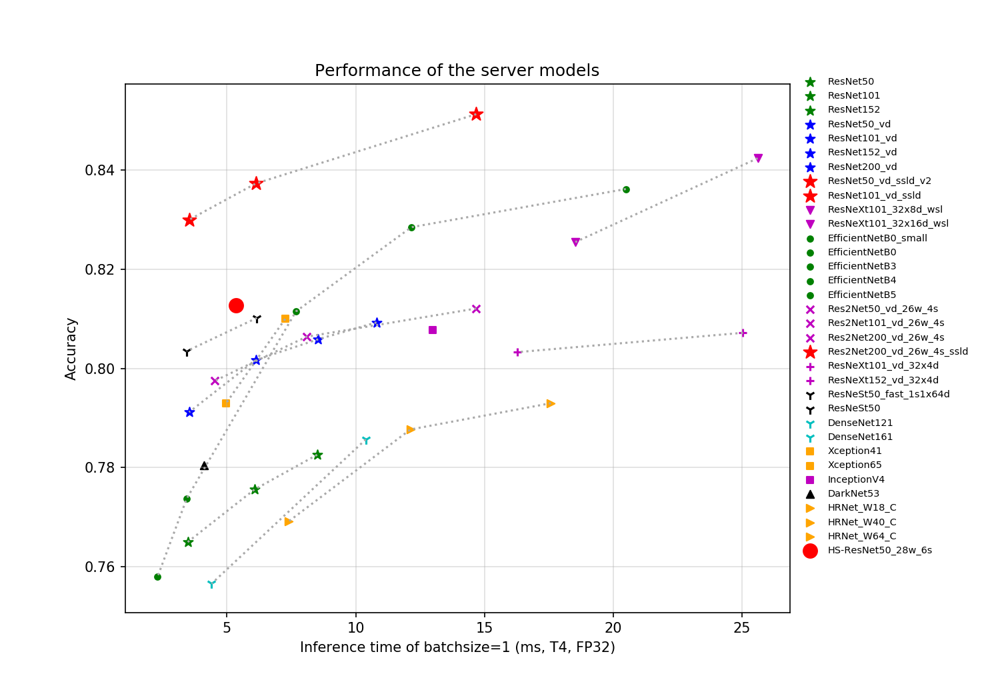

[简体中文](README_cn.md) | English

# PaddleClas

## Introduction

PaddleClas is a toolset for image classification tasks prepared for the industry and academia. It helps users train better computer vision models and apply them in real scenarios.

**Recent update**
- 2020.12.16 Add support for TensorRT when using cpp inference to obain more obvious acceleration.
- 2020.12.06 Add `SE_HRNet_W64_C_ssld` pretrained model, whose Top-1 Acc on ImageNet-1k dataset reaches 84.75%.
- 2020.11.23 Add `GhostNet_x1_3_ssld` pretrained model, whose Top-1 Acc on ImageNet-1k dataset reaches 79.38%.
- 2020.11.09 Add `InceptionV3` architecture and pretrained model, whose Top-1 Acc on ImageNet1k dataset reaches 79.1%.
- 2020.09.17 Add `Res2Net50_vd_26w_4s_ssld` pretrained model, whose Top-1 Acc on ImageNet-1k dataset reaches 83.1%. Add `Res2Net101_vd_26w_4s_ssld` pretrained model, whose Top-1 Acc on ImageNet-1k dataset reaches 83.9%.
- 2020.10.12 Add Paddle-Lite demo。
- 2020.10.10 Add cpp inference demo and improve FAQ tutorial.
- 2020.09.17 Add `HRNet_W48_C_ssld` pretrained model, whose Top-1 Acc on ImageNet-1k dataset reaches 83.62%. Add `ResNet34_vd_ssld` pretrained model, whose Top-1 Acc on ImageNet-1k dataset reaches 79.72%.
- 2020.09.07 Add `HRNet_W18_C_ssld` pretrained model, whose Top-1 Acc on ImageNet-1k dataset reaches 81.16%.
- [more](./docs/en/update_history_en.md)

## Features

- Rich model zoo. Based on the ImageNet-1k classification dataset, PaddleClas provides 29 series of classification network structures and training configurations, 134 models' pretrained weights and their evaluation metrics.

- SSLD Knowledge Distillation. Based on this SSLD distillation strategy, the top-1 acc of the distilled model is generally increased by more than 3%.

- Data augmentation: PaddleClas provides detailed introduction of 8 data augmentation algorithms such as AutoAugment, Cutout, Cutmix, code reproduction and effect evaluation in a unified experimental environment.

- Pretrained model with 100,000 categories: Based on `ResNet50_vd` model, Baidu open sourced the `ResNet50_vd` pretrained model trained on a 100,000-category dataset. In some practical scenarios, the accuracy based on the pretrained weights can be increased by up to 30%.

- A variety of training modes, including multi-machine training, mixed precision training, etc.

- A variety of inference and deployment solutions, including TensorRT inference, Paddle-Lite inference, model service deployment, model quantification, Paddle Hub, etc.

- Support Linux, Windows, macOS and other systems.

## Community

* Scan the QR code below with your Wechat and send the message `分类` out, then you will be invited into the official technical exchange group.

* You can also scan the QQ group QR code to enter the PaddleClas QQ group. Look forward to your participation.

## Tutorials

- [Installation](./docs/en/tutorials/install_en.md)
- [Quick start PaddleClas in 30 minutes](./docs/en/tutorials/quick_start_en.md)
- [Model introduction and model zoo](./docs/en/models/models_intro_en.md)
    - [Model zoo overview](#Model_zoo_overview)
    - [SSLD pretrained models](#SSLD_pretrained_series)
    - [ResNet and Vd series](#ResNet_and_Vd_series)
    - [Mobile series](#Mobile_series)
    - [SEResNeXt and Res2Net series](#SEResNeXt_and_Res2Net_series)
    - [DPN and DenseNet series](#DPN_and_DenseNet_series)
    - [HRNet series](#HRNet_series)
    - [Inception series](#Inception_series)
    - [EfficientNet and ResNeXt101_wsl series](#EfficientNet_and_ResNeXt101_wsl_series)
    - [ResNeSt and RegNet series](#ResNeSt_and_RegNet_series)
    - [Others](#Others)
    - HS-ResNet: arxiv link: [https://arxiv.org/pdf/2010.07621.pdf](https://arxiv.org/pdf/2010.07621.pdf). Code and models are coming soon!
- Model training/evaluation
    - [Data preparation](./docs/en/tutorials/data_en.md)
    - [Model training and finetuning](./docs/en/tutorials/getting_started_en.md)
    - [Model evaluation](./docs/en/tutorials/getting_started_en.md)
    - [Configuration details](./docs/en/tutorials/config_en.md)
- Model prediction/inference
    - [Prediction based on training engine](./docs/en/tutorials/getting_started_en.md)
    - [Python inference](./docs/en/tutorials/getting_started_en.md)
    - [C++ inference](./deploy/cpp_infer/readme_en.md)
    - [Serving deployment](./deploy/hubserving/readme_en.md)
    - [Mobile](./deploy/lite/readme_en.md)
    - [Model Quantization and Compression](docs/en/extension/paddle_quantization_en.md)
- Advanced tutorials
    - [Knowledge distillation](./docs/en/advanced_tutorials/distillation/distillation_en.md)
    - [Data augmentation](./docs/en/advanced_tutorials/image_augmentation/ImageAugment_en.md)
- Applications
    - [Transfer learning](./docs/en/application/transfer_learning_en.md)
    - [Pretrained model with 100,000 categories](./docs/en/application/transfer_learning_en.md)
    - [Generic object detection](./docs/en/application/object_detection_en.md)
- FAQ
    - [General image classification problems](./docs/en/faq_en.md)
    - [PaddleClas FAQ](./docs/en/faq_en.md)
- [Competition support](./docs/en/competition_support_en.md)
- [License](#License)
- [Contribution](#Contribution)

### Model zoo overview

Based on the ImageNet-1k classification dataset, the 24 classification network structures supported by PaddleClas and the corresponding 122 image classification pretrained models are shown below. Training trick, a brief introduction to each series of network structures, and performance evaluation will be shown in the corresponding chapters. The  evaluation environment is as follows.

* CPU evaluation environment is based on Snapdragon 855 (SD855).
* The GPU evaluation speed is measured by running 500 times under the FP32+TensorRT configuration (excluding the warmup time of the first 10 times).

Curves of accuracy to the inference time of common server-side models are shown as follows.

Curves of accuracy to the inference time and storage size of common mobile-side models are shown as follows.

### SSLD pretrained models
Accuracy and inference time of the prtrained models based on SSLD distillation are as follows. More detailed information can be refered to [SSLD distillation tutorial](./docs/en/advanced_tutorials/distillation/distillation_en.md).

* Server-side distillation pretrained models

| Model                  | Top-1 Acc | Reference Top-1 Acc | Acc gain | time(ms) bs=1 | time(ms) bs=4 | Flops(G) | Params(M) | Download Address                                                                                         |
|---------------------|-----------|-----------|---------------|----------------|-----------|----------|-----------|-----------------------------------|
| ResNet34_vd_ssld         | 0.797    | 0.760  | 0.037  | 2.434               | 6.222              | 7.39     | 21.82     | [Download link](https://paddle-imagenet-models-name.bj.bcebos.com/dygraph/ResNet34_vd_ssld_pretrained.pdparams)         |
| ResNet50_vd_ ssld    | 0.824    | 0.791    | 0.033 |  3.531               | 8.090              | 8.67     | 25.58     | [Download link](https://paddle-imagenet-models-name.bj.bcebos.com/dygraph/ResNet50_vd_ssld_pretrained.pdparams)    |
| ResNet50_vd_ ssld_v2 | 0.830    | 0.792    | 0.039 | 3.531               | 8.090              | 8.67     | 25.58     | [Download link](https://paddle-imagenet-models-name.bj.bcebos.com/dygraph/ResNet50_vd_ssld_v2_pretrained.pdparams) |
| ResNet101_vd_ ssld   | 0.837    | 0.802    | 0.035 |  6.117               | 13.762             | 16.1     | 44.57     | [Download link](https://paddle-imagenet-models-name.bj.bcebos.com/dygraph/ResNet101_vd_ssld_pretrained.pdparams)   |
| Res2Net50_vd_ 26w_4s_ssld | 0.831    | 0.798    | 0.033 |  4.527              | 9.657             | 8.37     | 25.06     | [Download link](https://paddle-imagenet-models-name.bj.bcebos.com/dygraph/Res2Net200_vd_26w_4s_ssld_pretrained.pdparams) |
| Res2Net101_vd_ 26w_4s_ssld | 0.839    | 0.806    | 0.033 | 8.087              | 17.312             | 16.67    | 45.22     | [Download link](https://paddle-imagenet-models-name.bj.bcebos.com/dygraph/Res2Net200_vd_26w_4s_ssld_pretrained.pdparams) |
| Res2Net200_vd_ 26w_4s_ssld | 0.851    | 0.812    | 0.049 | 14.678              | 32.350             | 31.49    | 76.21     | [Download link](https://paddle-imagenet-models-name.bj.bcebos.com/dygraph/Res2Net200_vd_26w_4s_ssld_pretrained.pdparams) |
| HRNet_W18_C_ssld | 0.812    | 0.769   | 0.043 | 7.406          | 13.297         | 4.14     | 21.29     | [Download link](https://paddle-imagenet-models-name.bj.bcebos.com/dygraph/HRNet_W18_C_ssld_pretrained.pdparams) |
| HRNet_W48_C_ssld | 0.836    | 0.790   | 0.046  | 13.707         | 34.435         | 34.58    | 77.47     | [Download link](https://paddle-imagenet-models-name.bj.bcebos.com/dygraph/HRNet_W48_C_ssld_pretrained.pdparams) |
| SE_HRNet_W64_C_ssld | 0.848    |  -    |  - |  31.697      |     94.995      | 57.83    | 128.97    | [Download link](https://paddle-imagenet-models-name.bj.bcebos.com/dygraph/SE_HRNet_W64_C_ssld_pretrained.pdparams) |

* Mobile-side distillation pretrained models

| Model                  | Top-1 Acc | Reference Top-1 Acc | Acc gain | SD855 time(ms) bs=1 | Flops(G) | Params(M) | Model size(M) | Download Address   |
|---------------------|-----------|-----------|---------------|----------------|-----------|----------|-----------|-----------------------------------|
| MobileNetV1_ ssld   | 0.779    | 0.710    | 0.069 |  32.523              | 1.11     | 4.19      | 16      | [Download link](https://paddle-imagenet-models-name.bj.bcebos.com/dygraph/MobileNetV1_ssld_pretrained.pdparams)                 |
| MobileNetV2_ ssld                 | 0.767    | 0.722  | 0.045  | 23.318              | 0.6      | 3.44      | 14      | [Download link](https://paddle-imagenet-models-name.bj.bcebos.com/dygraph/MobileNetV2_ssld_pretrained.pdparams)                 |
| MobileNetV3_ small_x0_35_ssld          | 0.556    | 0.530 | 0.026   | 2.635                 | 0.026    | 1.66      | 6.9     | [Download link](https://paddle-imagenet-models-name.bj.bcebos.com/dygraph/MobileNetV3_small_x0_35_ssld_pretrained.pdparams)          |
| MobileNetV3_ large_x1_0_ssld      | 0.790    | 0.753  | 0.036  | 19.308           | 0.45     | 5.47      | 21      | [Download link](https://paddle-imagenet-models-name.bj.bcebos.com/dygraph/MobileNetV3_large_x1_0_ssld_pretrained.pdparams)      |
| MobileNetV3_small_ x1_0_ssld      | 0.713    | 0.682  |  0.031  | 6.546                 | 0.123    | 2.94      | 12      | [Download link](https://paddle-imagenet-models-name.bj.bcebos.com/dygraph/MobileNetV3_small_x1_0_ssld_pretrained.pdparams)      |
| GhostNet_ x1_3_ssld                    | 0.794    | 0.757   | 0.037 | 19.983                | 0.44     | 7.3       | 29      | [Download link](https://paddle-imagenet-models-name.bj.bcebos.com/dygraph/GhostNet_x1_3_ssld_pretrained.pdparams)               |

* Note: `Reference Top-1 Acc` means accuracy of pretrained models which are trained on ImageNet1k dataset.

### ResNet and Vd series

Accuracy and inference time metrics of ResNet and Vd series models are shown as follows. More detailed information can be refered to [ResNet and Vd series tutorial](./docs/en/models/ResNet_and_vd_en.md).

| Model                 | Top-1 Acc | Top-5 Acc | time(ms) bs=1 | time(ms) bs=4 | Flops(G) | Params(M) | Download Address                                                                                         |
|---------------------|-----------|-----------|-----------------------|----------------------|----------|-----------|----------------------------------------------------------------------------------------------|
| ResNet18            | 0.7098    | 0.8992    | 1.45606               | 3.56305              | 3.66     | 11.69     | [Download link](https://paddle-imagenet-models-name.bj.bcebos.com/dygraph/ResNet18_pretrained.pdparams)            |
| ResNet18_vd         | 0.7226    | 0.9080    | 1.54557               | 3.85363              | 4.14     | 11.71     | [Download link](https://paddle-imagenet-models-name.bj.bcebos.com/dygraph/ResNet18_vd_pretrained.pdparams)         |
| ResNet34            | 0.7457    | 0.9214    | 2.34957               | 5.89821              | 7.36     | 21.8      | [Download link](https://paddle-imagenet-models-name.bj.bcebos.com/dygraph/ResNet34_pretrained.pdparams)            |
| ResNet34_vd         | 0.7598    | 0.9298    | 2.43427               | 6.22257              | 7.39     | 21.82     | [Download link](https://paddle-imagenet-models-name.bj.bcebos.com/dygraph/ResNet34_vd_pretrained.pdparams)         |
| ResNet34_vd_ssld         | 0.7972    | 0.9490    | 2.43427               | 6.22257              | 7.39     | 21.82     | [Download link](https://paddle-imagenet-models-name.bj.bcebos.com/dygraph/ResNet34_vd_ssld_pretrained.pdparams)         |
| ResNet50            | 0.7650    | 0.9300    | 3.47712               | 7.84421              | 8.19     | 25.56     | [Download link](https://paddle-imagenet-models-name.bj.bcebos.com/dygraph/ResNet50_pretrained.pdparams)            |
| ResNet50_vc         | 0.7835    | 0.9403    | 3.52346               | 8.10725              | 8.67     | 25.58     | [Download link](https://paddle-imagenet-models-name.bj.bcebos.com/dygraph/ResNet50_vc_pretrained.pdparams)         |
| ResNet50_vd         | 0.7912    | 0.9444    | 3.53131               | 8.09057              | 8.67     | 25.58     | [Download link](https://paddle-imagenet-models-name.bj.bcebos.com/dygraph/ResNet50_vd_pretrained.pdparams)         |
| ResNet50_vd_v2      | 0.7984    | 0.9493    | 3.53131               | 8.09057              | 8.67     | 25.58     | [Download link](https://paddle-imagenet-models-name.bj.bcebos.com/dygraph/ResNet50_vd_v2_pretrained.pdparams)      |
| ResNet101           | 0.7756    | 0.9364    | 6.07125               | 13.40573             | 15.52    | 44.55     | [Download link](https://paddle-imagenet-models-name.bj.bcebos.com/dygraph/ResNet101_pretrained.pdparams)           |
| ResNet101_vd        | 0.8017    | 0.9497    | 6.11704               | 13.76222             | 16.1     | 44.57     | [Download link](https://paddle-imagenet-models-name.bj.bcebos.com/dygraph/ResNet101_vd_pretrained.pdparams)        |
| ResNet152           | 0.7826    | 0.9396    | 8.50198               | 19.17073             | 23.05    | 60.19     | [Download link](https://paddle-imagenet-models-name.bj.bcebos.com/dygraph/ResNet152_pretrained.pdparams)           |
| ResNet152_vd        | 0.8059    | 0.9530    | 8.54376               | 19.52157             | 23.53    | 60.21     | [Download link](https://paddle-imagenet-models-name.bj.bcebos.com/dygraph/ResNet152_vd_pretrained.pdparams)        |
| ResNet200_vd        | 0.8093    | 0.9533    | 10.80619              | 25.01731             | 30.53    | 74.74     | [Download link](https://paddle-imagenet-models-name.bj.bcebos.com/dygraph/ResNet200_vd_pretrained.pdparams)        |
| ResNet50_vd_ ssld    | 0.8239    | 0.9610    | 3.53131               | 8.09057              | 8.67     | 25.58     | [Download link](https://paddle-imagenet-models-name.bj.bcebos.com/dygraph/ResNet50_vd_ssld_pretrained.pdparams)    |
| ResNet50_vd_ ssld_v2 | 0.8300    | 0.9640    | 3.53131               | 8.09057              | 8.67     | 25.58     | [Download link](https://paddle-imagenet-models-name.bj.bcebos.com/dygraph/ResNet50_vd_ssld_v2_pretrained.pdparams) |
| ResNet101_vd_ ssld   | 0.8373    | 0.9669    | 6.11704               | 13.76222             | 16.1     | 44.57     | [Download link](https://paddle-imagenet-models-name.bj.bcebos.com/dygraph/ResNet101_vd_ssld_pretrained.pdparams)   |

### Mobile series

Accuracy and inference time metrics of Mobile series models are shown as follows. More detailed information can be refered to [Mobile series tutorial](./docs/en/models/Mobile_en.md).

| Model                              | Top-1 Acc | Top-5 Acc | SD855 time(ms) bs=1 | Flops(G) | Params(M) | Model storage size(M) | Download Address                                                                                                      |
|----------------------------------|-----------|-----------|------------------------|----------|-----------|---------|-----------------------------------------------------------------------------------------------------------|
| MobileNetV1_ x0_25                | 0.5143    | 0.7546    | 3.21985                | 0.07     | 0.46      | 1.9     | [Download link](https://paddle-imagenet-models-name.bj.bcebos.com/dygraph/MobileNetV1_x0_25_pretrained.pdparams)                |
| MobileNetV1_ x0_5                 | 0.6352    | 0.8473    | 9.579599               | 0.28     | 1.31      | 5.2     | [Download link](https://paddle-imagenet-models-name.bj.bcebos.com/dygraph/MobileNetV1_x0_5_pretrained.pdparams)                 |
| MobileNetV1_ x0_75                | 0.6881    | 0.8823    | 19.436399              | 0.63     | 2.55      | 10      | [Download link](https://paddle-imagenet-models-name.bj.bcebos.com/dygraph/MobileNetV1_x0_75_pretrained.pdparams)                |
| MobileNetV1                      | 0.7099    | 0.8968    | 32.523048              | 1.11     | 4.19      | 16      | [Download link](https://paddle-imagenet-models-name.bj.bcebos.com/dygraph/MobileNetV1_pretrained.pdparams)                      |
| MobileNetV1_ ssld                 | 0.7789    | 0.9394    | 32.523048              | 1.11     | 4.19      | 16      | [Download link](https://paddle-imagenet-models-name.bj.bcebos.com/dygraph/MobileNetV1_ssld_pretrained.pdparams)                 |
| MobileNetV2_ x0_25                | 0.5321    | 0.7652    | 3.79925                | 0.05     | 1.5       | 6.1     | [Download link](https://paddle-imagenet-models-name.bj.bcebos.com/dygraph/MobileNetV2_x0_25_pretrained.pdparams)                |
| MobileNetV2_ x0_5                 | 0.6503    | 0.8572    | 8.7021                 | 0.17     | 1.93      | 7.8     | [Download link](https://paddle-imagenet-models-name.bj.bcebos.com/dygraph/MobileNetV2_x0_5_pretrained.pdparams)                 |
| MobileNetV2_ x0_75                | 0.6983    | 0.8901    | 15.531351              | 0.35     | 2.58      | 10      | [Download link](https://paddle-imagenet-models-name.bj.bcebos.com/dygraph/MobileNetV2_x0_75_pretrained.pdparams)                |
| MobileNetV2                      | 0.7215    | 0.9065    | 23.317699              | 0.6      | 3.44      | 14      | [Download link](https://paddle-imagenet-models-name.bj.bcebos.com/dygraph/MobileNetV2_pretrained.pdparams)                      |
| MobileNetV2_ x1_5                 | 0.7412    | 0.9167    | 45.623848              | 1.32     | 6.76      | 26      | [Download link](https://paddle-imagenet-models-name.bj.bcebos.com/dygraph/MobileNetV2_x1_5_pretrained.pdparams)                 |
| MobileNetV2_ x2_0                 | 0.7523    | 0.9258    | 74.291649              | 2.32     | 11.13     | 43      | [Download link](https://paddle-imagenet-models-name.bj.bcebos.com/dygraph/MobileNetV2_x2_0_pretrained.pdparams)                 |
| MobileNetV2_ ssld                 | 0.7674    | 0.9339    | 23.317699              | 0.6      | 3.44      | 14      | [Download link](https://paddle-imagenet-models-name.bj.bcebos.com/dygraph/MobileNetV2_ssld_pretrained.pdparams)                 |
| MobileNetV3_ large_x1_25          | 0.7641    | 0.9295    | 28.217701              | 0.714    | 7.44      | 29      | [Download link](https://paddle-imagenet-models-name.bj.bcebos.com/dygraph/MobileNetV3_large_x1_25_pretrained.pdparams)          |
| MobileNetV3_ large_x1_0           | 0.7532    | 0.9231    | 19.30835               | 0.45     | 5.47      | 21      | [Download link](https://paddle-imagenet-models-name.bj.bcebos.com/dygraph/MobileNetV3_large_x1_0_pretrained.pdparams)           |
| MobileNetV3_ large_x0_75          | 0.7314    | 0.9108    | 13.5646                | 0.296    | 3.91      | 16      | [Download link](https://paddle-imagenet-models-name.bj.bcebos.com/dygraph/MobileNetV3_large_x0_75_pretrained.pdparams)          |
| MobileNetV3_ large_x0_5           | 0.6924    | 0.8852    | 7.49315                | 0.138    | 2.67      | 11      | [Download link](https://paddle-imagenet-models-name.bj.bcebos.com/dygraph/MobileNetV3_large_x0_5_pretrained.pdparams)           |
| MobileNetV3_ large_x0_35          | 0.6432    | 0.8546    | 5.13695                | 0.077    | 2.1       | 8.6     | [Download link](https://paddle-imagenet-models-name.bj.bcebos.com/dygraph/MobileNetV3_large_x0_35_pretrained.pdparams)          |
| MobileNetV3_ small_x1_25          | 0.7067    | 0.8951    | 9.2745                 | 0.195    | 3.62      | 14      | [Download link](https://paddle-imagenet-models-name.bj.bcebos.com/dygraph/MobileNetV3_small_x1_25_pretrained.pdparams)          |
| MobileNetV3_ small_x1_0           | 0.6824    | 0.8806    | 6.5463                 | 0.123    | 2.94      | 12      | [Download link](https://paddle-imagenet-models-name.bj.bcebos.com/dygraph/MobileNetV3_small_x1_0_pretrained.pdparams)           |
| MobileNetV3_ small_x0_75          | 0.6602    | 0.8633    | 5.28435                | 0.088    | 2.37      | 9.6     | [Download link](https://paddle-imagenet-models-name.bj.bcebos.com/dygraph/MobileNetV3_small_x0_75_pretrained.pdparams)          |
| MobileNetV3_ small_x0_5           | 0.5921    | 0.8152    | 3.35165                | 0.043    | 1.9       | 7.8     | [Download link](https://paddle-imagenet-models-name.bj.bcebos.com/dygraph/MobileNetV3_small_x0_5_pretrained.pdparams)           |
| MobileNetV3_ small_x0_35          | 0.5303    | 0.7637    | 2.6352                 | 0.026    | 1.66      | 6.9     | [Download link](https://paddle-imagenet-models-name.bj.bcebos.com/dygraph/MobileNetV3_small_x0_35_pretrained.pdparams)          |
| MobileNetV3_ small_x0_35_ssld          | 0.5555    | 0.7771    | 2.6352                 | 0.026    | 1.66      | 6.9     | [Download link](https://paddle-imagenet-models-name.bj.bcebos.com/dygraph/MobileNetV3_small_x0_35_ssld_pretrained.pdparams)          |
| MobileNetV3_ large_x1_0_ssld      | 0.7896    | 0.9448    | 19.30835               | 0.45     | 5.47      | 21      | [Download link](https://paddle-imagenet-models-name.bj.bcebos.com/dygraph/MobileNetV3_large_x1_0_ssld_pretrained.pdparams)      |
| MobileNetV3_small_ x1_0_ssld      | 0.7129    | 0.9010    | 6.5463                 | 0.123    | 2.94      | 12      | [Download link](https://paddle-imagenet-models-name.bj.bcebos.com/dygraph/MobileNetV3_small_x1_0_ssld_pretrained.pdparams)      |
| ShuffleNetV2                     | 0.6880    | 0.8845    | 10.941                 | 0.28     | 2.26      | 9       | [Download link](https://paddle-imagenet-models-name.bj.bcebos.com/dygraph/ShuffleNetV2_x1_0_pretrained.pdparams)                     |
| ShuffleNetV2_ x0_25               | 0.4990    | 0.7379    | 2.329                  | 0.03     | 0.6       | 2.7     | [Download link](https://paddle-imagenet-models-name.bj.bcebos.com/dygraph/ShuffleNetV2_x0_25_pretrained.pdparams)               |
| ShuffleNetV2_ x0_33               | 0.5373    | 0.7705    | 2.64335                | 0.04     | 0.64      | 2.8     | [Download link](https://paddle-imagenet-models-name.bj.bcebos.com/dygraph/ShuffleNetV2_x0_33_pretrained.pdparams)               |
| ShuffleNetV2_ x0_5                | 0.6032    | 0.8226    | 4.2613                 | 0.08     | 1.36      | 5.6     | [Download link](https://paddle-imagenet-models-name.bj.bcebos.com/dygraph/ShuffleNetV2_x0_5_pretrained.pdparams)                |
| ShuffleNetV2_ x1_5                | 0.7163    | 0.9015    | 19.3522                | 0.58     | 3.47      | 14      | [Download link](https://paddle-imagenet-models-name.bj.bcebos.com/dygraph/ShuffleNetV2_x1_5_pretrained.pdparams)                |
| ShuffleNetV2_ x2_0                | 0.7315    | 0.9120    | 34.770149              | 1.12     | 7.32      | 28      | [Download link](https://paddle-imagenet-models-name.bj.bcebos.com/dygraph/ShuffleNetV2_x2_0_pretrained.pdparams)                |
| ShuffleNetV2_ swish               | 0.7003    | 0.8917    | 16.023151              | 0.29     | 2.26      | 9.1     | [Download link](https://paddle-imagenet-models-name.bj.bcebos.com/dygraph/ShuffleNetV2_swish_pretrained.pdparams)               |
| GhostNet_ x0_5                    | 0.6688    | 0.8695    | 5.7143                 | 0.082    | 2.6       | 10      | [Download link](https://paddle-imagenet-models-name.bj.bcebos.com/dygraph/GhostNet_x0_5_pretrained.pdparams)               |
| GhostNet_ x1_0                    | 0.7402    | 0.9165    | 13.5587                | 0.294    | 5.2       | 20      | [Download link](https://paddle-imagenet-models-name.bj.bcebos.com/dygraph/GhostNet_x1_0_pretrained.pdparams)               |
| GhostNet_ x1_3                    | 0.7579    | 0.9254    | 19.9825                | 0.44     | 7.3       | 29      | [Download link](https://paddle-imagenet-models-name.bj.bcebos.com/dygraph/GhostNet_x1_3_pretrained.pdparams)               |
| GhostNet_ x1_3_ssld                    | 0.7938    | 0.9449    | 19.9825                | 0.44     | 7.3       | 29      | [Download link](https://paddle-imagenet-models-name.bj.bcebos.com/dygraph/GhostNet_x1_3_ssld_pretrained.pdparams)               |

### SEResNeXt and Res2Net series

Accuracy and inference time metrics of SEResNeXt and Res2Net series models are shown as follows. More detailed information can be refered to [SEResNext and_Res2Net series tutorial](./docs/en/models/SEResNext_and_Res2Net_en.md).

| Model                 | Top-1 Acc | Top-5 Acc | time(ms) bs=1 | time(ms) bs=4 | Flops(G) | Params(M) | Download Address                                                                                         |
|---------------------------|-----------|-----------|-----------------------|----------------------|----------|-----------|----------------------------------------------------------------------------------------------------|
| Res2Net50_ 26w_4s          | 0.7933    | 0.9457    | 4.47188               | 9.65722              | 8.52     | 25.7      | [Download link](https://paddle-imagenet-models-name.bj.bcebos.com/dygraph/Res2Net50_26w_4s_pretrained.pdparams)          |
| Res2Net50_vd_ 26w_4s       | 0.7975    | 0.9491    | 4.52712               | 9.93247              | 8.37     | 25.06     | [Download link](https://paddle-imagenet-models-name.bj.bcebos.com/dygraph/Res2Net50_vd_26w_4s_pretrained.pdparams)       |
| Res2Net50_ 14w_8s          | 0.7946    | 0.9470    | 5.4026                | 10.60273             | 9.01     | 25.72     | [Download link](https://paddle-imagenet-models-name.bj.bcebos.com/dygraph/Res2Net50_14w_8s_pretrained.pdparams)          |
| Res2Net101_vd_ 26w_4s      | 0.8064    | 0.9522    | 8.08729               | 17.31208             | 16.67    | 45.22     | [Download link](https://paddle-imagenet-models-name.bj.bcebos.com/dygraph/Res2Net101_vd_26w_4s_pretrained.pdparams)      |
| Res2Net200_vd_ 26w_4s      | 0.8121    | 0.9571    | 14.67806              | 32.35032             | 31.49    | 76.21     | [Download link](https://paddle-imagenet-models-name.bj.bcebos.com/dygraph/Res2Net200_vd_26w_4s_pretrained.pdparams)      |
| Res2Net200_vd_ 26w_4s_ssld | 0.8513    | 0.9742    | 14.67806              | 32.35032             | 31.49    | 76.21     | [Download link](https://paddle-imagenet-models-name.bj.bcebos.com/dygraph/Res2Net200_vd_26w_4s_ssld_pretrained.pdparams) |
| ResNeXt50_ 32x4d           | 0.7775    | 0.9382    | 7.56327               | 10.6134              | 8.02     | 23.64     | [Download link](https://paddle-imagenet-models-name.bj.bcebos.com/dygraph/ResNeXt50_32x4d_pretrained.pdparams)           |
| ResNeXt50_vd_ 32x4d        | 0.7956    | 0.9462    | 7.62044               | 11.03385             | 8.5      | 23.66     | [Download link](https://paddle-imagenet-models-name.bj.bcebos.com/dygraph/ResNeXt50_vd_32x4d_pretrained.pdparams)        |
| ResNeXt50_ 64x4d           | 0.7843    | 0.9413    | 13.80962              | 18.4712              | 15.06    | 42.36     | [Download link](https://paddle-imagenet-models-name.bj.bcebos.com/dygraph/ResNeXt50_64x4d_pretrained.pdparams)           |
| ResNeXt50_vd_ 64x4d        | 0.8012    | 0.9486    | 13.94449              | 18.88759             | 15.54    | 42.38     | [Download link](https://paddle-imagenet-models-name.bj.bcebos.com/dygraph/ResNeXt50_vd_64x4d_pretrained.pdparams)        |
| ResNeXt101_ 32x4d          | 0.7865    | 0.9419    | 16.21503              | 19.96568             | 15.01    | 41.54     | [Download link](https://paddle-imagenet-models-name.bj.bcebos.com/dygraph/ResNeXt101_32x4d_pretrained.pdparams)          |
| ResNeXt101_vd_ 32x4d       | 0.8033    | 0.9512    | 16.28103              | 20.25611             | 15.49    | 41.56     | [Download link](https://paddle-imagenet-models-name.bj.bcebos.com/dygraph/ResNeXt101_vd_32x4d_pretrained.pdparams)       |
| ResNeXt101_ 64x4d          | 0.7835    | 0.9452    | 30.4788               | 36.29801             | 29.05    | 78.12     | [Download link](https://paddle-imagenet-models-name.bj.bcebos.com/dygraph/ResNeXt101_64x4d_pretrained.pdparams)          |
| ResNeXt101_vd_ 64x4d       | 0.8078    | 0.9520    | 30.40456              | 36.77324             | 29.53    | 78.14     | [Download link](https://paddle-imagenet-models-name.bj.bcebos.com/dygraph/ResNeXt101_vd_64x4d_pretrained.pdparams)       |
| ResNeXt152_ 32x4d          | 0.7898    | 0.9433    | 24.86299              | 29.36764             | 22.01    | 56.28     | [Download link](https://paddle-imagenet-models-name.bj.bcebos.com/dygraph/ResNeXt152_32x4d_pretrained.pdparams)          |
| ResNeXt152_vd_ 32x4d       | 0.8072    | 0.9520    | 25.03258              | 30.08987             | 22.49    | 56.3      | [Download link](https://paddle-imagenet-models-name.bj.bcebos.com/dygraph/ResNeXt152_vd_32x4d_pretrained.pdparams)       |
| ResNeXt152_ 64x4d          | 0.7951    | 0.9471    | 46.7564               | 56.34108             | 43.03    | 107.57    | [Download link](https://paddle-imagenet-models-name.bj.bcebos.com/dygraph/ResNeXt152_64x4d_pretrained.pdparams)          |
| ResNeXt152_vd_ 64x4d       | 0.8108    | 0.9534    | 47.18638              | 57.16257             | 43.52    | 107.59    | [Download link](https://paddle-imagenet-models-name.bj.bcebos.com/dygraph/ResNeXt152_vd_64x4d_pretrained.pdparams)       |
| SE_ResNet18_vd            | 0.7333    | 0.9138    | 1.7691                | 4.19877              | 4.14     | 11.8      | [Download link](https://paddle-imagenet-models-name.bj.bcebos.com/dygraph/SE_ResNet18_vd_pretrained.pdparams)            |
| SE_ResNet34_vd            | 0.7651    | 0.9320    | 2.88559               | 7.03291              | 7.84     | 21.98     | [Download link](https://paddle-imagenet-models-name.bj.bcebos.com/dygraph/SE_ResNet34_vd_pretrained.pdparams)            |
| SE_ResNet50_vd            | 0.7952    | 0.9475    | 4.28393               | 10.38846             | 8.67     | 28.09     | [Download link](https://paddle-imagenet-models-name.bj.bcebos.com/dygraph/SE_ResNet50_vd_pretrained.pdparams)            |
| SE_ResNeXt50_ 32x4d        | 0.7844    | 0.9396    | 8.74121               | 13.563               | 8.02     | 26.16     | [Download link](https://paddle-imagenet-models-name.bj.bcebos.com/dygraph/SE_ResNeXt50_32x4d_pretrained.pdparams)        |
| SE_ResNeXt50_vd_ 32x4d     | 0.8024    | 0.9489    | 9.17134               | 14.76192             | 10.76    | 26.28     | [Download link](https://paddle-imagenet-models-name.bj.bcebos.com/dygraph/SE_ResNeXt50_vd_32x4d_pretrained.pdparams)     |
| SE_ResNeXt101_ 32x4d       | 0.7939    | 0.9443    | 18.82604              | 25.31814             | 15.02    | 46.28     | [Download link](https://paddle-imagenet-models-name.bj.bcebos.com/dygraph/SE_ResNeXt101_32x4d_pretrained.pdparams)       |
| SENet154_vd               | 0.8140    | 0.9548    | 53.79794              | 66.31684             | 45.83    | 114.29    | [Download link](https://paddle-imagenet-models-name.bj.bcebos.com/dygraph/SENet154_vd_pretrained.pdparams)               |

### DPN and DenseNet series

Accuracy and inference time metrics of DPN and DenseNet series models are shown as follows. More detailed information can be refered to [DPN and DenseNet series tutorial](./docs/en/models/DPN_DenseNet_en.md).

| Model                 | Top-1 Acc | Top-5 Acc | time(ms) bs=1 | time(ms) bs=4 | Flops(G) | Params(M) | Download Address                                                                                         |
|-------------|-----------|-----------|-----------------------|----------------------|----------|-----------|--------------------------------------------------------------------------------------|
| DenseNet121 | 0.7566    | 0.9258    | 4.40447               | 9.32623              | 5.69     | 7.98      | [Download link](https://paddle-imagenet-models-name.bj.bcebos.com/dygraph/DenseNet121_pretrained.pdparams) |
| DenseNet161 | 0.7857    | 0.9414    | 10.39152              | 22.15555             | 15.49    | 28.68     | [Download link](https://paddle-imagenet-models-name.bj.bcebos.com/dygraph/DenseNet161_pretrained.pdparams) |
| DenseNet169 | 0.7681    | 0.9331    | 6.43598               | 12.98832             | 6.74     | 14.15     | [Download link](https://paddle-imagenet-models-name.bj.bcebos.com/dygraph/DenseNet169_pretrained.pdparams) |
| DenseNet201 | 0.7763    | 0.9366    | 8.20652               | 17.45838             | 8.61     | 20.01     | [Download link](https://paddle-imagenet-models-name.bj.bcebos.com/dygraph/DenseNet201_pretrained.pdparams) |
| DenseNet264 | 0.7796    | 0.9385    | 12.14722              | 26.27707             | 11.54    | 33.37     | [Download link](https://paddle-imagenet-models-name.bj.bcebos.com/dygraph/DenseNet264_pretrained.pdparams) |
| DPN68       | 0.7678    | 0.9343    | 11.64915              | 12.82807             | 4.03     | 10.78     | [Download link](https://paddle-imagenet-models-name.bj.bcebos.com/dygraph/DPN68_pretrained.pdparams)       |
| DPN92       | 0.7985    | 0.9480    | 18.15746              | 23.87545             | 12.54    | 36.29     | [Download link](https://paddle-imagenet-models-name.bj.bcebos.com/dygraph/DPN92_pretrained.pdparams)       |
| DPN98       | 0.8059    | 0.9510    | 21.18196              | 33.23925             | 22.22    | 58.46     | [Download link](https://paddle-imagenet-models-name.bj.bcebos.com/dygraph/DPN98_pretrained.pdparams)       |
| DPN107      | 0.8089    | 0.9532    | 27.62046              | 52.65353             | 35.06    | 82.97     | [Download link](https://paddle-imagenet-models-name.bj.bcebos.com/dygraph/DPN107_pretrained.pdparams)      |
| DPN131      | 0.8070    | 0.9514    | 28.33119              | 46.19439             | 30.51    | 75.36     | [Download link](https://paddle-imagenet-models-name.bj.bcebos.com/dygraph/DPN131_pretrained.pdparams)      |

### HRNet series

Accuracy and inference time metrics of HRNet series models are shown as follows. More detailed information can be refered to [Mobile series tutorial](./docs/en/models/HRNet_en.md).

| Model         | Top-1 Acc | Top-5 Acc | time(ms) bs=1 | time(ms) bs=4 | Flops(G) | Params(M) | Download Address                                                                                 |
|-------------|-----------|-----------|------------------|------------------|----------|-----------|--------------------------------------------------------------------------------------|
| HRNet_W18_C | 0.7692    | 0.9339    | 7.40636          | 13.29752         | 4.14     | 21.29     | [Download link](https://paddle-imagenet-models-name.bj.bcebos.com/dygraph/HRNet_W18_C_pretrained.pdparams) |
| HRNet_W18_C_ssld | 0.81162    | 0.95804    | 7.40636          | 13.29752         | 4.14     | 21.29     | [Download link](https://paddle-imagenet-models-name.bj.bcebos.com/dygraph/HRNet_W18_C_ssld_pretrained.pdparams) |
| HRNet_W30_C | 0.7804    | 0.9402    | 9.57594          | 17.35485         | 16.23    | 37.71     | [Download link](https://paddle-imagenet-models-name.bj.bcebos.com/dygraph/HRNet_W30_C_pretrained.pdparams) |
| HRNet_W32_C | 0.7828    | 0.9424    | 9.49807          | 17.72921         | 17.86    | 41.23     | [Download link](https://paddle-imagenet-models-name.bj.bcebos.com/dygraph/HRNet_W32_C_pretrained.pdparams) |
| HRNet_W40_C | 0.7877    | 0.9447    | 12.12202         | 25.68184         | 25.41    | 57.55     | [Download link](https://paddle-imagenet-models-name.bj.bcebos.com/dygraph/HRNet_W40_C_pretrained.pdparams) |
| HRNet_W44_C | 0.7900    | 0.9451    | 13.19858         | 32.25202         | 29.79    | 67.06     | [Download link](https://paddle-imagenet-models-name.bj.bcebos.com/dygraph/HRNet_W44_C_pretrained.pdparams) |
| HRNet_W48_C | 0.7895    | 0.9442    | 13.70761         | 34.43572         | 34.58    | 77.47     | [Download link](https://paddle-imagenet-models-name.bj.bcebos.com/dygraph/HRNet_W48_C_pretrained.pdparams) |
| HRNet_W48_C_ssld | 0.8363    | 0.9682    | 13.70761         | 34.43572         | 34.58    | 77.47     | [Download link](https://paddle-imagenet-models-name.bj.bcebos.com/dygraph/HRNet_W48_C_pretrained.pdparams) |
| HRNet_W64_C | 0.7930    | 0.9461    | 17.57527         | 47.9533          | 57.83    | 128.06    | [Download link](https://paddle-imagenet-models-name.bj.bcebos.com/dygraph/HRNet_W64_C_pretrained.pdparams) |
| SE_HRNet_W64_C_ssld | 0.8475    |  0.9726    |    31.69770      |      94.99546     | 57.83    | 128.97    | [Download link](https://paddle-imagenet-models-name.bj.bcebos.com/dygraph/SE_HRNet_W64_C_ssld_pretrained.pdparams) |

### Inception series

Accuracy and inference time metrics of Inception series models are shown as follows. More detailed information can be refered to [Inception series tutorial](./docs/en/models/Inception_en.md).

| Model                 | Top-1 Acc | Top-5 Acc | time(ms) bs=1 | time(ms) bs=4 | Flops(G) | Params(M) | Download Address                                                                                         |
|--------------------|-----------|-----------|-----------------------|----------------------|----------|-----------|---------------------------------------------------------------------------------------------|
| GoogLeNet          | 0.7070    | 0.8966    | 1.88038               | 4.48882              | 2.88     | 8.46      | [Download link](https://paddle-imagenet-models-name.bj.bcebos.com/dygraph/GoogLeNet_pretrained.pdparams)          |
| Xception41         | 0.7930    | 0.9453    | 4.96939               | 17.01361             | 16.74    | 22.69     | [Download link](https://paddle-imagenet-models-name.bj.bcebos.com/dygraph/Xception41_pretrained.pdparams)         |
| Xception41_deeplab | 0.7955    | 0.9438    | 5.33541               | 17.55938             | 18.16    | 26.73     | [Download link](https://paddle-imagenet-models-name.bj.bcebos.com/dygraph/Xception41_deeplab_pretrained.pdparams) |
| Xception65         | 0.8100    | 0.9549    | 7.26158               | 25.88778             | 25.95    | 35.48     | [Download link](https://paddle-imagenet-models-name.bj.bcebos.com/dygraph/Xception65_pretrained.pdparams)         |
| Xception65_deeplab | 0.8032    | 0.9449    | 7.60208               | 26.03699             | 27.37    | 39.52     | [Download link](https://paddle-imagenet-models-name.bj.bcebos.com/dygraph/Xception65_deeplab_pretrained.pdparams) |
| Xception71         | 0.8111    | 0.9545    | 8.72457               | 31.55549             | 31.77    | 37.28     | [Download link](https://paddle-imagenet-models-name.bj.bcebos.com/dygraph/Xception71_pretrained.pdparams)         |
| InceptionV3        | 0.7914    | 0.9459    | 6.64054              | 13.53630              | 11.46    | 23.83     | [Download link](https://paddle-imagenet-models-name.bj.bcebos.com/dygraph/InceptionV3_pretrained.pdparams)        |
| InceptionV4        | 0.8077    | 0.9526    | 12.99342              | 25.23416             | 24.57    | 42.68     | [Download link](https://paddle-imagenet-models-name.bj.bcebos.com/dygraph/InceptionV4_pretrained.pdparams)        |

### EfficientNet and ResNeXt101_wsl series

Accuracy and inference time metrics of EfficientNet and ResNeXt101_wsl series models are shown as follows. More detailed information can be refered to [EfficientNet and ResNeXt101_wsl series tutorial](./docs/en/models/EfficientNet_and_ResNeXt101_wsl_en.md).

| Model                       | Top-1 Acc | Top-5 Acc | time(ms) bs=1 | time(ms) bs=4 | Flops(G) | Params(M) | Download Address                                                                                               |
|---------------------------|-----------|-----------|------------------|------------------|----------|-----------|----------------------------------------------------------------------------------------------------|
| ResNeXt101_ 32x8d_wsl      | 0.8255    | 0.9674    | 18.52528         | 34.25319         | 29.14    | 78.44     | [Download link](https://paddle-imagenet-models-name.bj.bcebos.com/dygraph/ResNeXt101_32x8d_wsl_pretrained.pdparams)      |
| ResNeXt101_ 32x16d_wsl     | 0.8424    | 0.9726    | 25.60395         | 71.88384         | 57.55    | 152.66    | [Download link](https://paddle-imagenet-models-name.bj.bcebos.com/dygraph/ResNeXt101_32x16d_wsl_pretrained.pdparams)     |
| ResNeXt101_ 32x32d_wsl     | 0.8497    | 0.9759    | 54.87396         | 160.04337        | 115.17   | 303.11    | [Download link](https://paddle-imagenet-models-name.bj.bcebos.com/dygraph/ResNeXt101_32x32d_wsl_pretrained.pdparams)     |
| ResNeXt101_ 32x48d_wsl     | 0.8537    | 0.9769    | 99.01698256      | 315.91261        | 173.58   | 456.2     | [Download link](https://paddle-imagenet-models-name.bj.bcebos.com/dygraph/ResNeXt101_32x48d_wsl_pretrained.pdparams)     |
| Fix_ResNeXt101_ 32x48d_wsl | 0.8626    | 0.9797    | 160.0838242      | 595.99296        | 354.23   | 456.2     | [Download link](https://paddle-imagenet-models-name.bj.bcebos.com/dygraph/Fix_ResNeXt101_32x48d_wsl_pretrained.pdparams) |
| EfficientNetB0            | 0.7738    | 0.9331    | 3.442            | 6.11476          | 0.72     | 5.1       | [Download link](https://paddle-imagenet-models-name.bj.bcebos.com/dygraph/EfficientNetB0_pretrained.pdparams)            |
| EfficientNetB1            | 0.7915    | 0.9441    | 5.3322           | 9.41795          | 1.27     | 7.52      | [Download link](https://paddle-imagenet-models-name.bj.bcebos.com/dygraph/EfficientNetB1_pretrained.pdparams)            |
| EfficientNetB2            | 0.7985    | 0.9474    | 6.29351          | 10.95702         | 1.85     | 8.81      | [Download link](https://paddle-imagenet-models-name.bj.bcebos.com/dygraph/EfficientNetB2_pretrained.pdparams)            |
| EfficientNetB3            | 0.8115    | 0.9541    | 7.67749          | 16.53288         | 3.43     | 11.84     | [Download link](https://paddle-imagenet-models-name.bj.bcebos.com/dygraph/EfficientNetB3_pretrained.pdparams)            |
| EfficientNetB4            | 0.8285    | 0.9623    | 12.15894         | 30.94567         | 8.29     | 18.76     | [Download link](https://paddle-imagenet-models-name.bj.bcebos.com/dygraph/EfficientNetB4_pretrained.pdparams)            |
| EfficientNetB5            | 0.8362    | 0.9672    | 20.48571         | 61.60252         | 19.51    | 29.61     | [Download link](https://paddle-imagenet-models-name.bj.bcebos.com/dygraph/EfficientNetB5_pretrained.pdparams)            |
| EfficientNetB6            | 0.8400    | 0.9688    | 32.62402         | -                | 36.27    | 42        | [Download link](https://paddle-imagenet-models-name.bj.bcebos.com/dygraph/EfficientNetB6_pretrained.pdparams)            |
| EfficientNetB7            | 0.8430    | 0.9689    | 53.93823         | -                | 72.35    | 64.92     | [Download link](https://paddle-imagenet-models-name.bj.bcebos.com/dygraph/EfficientNetB7_pretrained.pdparams)            |
| EfficientNetB0_ small      | 0.7580    | 0.9258    | 2.3076           | 4.71886          | 0.72     | 4.65      | [Download link](https://paddle-imagenet-models-name.bj.bcebos.com/dygraph/EfficientNetB0_small_pretrained.pdparams)      |

### ResNeSt and RegNet series

Accuracy and inference time metrics of ResNeSt and RegNet series models are shown as follows. More detailed information can be refered to [ResNeSt and RegNet series tutorial](./docs/en/models/ResNeSt_RegNet_en.md).

| Model                    | Top-1 Acc | Top-5 Acc | time(ms) bs=1 | time(ms) bs=4 | Flops(G) | Params(M) | Download Address                                                                                                 |
|------------------------|-----------|-----------|------------------|------------------|----------|-----------|------------------------------------------------------------------------------------------------------|
| ResNeSt50_ fast_1s1x64d | 0.8035    | 0.9528    | 3.45405                | 8.72680                | 8.68     | 26.3      | [Download link](https://paddle-imagenet-models-name.bj.bcebos.com/dygraph/ResNeSt50_fast_1s1x64d_pretrained.pdparams) |
| ResNeSt50              | 0.8083    | 0.9542    | 6.69042    | 8.01664                | 10.78    | 27.5      | [Download link](https://paddle-imagenet-models-name.bj.bcebos.com/dygraph/ResNeSt50_pretrained.pdparams)              |
| RegNetX_4GF            | 0.785     | 0.9416    |    6.46478              |      11.19862           | 8        | 22.1      | [Download link](https://paddle-imagenet-models-name.bj.bcebos.com/dygraph/RegNetX_4GF_pretrained.pdparams)            |

### Others

Accuracy and inference time metrics of AlexNet, SqueezeNet series, VGG series and DarkNet53 models are shown as follows. More detailed information can be refered to [Others](./docs/en/models/Others_en.md).

| Model                     | Top-1 Acc | Top-5 Acc | time(ms) bs=1 | time(ms) bs=4 | Flops(G) | Params(M) | Download Address |
|------------------------|-----------|-----------|------------------|------------------|----------|-----------|------------------------------------------------------------------------------------------------------|
| AlexNet       | 0.567 | 0.792 | 1.44993         | 2.46696         | 1.370 | 61.090 | [Download link](https://paddle-imagenet-models-name.bj.bcebos.com/dygraph/AlexNet_pretrained.pdparams) |
| SqueezeNet1_0 | 0.596 | 0.817 | 0.96736 | 2.53221         | 1.550 | 1.240 | [Download link](https://paddle-imagenet-models-name.bj.bcebos.com/dygraph/SqueezeNet1_0_pretrained.pdparams) |
| SqueezeNet1_1 | 0.601 | 0.819 | 0.76032       | 1.877      | 0.690   | 1.230 | [Download link](https://paddle-imagenet-models-name.bj.bcebos.com/dygraph/SqueezeNet1_1_pretrained.pdparams) |
| VGG11 | 0.693 | 0.891 | 3.90412 | 9.51147 | 15.090 | 132.850 | [Download link](https://paddle-imagenet-models-name.bj.bcebos.com/dygraph/VGG11_pretrained.pdparams) |
| VGG13 | 0.700 | 0.894 | 4.64684 | 12.61558 | 22.480 | 133.030 | [Download link](https://paddle-imagenet-models-name.bj.bcebos.com/dygraph/VGG13_pretrained.pdparams) |
| VGG16 | 0.720 | 0.907 | 5.61769 | 16.40064 | 30.810 | 138.340 | [Download link](https://paddle-imagenet-models-name.bj.bcebos.com/dygraph/VGG16_pretrained.pdparams) |
| VGG19 | 0.726 | 0.909 | 6.65221 | 20.4334 | 39.130 | 143.650 | [Download link](https://paddle-imagenet-models-name.bj.bcebos.com/dygraph/VGG19_pretrained.pdparams) |
| DarkNet53 | 0.780 | 0.941 | 4.10829 | 12.1714 | 18.580 | 41.600 | [Download link](https://paddle-imagenet-models-name.bj.bcebos.com/dygraph/DarkNet53_pretrained.pdparams) |

## License

PaddleClas is released under the <a href="https://github.com/PaddlePaddle/PaddleClas/blob/master/LICENSE">Apache 2.0 license</a>

## Contribution

Contributions are highly welcomed and we would really appreciate your feedback!!

- Thank [nblib](https://github.com/nblib) to fix bug of RandErasing.
- Thank [chenpy228](https://github.com/chenpy228) to fix some typos PaddleClas.
