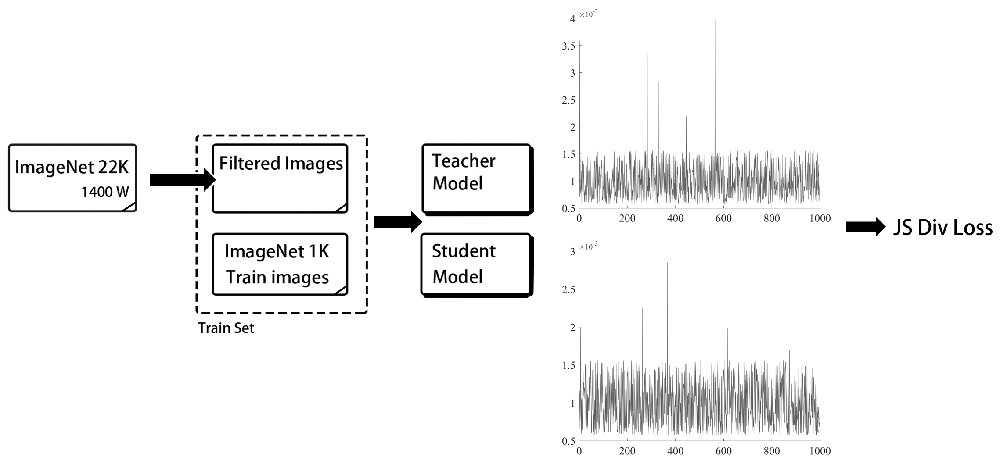

# PaddleClas

**文档教程**：https://paddleclas.readthedocs.io （正在持续更新中）

## 简介
PaddleClas的目的是为工业界和学术界提供一个图像分类任务相关的百宝箱，特色如下：
- 模型库：ResNet_vd、MobileNetV3等23种系列的分类网络结构和训练技巧，以及对应的117个分类预训练模型和性能评估

- 高阶支持：高精度的知识蒸馏方案（准确率82.39%的ResNet50_vd和78.9%的MobileNetV3）、8种数据增广方法的复现和验证

- 应用拓展：常见视觉任务的特色方案，包括图像分类领域的迁移学习（百度自研的10万类图像分类预训练模型）和通用目标检测（mAP 47.8%的实用检测方案）等

- 实用工具：便于工业应用部署的实用工具，包括TensorRT预测、移动端预测、模型服务化部署等

- 赛事支持：助力多个视觉全球挑战赛取得领先成绩，包括2018年Kaggle Open Images V4图像目标检测挑战赛冠军、2019年Kaggle地标检索挑战赛亚军等

## 模型库

基于ImageNet1k分类数据集，PaddleClas提供ResNet、ResNet_vd、EfficientNet、Res2Net、HRNet、MobileNetV3等23种系列的分类网络结构的简单介绍、论文指标复现配置，以及在复现过程中的训练技巧。与此同时，PaddleClas也提供了对应的117个图像分类预训练模型，并且基于TensorRT评估了所有模型的GPU预测时间，以及在骁龙855（SD855）上评估了移动端模型的CPU预测时间和存储大小。支持的***预训练模型列表、下载地址以及更多信息***请见文档教程中的[**模型库章节**](https://paddleclas.readthedocs.io/zh_CN/latest/models/models_intro.html)。

    

上图展示了一些适合服务器端应用的模型，使用V100，FP32和TensorRT预测一张图像的时间，图中ResNet50_vd_ssld和ResNet101_vd_ssld，是采用PaddleClas提供的SSLD蒸馏方法训练的模型。图中相同颜色和符号的点代表同一系列不同规模的模型。不同模型的简介、FLOPS、Parameters以及详细GPU预测时间请参考文档教程中的[**模型库章节**](https://paddleclas.readthedocs.io/zh_CN/latest/models/models_intro.html)。

上图展示了一些适合移动端应用的模型，在SD855上预测一张图像的CPU时间。图中MV3_large_x1_0_ssld（M是MobileNet的简称），MV3_small_x1_0_ssld、MV2_ssld和MV1_ssld，是采用PaddleClas提供的SSLD蒸馏方法训练的模型。MV3_large_x1_0_ssld_int8是进一步进行INT8量化的模型。不同模型的简介、FLOPS、Parameters和模型存储大小请参考文档教程中的[**模型库章节**](https://paddleclas.readthedocs.io/zh_CN/latest/models/models_intro.html)。

- TODO
- [ ] EfficientLite、GhostNet、RegNet论文指标复现和性能评估

## 高阶支持
除了提供丰富的分类网络结构和预训练模型，PaddleClas也支持了一系列有助于图像分类任务效果和效率提升的算法或工具。
### 知识蒸馏

知识蒸馏是指使用教师模型(teacher model)去指导学生模型(student model)学习特定任务，保证小模型在参数量不变的情况下，得到比较大的效果提升，甚至获得与大模型相似的精度指标。

PaddleClas提供了一种简单的半监督标签知识蒸馏方案（SSLD，Simple Semi-supervised Label Distillation），使用该方案大幅提升了ResNet101_vd，ResNet50_vd、MobileNetV1、MobileNetV2和MobileNetV3在ImageNet数据集上分类效果，如上图所示。该知识蒸馏方案的框架图如下，详细的知识蒸馏方法介绍以及使用正在持续更新中。

### 数据增广

在图像分类任务中，图像数据的增广是一种常用的正则化方法，可以有效提升图像分类的效果，尤其对于数据量不足或者模型网络较大的场景。PaddleClas支持了最新的8种数据增广算法的复现和在统一实验环境下的效果评估，下图展示了不同数据增广方式在ResNet50上的表现。每种数据增广方法的详细介绍、对比的实验环境以及使用正在持续更新中。

- TODO
- [ ] 更多的优化器支持和效果验证
- [ ] 支持模型可解释性工具

## 开始使用
PaddleClas的安装说明、模型训练、预测、评估以及模型微调（finetune）请参考文档教程中的[**初级使用章节**](https://paddleclas.readthedocs.io/zh_CN/latest/tutorials/index.html)，SSLD知识蒸馏和数据增广的高阶使用正在持续更新中。

## 应用拓展
效果更优的图像分类网络结构和预训练模型往往有助于提升其他视觉任务的效果，PaddleClas提供了一系列在常见视觉任务中的特色方案。

### 图像分类的迁移学习

在实际应用中，由于训练数据的匮乏，往往将ImageNet1K数据集训练的分类模型作为预训练模型，进行图像分类的迁移学习。为了进一步助力实际问题的解决，PaddleClas计划开源百度自研的基于10万种类别、4千多万的有标签数据训练的预训练模型，同时给出多种超参搜索方法。该部分内容正在持续更新中。

### 通用目标检测

近年来，学术界和工业界广泛关注图像中目标检测任务。PaddleClas基于82.39%的ResNet50_vd的预训练模型，结合PaddleDetection中丰富的检测算子，提供了一种面向服务器端应用的目标检测方案，PSS-DET (Practical Server Side Detection)，在COCO目标检测数据集上，当V100单卡预测速度为61FPS时，mAP是41.6%，预测速度为20FPS时，mAP是47.8%。详细的网络配置和训练代码，请参看<a href="https://github.com/PaddlePaddle/PaddleDetection/tree/master/configs/rcnn_server_side_det" rel="nofollow"> PaddleDetection中的相关内容</a>。更多的PaddleClas在目标检测中的特色应用，正在持续更新中。

- TODO
- [ ] PaddleClas在OCR任务中的特色应用
- [ ] PaddleClas在人脸检测和识别中的特色应用

## 实用工具
PaddlePaddle提供了一系列实用工具，便于工业应用部署PaddleClas，具体请参考文档教程中的[**实用工具章节**](https://paddleclas.readthedocs.io/zh_CN/latest/extension/index.html)。

- TensorRT预测
- Paddle-Lite
- 模型服务化部署
- 模型量化
- 多机训练
- Paddle Hub

## 赛事支持
PaddleClas的建设源于百度实际视觉业务应用的淬炼和视觉前沿能力的探索，助力多个视觉重点赛事取得领先成绩，并且持续推进更多的前沿视觉问题的解决和落地应用。更多内容请关注文档教程中的[**赛事支持章节**](https://paddleclas.readthedocs.io/zh_CN/latest/competition_support.html)

- 2018年Kaggle Open Images V4图像目标检测挑战赛冠军
- 2019年Kaggle Open Images V5图像目标检测挑战赛亚军
- 2019年Kaggle地标检索挑战赛亚军
- 2019年Kaggle地标识别挑战赛亚军
- 首届多媒体信息识别技术竞赛中印刷文本OCR、人脸识别和地标识别三项任务A级证书

## 许可证书
本项目的发布受<a href="https://github.com/PaddlePaddle/PaddleCLS/blob/master/LICENSE">Apache 2.0 license</a>许可认证。

## 版本更新

## 如何贡献代码
我们非常欢迎你为PaddleClas贡献代码，也十分感谢你的反馈。
