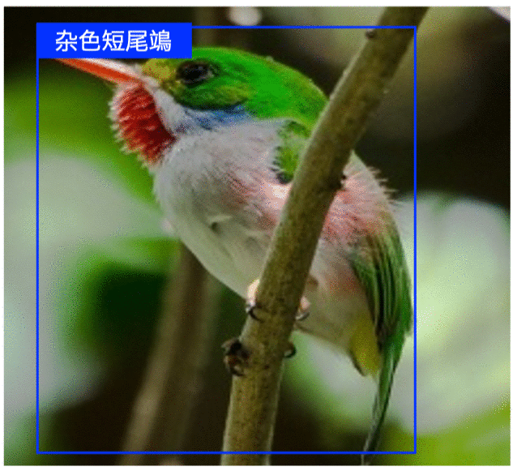

简体中文 | [English](README_en.md)

# PaddleClas

## 简介

飞桨图像识别套件PaddleClas是飞桨为工业界和学术界所准备的一个图像识别和图像分类任务的工具集，助力使用者训练出更好的视觉模型和应用落地。&nbsp;

PP-ShiTuV2图像识别系统效果展示

PULC实用图像分类模型效果展示

## 近期更新

- 🔥️ 2022.9.14 晚上8:30  **商超零售新革命-生鲜智能结算产业应用**，扫码进群获取直播链接

  

    
  

- 🔥️ 2022.9.13发布超轻量图像识别系统[PP-ShiTuV2](docs/zh_CN/models/PP-ShiTu/README.md)，recall1精度提升8个点，覆盖商品识别、垃圾分类、航拍场景等[20+识别场景](docs/zh_CN/deployment/PP-ShiTu/application_scenarios.md)，新增[库管理工具](./deploy/shitu_index_manager/)，[Android Demo](./docs/zh_CN/quick_start/quick_start_recognition.md)全新体验。
- 2022.9.4 新增[生鲜产品自主结算范例库](./docs/zh_CN/samples/Fresh_Food_Recogniiton/README.md)，具体内容可以在AI Studio上体验。
- 2022.6.15 发布[PULC超轻量图像分类实用方案](docs/zh_CN/training/PULC.md)，CPU推理3ms，精度比肩SwinTransformer，覆盖人、车、OCR场景九大常见任务。
- 2022.5.23 新增[人员出入管理范例库](https://aistudio.baidu.com/aistudio/projectdetail/4094475)，具体内容可以在 AI Studio 上体验。
- 2022.5.20 上线[PP-HGNet](./docs/zh_CN/models/ImageNet1k/PP-HGNet.md), [PP-LCNetv2](./docs/zh_CN/models/ImageNet1k/PP-LCNetV2.md)。
- [more](docs/zh_CN/version_history.md)

## 特性

PaddleClas发布了[PP-HGNet](docs/zh_CN/models/ImageNet1k/PP-HGNet.md)、[PP-LCNetv2](docs/zh_CN/models/ImageNet1k/PP-LCNetV2.md)、 [PP-LCNet](docs/zh_CN/models/ImageNet1k/PP-LCNet.md)和[SSLD半监督知识蒸馏方案](docs/zh_CN/training/advanced/ssld.md)等算法，
并支持多种图像分类、识别相关算法，在此基础上打造[PULC超轻量图像分类方案](docs/zh_CN/quick_start/PULC.md)和[PP-ShiTu图像识别系统](./docs/zh_CN/quick_start/quick_start_recognition.md)。

## 欢迎加入技术交流群

* 欢迎加入PaddleClas 微信用户群（扫码填写问卷即可入群）

  

## 快速体验

PULC超轻量图像分类方案快速体验：[点击这里](docs/zh_CN/quick_start/PULC.md)

PP-ShiTu图像识别快速体验：[点击这里](./docs/zh_CN/quick_start/quick_start_recognition.md)

PP-ShiTuV2 Android Demo APP，可扫描如下二维码，下载体验

PP-ShiTuV2 Android Demo

## 产业实践范例库

- 基于PP-ShiTu v2的生鲜品自助结算： [点击这里](./docs/zh_CN/samples/Fresh_Food_Recogniiton/README.md)
- 基于PULC人员出入视频管理： [点击这里](./docs/zh_CN/samples/Personnel_Access/README.md)
- 基于 PP-ShiTu 的智慧商超商品识别：[点击这里](./docs/zh_CN/samples/Goods_Recognition/README.md)
- 基于PP-ShiTu电梯内电瓶车入室识别：[点击这里](./docs/zh_CN/samples//Electromobile_In_Elevator_Detection/README.md)

## 文档教程
- [环境准备](docs/zh_CN/installation.md)
- [PP-ShiTuV2图像识别系统介绍](docs/zh_CN/models/PP-ShiTu/README.md)
  - [图像识别快速体验](docs/zh_CN/quick_start/quick_start_recognition.md)
  - [20+应用场景库](docs/zh_CN/deployment/PP-ShiTu/application_scenarios.md)
  - 子模块算法介绍及模型训练
    - [主体检测](docs/zh_CN/training/PP-ShiTu/mainbody_detection.md)
    - [特征提取模型](docs/zh_CN/training/PP-ShiTu/feature_extraction.md)
    - [向量检索](docs/zh_CN/deployment/PP-ShiTu/vector_search.md)
    - [哈希编码](docs/zh_CN/training/PP-ShiTu/deep_hashing.md)
  - PipeLine 推理部署
    - [基于python预测引擎推理](docs/zh_CN/deployment/image_classification/python.md#2)
    - [基于C++预测引擎推理](deploy/cpp_shitu/readme.md)
    - [服务化部署](docs/zh_CN/deployment/PP-ShiTu/paddle_serving.md)
    - [端侧部署](docs/zh_CN/deployment/PP-ShiTu/paddle_lite.md)
    - [库管理工具](docs/zh_CN/deployment/PP-ShiTu/gallery_manager.md)
- [PULC超轻量图像分类实用方案](docs/zh_CN/training/PULC.md)
  - [超轻量图像分类快速体验](docs/zh_CN/quick_start/PULC.md)
  - [超轻量图像分类模型库](docs/zh_CN/models/PULC/model_list.md)
    - [PULC有人/无人分类模型](docs/zh_CN/models/PULC/PULC_person_exists.md)
    - [PULC人体属性识别模型](docs/zh_CN/models/PULC/PULC_person_attribute.md)
    - [PULC佩戴安全帽分类模型](docs/zh_CN/models/PULC/PULC_safety_helmet.md)
    - [PULC交通标志分类模型](docs/zh_CN/models/PULC/PULC_traffic_sign.md)
    - [PULC车辆属性识别模型](docs/zh_CN/models/PULC/PULC_vehicle_attribute.md)
    - [PULC有车/无车分类模型](docs/zh_CN/models/PULC/PULC_car_exists.md)
    - [PULC含文字图像方向分类模型](docs/zh_CN/models/PULC/PULC_text_image_orientation.md)
    - [PULC文本行方向分类模型](docs/zh_CN/models/PULC/PULC_textline_orientation.md)
    - [PULC语种分类模型](docs/zh_CN/models/PULC/PULC_language_classification.md)
  - [模型训练](docs/zh_CN/training/PULC.md)
  - 推理部署
    - [基于python预测引擎推理](docs/zh_CN/deployment/image_classification/python.md#1)
    - [基于C++预测引擎推理](docs/zh_CN/deployment/image_classification/cpp/linux.md)
    - [服务化部署](docs/zh_CN/deployment/image_classification/paddle_serving.md)
    - [端侧部署](docs/zh_CN/deployment/image_classification/paddle_lite.md)
    - [Paddle2ONNX模型转化与预测](docs/zh_CN/deployment/image_classification/paddle2onnx.md)
  - [模型压缩](deploy/slim/README.md)
- PP系列骨干网络模型
  - [PP-HGNet](docs/zh_CN/models/ImageNet1k/PP-HGNet.md)
  - [PP-LCNetv2](docs/zh_CN/models/ImageNet1k/PP-LCNetV2.md)
  - [PP-LCNet](docs/zh_CN/models/ImageNet1k/PP-LCNet.md)
- [SSLD半监督知识蒸馏方案](docs/zh_CN/training/advanced/ssld.md)
- 前沿算法
  - [骨干网络和预训练模型库](docs/zh_CN/models/ImageNet1k/model_list.md)
  - [度量学习](docs/zh_CN/algorithm_introduction/metric_learning.md)
    - [ReID](./docs/zh_CN/algorithm_introduction/ReID.md)
  - [模型压缩](docs/zh_CN/algorithm_introduction/prune_quantization.md)
  - [模型蒸馏](./docs/zh_CN/training/advanced/knowledge_distillation.md)
  - [数据增强](docs/zh_CN/training/config_description/data_augmentation.md)
- [产业实用范例库](docs/zh_CN/samples)
- [30分钟快速体验图像分类](docs/zh_CN/quick_start/quick_start_classification_new_user.md)
- FAQ
  - [图像识别精选问题](docs/zh_CN/FAQ/faq_2021_s2.md)
  - [图像分类精选问题](docs/zh_CN/FAQ/faq_selected_30.md)
  - [图像分类FAQ第一季](docs/zh_CN/FAQ/faq_2020_s1.md)
  - [图像分类FAQ第二季](docs/zh_CN/FAQ/faq_2021_s1.md)
  - [图像分类FAQ第三季](docs/zh_CN/FAQ/faq_2022_s1.md)
- [社区贡献指南](docs/zh_CN/community/how_to_contribute.md)
- [许可证书](#许可证书)
- [贡献代码](#贡献代码)

## PP-ShiTuV2图像识别系统

PP-ShiTuV2是一个实用的轻量级通用图像识别系统，主要由主体检测、特征学习和向量检索三个模块组成。该系统从骨干网络选择和调整、损失函数的选择、数据增强、学习率变换策略、正则化参数选择、预训练模型使用以及模型裁剪量化多个方面，采用多种策略，对各个模块的模型进行优化，PP-ShiTuV2相比V1，Recall1提升近8个点。更多细节请参考[PP-ShiTuV2详细介绍](docs/zh_CN/models/PP-ShiTu/README.md)。

## PP-ShiTuV2图像识别系统效果展示

- 瓶装饮料识别

- 商品识别

- 动漫人物识别

- logo识别

- 车辆识别

## PULC超轻量图像分类方案

PULC融合了骨干网络、数据增广、蒸馏等多种前沿算法，可以自动训练得到轻量且高精度的图像分类模型。
PaddleClas提供了覆盖人、车、OCR场景九大常见任务的分类模型，CPU推理3ms，精度比肩SwinTransformer。

## PULC实用图像分类模型效果展示

## 许可证书
本项目的发布受<a href="https://github.com/PaddlePaddle/PaddleCLS/blob/master/LICENSE">Apache 2.0 license</a>许可认证。

## 贡献代码
我们非常欢迎你为PaddleClas贡献代码，也十分感谢你的反馈。
如果想为PaddleCLas贡献代码，可以参考[贡献指南](docs/zh_CN/community/how_to_contribute.md)。

- 非常感谢[nblib](https://github.com/nblib)修正了PaddleClas中RandErasing的数据增广配置文件。
- 非常感谢[chenpy228](https://github.com/chenpy228)修正了PaddleClas文档中的部分错别字。
- 非常感谢[jm12138](https://github.com/jm12138)为PaddleClas添加ViT，DeiT系列模型和RepVGG系列模型。
