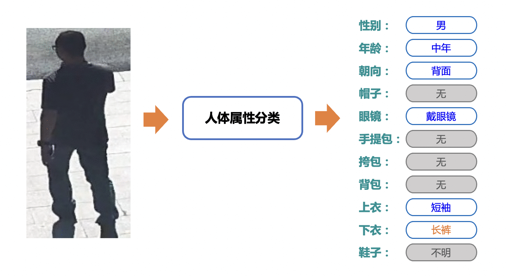
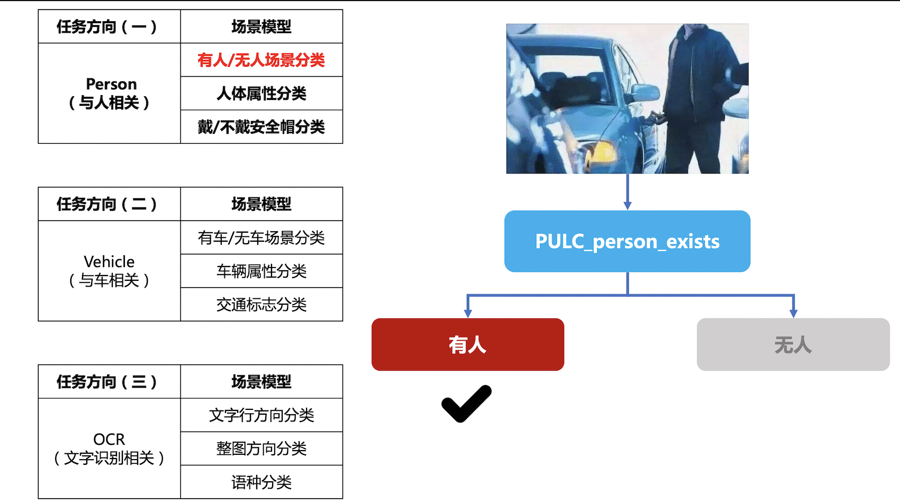
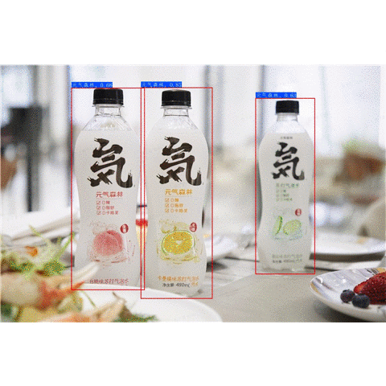

简体中文 | [English](README_en.md)

# PaddleClas

## 简介

飞桨图像识别套件PaddleClas是飞桨为工业界和学术界所准备的一个图像识别和图像分类任务的工具集，助力使用者训练出更好的视觉模型和应用落地。

PULC实用图像分类模型效果展示

&nbsp;

PP-ShiTu图像识别系统效果展示

## 近期更新
- 📢将于**6月15-6月17日晚20:30** 进行为期三天的课程直播，详细介绍超轻量图像分类方案，对各场景模型优化原理及使用方式进行拆解，之后还有产业案例全流程实操，对各类痛难点解决方案进行手把手教学，加上现场互动答疑，抓紧扫码上车吧！

- 🔥️ 2022.6.15 发布[PULC超轻量图像分类实用方案](docs/zh_CN/PULC/PULC_train.md)，CPU推理3ms，精度比肩SwinTransformer，覆盖人、车、OCR场景九大常见任务。

- 2022.5.26 [飞桨产业实践范例直播课](http://aglc.cn/v-c4FAR)，解读**超轻量重点区域人员出入管理方案**。

- 2022.5.23 新增[人员出入管理范例库](https://aistudio.baidu.com/aistudio/projectdetail/4094475)，具体内容可以在 AI Stuio 上体验。

- 2022.5.20 上线[PP-HGNet](./docs/zh_CN/models/PP-HGNet.md), [PP-LCNetv2](./docs/zh_CN/models/PP-LCNetV2.md)。

- 2022.4.21 新增 CVPR2022 oral论文 [MixFormer](https://arxiv.org/pdf/2204.02557.pdf) 相关[代码](https://github.com/PaddlePaddle/PaddleClas/pull/1820/files)。

- [more](./docs/zh_CN/others/update_history.md)

## 特性

PaddleClas发布了[PP-HGNet](docs/zh_CN/models/PP-HGNet.md)、[PP-LCNetv2](docs/zh_CN/models/PP-LCNetV2.md)、 [PP-LCNet](docs/zh_CN/models/PP-LCNet.md)和[SSLD半监督知识蒸馏方案](docs/zh_CN/advanced_tutorials/ssld.md)等算法，
并支持多种图像分类、识别相关算法，在此基础上打造[PULC超轻量图像分类方案](docs/zh_CN/PULC/PULC_quickstart.md)和[PP-ShiTu图像识别系统](./docs/zh_CN/quick_start/quick_start_recognition.md)。

## 欢迎加入技术交流群

* 您可以扫描下面的微信/QQ二维码（添加小助手微信并回复“C”），加入PaddleClas微信交流群，获得更高效的问题答疑，与各行各业开发者充分交流，期待您的加入。

## 快速体验

PULC超轻量图像分类方案快速体验：[点击这里](docs/zh_CN/PULC/PULC_quickstart.md)

PP-ShiTu图像识别快速体验：[点击这里](./docs/zh_CN/quick_start/quick_start_recognition.md)

## 文档教程
- [环境准备](docs/zh_CN/installation/install_paddleclas.md)
- [PULC超轻量图像分类实用方案](docs/zh_CN/PULC/PULC_train.md)
  - [超轻量图像分类快速体验](docs/zh_CN/PULC/PULC_quickstart.md)
  - [超轻量图像分类模型库](docs/zh_CN/PULC/PULC_model_list.md)
    - [PULC有人/无人分类模型](docs/zh_CN/PULC/PULC_person_exists.md)
    - [PULC人体属性识别模型](docs/zh_CN/PULC/PULC_person_attribute.md)
    - [PULC佩戴安全帽分类模型](docs/zh_CN/PULC/PULC_safety_helmet.md)
    - [PULC交通标志分类模型](docs/zh_CN/PULC/PULC_traffic_sign.md)
    - [PULC车辆属性识别模型](docs/zh_CN/PULC/PULC_vehicle_attribute.md)
    - [PULC有车/无车分类模型](docs/zh_CN/PULC/PULC_car_exists.md)
    - [PULC含文字图像方向分类模型](docs/zh_CN/PULC/PULC_text_image_orientation.md)
    - [PULC文本行方向分类模型](docs/zh_CN/PULC/PULC_textline_orientation.md)
    - [PULC语种分类模型](docs/zh_CN/PULC/PULC_language_classification.md)
  - [模型训练](docs/zh_CN/PULC/PULC_train.md)
  - 推理部署
    - [基于python预测引擎推理](docs/zh_CN/inference_deployment/python_deploy.md#1)
    - [基于C++预测引擎推理](docs/zh_CN/inference_deployment/cpp_deploy.md)
    - [服务化部署](docs/zh_CN/inference_deployment/paddle_serving_deploy.md)
    - [端侧部署](docs/zh_CN/inference_deployment/paddle_lite_deploy.md)
    - [Paddle2ONNX模型转化与预测](deploy/paddle2onnx/readme.md)
  - [模型压缩](deploy/slim/README.md)
- [PP-ShiTu图像识别系统介绍](#图像识别系统介绍)
  - [图像识别快速体验](docs/zh_CN/quick_start/quick_start_recognition.md)
  - 模块介绍
    - [主体检测](./docs/zh_CN/image_recognition_pipeline/mainbody_detection.md)
    - [特征提取模型](./docs/zh_CN/image_recognition_pipeline/feature_extraction.md)
    - [向量检索](./docs/zh_CN/image_recognition_pipeline/vector_search.md)
    - [哈希编码](docs/zh_CN/image_recognition_pipeline/)
  - [模型训练](docs/zh_CN/models_training/recognition.md)
  - 推理部署
    - [基于python预测引擎推理](docs/zh_CN/inference_deployment/python_deploy.md#2)
    - [基于C++预测引擎推理](deploy/cpp_shitu/readme.md)
    - [服务化部署](docs/zh_CN/inference_deployment/paddle_serving_deploy.md)
    - [端侧部署](deploy/lite_shitu/README.md)
- PP系列骨干网络模型
  - [PP-HGNet](docs/zh_CN/models/PP-HGNet.md)
  - [PP-LCNetv2](docs/zh_CN/models/PP-LCNetV2.md)
  - [PP-LCNet](docs/zh_CN/models/PP-LCNet.md)
- [SSLD半监督知识蒸馏方案](docs/zh_CN/advanced_tutorials/ssld.md)
- 前沿算法
  - [骨干网络和预训练模型库](docs/zh_CN/algorithm_introduction/ImageNet_models.md)
  - [度量学习](docs/zh_CN/algorithm_introduction/metric_learning.md)
  - [模型压缩](docs/zh_CN/algorithm_introduction/model_prune_quantization.md)
  - [模型蒸馏](docs/zh_CN/algorithm_introduction/knowledge_distillation.md)
  - [数据增强](docs/zh_CN/advanced_tutorials/DataAugmentation.md)
- [产业实用范例库](docs/zh_CN/samples)
- [30分钟快速体验图像分类](docs/zh_CN/quick_start/quick_start_classification_new_user.md)
- FAQ
  - [图像识别精选问题](docs/zh_CN/faq_series/faq_2021_s2.md)
  - [图像分类精选问题](docs/zh_CN/faq_series/faq_selected_30.md)
  - [图像分类FAQ第一季](docs/zh_CN/faq_series/faq_2020_s1.md)
  - [图像分类FAQ第二季](docs/zh_CN/faq_series/faq_2021_s1.md)
- [社区贡献指南](./docs/zh_CN/advanced_tutorials/how_to_contribute.md)
- [许可证书](#许可证书)
- [贡献代码](#贡献代码)

## PULC超轻量图像分类方案

PULC融合了骨干网络、数据增广、蒸馏等多种前沿算法，可以自动训练得到轻量且高精度的图像分类模型。
PaddleClas提供了覆盖人、车、OCR场景九大常见任务的分类模型，CPU推理3ms，精度比肩SwinTransformer。

## PP-ShiTu图像识别系统

PP-ShiTu是一个实用的轻量级通用图像识别系统，主要由主体检测、特征学习和向量检索三个模块组成。该系统从骨干网络选择和调整、损失函数的选择、数据增强、学习率变换策略、正则化参数选择、预训练模型使用以及模型裁剪量化8个方面，采用多种策略，对各个模块的模型进行优化，最终得到在CPU上仅0.2s即可完成10w+库的图像识别的系统。更多细节请参考[PP-ShiTu技术方案](https://arxiv.org/pdf/2111.00775.pdf)。

## PULC实用图像分类模型效果展示

## PP-ShiTu图像识别系统效果展示
- 瓶装饮料识别

- 商品识别

- 动漫人物识别

- logo识别

- 车辆识别

## 许可证书
本项目的发布受<a href="https://github.com/PaddlePaddle/PaddleCLS/blob/master/LICENSE">Apache 2.0 license</a>许可认证。

## 贡献代码
我们非常欢迎你为PaddleClas贡献代码，也十分感谢你的反馈。
如果想为PaddleCLas贡献代码，可以参考[贡献指南](./docs/zh_CN/advanced_tutorials/how_to_contribute.md)。

- 非常感谢[nblib](https://github.com/nblib)修正了PaddleClas中RandErasing的数据增广配置文件。
- 非常感谢[chenpy228](https://github.com/chenpy228)修正了PaddleClas文档中的部分错别字。
- 非常感谢[jm12138](https://github.com/jm12138)为PaddleClas添加ViT，DeiT系列模型和RepVGG系列模型。
