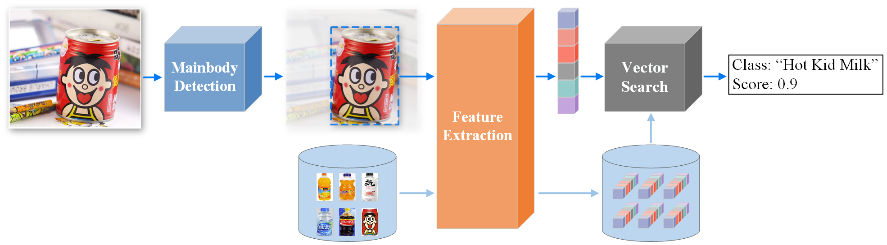
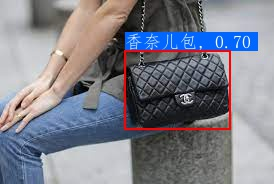
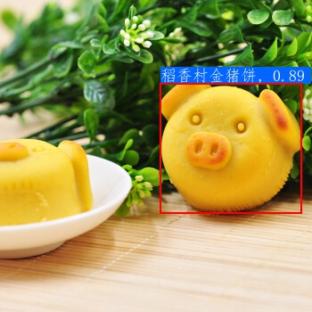
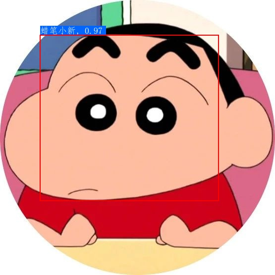
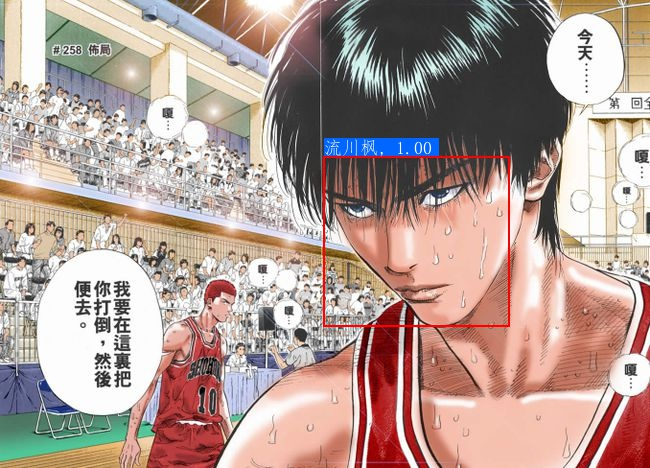
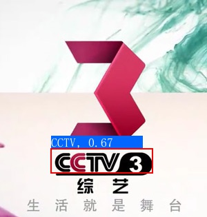
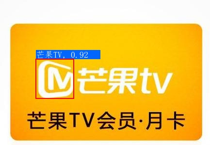
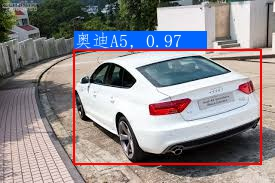
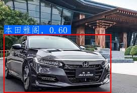

[简体中文](README.md) | English

# PaddleClas

## Introduction

PaddleClas is an image recognition toolset for industry and academia, helping users train better computer vision models and apply them in real scenarios.

**Recent updates**

- 🔥🔥🔥: 2021.06.16 PaddleClas release/2.2.
   - Add metric learning and vector search modules.
   - Add product recognition, animation character recognition, vehicle recognition and logo recognition.
   - Added 30 pretrained models of LeViT, Twins, TNT, DLA, HarDNet, and RedNet, and the accuracy is roughly the same as that of the paper.

- 2021.05.14
   - Add `SwinTransformer` series pretrained models, whose Top-1 Acc on ImageNet-1k dataset reaches 87.19%.

- 2021.04.15
   - Add `MixNet` and `ReXNet` pretrained models, `MixNet_L`'s Top-1 Acc on ImageNet-1k reaches 78.6% and `ReXNet_3_0` reaches 82.09%.

- [more](./docs/en/update_history_en.md)

## Features

- A practical image recognition system consist of detection, feature learning and retrieval modules, widely applicable to all types of image recognition tasks.
Four sample solutions are provided, including product recognition, vehicle recognition, logo recognition and animation character recognition.

- Rich library of pre-trained models: Provide a total of 164 ImageNet pre-trained models in 34 series, among which 6 selected series of models support fast structural modification.

- Comprehensive and easy-to-use feature learning components: 12 metric learning methods are integrated and can be combined and switched at will through configuration files.

- SSLD knowledge distillation: The 14 classification pre-training models generally improved their accuracy by more than 3%; among them, the ResNet50_vd model achieved a Top-1 accuracy of 84.0% on the Image-Net-1k dataset and the Res2Net200_vd pre-training model achieved a Top-1 accuracy of 85.1%.

- Data augmentation: Provide 8 data augmentation algorithms such as AutoAugment, Cutout, Cutmix, etc.  with detailed introduction, code replication and evaluation of effectiveness in a unified experimental environment.

 

## Image Recognition System Effect Demonstration

## Welcome to Join the Technical Exchange Group

* You can also scan the QR code below to join the PaddleClas WeChat group to get more efficient answers to your questions and to communicate with developers from all walks of life. We look forward to hearing from you.

## Quick Start 
Quick experience of image recognition：[Link](./docs/en/tutorials/quick_start_recognition_en.md)

## Tutorials

- [Quick Installatiopn](./docs/en/tutorials/install_en.md)
- [Quick Start of Recognition](./docs/en/tutorials/quick_start_recognition_en.md)
- [Introduction to Image Recognition Systems](#Introduction_to_Image_Recognition_Systems)
- [Demo images](#Demo_images)
- Algorithms Introduction
    - [Backbone Network and Pre-trained Model Library](./docs/en/ImageNet_models.md)
    - [Mainbody Detection](./docs/en/application/mainbody_detection_en.md)
    - [Image Classification](./docs/en/tutorials/image_classification_en.md)
    - [Feature Learning](./docs/en/application/feature_learning_en.md)
        - [Product Recognition](./docs/en/application/product_recognition_en.md)
        - [Vehicle Recognition](./docs/en/application/vehicle_recognition_en.md)
        - [Logo Recognition](./docs/en/application/logo_recognition_en.md)
        - [Animation Character Recognition](./docs/en/application/cartoon_character_recognition_en.md)
    - [Vector Search](./deploy/vector_search/README.md)
- Models Training/Evaluation
    - [Image Classification](./docs/en/tutorials/getting_started_en.md)
    - [Feature Learning](./docs/en/tutorials/getting_started_retrieval_en.md)
- Inference Model Prediction
    - [Python Inference](./docs/en/inference.md)
    - [C++ Inference](./deploy/cpp/readme_en.md)(only support classification for now, recognition coming soon)
- Model Deploy (only support classification for now, recognition coming soon)
    - [Hub Serving Deployment](./deploy/hubserving/readme_en.md)
    - [Mobile Deployment](./deploy/lite/readme_en.md)
    - [Inference Using whl](./docs/en/whl_en.md)
- Advanced Tutorial
    - [Knowledge Distillation](./docs/en/advanced_tutorials/distillation/distillation_en.md)
    - [Model Quantization](./docs/en/extension/paddle_quantization_en.md)
    - [Data Augmentation](./docs/en/advanced_tutorials/image_augmentation/ImageAugment_en.md)
- [License](#License)
- [Contribution](#Contribution)

## Introduction to Image Recognition Systems

Image recognition can be divided into three steps:
- （1）Identify region proposal for target objects through a detection model；
- （2）Extract features for each region proposal;
- （3）Search features in the retrieval database and output results;

For a new unknown category, there is no need to retrain the model, just prepare images of new category, extract features and update retrieval database and the category can be recognised.

## Demo images [more](./docs/en/more_demo.md)
- Product recognition

- Cartoon character recognition

- Logo recognition

- Car recognition

## License
PaddleClas is released under the Apache 2.0 license <a href="https://github.com/PaddlePaddle/PaddleCLS/blob/master/LICENSE">Apache 2.0 license</a>

## Contribution
Contributions are highly welcomed and we would really appreciate your feedback!!

- Thank [nblib](https://github.com/nblib) to fix bug of RandErasing.
- Thank [chenpy228](https://github.com/chenpy228) to fix some typos PaddleClas.
- Thank [jm12138](https://github.com/jm12138) to add ViT, DeiT models and RepVGG models into PaddleClas.
- Thank [FutureSI](https://aistudio.baidu.com/aistudio/personalcenter/thirdview/76563) to parse and summarize the PaddleClas code.
