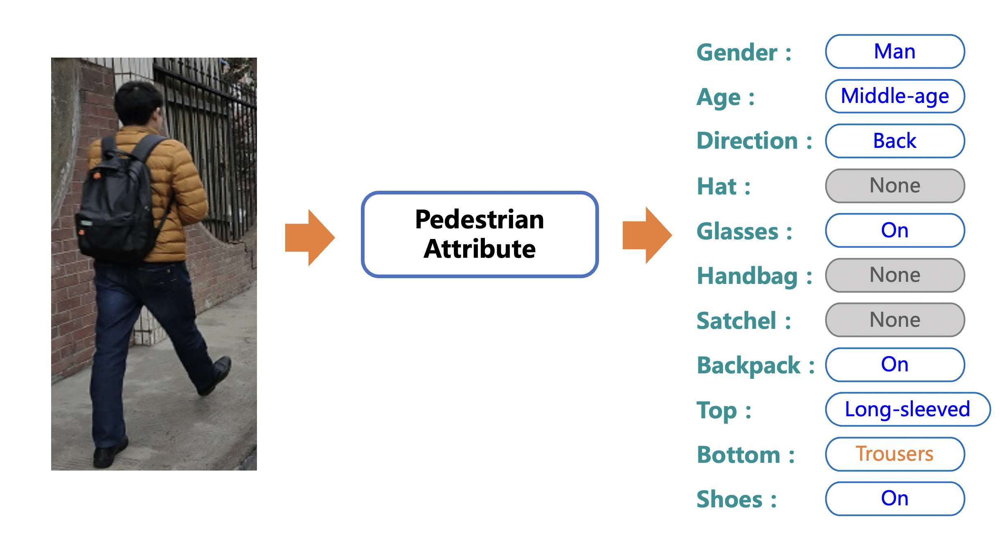

[简体中文](README_ch.md) | English

# PaddleClas

## Introduction

PaddleClas is an image classification and image recognition toolset for industry and academia, helping users train better computer vision models and apply them in real scenarios.

PULC demo images

&nbsp;

PP-ShiTu demo images

**Recent updates**
- 2022.6.15 Release [**P**ractical **U**ltra **L**ight-weight image **C**lassification solutions](./docs/en/PULC/PULC_quickstart_en.md). PULC models inference within 3ms on CPU devices, with accuracy on par with SwinTransformer. We also release 9 practical classification models covering pedestrian, vehicle and OCR scenario.
- 2022.4.21 Added the related [code](https://github.com/PaddlePaddle/PaddleClas/pull/1820/files) of the CVPR2022 oral paper [MixFormer](https://arxiv.org/pdf/2204.02557.pdf).

- 2021.09.17 Add PP-LCNet series model developed by PaddleClas, these models show strong competitiveness on Intel CPUs.
For the introduction of PP-LCNet, please refer to [paper](https://arxiv.org/pdf/2109.15099.pdf) or [PP-LCNet model introduction](docs/en/models/PP-LCNet_en.md). The metrics and pretrained model are available [here](docs/en/algorithm_introduction/ImageNet_models_en.md).

- 2021.06.29 Add [Swin-transformer](docs/en/models/SwinTransformer_en.md)) series model，Highest top1 acc on ImageNet1k dataset reaches 87.2%, training, evaluation and inference are all supported. Pretrained models can be downloaded [here](docs/en/algorithm_introduction/ImageNet_models_en.md#16).
- 2021.06.16 PaddleClas release/2.2. Add metric learning and vector search modules. Add product recognition, animation character recognition, vehicle recognition and logo recognition. Added 30 pretrained models of LeViT, Twins, TNT, DLA, HarDNet, and RedNet, and the accuracy is roughly the same as that of the paper.
- [more](./docs/en/others/update_history_en.md)

## Features

PaddleClas release PP-HGNet、PP-LCNetv2、 PP-LCNet and **S**imple **S**emi-supervised **L**abel **D**istillation algorithms, and support plenty of
image classification and image recognition algorithms.
Based on th algorithms above, PaddleClas release PP-ShiTu image recognition system and [**P**ractical **U**ltra **L**ight-weight image **C**lassification solutions](docs/en/PULC/PULC_quickstart_en.md).

## Welcome to Join the Technical Exchange Group

* You can also scan the QR code below to join the PaddleClas QQ group and WeChat group (add and replay "C") to get more efficient answers to your questions and to communicate with developers from all walks of life. We look forward to hearing from you.

## Quick Start
Quick experience of PP-ShiTu image recognition system：[Link](./docs/en/quick_start/quick_start_recognition_en.md)

Quick experience of **P**ractical **U**ltra **L**ight-weight image **C**lassification models：[Link](docs/en/PULC/PULC_quickstart_en.md)

## Tutorials

- [Install Paddle](./docs/en/installation/install_paddle_en.md)
- [Install PaddleClas Environment](./docs/en/installation/install_paddleclas_en.md)
- [Practical Ultra Light-weight image Classification solutions](./docs/en/PULC/PULC_train_en.md)
  - [PULC Quick Start](docs/en/PULC/PULC_quickstart_en.md)
  - [PULC Model Zoo](docs/en/PULC/PULC_model_list_en.md)
    - [PULC Classification Model of Someone or Nobody](docs/en/PULC/PULC_person_exists_en.md)
    - [PULC Recognition Model of Person Attribute](docs/en/PULC/PULC_person_attribute_en.md)
    - [PULC Classification Model of Wearing or Unwearing Safety Helmet](docs/en/PULC/PULC_safety_helmet_en.md)
    - [PULC Classification Model of Traffic Sign](docs/en/PULC/PULC_traffic_sign_en.md)
    - [PULC Recognition Model of Vehicle Attribute](docs/en/PULC/PULC_vehicle_attribute_en.md)
    - [PULC Classification Model of Containing or Uncontaining Car](docs/en/PULC/PULC_car_exists_en.md)
    - [PULC Classification Model of Text Image Orientation](docs/en/PULC/PULC_text_image_orientation_en.md)
    - [PULC Classification Model of Textline Orientation](docs/en/PULC/PULC_textline_orientation_en.md)
    - [PULC Classification Model of Language](docs/en/PULC/PULC_language_classification_en.md)
- [Quick Start of Recognition](./docs/en/quick_start/quick_start_recognition_en.md)
- [Introduction to Image Recognition Systems](#Introduction_to_Image_Recognition_Systems)
- [Image Recognition Demo images](#Rec_Demo_images)
- [PULC demo images](#Clas_Demo_images)
- Algorithms Introduction
    - [Backbone Network and Pre-trained Model Library](./docs/en/algorithm_introduction/ImageNet_models_en.md)
    - [Mainbody Detection](./docs/en/image_recognition_pipeline/mainbody_detection_en.md)
    - [Feature Learning](./docs/en/image_recognition_pipeline/feature_extraction_en.md)
    - [Vector Search](./deploy/vector_search/README.md)
- Inference Model Prediction
    - [Python Inference](./docs/en/inference_deployment/python_deploy_en.md)
    - [C++ Classfication Inference](./deploy/cpp/readme_en.md)， [C++ PP-ShiTu Inference](deploy/cpp_shitu/readme_en.md)
- Model Deploy (only support classification for now, recognition coming soon)
    - [Hub Serving Deployment](./deploy/hubserving/readme_en.md)
    - [Mobile Deployment](./deploy/lite/readme_en.md)
    - [Inference Using whl](./docs/en/inference_deployment/whl_deploy_en.md)
- Advanced Tutorial
    - [Knowledge Distillation](./docs/en/advanced_tutorials/distillation/distillation_en.md)
    - [Model Quantization](./docs/en/algorithm_introduction/model_prune_quantization_en.md)
    - [Data Augmentation](./docs/en/advanced_tutorials/DataAugmentation_en.md)
- [License](#License)
- [Contribution](#Contribution)

## Introduction to Practical Ultra Light-weight image Classification solutions

PULC solutions consists of PP-LCNet light-weight backbone, SSLD pretrained models, Ensemble of Data Augmentation strategy and SKL-UGI knowledge distillation.
PULC models inference within 3ms on CPU devices, with accuracy comparable with SwinTransformer. We also release 9 practical models covering pedestrian, vehicle and OCR.

## Introduction to Image Recognition Systems

Image recognition can be divided into three steps:
- （1）Identify region proposal for target objects through a detection model；
- （2）Extract features for each region proposal;
- （3）Search features in the retrieval database and output results;

For a new unknown category, there is no need to retrain the model, just prepare images of new category, extract features and update retrieval database and the category can be recognised.

## PULC demo images

## Image Recognition Demo images [more](https://github.com/PaddlePaddle/PaddleClas/tree/release/2.2/docs/images/recognition/more_demo_images)
- Product recognition

- Cartoon character recognition

- Logo recognition

- Car recognition

## License
PaddleClas is released under the Apache 2.0 license <a href="https://github.com/PaddlePaddle/PaddleCLS/blob/master/LICENSE">Apache 2.0 license</a>

## Contribution
Contributions are highly welcomed and we would really appreciate your feedback!!

- Thank [nblib](https://github.com/nblib) to fix bug of RandErasing.
- Thank [chenpy228](https://github.com/chenpy228) to fix some typos PaddleClas.
- Thank [jm12138](https://github.com/jm12138) to add ViT, DeiT models and RepVGG models into PaddleClas.
- Thank [FutureSI](https://aistudio.baidu.com/aistudio/personalcenter/thirdview/76563) to parse and summarize the PaddleClas code.
