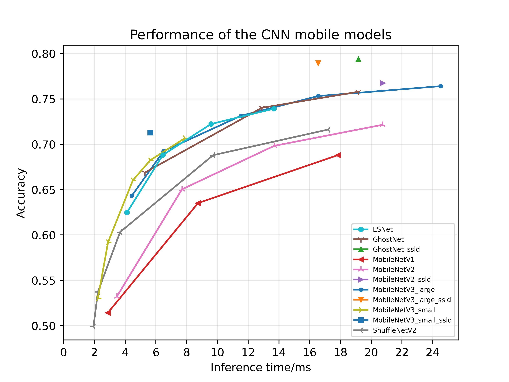

# PaddleClas

**Book**: https://paddleclas.readthedocs.io

**Quick start PaddleClas in 30 minutes**: https://paddleclas.readthedocs.io/zh_CN/latest/tutorials/quick_start.html

## Introduction

PaddleClas is a tool set for image classification tasks prepared for the industry and academia. It helps users train better computer vision models and apply in real scenarios.

    

## Rich model zoo

Based on ImageNet1k dataset, PaddleClas provides a brief introduction to 23 series of imaget classification networks such as ResNet, ResNet_vd, Res2Net, HRNet, and MobileNetV3 besides their reproduction configurations and training techniques. At the same time, the corresponding 117 image classification pretrained models are also open source. The GPU inference time of the server-side model is evaluated based on TensorRT. The CPU inference time and the mobile-side model storage size are evaluated on the Snapdragon 855 (SD855). For more detailed information of the supported pretrained models and their download links, please refer to [**models introduction tutorial**](https://paddleclas.readthedocs.io/zh_CN/latest/models/models_intro.html).

    

The above figure shows some of the latest server-side pretrained models. It can be seen from the figure that when using V100 GPU with FP32 and TensorRT, the `Top1` accuracy of the ResNet50_vd_ssld pretrained model on ImageNet1k-val dataset is **82.4%** and that of ResNet101_vd_ssld pretrained model is 83.7%. These pretained models are obtained from  SSLD knowledge distillation solution provided by PaddleClas. The marks of the same color and symbol in the figure represent models of different model sizes in the same series. For the introduction of different models, FLOPS, Params and detailed GPU inference time (including the infecne speed of T4 GPU with different batch size), please refer to the documentation tutorial formal details: [https://paddleclas.readthedocs.io/zh_CN/latest/models/models_intro.html](https://paddleclas.readthedocs.io/zh_CN/latest/models/models_intro.html)

The above figure shows performance of some commonly used mobile-side models, including MobileNetV1, MobileNetV2, MobileNetV3 and ShuffleNetV2 series. The inferece time is tested on Snapdragon 855 (SD855) with the batch size set as 1. the `Top1` accuracy of the MV3_large_x1_0_ssld, MV3_small_x1_0_ssld, MV1_ssld and MV2_ssld pretrained model on ImageNet1k-val dataset are 79%, 71.3%, 76.74%, 77.89%, respectively (M is short for MobileNet). MV3_large_x1_0_ssld_int8 is a quantizatied pretrained model for MV3_large_x1_0. More details about the mobile-side models can be seen in [**models introduction tutorial**](https://paddleclas.readthedocs.io/zh_CN/latest/models/models_intro.html)

- TODO
- [ ] Reproduction and performance evaluation of EfficientLite, GhostNet and RegNet.

## High-level support

In addition to providing rich classification network structures and pretrained models, PaddleClas also supports a series of algorithms or tools that help to improve the effectiveness and efficiency of image classification tasks.

### knowledge distillation (SSLD)

Knowledge distillation refers to using the teacher model to guide the student model to learn specific tasks, ensuring that the small model has a relatively large effect improvement with the computation cost unchanged, and even obtains similar accuracy with the large model. PaddleClas provides a Simple Semi-supervised Label Distillation method (SSLD). With this method, different models on ImageNet1k-val dataset has 3% absolute improvement(Top1 accuracy) on ImageNet1k-val dataset. The following figure shows the models' performance after SSLD.

Taking the ImageNet1k dataset as an example, the following figure shows the SSLD knowledge distillation method framework. The key points of the method include the choice of teacher model, loss calculation method, iteration number, use of unlabeled data, and ImageNet1k dataset finetune. For detailed introduction and experiments, please refer to [**knowledge distillation tutorial**](https://paddleclas.readthedocs.io/zh_CN/latest/advanced_tutorials/distillation/index.html)

### Data augmentation

For a certain image classification task, data augmentation is a commonly used regularization method, which can effectively improve the effect of image classification, especially for scenarios where the data is insufficient or the network is large. Commonly used data augmentation can be divided into 3 categories, `transformation`, `cropping` and `aliasing`, as shown below. The image transformation refers to performing some transformations on the entire image, such as AutoAugment and RandAugment. The image cropping refers to the transformation of the image to block some areas in a certain way, such as CutOut, RandErasing, HideAndSeek and GridMask. Image aliasing refers to the transformation of multiple images to alias a new image, such as Mixup and Cutmix.

PaddleClas provides the reproduction of the above 8 data augmentation algorithms and the evaluation of the effect in a unified environment. The following figure shows the performance of different data augmentation methods based on ResNet50. Compared with the standard transformation, using data augmentation, the recognition accuracy  can be increased by up to 1%. For more detailed introduction of data augmentation methods, please refer to the [**data augmentation tutorial**](https://paddleclas.readthedocs.io/zh_CN/latest/advanced_tutorials/image_augmentation/index.html).

## Quick start

Based on flowers102 dataset, you can easily experience different networks, pretrained models and SSLD knowledge distillation method in PaddleClas. More details can be seen in [**Quick start PaddleClas in 30 minutes**](https://paddleclas.readthedocs.io/zh_CN/latest/tutorials/quick_start.html).

## Getting started

For installation, model training, inference, evaluation and finetune in PaddleClas, you can refer to [**gettting started tutorial**](https://paddleclas.readthedocs.io/zh_CN/latest/tutorials/index.html).

## Featured extension and application

### A classification pretrained model with 100K categories

The models trained on ImageNet1K dataset are often used as pretrained models for other classification tasks in practical applications due to lack of training data. However, there are only 1,000 categories in the ImageNet1K dataset, and the feature migration capability of the pretrained model is limited. Therefore, Baidu developed a tag system including 100,000 categories, with semantic information and different granularity. Through manual or semi-supervised methods, more than 55,000,000 training images have been collectet. The system is the largest image classification system and training set in the country and even the world. PaddleClas provides the ResNet50_vd model trained on this dataset. The following table shows the comparison of using the ImageNet pretrained model and the above 100,000 image classification pretrained model in some practical application scenarios. Using the 100,000 image classification pretrained model, the recognition accuracy can be increased by up to 30%.

| Dataset   | Dataset statistics | ImageNet pretrained model | 100,000-categories' pretrained model |
|:--:|:--:|:--:|:--:|
| Flowers    | class_num:102 train/val:5789/2396      | 0.7779        | 0.9892        |
| Hand-painted stick figures | class_num:18 train/val:1007/432        | 0.8785        | 0.9107        |
| Leaves  | class_num:6 train/val:5256/2278        | 0.8212        | 0.8385        |
| Container vehicle | class_num:115 train/val:4879/2094       | 0.623         | 0.9524        |
| Chair    | class_num:5 train/val:169/78         | 0.8557        | 0.9077        |
| Geology    | class_num:4 train/val:671/296         | 0.5719        | 0.6781        |

The 100,000 categories' pretrained model can be downloaded here: [download link](https://paddle-imagenet-models-name.bj.bcebos.com/ResNet50_vd_10w_pretrained.tar). More details can be seen in [**Transfer learning tutorial**](https://paddleclas.readthedocs.io/zh_CN/latest/application/transfer_learning.html).

### Object detection

In recent years, object detection tasks atrtract a lot of attention in academia and industry. The ImageNet classification model is often used for pretrained model n object detection, which can directly affect the effect of object detection. Based on 82.39% ResNet50_vd pretrained model, PaddleDetection provides a Pratical Server-side Detection solution, PSS-DET. The solution contains many strategies that can effectively improve the performance while take limited extra computation cost, such as model pruning, better pretrained model, deformable convolution, cascade rcnn, autoaugment, libra sampling and multi-scale training. Compared with the 79.12% ImageNet1k pretrained model, the 82.39% model can help improve the COCO mAP by 1.5% without any computation cost. Using PSS-DET, the inference speed on single V100 GPU can reach 20FPS when COCO mAP is 47.8%, and reach 61FPS when COCO mAP is 41.6%. For more details, please refer to [**Object Detection tutorial**](https://paddleclas.readthedocs.io/zh_CN/latest/application/object_detection.html).

- TODO
- [ ] Application of PaddleClas in OCR tasks.
- [ ] Application of PaddleClas in face detection and recognition tasks.

## Industrial-grade application deployment tools

PaddlePaddle provides a series of practical tools to conveniently deploy the PaddleClas models for industrial applications. For more details, please refer to [**extension tutorial**](https://paddleclas.readthedocs.io/zh_CN/latest/extension/index.html)

- TensorRT inference
- Paddle-Lite
- Paddle-Serving
- Model quantization
- Multi-machine training
- Paddle Hub

## Competition support

PaddleClas stems from the Baidu's visual business applications and the exploration of frontier visual capabilities. It has helped us achieve leading results in many key events, and continues to promote more frontier visual solutions and landing applications. For more details, please refer to [**competition support tutorial**](https://paddleclas.readthedocs.io/zh_CN/latest/competition_support.html)

- 1st place in 2018 Kaggle Open Images V4 object detection challenge
- A-level certificate of three tasks: printed text OCR, face recognition and landmark recognition in the first multimedia information recognition technology competition
- 2nd place in 2019 Kaggle Open Images V5 object detection challenge
- 2nd place in Kaggle Landmark Retrieval Challenge 2019
- 2nd place in Kaggle Landmark Recognition Challenge 2019

## License

PaddleClas is released under the <a href="https://github.com/PaddlePaddle/PaddleClas/blob/master/LICENSE">Apache 2.0 license</a>

## Updates

## Contributing

Contributions are highly welcomed and we would really appreciate your feedback!!
