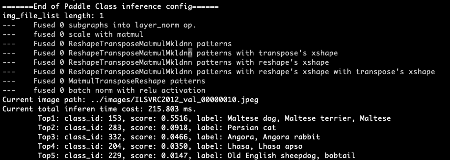

# 服务器端C++预测

本教程将介绍在服务器端部署PaddleClas模型的详细步骤。


## 1. 准备环境

### 运行准备
- Linux环境，推荐使用docker。
- Windows环境，目前支持基于`Visual Studio 2019 Community`进行编译；此外，如果您希望通过生成`sln解决方案`的方式进行编译，可以参考该文档：[https://zhuanlan.zhihu.com/p/145446681](https://zhuanlan.zhihu.com/p/145446681)

* 该文档主要介绍基于Linux环境下的PaddleClas C++预测流程，如果需要在Windows环境下使用预测库进行C++预测，具体编译方法请参考[Windows下编译教程](./docs/windows_vs2019_build.md)。

### 1.1 编译opencv库

* 首先需要从opencv官网上下载在Linux环境下源码编译的包，以3.4.7版本为例，下载及解压缩命令如下：

```
wget https://github.com/opencv/opencv/archive/3.4.7.tar.gz
tar -xvf 3.4.7.tar.gz
```

最终可以在当前目录下看到`opencv-3.4.7/`的文件夹。

* 编译opencv，首先设置opencv源码路径(`root_path`)以及安装路径(`install_path`)，`root_path`为下载的opencv源码路径，`install_path`为opencv的安装路径。在本例中，源码路径即为当前目录下的`opencv-3.4.7/`。

```shell
cd ./opencv-3.4.7
export root_path=$PWD
export install_path=${root_path}/opencv3
```

* 然后在opencv源码路径下，按照下面的方式进行编译。

```shell
rm -rf build
mkdir build
cd build

cmake .. \
    -DCMAKE_INSTALL_PREFIX=${install_path} \
    -DCMAKE_BUILD_TYPE=Release \
    -DBUILD_SHARED_LIBS=OFF \
    -DWITH_IPP=OFF \
    -DBUILD_IPP_IW=OFF \
    -DWITH_LAPACK=OFF \
    -DWITH_EIGEN=OFF \
    -DCMAKE_INSTALL_LIBDIR=lib64 \
    -DWITH_ZLIB=ON \
    -DBUILD_ZLIB=ON \
    -DWITH_JPEG=ON \
    -DBUILD_JPEG=ON \
    -DWITH_PNG=ON \
    -DBUILD_PNG=ON \
    -DWITH_TIFF=ON \
    -DBUILD_TIFF=ON

make -j
make install
```

* `make install`完成之后，会在该文件夹下生成opencv头文件和库文件，用于后面的PaddleClas代码编译。

以opencv3.4.7版本为例，最终在安装路径下的文件结构如下所示。**注意**：不同的opencv版本，下述的文件结构可能不同。

```
opencv3/
|-- bin
|-- include
|-- lib64
|-- share
```

### 1.2 下载或者编译Paddle预测库

* 有2种方式获取Paddle预测库，下面进行详细介绍。

#### 1.2.1 预测库源码编译
* 如果希望获取最新预测库特性，可以从Paddle github上克隆最新代码，源码编译预测库。
* 可以参考[Paddle预测库官网](https://www.paddlepaddle.org.cn/documentation/docs/zh/develop/guides/05_inference_deployment/inference/build_and_install_lib_cn.html#id16)的说明，从github上获取Paddle代码，然后进行编译，生成最新的预测库。使用git获取代码方法如下。

```shell
git clone https://github.com/PaddlePaddle/Paddle.git
```

* 进入Paddle目录后，使用如下方法编译。

```shell
rm -rf build
mkdir build
cd build

cmake  .. \
    -DWITH_CONTRIB=OFF \
    -DWITH_MKL=ON \
    -DWITH_MKLDNN=ON  \
    -DWITH_TESTING=OFF \
    -DCMAKE_BUILD_TYPE=Release \
    -DWITH_INFERENCE_API_TEST=OFF \
    -DON_INFER=ON \
    -DWITH_PYTHON=ON
make -j
make inference_lib_dist
```

更多编译参数选项可以参考Paddle C++预测库官网：[https://www.paddlepaddle.org.cn/documentation/docs/zh/develop/guides/05_inference_deployment/inference/build_and_install_lib_cn.html#id16](https://www.paddlepaddle.org.cn/documentation/docs/zh/develop/guides/05_inference_deployment/inference/build_and_install_lib_cn.html#id16)。


* 编译完成之后，可以在`build/paddle_inference_install_dir/`文件下看到生成了以下文件及文件夹。

```
build/paddle_inference_install_dir/
|-- CMakeCache.txt
|-- paddle
|-- third_party
|-- version.txt
```

其中`paddle`就是之后进行C++预测时所需的Paddle库，`version.txt`中包含当前预测库的版本信息。

#### 1.2.2 直接下载安装

* [Paddle预测库官网](https://www.paddlepaddle.org.cn/documentation/docs/zh/develop/guides/05_inference_deployment/inference/build_and_install_lib_cn.html#id1)上提供了不同cuda版本的Linux预测库，可以在官网查看并选择合适的预测库版本，注意必须选择`develop`版本。

  以`2.1.1-gpu-cuda10.2-cudnn8.1-mkl-gcc8.2`的`develop`版本为例，使用下述命令下载并解压：


```shell
wget https://paddle-inference-lib.bj.bcebos.com/2.1.1-gpu-cuda10.2-cudnn8.1-mkl-gcc8.2/paddle_inference.tgz
tar -xvf paddle_inference.tgz
```


最终会在当前的文件夹中生成`paddle_inference/`的子文件夹。


## 2 开始运行

### 2.1 将模型导出为inference model

* 可以参考[模型导出](../../tools/export_model.py)，导出`inference model`，用于模型预测。得到预测模型后，假设模型文件放在`inference`目录下，则目录结构如下。

```
inference/
|--inference.pdmodel
|--inference.pdiparams
```
**注意**：上述文件中，`inference.pdmodel`文件存储了模型结构信息，`inference.pdiparams`文件存储了模型参数信息。模型目录可以随意设置，但是模型名字不能修改。

### 2.2 编译PaddleClas C++预测demo

* 编译命令如下，其中Paddle C++预测库、opencv等其他依赖库的地址需要换成自己机器上的实际地址。


```shell
sh tools/build.sh
```

具体地，`tools/build.sh`中内容如下。

```shell
OPENCV_DIR=your_opencv_dir
LIB_DIR=your_paddle_inference_dir
CUDA_LIB_DIR=your_cuda_lib_dir
CUDNN_LIB_DIR=your_cudnn_lib_dir
TENSORRT_DIR=your_tensorrt_lib_dir

BUILD_DIR=build
rm -rf ${BUILD_DIR}
mkdir ${BUILD_DIR}
cd ${BUILD_DIR}
cmake .. \
    -DPADDLE_LIB=${LIB_DIR} \
    -DWITH_MKL=ON \
    -DDEMO_NAME=clas_system \
    -DWITH_GPU=OFF \
    -DWITH_STATIC_LIB=OFF \
    -DWITH_TENSORRT=OFF \
    -DTENSORRT_DIR=${TENSORRT_DIR} \
    -DOPENCV_DIR=${OPENCV_DIR} \
    -DCUDNN_LIB=${CUDNN_LIB_DIR} \
    -DCUDA_LIB=${CUDA_LIB_DIR} \

make -j
cd ..
```

上述命令中，

* `OPENCV_DIR`为opencv编译安装的地址（本例中为`opencv-3.4.7/opencv3`文件夹的路径）；

* `LIB_DIR`为下载的Paddle预测库（`paddle_inference`文件夹），或编译生成的Paddle预测库（`build/paddle_inference_install_dir`文件夹）的路径；

* `CUDA_LIB_DIR`为cuda库文件地址，在docker中为`/usr/local/cuda/lib64`；

* `CUDNN_LIB_DIR`为cudnn库文件地址，在docker中为`/usr/lib/x86_64-linux-gnu/`。

* `TENSORRT_DIR`是tensorrt库文件地址，在dokcer中为`/usr/local/TensorRT6-cuda10.0-cudnn7/`，TensorRT需要结合GPU使用。

在执行上述命令，编译完成之后，会在当前路径下生成`build`文件夹，其中生成一个名为`clas_system`的可执行文件。


### 2.3 运行demo
#### 2.3.1 设置配置文件

```shell
cp ../configs/inference_cls.yaml tools/
```

根据[python预测推理](../../docs/zh_CN/inference_deployment/python_deploy.md)的`图像分类推理`部分修改好`tools`目录下`inference_cls.yaml`文件。`yaml`文件的参数说明详见[python预测推理](../../docs/zh_CN/inference_deployment/python_deploy.md)。

请根据实际存放文件，修改好`Global.infer_imgs`、`Global.inference_model_dir`、`PostProcess.Topk.topk`、`PostProcess.Topk.class_id_map_file`等参数。

#### 2.3.2 执行

```shell
./build/clas_system -c tools/inference_cls.yaml
# or
./build/clas_system -config tools/inference_cls.yaml
```

最终屏幕上会输出结果，如下图所示。

<div align="center">
    
</div>


其中`class id`表示置信度最高的类别对应的id，score表示图片属于该类别的概率。
