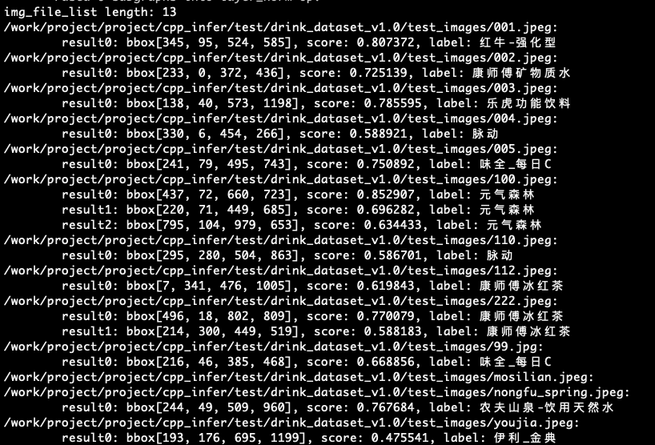

# C++ Inference on Server

This tutorial details the steps to deploy PP-ShiTU on the server side.

## Catalogue

- [1.Prepare the Environment](#1)
  - [1.1 Update cmake](#1.1)
  - [1.2 Compile opencv Library](#1.2)
  - [1.3 Download or Compile Paddle Inference Library](#1.3)
    - [1.3.1 Compile the Source of Inference Library](#1.3.1)
    - [1.3.2 Direct Download and Installation](#1.3.2)
  - [1.4 Install faiss Library](#1.4)
- [2.Code Compilation](#2)
- [3.Run the demo](#3)
- [4.Use Your Own Model](#4)

<a name="1"></a>

## 1. Prepare the Environment

### Environment Preparation

- Linux environment, ubuntu docker recommended.

<a name="1.1"></a>

### 1.1 Update cmake

The first step is to upgrade `cmake` considering the requirements of the dependency library compilation.

- Download the latest version of cmake

```
# The latest version is 3.22.0, please download the appropriate one, the latest recommended.
wget https://github.com/Kitware/CMake/releases/download/v3.22.0/cmake-3.22.0.tar.gz
tar xf cmake-3.22.0.tar.gz
```

You can find `cmake-3.22.0/` folder in the current directory.

- To compile cmake, first set the source path of `cmake` (`root_path`) and installation path (`install_path`). In this example, the source path is `cmake-3.22.0/` in the current directory.

```shell
cd ./cmake-3.22.0
export root_path=$PWD
export install_path=${root_path}/cmake
```

- Then compile under the source path as follows:

```shell
./bootstrap --prefix=${install_path}
make -j
make install
```

- Set environment variables

```shell
export PATH=${install_path}/bin:$PATH
#Check its well functioning
cmake --version
```

cmake is now ready for use.

<a name="1.2"></a>

### 1.2 Compile opencv Library

- First, download the package for source compilation in Linux environment from the official website of opencv. Taking version 3.4.7 as an example, follow the command below to download and unzip it:

```shell
wget https://github.com/opencv/opencv/archive/3.4.7.tar.gz
tar -xvf 3.4.7.tar.gz
```

You can find`opencv-3.4.7/`folder in the current directory.

- To compile opencv, first set the source path of opencv(`root_path`) and installation path (`install_path`). In this example, the source path is`opencv-3.4.7/`in the current directory.

```
cd ./opencv-3.4.7
export root_path=$PWD
export install_path=${root_path}/opencv3
```

- Then compile under the source path as follows:

```shell
rm -rf build
mkdir build
cd build

cmake .. \
    -DCMAKE_INSTALL_PREFIX=${install_path} \
    -DCMAKE_BUILD_TYPE=Release \
    -DBUILD_SHARED_LIBS=OFF \
    -DWITH_IPP=OFF \
    -DBUILD_IPP_IW=OFF \
    -DWITH_LAPACK=OFF \
    -DWITH_EIGEN=OFF \
    -DCMAKE_INSTALL_LIBDIR=lib64 \
    -DWITH_ZLIB=ON \
    -DBUILD_ZLIB=ON \
    -DWITH_JPEG=ON \
    -DBUILD_JPEG=ON \
    -DWITH_PNG=ON \
    -DBUILD_PNG=ON \
    -DWITH_TIFF=ON \
    -DBUILD_TIFF=ON

make -j
make install
```

- After `make install` is done, opencv header and library files will be generated in this folder for later compilation of PaddleClas code.

For opencv version 3.4.7, the final file structure under the installation path is shown below. **Note**: The following file structure may vary for different opencv versions.

```
opencv3/
|-- bin
|-- include
|-- lib64
|-- share
```

<a name="1.3"></a>

### 1.3 Download or Compile Paddle Inference Library

- Here we detail 2 ways to obtain Paddle inference library.

<a name="1.3.1"></a>

#### 1.3.1 Compile the Source of Inference Library

- To obtain the latest features of the inference library, you can clone the latest code from Paddle github and compile the source code of the library.
- Please refer to the website of  [Paddle Inference Library](https://www.paddlepaddle.org.cn/documentation/docs/zh/develop/guides/05_inference_deployment/inference/build_ and_install_lib_cn.html#id16) to get Paddle code from github and then compile it to generate the latest inference library. The method to obtain the code using git is as follows.

```shell
git clone https://github.com/PaddlePaddle/Paddle.git
```

- Adopt the following method to compile after entering Paddle directory.

```shell
rm -rf build
mkdir build
cd build

cmake  .. \
    -DWITH_CONTRIB=OFF \
    -DWITH_MKL=ON \
    -DWITH_MKLDNN=ON  \
    -DWITH_TESTING=OFF \
    -DCMAKE_BUILD_TYPE=Release \
    -DWITH_INFERENCE_API_TEST=OFF \
    -DON_INFER=ON \
    -DWITH_PYTHON=ON
make -j
make inference_lib_dist
```

See the official website of [Paddle C++ Inference Library](https://www.paddlepaddle.org.cn/documentation/docs/zh/develop/guides/05_inference_deployment/inference/build_and_install_lib_cn.html#id16) for more compilation parameters.

- The following files and folders can be found generated under `build/paddle_inference_install_dir/` after compilation.

```
build/paddle_inference_install_dir/
|-- CMakeCache.txt
|-- paddle
|-- third_party
|-- version.txt
```

 `paddle` is the Paddle library needed for later C++ inference, and `version.txt` contains the version information of the current inference library.

<a name="1.3.2"></a>

#### 1.3.2 Direct Download and Installation

- The Linux inference library of different cuda versions are available on the official website of [Paddle Inference Library ](https://paddle-inference.readthedocs.io/en/latest/user_guides/download_lib.html), where you can choose the appropriate version. Note that you must select the `develop` version.

  For the `develop` version of `https://paddle-inference-lib.bj.bcebos.com/2.1.1-gpu-cuda10.2-cudnn8.1-mkl-gcc8.2/paddle_inference.tgz`, use the following command to download and unzip it:

```shell
wget https://paddle-inference-lib.bj.bcebos.com/2.1.1-gpu-cuda10.2-cudnn8.1-mkl-gcc8.2/paddle_inference.tgz

tar -xvf paddle_inference.tgz
```

The subfolder `paddle_inference/` will finally be created in the current folder.

<a name="1.4"></a>

### 1.4 Install faiss Library

```shell
 # Download faiss
 git clone https://github.com/facebookresearch/faiss.git
 cd faiss
 export faiss_install_path=$PWD/faiss_install
 cmake -B build . -DFAISS_ENABLE_PYTHON=OFF  -DCMAKE_INSTALL_PREFIX=${faiss_install_path}
 make -C build -j faiss
 make -C build install
```

Please install `openblas` before `faiss`, the installation command in `ubuntu` system is as follows:

```
apt-get install libopenblas-dev
```

Note that this tutorial installs the cpu version of faiss as an example, please install it as your need by referring to the official documents of [faiss](https://github.com/facebookresearch/faiss).

<a name="2"></a>

## 2. Code Compilation

The command is as follows, where the address of Paddle C++ inference library, opencv and other dependency libraries need to be replaced with the actual address on your own machine. Also, you need to download and compile `yaml-cpp` and other C++ libraries during the compilation, so please keep the network unblocked.

```shell
sh tools/build.sh
```

Specifically, the contents of `tools/build.sh` are as follows, please modify according to the specific path.

```shell
OPENCV_DIR=${opencv_install_dir}
LIB_DIR=${paddle_inference_dir}
CUDA_LIB_DIR=/usr/local/cuda/lib64
CUDNN_LIB_DIR=/usr/lib/x86_64-linux-gnu/
FAISS_DIR=${faiss_install_dir}
FAISS_WITH_MKL=OFF

BUILD_DIR=build
rm -rf ${BUILD_DIR}
mkdir ${BUILD_DIR}
cd ${BUILD_DIR}
cmake .. \
    -DPADDLE_LIB=${LIB_DIR} \
    -DWITH_MKL=ON \
    -DWITH_GPU=OFF \
    -DWITH_STATIC_LIB=OFF \
    -DUSE_TENSORRT=OFF \
    -DOPENCV_DIR=${OPENCV_DIR} \
    -DCUDNN_LIB=${CUDNN_LIB_DIR} \
    -DCUDA_LIB=${CUDA_LIB_DIR} \
    -DFAISS_DIR=${FAISS_DIR} \
    -DFAISS_WITH_MKL=${FAISS_WITH_MKL}

make -j
cd ..
```

In the above commands:

- `OPENCV_DIR` is the address of the opencv compilation and installation (in this case, the path of the `opencv-3.4.7/opencv3` folder).
- `LIB_DIR` is the path of the downloaded Paddle inference library (`paddle_inference` folder), or the generated Paddle inference library after compilation (`build/paddle_inference_install_dir` folder).
- `CUDA_LIB_DIR` is path of the cuda library file, which in docker is `/usr/local/cuda/lib64`.
- `CUDNN_LIB_DIR` is the path of the cudnn library file, which in docker is `/usr/lib/x86_64-linux-gnu/` .
- `TENSORRT_DIR` is the path of the tensorrt library file, which in docker is `/usr/local/TensorRT6-cuda10.0-cudnn7/`. TensorRT needs to be used in combination with GPU.
- `FAISS_DIR` is the installation path of faiss.
- `FAISS_WITH_MKL` means whether mkldnn is used during the compilation of faiss. The compilation in this document employs openbals instead of mkldnn, so it is set to `OFF`, otherwise it is `ON`.

A `build` folder will be created in the current path after the compilation, which generates an executable file named `pp_shitu`.

<a name="3"></a>

## 3. Run the demo

- Please refer to the [Quick Start of Recognition](../../docs/en/quick_start/quick_start_recognition_en.md), download the corresponding Lightweight Generic Mainbody Detection Model, Lightweight Generic Recognition Model, and the beverage test data and unzip them.

  ```shell
  mkdir models
  cd models
  wget https://paddle-imagenet-models-name.bj.bcebos.com/dygraph/rec/models/inference/picodet_PPLCNet_x2_5_mainbody_lite_v1.0_infer.tar
  tar -xf picodet_PPLCNet_x2_5_mainbody_lite_v1.0_infer.tar
  wget https://paddle-imagenet-models-name.bj.bcebos.com/dygraph/rec/models/inference/general_PPLCNet_x2_5_lite_v1.0_infer.tar
  tar -xf general_PPLCNet_x2_5_lite_v1.0_infer.tar
  cd ..

  mkdir data
  cd data
  wget https://paddle-imagenet-models-name.bj.bcebos.com/dygraph/rec/data/drink_dataset_v1.0.tar
  tar -xf drink_dataset_v1.0.tar
  cd ..
  ```

- Copy the corresponding yaml file to the current folder

  ```
  cp ../configs/inference_drink.yaml .
  ```

- Change the relative path in `inference_drink.yaml` to a path based on this directory or an absolute path. The parameters involved are:

  - Global.infer_imgs: This parameter can be a specific image path or the directory where the image set is located
  - Global.det_inference_model_dir: The directory where detection models are saved.
  - Global.rec_inference_model_dir: The directory where recognition models are saved.
  - IndexProcess.index_dir: The storage directory of the retrieval library, in the exmple, the retrieval library is in the downloaded demo data.

- Transform the ID-Label Map Dictionary

  The id-label map dictionary in python is serialized using `pickle`, which make it hard to read for C++, so the transformation is needed:

  ```
  python tools/transform_id_map.py -c inference_drink.yaml
  ```

   `id_map.txt` is generated in `IndexProcess.index_dir` directory for convenience of C++ reading.

- Execute the program

  ```shell
  ./build/pp_shitu -c inference_drink.yaml
  # or
  ./build/pp_shitu -config inference_drink.yaml
  ```

  The following results can be obtained after searching the image set.

  At the same time, it should be noticed that a slight difference may occur during the pre-processing of the image due to the version of opencv, resulting in a minor discrepancy in python and c++ results, such as a few pixels for bbox, 3 decimal places for retrieval results, etc. But it has no impact on the final search label.

  [](https://github.com/PaddlePaddle/PaddleClas/blob/develop/docs/images/quick_start/shitu_c++_result.png)

<a name="4"></a>

## 4. Use Your Own Model

You can also use your self-trained models. Please refer to [model export](../../docs/en/inference_deployment/export_model_en.md) to export ` inference model` for model inference.

Mind modifying the specific parameters in the `yaml` file.
