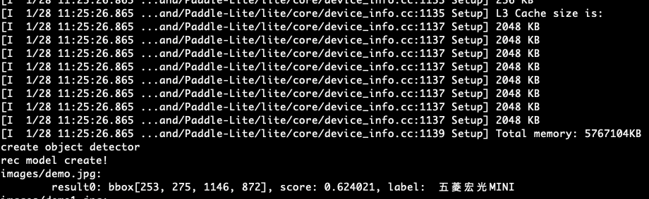

# PP-ShiTu在Paddle-Lite端侧部署

本教程将介绍基于[Paddle Lite](https://github.com/PaddlePaddle/Paddle-Lite) 在移动端部署PaddleClas PP-ShiTu模型的详细步骤。

Paddle Lite是飞桨轻量化推理引擎，为手机、IOT端提供高效推理能力，并广泛整合跨平台硬件，为端侧部署及应用落地问题提供轻量化的部署方案。

## 1. 准备环境

### 运行准备
- 电脑（编译Paddle Lite）
- 安卓手机（armv7或armv8）

### 1.1 准备交叉编译环境
交叉编译环境用于编译 Paddle Lite 和 PaddleClas 的PP-ShiTu Lite demo。
支持多种开发环境，不同开发环境的编译流程请参考对应文档，请确保安装完成Java jdk、Android NDK(R17以上)。

1. [Docker](https://paddle-lite.readthedocs.io/zh/latest/source_compile/compile_env.html#docker)
2. [Linux](https://paddle-lite.readthedocs.io/zh/latest/source_compile/compile_env.html#linux)
3. [MAC OS](https://paddle-lite.readthedocs.io/zh/latest/source_compile/compile_env.html#mac-os)

```shell
# 配置完成交叉编译环境后，更新环境变量
# for docker、Linux
source ~/.bashrc
# for Mac OS
source ~/.bash_profile
```

### 1.2 准备预测库

预测库有两种获取方式：
1. [**建议**]直接下载，预测库下载链接如下：
      |平台| 架构 | 预测库下载链接|
      |-|-|-|
      |Android| arm7 | [inference_lite_lib](https://github.com/PaddlePaddle/Paddle-Lite/releases/download/v2.10-rc/inference_lite_lib.android.armv7.clang.c++_static.with_extra.with_cv.tar.gz) |
      | Android | arm8 | [inference_lite_lib](https://github.com/PaddlePaddle/Paddle-Lite/releases/download/v2.10-rc/inference_lite_lib.android.armv8.clang.c++_static.with_extra.with_cv.tar.gz)  |
      | Android | arm8(FP16) | [inference_lite_lib](https://github.com/PaddlePaddle/Paddle-Lite/releases/download/v2.10-rc/inference_lite_lib.android.armv8_clang_c++_static_with_extra_with_cv_with_fp16.tiny_publish_427e46.zip)  |

**注意**：1. 如果是从 Paddle-Lite [官方文档](https://paddle-lite.readthedocs.io/zh/latest/quick_start/release_lib.html#android-toolchain-gcc)下载的预测库，注意选择`with_extra=ON，with_cv=ON`的下载链接。2. 目前只提供Android端demo，IOS端demo可以参考[Paddle-Lite IOS demo](https://github.com/PaddlePaddle/Paddle-Lite-Demo/tree/master/PaddleLite-ios-demo)


2. 编译Paddle-Lite得到预测库，Paddle-Lite的编译方式如下：
```shell
git clone https://github.com/PaddlePaddle/Paddle-Lite.git
cd Paddle-Lite
# 如果使用编译方式，建议使用develop分支编译预测库
git checkout develop
# FP32
./lite/tools/build_android.sh --arch=armv8 --toolchain=clang --with_cv=ON --with_extra=ON
# FP16
./lite/tools/build_android.sh --arch=armv8 --toolchain=clang --with_cv=ON --with_extra=ON --with_arm82_fp16=ON
```

**注意**：编译Paddle-Lite获得预测库时，需要打开`--with_cv=ON --with_extra=ON`两个选项，`--arch`表示`arm`版本，这里指定为armv8，更多编译命令介绍请参考[链接](https://paddle-lite.readthedocs.io/zh/latest/source_compile/compile_andriod.html#id2)。

直接下载预测库并解压后，可以得到`inference_lite_lib.android.armv8.clang.c++_static.with_extra.with_cv/`文件夹，通过编译Paddle-Lite得到的预测库位于`Paddle-Lite/build.lite.android.armv8.gcc/inference_lite_lib.android.armv8/`文件夹下。
预测库的文件目录如下：

```
inference_lite_lib.android.armv8/
|-- cxx                                        C++ 预测库和头文件
|   |-- include                                C++ 头文件
|   |   |-- paddle_api.h
|   |   |-- paddle_image_preprocess.h
|   |   |-- paddle_lite_factory_helper.h
|   |   |-- paddle_place.h
|   |   |-- paddle_use_kernels.h
|   |   |-- paddle_use_ops.h
|   |   `-- paddle_use_passes.h
|   `-- lib                                           C++预测库
|       |-- libpaddle_api_light_bundled.a             C++静态库
|       `-- libpaddle_light_api_shared.so             C++动态库
|-- java                                     Java预测库
|   |-- jar
|   |   `-- PaddlePredictor.jar
|   |-- so
|   |   `-- libpaddle_lite_jni.so
|   `-- src
|-- demo                                     C++和Java示例代码
|   |-- cxx                                  C++  预测库demo
|   `-- java                                 Java 预测库demo
```

## 2 开始运行

### 2.1 模型准备


#### 2.1.1 模型准备

```shell
# 进入lite_ppshitu目录
cd $PaddleClas/deploy/lite_shitu
wget https://paddle-imagenet-models-name.bj.bcebos.com/dygraph/lite/ppshitu_lite_models_v1.0.tar
tar -xf ppshitu_lite_models_v1.0.tar
rm -f ppshitu_lite_models_v1.0.tar
```

#### 2.1.2将yaml文件转换成json文件

```shell
# 如果测试单张图像
python generate_json_config.py --det_model_path ppshitu_lite_models_v1.0/mainbody_PPLCNet_x2_5_640_quant_v1.0_lite.nb  --rec_model_path ppshitu_lite_models_v1.0/general_PPLCNet_x2_5_quant_v1.0_lite.nb --rec_label_path ppshitu_lite_models_v1.0/label.txt --img_path images/demo.jpg
# or
# 如果测试多张图像
python generate_json_config.py --det_model_path ppshitu_lite_models_v1.0/mainbody_PPLCNet_x2_5_640_quant_v1.0_lite.nb  --rec_model_path ppshitu_lite_models_v1.0/general_PPLCNet_x2_5_quant_v1.0_lite.nb --rec_label_path ppshitu_lite_models_v1.0/label.txt --img_dir images

# 执行完成后，会在lit_shitu下生成shitu_config.json配置文件

```

### 2.2 与手机联调

首先需要进行一些准备工作。
1. 准备一台arm8的安卓手机，如果编译的预测库是armv7，则需要arm7的手机，并修改Makefile中`ARM_ABI=arm7`。
2. 电脑上安装ADB工具，用于调试。 ADB安装方式如下：

    2.1. MAC电脑安装ADB:

    ```shell
    brew cask install android-platform-tools
    ```
    2.2. Linux安装ADB
    ```shell
    sudo apt update
    sudo apt install -y wget adb
    ```
    2.3. Window安装ADB

    win上安装需要去谷歌的安卓平台下载ADB软件包进行安装：[链接](https://developer.android.com/studio)

3. 手机连接电脑后，开启手机`USB调试`选项，选择`文件传输`模式，在电脑终端中输入：

```shell
adb devices
```
如果有device输出，则表示安装成功，如下所示：
```
List of devices attached
744be294    device
```

4. 编译lite部署代码生成移动端可执行文件

```shell
cd $PaddleClas/deploy/lite_shitu
# ${lite prediction library path}下载的Paddle-Lite库路径
inference_lite_path=${lite prediction library path}/inference_lite_lib.android.armv8.gcc.c++_static.with_extra.with_cv/
mkdir $inference_lite_path/demo/cxx/ppshitu_lite

cp -r * $inference_lite_path/demo/cxx/ppshitu_lite
cd $inference_lite_path/demo/cxx/ppshitu_lite

# 执行编译，等待完成后得到可执行文件main
make ARM_ABI=arm8
#如果是arm7，则执行 make ARM_ABI = arm7 (或者在Makefile中修改该项)
```

5. 准备优化后的模型、预测库文件、测试图像。

```shell
mkdir deploy
mv ppshitu_lite_models_v1.0 deploy/
mv images deploy/
mv shitu_config.json deploy/
cp pp_shitu deploy/

# 将C++预测动态库so文件复制到deploy文件夹中
cp ../../../cxx/lib/libpaddle_light_api_shared.so deploy/
```

执行完成后，deploy文件夹下将有如下文件格式：

```shell
deploy/
|-- ppshitu_lite_models_v1.0/
|   |--mainbody_PPLCNet_x2_5_640_v1.0_lite.nb        优化后的主体检测模型文件
|   |--general_PPLCNet_x2_5_quant_v1.0_lite.nb       优化后的识别模型文件
|   |--label.txt                                     识别模型的label文件
|-- images/
|   |--demo.jpg                                      图片文件
|   ...                                              图片文件
|-- pp_shitu                                         生成的移动端执行文件
|-- shitu_config.json                                执行时参数配置文件
|-- libpaddle_light_api_shared.so                    Paddle-Lite库文件
```

**注意：**
*  `shitu_config.json` 包含了目标检测的超参数，请按需进行修改

6. 启动调试，上述步骤完成后就可以使用ADB将文件夹 `deploy/` push到手机上运行，步骤如下：

```shell
# 将上述deploy文件夹push到手机上
adb push deploy /data/local/tmp/

adb shell
cd /data/local/tmp/deploy
export LD_LIBRARY_PATH=/data/local/tmp/deploy:$LD_LIBRARY_PATH

# 修改权限为可执行
chmod 777 pp_shitu
# 执行程序
./pp_shitu shitu_config.json
```

如果对代码做了修改，则需要重新编译并push到手机上。

运行效果如下：



## FAQ
Q1：如果想更换模型怎么办，需要重新按照流程走一遍吗？
A1：如果已经走通了上述步骤，更换模型只需要替换 `.nb` 模型文件即可，同时要注意修改下配置文件中的 `.nb` 文件路径以及类别映射文件（如有必要）。

Q2：换一个图测试怎么做？
A2：替换 deploy 下的测试图像为你想要测试的图像，并重新生成json配置文件（或者直接修改图像路径），使用 ADB 再次 push 到手机上即可。
