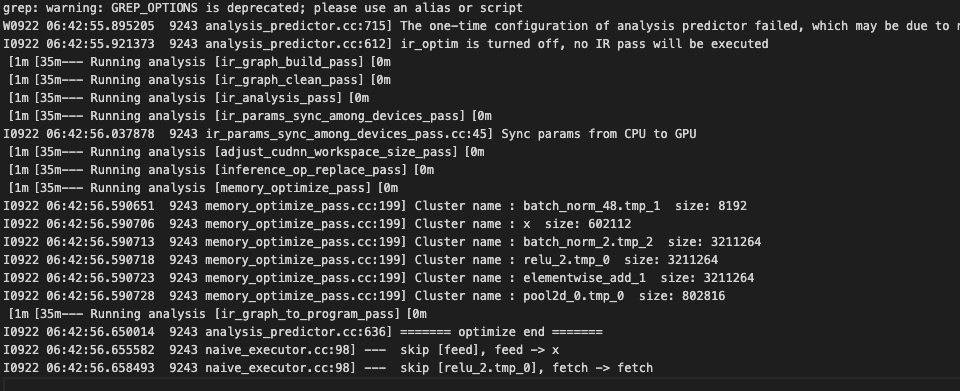
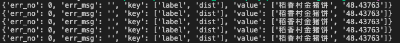

# 基于PaddleServing的商品识别服务部署

([English](./README.md)|简体中文)

本文以商品识别为例，介绍如何使用[PaddleServing](https://github.com/PaddlePaddle/Serving/blob/develop/README_CN.md)工具部署PaddleClas动态图模型的pipeline在线服务。

相比较于hubserving部署，PaddleServing具备以下优点：
- 支持客户端和服务端之间高并发和高效通信
- 支持 工业级的服务能力 例如模型管理，在线加载，在线A/B测试等
- 支持 多种编程语言 开发客户端，例如C++, Python和Java

更多有关PaddleServing服务化部署框架介绍和使用教程参考[文档](https://github.com/PaddlePaddle/Serving/blob/develop/README_CN.md)。

## 目录
- [环境准备](#环境准备)
- [模型转换](#模型转换)
- [Paddle Serving pipeline部署](#部署)
- [FAQ](#FAQ)

<a name="环境准备"></a>
## 环境准备

需要准备PaddleClas的运行环境和PaddleServing的运行环境。

- 准备PaddleClas的[运行环境](../../docs/zh_CN/tutorials/install.md), 根据环境下载对应的paddle whl包，推荐安装2.1.0版本

- 准备PaddleServing的运行环境，步骤如下

1. 安装serving，用于启动服务
    ```
    pip3 install paddle-serving-server==0.6.1 # for CPU
    pip3 install paddle-serving-server-gpu==0.6.1 # for GPU
    # 其他GPU环境需要确认环境再选择执行如下命令
    pip3 install paddle-serving-server-gpu==0.6.1.post101 # GPU with CUDA10.1 + TensorRT6
    pip3 install paddle-serving-server-gpu==0.6.1.post11 # GPU with CUDA11 + TensorRT7
    ```

2. 安装client，用于向服务发送请求
    在[下载链接](https://github.com/PaddlePaddle/Serving/blob/develop/doc/LATEST_PACKAGES.md)中找到对应python版本的client安装包，这里推荐python3.7版本：

    ```
    wget https://paddle-serving.bj.bcebos.com/test-dev/whl/paddle_serving_client-0.0.0-cp37-none-any.whl
    pip3 install paddle_serving_client-0.0.0-cp37-none-any.whl
    ```

3. 安装serving-app
    ```
    pip3 install paddle-serving-app==0.6.1
    ```
    **Note:** 如果要安装最新版本的PaddleServing参考[链接](https://github.com/PaddlePaddle/Serving/blob/develop/doc/LATEST_PACKAGES.md)。

<a name="模型转换"></a>
## 模型转换

使用PaddleServing做服务化部署时，需要将保存的inference模型转换为serving易于部署的模型。

以下内容假定当前工作目录为PaddleClas根目录。

首先，下载商品识别的inference模型
```
cd deploy

# 下载并解压商品识别模型
wget -P models/ https://paddle-imagenet-models-name.bj.bcebos.com/dygraph/rec/models/inference/product_ResNet50_vd_aliproduct_v1.0_infer.tar
cd models
tar -xf product_ResNet50_vd_aliproduct_v1.0_infer.tar
```

接下来，用安装的paddle_serving_client把下载的inference模型转换成易于server部署的模型格式。

```
# 转换商品识别模型
python3 -m paddle_serving_client.convert --dirname ./product_ResNet50_vd_aliproduct_v1.0_infer/ \
                                         --model_filename inference.pdmodel  \
                                         --params_filename inference.pdiparams \
                                         --serving_server ./product_ResNet50_vd_aliproduct_v1.0_serving/ \
                                         --serving_client ./product_ResNet50_vd_aliproduct_v1.0_client/
```
商品识别推理模型转换完成后，会在当前文件夹多出`product_ResNet50_vd_aliproduct_v1.0_serving` 和`product_ResNet50_vd_aliproduct_v1.0_client`的文件夹，具备如下格式：
```
|- product_ResNet50_vd_aliproduct_v1.0_serving/
  |- __model__  
  |- __params__
  |- serving_server_conf.prototxt  
  |- serving_server_conf.stream.prototxt

|- product_ResNet50_vd_aliproduct_v1.0_client
  |- serving_client_conf.prototxt  
  |- serving_client_conf.stream.prototxt

```
得到模型文件之后，需要修改serving_server_conf.prototxt中的alias名字： 将`fetch_var`中的`alias_name`改为`features`, 
修改后的serving_server_conf.prototxt内容如下：
```
feed_var {
  name: "x"
  alias_name: "x"
  is_lod_tensor: false
  feed_type: 1
  shape: 3
  shape: 224
  shape: 224
}
fetch_var {
  name: "save_infer_model/scale_0.tmp_1"
  alias_name: "features"
  is_lod_tensor: true
  fetch_type: 1
  shape: -1
}
```

接下来，下载并解压已经构建后的商品库index
```
cd ../
wget https://paddle-imagenet-models-name.bj.bcebos.com/dygraph/rec/data/recognition_demo_data_v1.1.tar
tar -xf recognition_demo_data_v1.1.tar
```


<a name="部署"></a>
## Paddle Serving pipeline部署

1. 下载PaddleClas代码，若已下载可跳过此步骤
    ```
    git clone https://github.com/PaddlePaddle/PaddleClas

    # 进入到工作目录
    cd PaddleClas/deploy/paddleserving/recognition
    ```
    paddleserving目录包含启动pipeline服务和发送预测请求的代码，包括：
    ```
    __init__.py
    config.yml                    # 启动服务的配置文件
    pipeline_http_client.py       # http方式发送pipeline预测请求的脚本
    pipeline_rpc_client.py        # rpc方式发送pipeline预测请求的脚本
    recognition_web_service.py    # 启动pipeline服务端的脚本
    ```

2. 启动服务可运行如下命令：
    ```
    # 启动服务，运行日志保存在log.txt
    python3 recognition_web_service.py &>log.txt &
    ```
    成功启动服务后，log.txt中会打印类似如下日志
    

3. 发送服务请求：
    ```
    python3 pipeline_http_client.py
    ```
    成功运行后，模型预测的结果会打印在cmd窗口中，结果示例为：
    

    调整 config.yml 中的并发个数可以获得最大的QPS
    ```
    op:
        #并发数，is_thread_op=True时，为线程并发；否则为进程并发
        concurrency: 8
        ...
    ```
    有需要的话可以同时发送多个服务请求

    预测性能数据会被自动写入 `PipelineServingLogs/pipeline.tracer` 文件中。

<a name="FAQ"></a>
## FAQ
**Q1**： 发送请求后没有结果返回或者提示输出解码报错

**A1**： 启动服务和发送请求时不要设置代理，可以在启动服务前和发送请求前关闭代理，关闭代理的命令是：
```
unset https_proxy
unset http_proxy
```
