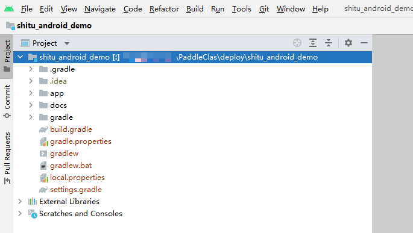
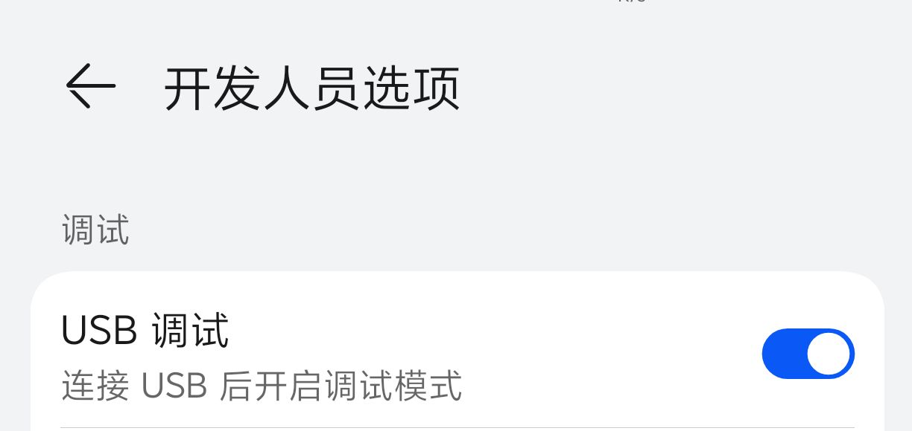
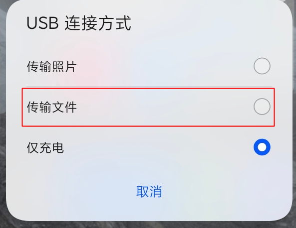
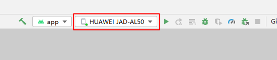

# PP-ShiTu android demo

本项目是一个基于 PaddleClas PP-ShiTu 和 [Paddle-Lite-Demo](https://github.com/PaddlePaddle/Paddle-Lite-Demo) 的安卓轻量级图像识别APP

本工程Android部分的代码基于 [Paddle-Lite-Demo](https://github.com/PaddlePaddle/Paddle-Lite-Demo) 开发，识别过程中使用的检测与识别模型基于 PaddleDetection 和 PaddleClas
详细信息可以查看对应模型文档 [主体检测模型](../../../docs/zh_CN/training/PP-ShiTu/mainbody_detection.md) 与 [特征提取模型](../../../docs/zh_CN/training/PP-ShiTu/feature_extraction.md) 以及 [faiss检索库](../../../docs/zh_CN/deployment/PP-ShiTu/vector_search.md)


## APP安装体验

- 点击链接下载：[下载链接](https://paddle-imagenet-models-name.bj.bcebos.com/demos/PP-ShiTu.apk)
- 扫描下方二维码下载：
  <div align="center">
    
  </div>

## Demo开发介绍
本Demo使用的集成开发环境是 [AndroidStudio](https://developer.android.google.cn/studio)

### 克隆本项目
首先使用git工具，将本项目克隆到本地

### 文件准备
下述步骤均以 **ppshituv2_lite_models_v1.0.tar** 模型压缩包为例，如需使用非量化的模型包 ppshituv2_lite_models_fp32_v1.0.tar ，则按照类似步骤进行操作，过程中使用非量化的识别模型生成检索库，同时按照 [FAQ-Q2](#faq) 将文件名替换成非量化的模型文件名即可。

1. 下载我们准备好的模型压缩包：

    | model      | download_link | size |
    | :--------- | :------------------------------------------------ | :-- |
    | 量化模型 | [ppshituv2_lite_models_v1.0.tar](https://paddle-imagenet-models-name.bj.bcebos.com/dygraph/lite/ppshituv2_lite_models_v1.0.tar) | 13.8MB |
    | fp32模型 | [ppshituv2_lite_models_fp32_v1.0.tar](https://paddle-imagenet-models-name.bj.bcebos.com/dygraph/lite/ppshituv2_lite_models_fp32_v1.0.tar) | 44.8MB |
    **注：** 量化模型虽然减少了体积但也略微降低了精度,用户可以根据实际需要下载量化或非量化版本的模型文件；上述表格中的“size”指主体检测+特征提取`*.nb`文件的大小总和，不包括压缩包内额外提供的方便用户导出检索库的普通推理模型大小；


    下载 [ppshituv2_lite_models_v1.0.tar](https://paddle-imagenet-models-name.bj.bcebos.com/dygraph/lite/ppshituv2_lite_models_v1.0.tar) 并解压出来，将其中2个 `*.nb` 格式的Lite模型文件放置到 [shitu_android_demo/app/src/main/assets/models](../app/src/main/assets/models) 目录下。以 PP-ShiTuV2 的主体检测和特征提取模型为例，模型最终的文件组织结构如下所示
    ```log
    models
    ├── general_PPLCNetV2_base_quant_v1.0_lite.nb
    └── mainbody_PPLCNet_x2_5_640_quant_v1.0_lite.nb
    ```

2. 下载 [faiss1.5.3.tar.gz](https://paddle-inference-dist.bj.bcebos.com/faiss1.5.3.tar.gz) 检索库文件并解压，里面包含了编译好的 `libfaiss.a` 文件和对应的头文件，将 `include` 文件夹放置在 `main/cpp` 目录下，将 `libs` 文件夹下的 `arm64-v8a` 和 `armeabi-v7a` 放置在 `main/jniLibs` 文件夹下。

3. 以 `drink_dataset_v2.0` 检索库为例，依次执行以下命令，生成检索库 `vector.index` 文件与pkl格式的标签库 `id_map.pkl` 文件

    ```shell
    # 进入工作目录
    cd PaddleClas/deploy

    # 下载数据集
    wget -nc https://paddle-imagenet-models-name.bj.bcebos.com/dygraph/rec/data/drink_dataset_v2.0.tar
    tar -xf drink_dataset_v2.0.tar

    # 下载lite模型
    cd models
    wget -nc https://paddle-imagenet-models-name.bj.bcebos.com/dygraph/lite/ppshituv2_lite_models_v1.0.tar
    tar -xf ppshituv2_lite_models_v1.0.tar
    cd ../

    # 构建检索库与标签库(如使用非量化模型，则需将Global.rec_inference_model_dir后的路径改为非量化推理模型)
    python3.7 python/build_gallery.py -c configs/inference_drink.yaml -o Global.rec_inference_model_dir=./models/ppshituv2_lite_models_v1.0/general_PPLCNetV2_base_quant_v1.0_lite_inference_model -o IndexProcess.index_method=Flat -o Global.android_demo=True
    ```
4. 然后将 `configs/inference_drink.yaml` 文件中的 `IndexProcess.index_dir` 字段后的路径改为 `"../drink_dataset_v2.0/index"`，再执行以下命令，得到转换成txt格式的标签库

    ```shell
    cd ./lite_shitu
    python3.7 transform_id_map.py -c ../configs/inference_drink.yaml
    ```

5. 最后，将上述步骤生成的 `vector.index` 与 `id_map.txt` 重命名为 `original.index` 与 `original.txt` ，放置到 [shitu_android_demo/app/src/main/assets/index](../app/src/main/assets/index) 文件夹下。

### 打开Demo
1. 首先下载并安装AndroidStudio集成开发环境(IDE)
2. 打开安装好的AndroidStudio，依次点击标题栏左侧的"File"→"Open"→找到并选择 `shitu_android_demo` 文件夹，点击"ok"，等待IDE加载处理完毕，如下图所示
    <div align="center">
        
    </div>

4. 然后将手机通过USB数据线连接到调试用的电脑上，并且在手机上**选择允许USB调试模式**。以华为手机为例，连接电脑后选择"传输文件"，并且在"开发人员选项"中开启"USB调试"选项，如下图所示
    <div align="center">
      
      
    </div>

    **注： 这一步非常重要，否则可能Android Studio无法检测并安装APP到手机上**
5. 连接完毕后应该能在Android Studio界面右上角显示出手机型号，如下图所示
    

6. 然后点击手机型号右侧第一个绿色箭头，会自动进行交叉编译并安装APP到手机上，在手机上确认安装即可开始使用、调试APP。开发过程中想即时使用当前代码生成的APP，则仍旧点击手机型号右侧的第一个按钮（开发过程中绿色箭头的按钮图标可能会变成其它形状，但仍然可以点击它），在手机上确认安装最新APK文件，重复这一过程直至开发完成即可。开发完毕后，如需导出APK文件并分享给他人安装，请自行上网查找对应教程。
    **注： 过程中AndroidStudio可能会提示需要安装一系列的环境包，包括JRE、Android NDK等，请按照提示安装，否则可能无法编译安装APP到手机上。**

### 二次开发
本项目的功能实现主要由一些的代码文件完成，如下所示
```log
main
├── assets/ # 资源文件夹，用于放置界面图标、模型文件以及检索库
├── cpp/ # CPP代码文件夹，其下的include文件夹配合libfaiss.a用来调用faiss检索API，其余代码文件负责控制C++层的代码逻辑
    └── include/
        └── faiss/ # faiss 检索库头文件，无需改动
├── java/ # JAVA代码文件夹，内部的代码文件负责控制JAVA层的代码逻辑
├── jniLibs/
    ├── arm64-v8a/  # 用于存放第三方SDK文件所需的库，如存放libfaiss.a文件
    └── armeabi-v7a/  # 用于存放第三方SDK文件所需的库，如存放libfaiss.a文件
├── docs/ # 本项目文档与文档图片存放目录
├── ...
└── ...
```
开发者可以针对以上涉及的具体代码文件进行修改与二次开发


### FAQ
Q1: 点击绿色箭头后，交叉编译过程中报“source-7不支持lambda匿名表达式“的错误
A1: 将光标移动到报错的代码上，按 `Alt+Enter` 键，选择替换语言支持到source-8，等待IDE同步更新完毕，再重新点击绿色箭头即可。

Q2: 想更换其他检测或识别模型
A2: 首先将自己准备的模型放置到 [shitu_android_demo/app/src/main/assets/models](../app/src/main/assets/models) 目录下，然后对用替换 [Pipeline.cc](../app/src/main/cpp/Pipeline.cc#L64-L65) 文件中检测和识别模型的路径，重新点击绿色三角箭头交叉编译安装即可。

Q3: 开发过程中APP进行某些操作会闪退
A3: 一般闪退是由于APP代码存在一些BUG导致程序运行出现错误，可以重点关注Android Studio下方的"Run"窗口，闪退时报错信息会显示在里面，方便快速定位问题代码行。
