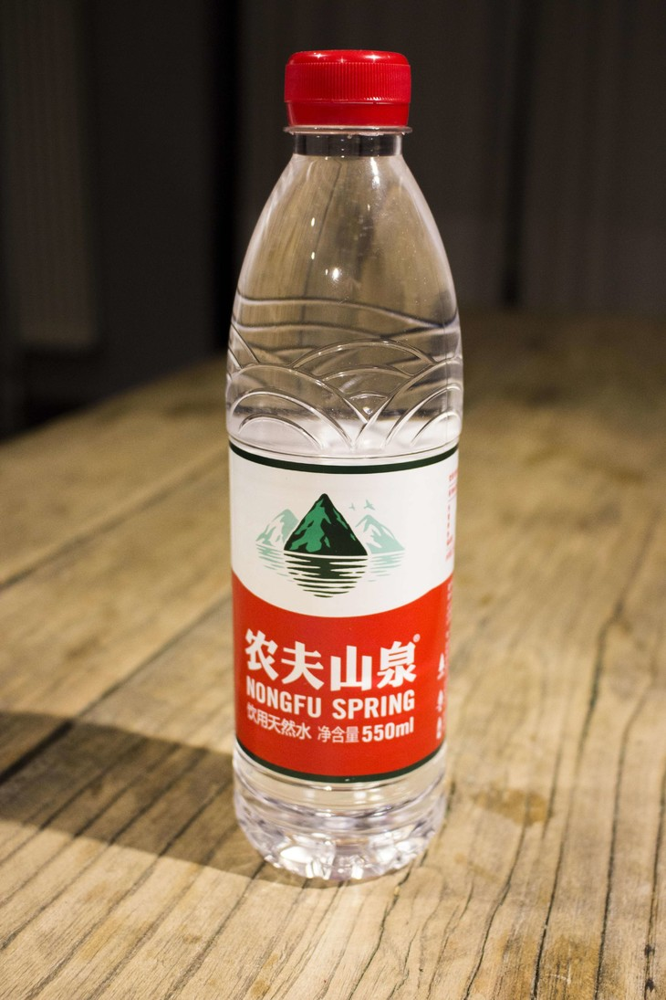
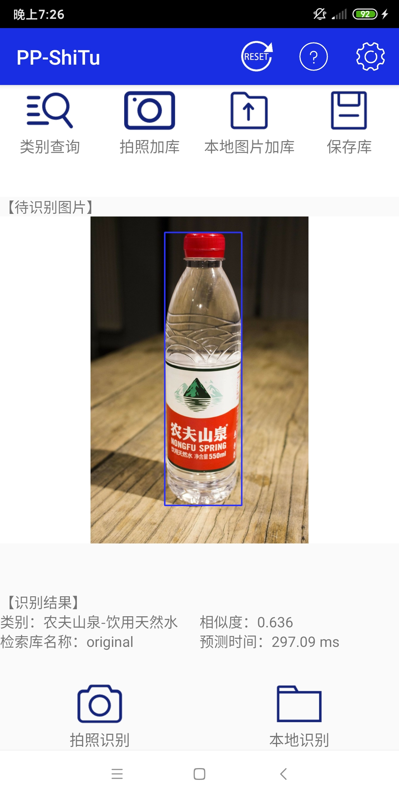

## PP-ShiTuV2 Image Recognition System

## Table of contents

- [1. Introduction of PP-ShiTuV2 model and application scenarios](#1-introduction-of-pp-shituv2-model-and-application-scenarios)
- [2. Quick experience](#2-quick-experience)
  - [2.1 Quick experience of PP-ShiTu android demo](#21-quick-experience-of-pp-shitu-android-demo)
  - [2.2 Quick experience of command line code](#22-quick-experience-of-command-line-code)
- [3 Module introduction and training](#3-module-introduction-and-training)
  - [3.1 Mainbody detection](#31-mainbody-detection)
  - [3.2 Feature Extraction](#32-feature-extraction)
  - [3.3 Vector Search](#33-vector-search)
- [4. Inference Deployment](#4-inference-deployment)
  - [4.1 Inference model preparation](#41-inference-model-preparation)
    - [4.1.1 Export the inference model from pretrained model](#411-export-the-inference-model-from-pretrained-model)
    - [4.1.2 Download the inference model directly](#412-download-the-inference-model-directly)
  - [4.2 Test data preparation](#42-test-data-preparation)
  - [4.3 Inference based on Python inference engine](#43-inference-based-on-python-inference-engine)
    - [4.3.1 single image prediction](#431-single-image-prediction)
    - [4.3.2 multi images prediction](#432-multi-images-prediction)
  - [4.3 Inference based on C++ inference engine](#43-inference-based-on-c-inference-engine)
  - [4.4 Serving deployment](#44-serving-deployment)
  - [4.5 Lite deployment](#45-lite-deployment)
  - [4.6 Paddle2ONNX](#46-paddle2onnx)
- [references](#references)

## 1. Introduction of PP-ShiTuV2 model and application scenarios

PP-shituv2 is a practical lightweight general image recognition system improved on PP-ShitUV1. It is composed of three modules: mainbody detection, feature extraction and vector search. Compared with PP-ShiTuV1, PP-ShiTuV2 has higher recognition accuracy, stronger generalization and similar inference speed <sup>*</sup>. This paper mainly optimize in training dataset, feature extraction with better backbone network, loss function and training strategy, which significantly improved the retrieval performance of PP-ShiTuV2 in multiple practical application scenarios.

<div align="center">

</div>

The following table lists the relevant metric obtained by PP-ShiTuV2 with comparison to PP-ShiTuV1.

| model      | storage (mainbody detection + feature extraction) | product  |
| :--------- | :------------------------------------------------ | :------- |
|            |                                                   | recall@1 |
| PP-ShiTuV1 | 64(30+34)MB                                       | 66.8%    |
| PP-ShiTuV2 | 49(30+19)                                         | 73.8%    |

**Note:**
- For the introduction of recall and mAP metric, please refer to [Retrieval Metric](../algorithm_introduction/reid.md).
- Latency is based on Intel(R) Xeon(R) Gold 6148 CPU @ 2.40GHz test, MKLDNN acceleration strategy is enabled, and the number of threads is 10.

## 2. Quick experience

### 2.1 Quick experience of PP-ShiTu android demo

You can download and install the APP by scanning the QR code or [click the link](https://paddle-imagenet-models-name.bj.bcebos.com/demos/PP-ShiTu.apk)

<div align=center></div>

Then save the following demo pictures to your phone:

<div align=center></div>

Open the installed APP, click the "**file recognition**" button below, select the above saved image, and you can get the following recognition results:

<div align=center></div>

### 2.2 Quick experience of command line code

- First follow the commands below to install paddlepaddle and faiss
  ```shell
  # If your machine is installed with CUDA9 or CUDA10, please run the following command to install
  python3.7 -m pip install paddlepaddle-gpu -i https://mirror.baidu.com/pypi/simple

  # If your machine is CPU, please run the following command to install
  python3.7 -m pip install paddlepaddle -i https://mirror.baidu.com/pypi/simple

  # install faiss database
  python3.7 -m pip install faiss-cpu==1.7.1post2
  ```

- Then follow the command below to install the paddleclas whl package
  ```shell
  # Go to the root directory of PaddleClas
  cd PaddleClas

  # install paddleclas
  python3.7 setup.py install
  ```

- Then execute the following command to download and decompress the demo data, and finally execute command to quick start image recognition

  ```shell
  # Download and unzip the demo data
  wget -nc https://paddle-imagenet-models-name.bj.bcebos.com/dygraph/rec/data/drink_dataset_v2.0.tar && tar -xf drink_dataset_v2.0.tar

  # Execute the identification command
  paddleclas \
  --model_name=PP-ShiTuV2 \
  --infer_imgs=./drink_dataset_v2.0/test_images/100.jpeg \
  --index_dir=./drink_dataset_v2.0/index/ \
  --data_file=./drink_dataset_v2.0/gallery/drink_label.txt
  ```

## 3 Module introduction and training

### 3.1 Mainbody detection

Mainbody detection is a widely used detection technology. It refers to detecting the coordinate position of one or more objects in the image, and then cropping the corresponding area in the image for identification. Mainbody detection is the pre-procedure of the recognition task. The input image is recognized after mainbody detection, which can remove complex backgrounds and effectively improve the recognition accuracy.

Taking into account the detection speed, model size, detection accuracy and other factors, the lightweight model `PicoDet-LCNet_x2_5` developed by PaddleDetection was finally selected as the mainbody detection model of PP-ShiTuV2

For details on the dataset, training, evaluation, inference, etc. of the mainbody detection model, please refer to the document: [picodet_lcnet_x2_5_640_mainbody](../../en/image_recognition_pipeline/mainbody_detection_en.md).

### 3.2 Feature Extraction

Feature extraction is a key part of image recognition. It is designed to convert the input image into a fixed-dimensional feature vector for subsequent [vector search](../../en/image_recognition_pipeline/vector_search_en.md) . Taking into account the speed of the feature extraction model, model size, feature extraction performance and other factors, the [`PPLCNetV2_base`](../../en/models/PP-LCNet_en.md) developed by PaddleClas was finally selected as the feature extraction network. Compared with `PPLCNet_x2_5` used by PP-ShiTuV1, `PPLCNetV2_base` basically maintains high classification accuracy and reduces inference time by 40%<sup>*</sup>.

**Note:** <sup>*</sup>The inference environment is based on Intel(R) Xeon(R) Gold 6271C CPU @ 2.60GHz hardware platform, OpenVINO inference platform.

During the experiment, we found that we can make appropriate improvements to `PPLCNetV2_base` to achieve higher performance in recognition tasks while keeping the speed basically unchanged, including: removing `ReLU` and `FC` at the end of `PPLCNetV2_base`, change the stride of the last stage (RepDepthwiseSeparable) to 1.

For details about the dataset, training, evaluation, inference, etc. of the feature extraction model, please refer to the document: [PPLCNetV2_base_ShiTu](../../en/image_recognition_pipeline/feature_extraction_en.md).

### 3.3 Vector Search

Vector Search technology is widely used in image recognition. Its' main goal is to calculate the similarity or distance of the feature vector in the established vector database for a given query vector, and return the similarity ranking result of the candidate vector.

In the PP-ShiTuV2 recognition system, we use the [Faiss](https://github.com/facebookresearch/faiss) vector research open source library, which has good adaptability, easy installation, rich algorithms, It supports the advantages of both CPU and GPU.

For the installation and use of the Faiss vector research tool in the PP-ShiTuV2 system, please refer to the document: [vector search](../../en/image_recognition_pipeline/vector_search_en.md).

## 4. Inference Deployment

### 4.1 Inference model preparation
Paddle Inference is the native inference database of Paddle, which enabled on the server and the cloud to provide high-performance inference capabilities. Compared to making predictions based on pre-trained models directly, Paddle Inference can use MKLDNN, CUDNN, and TensorRT for prediction acceleration to achieve better inference performance. For more introduction to Paddle Inference inference engine, please refer to [Paddle Inference official website tutorial](https://www.paddlepaddle.org.cn/documentation/docs/zh/guides/infer/inference/inference_cn.html).

When using Paddle Inference for model inference, the loaded model type is the inference model. This case provides two methods to obtain the inference model. If you want to get the same result as the document, please click [Download the inference model directly](#412-download-the-inference-model-directly).

#### 4.1.1 Export the inference model from pretrained model
- Please refer to the document [Mainbody Detection Inference Model Preparation](../../en/image_recognition_pipeline/mainbody_detection_en.md), or refer to [4.1.2](#412-direct download-inference-model)

- To export the weights of the feature extraction model, you can refer to the following commands:
  ```shell
  python3.7 tools/export_model.py \
  -c ./ppcls/configs/GeneralRecognitionV2/GeneralRecognitionV2_PPLCNetV2_base.yaml \
  -o Global.pretrained_model="https://paddle-imagenet-models-name.bj.bcebos.com/dygraph/rec/models/pretrain/PPShiTuV2/general_PPLCNetV2_base_pretrained_v1.0.pdparams" \
  -o Global.save_inference_dir=deploy/models/GeneralRecognitionV2_PPLCNetV2_base`
  ```
  After executing the script, the `GeneralRecognitionV2_PPLCNetV2_base` folder will be generated under `deploy/models/` with the following file structure:

  ```log
  deploy/models/
  ├── GeneralRecognitionV2_PPLCNetV2_base
  │   ├── inference.pdiparams
  │   ├── inference.pdiparams.info
  │   └── inference.pdmodel
  ```

#### 4.1.2 Download the inference model directly

[Section 4.1.1](#411-export-the-inference-model-from-pretrained-model) provides a method to export the inference model, here we provide the exported inference model, you can download the model to the specified location and decompress it by the following command experience.

```shell
cd deploy/models

# Download the mainbody detection inference model and unzip it
wget -nc https://paddle-imagenet-models-name.bj.bcebos.com/dygraph/rec/models/inference/picodet_PPLCNet_x2_5_mainbody_lite_v1.0_infer.tar && tar -xf picodet_PPLCNet_x2_5_mainbody_lite_v1.0_infer.tar

# Download the feature extraction inference model and unzip it
wget -nc https://paddle-imagenet-models-name.bj.bcebos.com/dygraph/rec/models/inference/PP-ShiTuV2/general_PPLCNetV2_base_pretrained_v1.0_infer.tar && tar -xf general_PPLCNetV2_base_pretrained_v1.
```

### 4.2 Test data preparation

After preparing the mainbody detection and feature extraction models, you also need to prepare the test data as input. You can run the following commands to download and decompress the test data.

```shell
# return to ./deploy
cd ../

# Download the test data drink_dataset_v2.0 and unzip it
wget -nc https://paddle-imagenet-models-name.bj.bcebos.com/dygraph/rec/data/drink_dataset_v2.0.tar && tar -xf drink_dataset_v2.0.tar
```

### 4.3 Inference based on Python inference engine

#### 4.3.1 single image prediction

Then execute the following command to identify the single image `./drink_dataset_v2.0/test_images/100.jpeg`.

```shell
# Execute the following command to predict with GPU
python3.7 python/predict_system.py -c configs/inference_general.yaml -o Global.infer_imgs="./drink_dataset_v2.0/test_images/100.jpeg"

# Execute the following command to predict with CPU
python3.7 python/predict_system.py -c configs/inference_general.yaml -o Global.infer_imgs="./drink_dataset_v2.0/test_images/100.jpeg" -o Global.use_gpu=False
```

The final output is as follows.

```log
[{'bbox': [437, 71, 660, 728], 'rec_docs': '元气森林', 'rec_scores': 0.7740249}, {'bbox': [221, 72, 449, 701], 'rec_docs': '元气森林', 'rec_scores': 0.6950992}, {'bbox': [794, 104, 979, 652], 'rec_docs': '元气森林', 'rec_scores': 0.6305153}]
```

#### 4.3.2 multi images prediction

If you want to predict the images in the folder, you can directly modify the `Global.infer_imgs` field in the configuration file, or you can modify the corresponding configuration through the following -o parameter.

```shell
# Use the command below to predict with GPU
python3.7 python/predict_system.py -c configs/inference_general.yaml -o Global.infer_imgs="./drink_dataset_v2.0/test_images"
# Use the following command to predict with CPU
python3.7 python/predict_system.py -c configs/inference_general.yaml -o Global.infer_imgs="./drink_dataset_v2.0/test_images" -o Global.use_gpu=False
```

The terminal will output the recognition results of all images in the folder, as shown below.

```log
...
[{'bbox': [0, 0, 600, 600], 'rec_docs': '红牛-强化型', 'rec_scores': 0.74081033}]
Inference: 120.39852142333984 ms per batch image
[{'bbox': [0, 0, 514, 436], 'rec_docs': '康师傅矿物质水', 'rec_scores': 0.6918598}]
Inference: 32.045602798461914 ms per batch image
[{'bbox': [138, 40, 573, 1198], 'rec_docs': '乐虎功能饮料', 'rec_scores': 0.68214047}]
Inference: 113.41428756713867 ms per batch image
[{'bbox': [328, 7, 467, 272], 'rec_docs': '脉动', 'rec_scores': 0.60406065}]
Inference: 122.04337120056152 ms per batch image
[{'bbox': [242, 82, 498, 726], 'rec_docs': '味全_每日C', 'rec_scores': 0.5428652}]
Inference: 37.95266151428223 ms per batch image
[{'bbox': [437, 71, 660, 728], 'rec_docs': '元气森林', 'rec_scores': 0.7740249}, {'bbox': [221, 72, 449, 701], 'rec_docs': '元气森林', 'rec_scores': 0.6950992}, {'bbox': [794, 104, 979, 652], 'rec_docs': '元气森林', 'rec_scores': 0.6305153}]
...
```

Where `bbox` represents the bounding box of the detected mainbody, `rec_docs` represents the most similar category to the detection object in the index database, and `rec_scores` represents the corresponding similarity.

### 4.3 Inference based on C++ inference engine
PaddleClas provides an example of inference based on C++ prediction engine, you can refer to [Server-side C++ prediction](../../../deploy/cpp_shitu/readme_en.md) to complete the corresponding inference deployment. If you are using the Windows platform, you can refer to [Visual Studio 2019 Community CMake Compilation Guide](../inference_deployment/python_deploy_en.md) to complete the corresponding prediction database compilation and model prediction work.

### 4.4 Serving deployment
Paddle Serving provides high-performance, flexible and easy-to-use industrial-grade online inference services. Paddle Serving supports RESTful, gRPC, bRPC and other protocols, and provides inference solutions in a variety of heterogeneous hardware and operating system environments. For more introduction to Paddle Serving, please refer to [Paddle Serving Code Repository](https://github.com/PaddlePaddle/Serving).

PaddleClas provides an example of model serving deployment based on Paddle Serving. You can refer to [Model serving deployment](../inference_deployment/recognition_serving_deploy_en.md) to complete the corresponding deployment.

### 4.5 Lite deployment
Paddle Lite is a high-performance, lightweight, flexible and easily extensible deep learning inference framework, positioned to support multiple hardware platforms including mobile, embedded and server. For more introduction to Paddle Lite, please refer to [Paddle Lite Code Repository](https://github.com/PaddlePaddle/Paddle-Lite).

### 4.6 Paddle2ONNX
Paddle2ONNX supports converting PaddlePaddle model format to ONNX model format. The deployment of Paddle models to various inference engines can be completed through ONNX, including TensorRT/OpenVINO/MNN/TNN/NCNN, and other inference engines or hardware that support the ONNX open source format. For more introduction to Paddle2ONNX, please refer to [Paddle2ONNX Code Repository](https://github.com/PaddlePaddle/Paddle2ONNX).

PaddleClas provides an example of converting an inference model to an ONNX model and making inference prediction based on Paddle2ONNX. You can refer to [Paddle2ONNX Model Conversion and Prediction](../../../deploy/paddle2onnx/readme_en.md) to complete the corresponding deployment work.

## references
1. Schall, Konstantin, et al. "GPR1200: A Benchmark for General-Purpose Content-Based Image Retrieval." International Conference on Multimedia Modeling. Springer, Cham, 2022.
2. Luo, Hao, et al. "A strong baseline and batch normalization neck for deep person re-identification." IEEE Transactions on Multimedia 22.10 (2019): 2597-2609.
