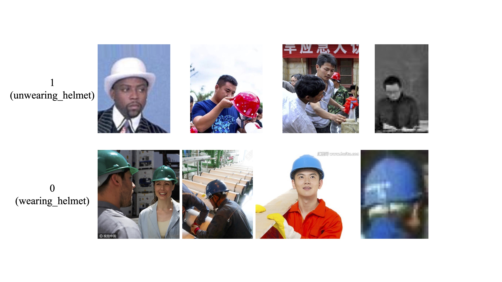

# PULC Classification Model of Wheather Wearing Safety Helmet or Not

-----

## Catalogue

- [1. Introduction](#1)
- [2. Quick Start](#2)
    - [2.1 PaddlePaddle Installation](#2.1)
    - [2.2 PaddleClas Installation](#2.2)
    - [2.3 Prediction](#2.3)
- [3. Training, Evaluation and Inference](#3)
    - [3.1 Installation](#3.1)
    - [3.2 Dataset](#3.2)
      - [3.2.1 Dataset Introduction](#3.2.1)
      - [3.2.2 Getting Dataset](#3.2.2)
    - [3.3 Training](#3.3)
    - [3.4 Evaluation](#3.4)
    - [3.5 Inference](#3.5)
- [4. Model Compression](#4)
  - [4.1 SKL-UGI Knowledge Distillation](#4.1)
    - [4.1.1 Teacher Model Training](#4.1.1)
    - [4.1.2 Knowledge Distillation Training](#4.1.2)
- [5. SHAS](#5)
- [6. Inference Deployment](#6)
  - [6.1 Getting Paddle Inference Model](#6.1)
    - [6.1.1 Exporting Paddle Inference Model](#6.1.1)
    - [6.1.2 Downloading Inference Model](#6.1.2)
  - [6.2 Prediction with Python](#6.2)
    - [6.2.1 Image Prediction](#6.2.1)
    - [6.2.2 Images Prediction](#6.2.2)
  - [6.3 Deployment with C++](#6.3)
  - [6.4 Deployment as Service](#6.4)
  - [6.5 Deployment on Mobile](#6.5)
  - [6.6 Converting To ONNX and Deployment](#6.6)

<a name="1"></a>

## 1. Introduction

This case provides a way for users to quickly build a lightweight, high-precision and practical classification model of wheather wearing safety helmet using PaddleClas PULC (Practical Ultra Lightweight image Classification). The model can be widely used in construction scenes, factory workshop scenes, traffic scenes and so on.

The following table lists the relevant indicators of the model. The first three lines means that using SwinTransformer_tiny, Res2Net200_vd_26w_4s and MobileNetV3_small_x0_35 as the backbone to training. The fourth to seventh lines means that the backbone is replaced by PPLCNet, additional use of EDA strategy and additional use of EDA strategy and SKL-UGI knowledge distillation strategy.

| Backbone | Tpr(%) | Latency(ms) | Size(M)| Training Strategy |
|-------|-----------|----------|---------------|---------------|
| SwinTranformer_tiny  | 93.57 | 91.32  | 111 | using ImageNet pretrained model |
| Res2Net200_vd_26w_4s  | 98.92 | 80.99 | 284 | using ImageNet pretrained model |
| MobileNetV3_small_x0_35  | 84.83 | 2.85 | 2.6 | using ImageNet pretrained model |
| PPLCNet_x1_0  | 93.27 | 2.03  | 7.1 | using ImageNet pretrained model |
| PPLCNet_x1_0  | 98.16 | 2.03  | 7.1 | using SSLD pretrained model |
| PPLCNet_x1_0  | 99.30 | 2.03  | 7.1 | using SSLD pretrained model + EDA strategy  |
| <b>PPLCNet_x1_0<b>  | <b>99.38<b> | <b>2.03<b>  | <b>7.1<b> | using SSLD pretrained model + EDA strategy + SKL-UGI knowledge distillation strategy|

It can be seen that high Tpr can be getted when backbone is Res2Net200_vd_26w_4s, but the speed is slow. Replacing backbone with the lightweight model MobileNetV3_small_x0_35, the speed can be greatly improved, but the Tpr will be greatly reduced. Replacing backbone with faster backbone PPLCNet_x1_0, the Tpr is higher more 8.5 percentage points than MobileNetv3_small_x0_35. At the same time, the speed can be more than 20% faster. After additional using the SSLD pretrained model, the Tpr can be improved by about 4.9 percentage points without affecting the inference speed. Further, additional using the EDA strategy, the Tpr can be increased by 1.1 percentage points. Finally, after additional using the UDML knowledge distillation, the Tpr can be further improved by 2.2 percentage points. At this point, the Tpr is higher than that of Res2Net200_vd_26w_4s, but the speed is more than 70 times faster. The training method and deployment instructions of PULC will be introduced in detail below.

**Note**:

* About `Tpr` metric, please refer to [3.2 section](#3.2) for more information .
* The Latency is tested on Intel(R) Xeon(R) Gold 6148 CPU @ 2.40GHz. The MKLDNN is enabled and the number of threads is 10.
* About PP-LCNet, please refer to [PP-LCNet Introduction](../models/PP-LCNet_en.md) and [PP-LCNet Paper](https://arxiv.org/abs/2109.15099).

<a name="2"></a>

## 2. Quick Start

<a name="2.1"></a>  

### 2.1 PaddlePaddle Installation

- Run the following command to install if CUDA9 or CUDA10 is available.

```bash
python3 -m pip install paddlepaddle-gpu -i https://mirror.baidu.com/pypi/simple
```

- Run the following command to install if GPU device is unavailable.

```bash
python3 -m pip install paddlepaddle -i https://mirror.baidu.com/pypi/simple
```

Please refer to [PaddlePaddle Installation](https://www.paddlepaddle.org.cn/install/quick?docurl=/documentation/docs/en/install/pip/linux-pip_en.html) for more information about installation, for examples other versions.

<a name="2.2"></a>  

### 2.2 PaddleClas wheel Installation

The command of PaddleClas installation as bellow:

```bash
pip3 install paddleclas
```

<a name="2.3"></a>

### 2.3 Prediction

First, please click [here](https://paddleclas.bj.bcebos.com/data/PULC/pulc_demo_imgs.zip) to download and unzip to get the test demo images.

* Prediction with CLI

```bash
paddleclas --model_name=safety_helmet --infer_imgs=pulc_demo_imgs/safety_helmet/safety_helmet_test_1.png
```

Results:

```
>>> result
class_ids: [1], scores: [0.9986255], label_names: ['unwearing_helmet'], filename: pulc_demo_imgs/safety_helmet/safety_helmet_test_1.png
Predict complete!
```
**Note**: If you want to test other images, only need to specify the `--infer_imgs` argument, and the directory containing images is also supported.

* Prediction in Python

```python
import paddleclas
model = paddleclas.PaddleClas(model_name="safety_helmet")
result = model.predict(input_data="pulc_demo_imgs/safety_helmet/safety_helmet_test_1.png")
print(next(result))
```

**Note**: The `result` returned by `model.predict()` is a generator, so you need to use the `next()` function to call it or `for` loop to loop it. And it will predict with `batch_size` size batch and return the prediction results when called. The default `batch_size` is 1, and you also specify the `batch_size` when instantiating, such as `model = paddleclas.PaddleClas(model_name="safety_helmet",  batch_size=2)`. The result of demo above:

```
>>> result
[{'class_ids': [1], 'scores': [0.9986255], 'label_names': ['unwearing_helmet'], 'filename': 'pulc_demo_imgs/safety_helmet/safety_helmet_test_1.png'}]
```

<a name="3"></a>

## 3. Training, Evaluation and Inference

<a name="3.1"></a>  

### 3.1 Installation

Please refer to [Installation](../installation/install_paddleclas_en.md) to get the description about installation.

<a name="3.2"></a>

### 3.2 Dataset

<a name="3.2.1"></a>

#### 3.2.1 Dataset Introduction

All datasets used in this case are open source data. Train data is the subset of [Safety-Helmet-Wearing-Dataset](https://github.com/njvisionpower/Safety-Helmet-Wearing-Dataset), [hard-hat-detection](https://www.kaggle.com/datasets/andrewmvd/hard-hat-detection) and [Large-scale CelebFaces Attributes (CelebA) Dataset](https://mmlab.ie.cuhk.edu.hk/projects/CelebA.html).

<a name="3.2.2"></a>  

#### 3.2.2 Getting Dataset

The data used in this case can be getted by processing the open source data. The detailed processes are as follows:

* `Safety-Helmet-Wearing-Dataset`: according to the bbox label data, the image is cropped by enlarging width and height of bbox by 3 times. The label is 0 if wearing safety helmet in the image, and the label is 1 if not;
* `hard-hat-detection`: Only use the image that labeled "hat" and crop it with bbox. The label is 0;
* `CelebA`: Only use the image labeled "wearing_hat" and crop it with bbox. The label is 0;

After processing, the dataset totals about 150000 images, of which the number of images with and without wearing safety helmet is about 28000 and 121000 respectively. Then 5600 images are randomly selected in the two labels as the valuation data, a total of about 11200 images, and about 138000 other images as the training data.

Some image of the processed dataset is as follows:



And you can also download the data processed directly.

```
cd path_to_PaddleClas
```

Enter the `dataset/` directory, download and unzip the dataset.

```shell
cd dataset
wget https://paddleclas.bj.bcebos.com/data/PULC/safety_helmet.tar
tar -xf safety_helmet.tar
cd ../
```

The datas under `safety_helmet` directory:

```
├── images
│   ├── VOC2028_part2_001209_1.jpg
│   ├── HHD_hard_hat_workers23_1.jpg
│   ├── CelebA_077809.jpg
│   ├── ...
│   └── ...
├── train_list.txt
└── val_list.txt
```

The `train_list.txt` and `val_list.txt` are label files of training data and validation data respectively. All images in `images/` directory.

**Note**:

* About the contents format of `train_list.txt` and `val_list.txt`, please refer to [Description about Classification Dataset in PaddleClas](../data_preparation/classification_dataset_en.md).

<a name="3.3"></a>

### 3.3 Training

The details of training config in `ppcls/configs/PULC/person_exists/PPLCNet_x1_0.yaml`. The command about training as follows:

```shell
export CUDA_VISIBLE_DEVICES=0,1,2,3
python3 -m paddle.distributed.launch \
    --gpus="0,1,2,3" \
    tools/train.py \
    -c ./ppcls/configs/PULC/safety_helmet/PPLCNet_x1_0.yaml
```

The best metric of validation data is between `0.985` and `0.993`. There would be fluctuations because the data size is small.

**Note**:

* The metric Tpr, that describe the True Positive Rate when False Positive Rate is less than a certain threshold(1/10000 used in this case), is one of the commonly used metric for binary classification. About the details of Fpr and Tpr, please refer [here](https://en.wikipedia.org/wiki/Receiver_operating_characteristic).
* When evaluation, the best metric TprAtFpr will be printed that include `Fpr`, `Tpr` and the current `threshold`. The `Tpr` means the Recall rate under the current `Fpr`. The `Tpr` higher, the model better. The `threshold` would be used in deployment, which means the classification threshold under best `Fpr` metric.

<a name="3.4"></a>

### 3.4 Evaluation

After training, you can use the following commands to evaluate the model.


```bash
python3 tools/eval.py \
    -c ./ppcls/configs/PULC/safety_helmet/PPLCNet_x1_0.yaml \
    -o Global.pretrained_model=output/PPLCNet_x1_0/best_model
```

Among the above command, the argument `-o Global.pretrained_model="output/PPLCNet_x1_0/best_model"` specify the path of the best model weight file. You can specify other path if needed.

<a name="3.5"></a>

### 3.5 Inference

After training, you can use the model that trained to infer. Command is as follow:

```python
python3 tools/infer.py \
    -c ./ppcls/configs/PULC/safety_helmet/PPLCNet_x1_0.yaml \
    -o Global.pretrained_model=output/PPLCNet_x1_0/best_model
```

The results:

```
[{'class_ids': [1], 'scores': [0.9524797], 'label_names': ['unwearing_helmet'], 'file_name': 'deploy/images/PULC/safety_helmet/safety_helmet_test_1.png'}]
```

**备注：**

* Among the above command, argument `-o Global.pretrained_model="output/PPLCNet_x1_0/best_model"` specify the path of the best model weight file. You can specify other path if needed.
* The default test image is `deploy/images/PULC/safety_helmet/safety_helmet_test_1.png`. And you can test other image, only need to specify the argument `-o Infer.infer_imgs=path_to_test_image`.
* The default threshold is `0.5`. If needed, you can specify the argument `Infer.PostProcess.threshold`, such as: `-o Infer.PostProcess.threshold=0.9167`. And the argument `threshold` is needed to be specified according by specific case. The `0.9167` is the best threshold when `Fpr` is less than `1/10000` in this valuation dataset.

<a name="4"></a>

## 4. Model Compression

<a name="4.1"></a>

### 4.1 UDML  Knowledge Distillation

UDML is a simple but effective knowledge distillation algrithem proposed by PaddleClas. Please refer to [UDML 知识蒸馏](../advanced_tutorials/knowledge_distillation_en.md#1.2.3) for more details.

<a name="4.1.1"></a>

#### 4.1.1  Knowledge Distillation Training

Training with hyperparameters specified in `ppcls/configs/PULC/safety_helmet/PPLCNet_x1_0_distillation.yaml`. The command is as follow:

```shell
export CUDA_VISIBLE_DEVICES=0,1,2,3
python3 -m paddle.distributed.launch \
    --gpus="0,1,2,3" \
    tools/train.py \
    -c ./ppcls/configs/PULC/safety_helmet/PPLCNet_x1_0_distillation.yaml
```

The best metric is between `0.990` and `0.993`. The best student model weight would be saved in file `output/DistillationModel/best_model_student.pdparams`.

<a name="5"></a>

## 5. Hyperparameters Searching

The hyperparameters used by [3.2 section](#3.2) and [4.1 section](#4.1) are according by `Hyperparameters Searching` in PaddleClas. If you want to get better results on your own dataset, you can refer to [Hyperparameters Searching](PULC_train_en.md#4) to get better hyperparameters.

**Note**: This section is optional. Because the search process will take a long time, you can selectively run according to your specific. If not replace the dataset, you can ignore this section.

<a name="6"></a>

## 6. Inference Deployment

<a name="6.1"></a>

### 6.1 Getting Paddle Inference Model

Paddle Inference is the original Inference Library of the PaddlePaddle, provides high-performance inference for server deployment. And compared with  directly based on the pretrained model, Paddle Inference can use tools to accelerate prediction, so as to achieve better inference performance. Please refer to [Paddle Inference](https://www.paddlepaddle.org.cn/documentation/docs/zh/guides/infer/inference/inference_cn.html) for more information.

Paddle Inference need Paddle Inference Model to predict. Two process provided to get Paddle Inference Model. If want to use the provided by PaddleClas, you can download directly, click [Downloading Inference Model](#6.1.2).

<a name="6.1.1"></a>

### 6.1.1 Exporting Paddle Inference Model

The command about exporting Paddle Inference Model is as follow:

```bash
python3 tools/export_model.py \
    -c ./ppcls/configs/PULC/safety_helmet/PPLCNet_x1_0.yaml \
    -o Global.pretrained_model=output/DistillationModel/best_model_student \
    -o Global.save_inference_dir=deploy/models/PPLCNet_x1_0_safety_helmet_infer
```

After running above command, the inference model files would be saved in `deploy/models/PPLCNet_x1_0_safety_helmet_infer`, as shown below:

```
├── PPLCNet_x1_0_safety_helmet_infer
│   ├── inference.pdiparams
│   ├── inference.pdiparams.info
│   └── inference.pdmodel
```

**Note**: The best model is from knowledge distillation training. If knowledge distillation training is not used, the best model would be saved in `output/PPLCNet_x1_0/best_model.pdparams`.

<a name="6.1.2"></a>

### 6.1.2 Downloading Inference Model

You can also download directly.

```
cd deploy/models
# download the inference model and decompression
wget https://paddleclas.bj.bcebos.com/models/PULC/safety_helmet_infer.tar && tar -xf safety_helmet_infer.tar
```

After decompression, the directory `models` should be shown below.

```
├── safety_helmet_infer
│   ├── inference.pdiparams
│   ├── inference.pdiparams.info
│   └── inference.pdmodel
```

<a name="6.2"></a>

### 6.2 Prediction with Python

<a name="6.2.1"></a>  

#### 6.2.1 Image Prediction

Return the directory `deploy`:

```
cd ../
```

Run the following command to classify whether wearing safety helmet about the image `./images/PULC/safety_helmet/safety_helmet_test_1.png`.

```shell
# Use the following command to predict with GPU.
python3.7 python/predict_cls.py -c configs/PULC/safety_helmet/inference_safety_helmet.yaml
# Use the following command to predict with CPU.
python3.7 python/predict_cls.py -c configs/PULC/safety_helmet/inference_safety_helmet.yaml -o Global.use_gpu=False
```

The prediction results:

```
safety_helmet_test_1.png:       class id(s): [1], score(s): [1.00], label_name(s): ['unwearing_helmet']
```

**Note**: The default threshold is `0.5`. If needed, you can specify the argument `Infer.PostProcess.threshold`, such as: `-o Infer.PostProcess.threshold=0.9167`. And the argument `threshold` is needed to be specified according by specific case. The `0.9167` is the best threshold when `Fpr` is less than `1/10000` in this valuation dataset. Please refer to [3.3 section](#3.3) for details.

<a name="6.2.2"></a>  

#### 6.2.2 Images Prediction

If you want to predict images in directory, please specify the argument `Global.infer_imgs` as directory path by `-o Global.infer_imgs`. The command is as follow.

```shell
# Use the following command to predict with GPU. If want to replace with CPU, you can add argument -o Global.use_gpu=False
python3.7 python/predict_cls.py -c configs/PULC/safety_helmet/inference_safety_helmet.yaml -o Global.infer_imgs="./images/PULC/safety_helmet/"
```

All prediction results will be printed, as shown below.

```
safety_helmet_test_1.png:       class id(s): [1], score(s): [1.00], label_name(s): ['unwearing_helmet']
safety_helmet_test_2.png:       class id(s): [0], score(s): [1.00], label_name(s): ['wearing_helmet']
```

Among the prediction results above, `wearing_helmet` means that wearing safety helmet about the image, `unwearing_helmet` means not.

<a name="6.3"></a>

### 6.3 Deployment with C++

PaddleClas provides an example about how to deploy with C++. Please refer to [Deployment with C++](../inference_deployment/cpp_deploy_en.md).

<a name="6.4"></a>

### 6.4 Deployment as Service

Paddle Serving is a flexible, high-performance carrier for machine learning models, and supports different protocol, such as RESTful, gRPC, bRPC and so on, which provides different deployment solutions for a variety of heterogeneous hardware and operating system environments. Please refer [Paddle Serving](https://github.com/PaddlePaddle/Serving) for more information.

PaddleClas provides an example about how to deploy as service by Paddle Serving. Please refer to [Paddle Serving Deployment](../inference_deployment/paddle_serving_deploy_en.md).

<a name="6.5"></a>

### 6.5 Deployment on Mobile

Paddle-Lite is an open source deep learning framework that designed to make easy to perform inference on mobile, embeded, and IoT devices. Please refer to [Paddle-Lite](https://github.com/PaddlePaddle/Paddle-Lite) for more information.

PaddleClas provides an example of how to deploy on mobile by Paddle-Lite. Please refer to [Paddle-Lite deployment](../inference_deployment/paddle_lite_deploy_en.md).

<a name="6.6"></a>

### 6.6 Converting To ONNX and Deployment

Paddle2ONNX support convert Paddle Inference model to ONNX model. And you can deploy with ONNX model on different inference engine, such as TensorRT, OpenVINO, MNN/TNN, NCNN and so on. About Paddle2ONNX details, please refer to [Paddle2ONNX](https://github.com/PaddlePaddle/Paddle2ONNX).

PaddleClas provides an example of how to convert Paddle Inference model to ONNX model by paddle2onnx toolkit and predict by ONNX model. You can refer to [paddle2onnx](../../../deploy/paddle2onnx/readme_en.md) for deployment details.
