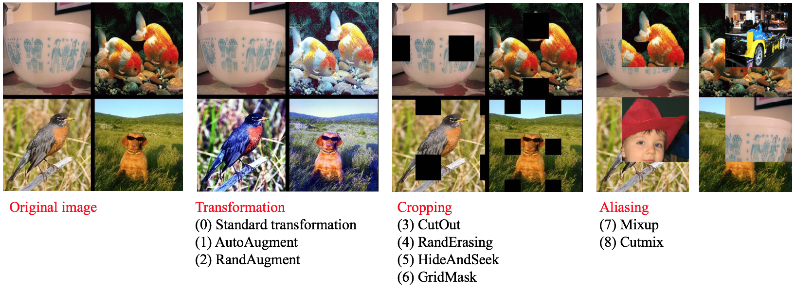
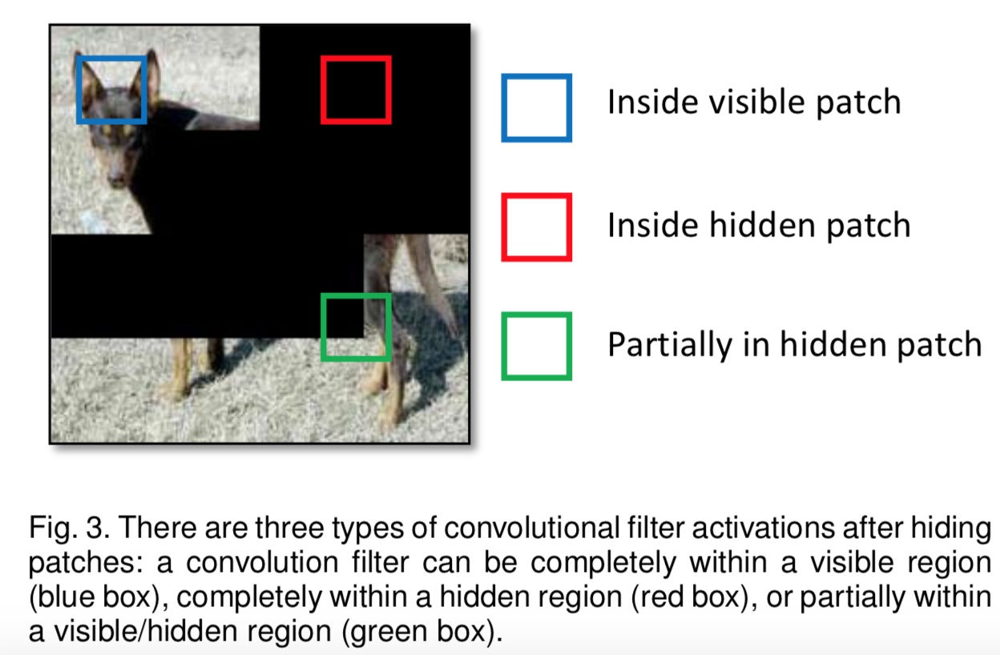
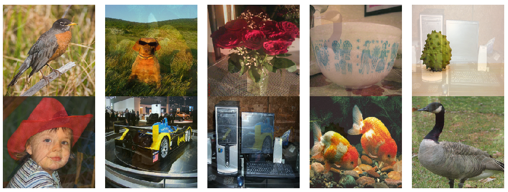
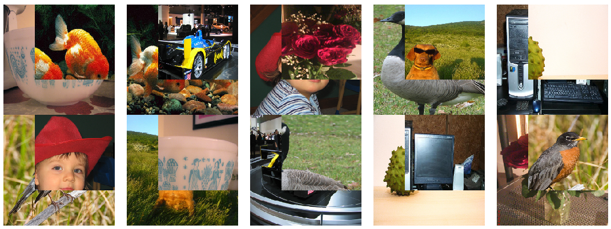

# Data Augmentation
------

## Catalogue

  - [1. Introduction to data augmentation](#1)
  - [2. Common data augmentation methods](#2)
    - [2.1 Image Transformation](#2.1)
      - [2.1.1 AutoAugment](#2.1.1)
      - [2.1.2 RandAugment](#2.1.2)
      - [2.1.3 TimmAutoAugment](#2.1.3)
    - [2.2 Image Cropping](#2.2)
      - [2.2.1 Cutout](#2.2.1)
      - [2.2.2 RandomErasing](#2.2.2)
      - [2.2.3 HideAndSeek](#2.2.3)
      - [2.2.4 GridMask](#2.2.4)
    - [2.3 Image mix](#2.3)
      - [2.3.1 Mixup](#2.3.1)
      - [2.3.2 Cutmix](#2.3.2)
    

## 1. Introduction to data augmentation

Data augmentation is a commonly used regularization method in image classification task, which is often used in scenarios with insufficient data or large model. In this chapter, we mainly introduce 8 image augmentation methods besides standard augmentation methods. Users can apply these methods in their own tasks for better model performance. Under the same conditions, these augmentation methods' performance on ImageNet1k dataset is shown as follows.

## 2. Common data augmentation methods

If without special explanation, all the examples and experiments in this chapter are based on ImageNet1k dataset with the network input image size set as 224.

The standard data augmentation pipeline in ImageNet classification tasks contains the following steps.

1. Decode image, abbreviated as `ImageDecode`.
2. Randomly crop the image to size with 224x224, abbreviated as `RandCrop`.
3. Randomly flip the image horizontally, abbreviated as `RandFlip`.
4. Normalize the image pixel values, abbreviated as `Normalize`.
5. Transpose the image from `[224, 224, 3]`(HWC) to `[3, 224, 224]`(CHW), abbreviated as `Transpose`.
6. Group the image data(`[3, 224, 224]`) into a batch(`[N, 3, 224, 224]`), where `N` is the batch size. It is abbreviated as `Batch`.

Compared with the above standard image augmentation methods, the researchers have also proposed many improved image augmentation strategies. These strategies are to insert certain operations at different stages of the standard augmentation method, based on the different stages of operation. We divide it into the following three categories.

1. Transformation. Perform some transformations on the image after `RandCrop`, such as AutoAugment and RandAugment.
2. Cropping. Perform some transformations on the image after  `Transpose`, such as CutOut, RandErasing, HideAndSeek and GridMask.
3. Aliasing. Perform some transformations on the image after `Batch`, such as Mixup and Cutmix.

Visualization results of some images after augmentation are shown as follows.

The following table shows more detailed information of the transformations.

| Method        | Input                        | Output                        | Auto- Augment\[1\] | Rand- Augment\[2\] | CutOut\[3\] | Rand Erasing\[4\] | HideAnd- Seek\[5\] | GridMask\[6\] | Mixup\[7\] | Cutmix\[8\] |
|-------------|---------------------------|---------------------------|------------------|------------------|-------------|------------------|------------------|---------------|------------|------------|
| Image Decode | Binary                    | (224, 224, 3) uint8      | Y                | Y                | Y           | Y                | Y                | Y             | Y          | Y |
| RandCrop    | (:, :, 3) uint8          | (224, 224, 3) uint8      | Y                | Y                | Y           | Y                | Y                | Y             | Y          | Y |
| **Process**     | (224, 224, 3) uint8      | (224, 224, 3) uint8      | Y                | Y                | \-          | \-               | \-               | \-            | \-         | \- |
| RandFlip    | (224, 224, 3) uint8      | (224, 224, 3) float32    | Y                | Y                | Y           | Y                | Y                | Y             | Y          | Y |
| Normalize   | (224, 224, 3) uint8      | (3, 224, 224) float32    | Y                | Y                | Y           | Y                | Y                | Y             | Y          | Y |
| Transpose   | (224, 224, 3) float32    | (3, 224, 224) float32    | Y                | Y                | Y           | Y                | Y                | Y             | Y          | Y |
| **Process**     | (3, 224, 224) float32    | (3, 224, 224) float32    | \-               | \-               | Y           | Y                | Y                | Y             | \-         | \- |
| Batch       | (3, 224, 224) float32    | (N, 3, 224, 224) float32 | Y                | Y                | Y           | Y                | Y                | Y             | Y          | Y |
| **Process**     | (N, 3, 224, 224) float32 | (N, 3, 224, 224) float32 | \-               | \-               | \-          | \-               | \-               | \-            | Y          | Y |

PaddleClas integrates all the above data augmentation strategies. More details including principles and usage of the strategies are introduced in the following chapters. For better visualization, we use the following figure to show the changes after the transformations. And `RandCrop` is replaced with` Resize` for simplification.

### 2.1 Image Transformation

Transformation means performing some transformations on the image after `RandCrop`. It mainly contains AutoAugment and RandAugment.

#### 2.1.1 AutoAugment

Address：[https://arxiv.org/abs/1805.09501v1](https://arxiv.org/abs/1805.09501v1)

Github repo：[https://github.com/DeepVoltaire/AutoAugment](https://github.com/DeepVoltaire/AutoAugment)

Unlike conventional artificially designed image augmentation methods, AutoAugment is an image augmentation solution suitable for a specific data set found by certain search algorithm in the search space of a series of image augmentation sub-strategies. For the ImageNet dataset, the final data augmentation solution contains 25 sub-strategy combinations. Each sub-strategy contains two transformations. For each image, a sub-strategy combination is randomly selected and then determined with a certain probability Perform each transformation in the sub-strategy.

The images after `AutoAugment` are as follows.

#### 2.1.2 RandAugment

Address: [https://arxiv.org/pdf/1909.13719.pdf](https://arxiv.org/pdf/1909.13719.pdf)

Github repo: [https://github.com/heartInsert/randaugment](https://github.com/heartInsert/randaugment)

The search method of `AutoAugment` is relatively violent. Searching for the optimal strategy for this data set directly on the data set requires a lot of computation. In `RandAugment`, the author found that on the one hand, for larger models and larger datasets, the gains generated by the augmentation method searched using `AutoAugment` are smaller. On the other hand, the searched strategy is limited to certain dataset, which has poor generalization performance and not sutable for other datasets.

In `RandAugment`, the author proposes a random augmentation method. Instead of using a specific probability to determine whether to use a certain sub-strategy, all sub-strategies are selected with the same probability. The experiments in the paper also show that this method performs well even for large models.

The images after `RandAugment` are as follows.

#### 2.1.3 TimmAutoAugment

Github open source code address: [https://github.com/rwightman/pytorch-image-models/blob/master/timm/data/auto_augment.py](https://github.com/rwightman/pytorch-image-models/blob/master/timm/data/auto_augment.py)

`TimmAutoAugment` is an improvement of AutoAugment and RandAugment by open source authors. Facts have proved that it has better performance on many visual tasks. At present, most VisionTransformer models are implemented based on TimmAutoAugment.

### 2.2 Image Cropping

Cropping means performing some transformations on the image after `Transpose`, setting pixels of the cropped area as certain constant. It mainly contains CutOut, RandErasing, HideAndSeek and GridMask.

Image cropping methods can be operated before or after normalization. The difference is that if we crop the image before normalization and fill the areas with 0, the cropped areas' pixel values will not be 0 after normalization, which will cause grayscale distribution change of the data.

The above-mentioned cropping transformation ideas are the similar, all to solve the problem of poor generalization ability of the trained model on occlusion images, the difference lies in that their cropping details.

#### 2.2.1 Cutout

Address: [https://arxiv.org/abs/1708.04552](https://arxiv.org/abs/1708.04552)

Github repo: [https://github.com/uoguelph-mlrg/Cutout](https://github.com/uoguelph-mlrg/Cutout)

Cutout is a kind of dropout, but occludes input image rather than feature map. It is more robust to noise than noise. Cutout has two advantages: (1) Using Cutout, we can simulate the situation when the subject is partially occluded. (2) It can promote the model to make full use of more content in the image for classification, and prevent the network from focusing only on the saliency area, thereby causing overfitting.

The images after `Cutout` are as follows.

#### 2.2.2 RandomErasing

Address: [https://arxiv.org/pdf/1708.04896.pdf](https://arxiv.org/pdf/1708.04896.pdf)

Github repo: [https://github.com/zhunzhong07/Random-Erasing](https://github.com/zhunzhong07/Random-Erasing)

RandomErasing is similar to the Cutout. It is also to solve the problem of poor generalization ability of the trained model on images with occlusion. The author also pointed out in the paper that the way of random cropping is complementary to random horizontal flipping. The author also verified the effectiveness of the method on pedestrian re-identification (REID). Unlike `Cutout`, in` `, `RandomErasing` is operateed on the image with a certain probability, size and aspect ratio of the generated mask are also randomly generated according to pre-defined hyperparameters.

The images after `RandomErasing` are as follows.

#### 2.2.3 HideAndSeek

Address: [https://arxiv.org/pdf/1811.02545.pdf](https://arxiv.org/pdf/1811.02545.pdf)

Github repo: [https://github.com/kkanshul/Hide-and-Seek](https://github.com/kkanshul/Hide-and-Seek)

Images are divided into some patches for `HideAndSeek` and masks are generated with certain probability for each patch. The meaning of the masks in different areas is shown in the figure below.

The images after `HideAndSeek` are as follows.

#### 2.2.4 GridMask
Address：[https://arxiv.org/abs/2001.04086](https://arxiv.org/abs/2001.04086)

Github repo：[https://github.com/akuxcw/GridMask](https://github.com/akuxcw/GridMask)

The author points out that the previous method based on image cropping has two problems, as shown in the following figure:

1. Excessive deletion of the area may cause most or all of the target subject to be deleted, or cause the context information loss, resulting in the images after enhancement becoming noisy data.
2. Reserving too much area has little effect on the object and context.

Therefore, it is the core problem to be solved how to
if you avoid over-deletion or over-retention becomes the core problem to be solved.

`GridMask` is to generate a mask with the same resolution as the original image and multiply it with the original image. The mask grid and size are adjusted by the hyperparameters.

In the training process, there are two methods to use:
1. Set a probability p and use the GridMask to augment the image with probability p from the beginning of training.
2. Initially set the augmentation probability to 0, and the probability is increased with number of iterations from 0 to p.

It shows that the second method is better.

The images after `GridMask` are as follows.

### 2.3 Image mix

mix means performing some transformations on the image after `Batch`, which contains Mixup and Cutmix.

Data augmentation methods introduced before are based on single image while mixing is carried on a certain batch to generate a new batch.

#### 2.3.1 Mixup

Address: [https://arxiv.org/pdf/1710.09412.pdf](https://arxiv.org/pdf/1710.09412.pdf)

Github repo: [https://github.com/facebookresearch/mixup-cifar10](https://github.com/facebookresearch/mixup-cifar10)

Mixup is the first solution for image aliasing, it is easy to realize and performs well not only on image classification but also on object detection. Mixup is usually carried out in a batch for simplification, so as `Cutmix`.

The images after `Mixup` are as follows.

#### 2.3.2 Cutmix

Address: [https://arxiv.org/pdf/1905.04899v2.pdf](https://arxiv.org/pdf/1905.04899v2.pdf)

Github repo: [https://github.com/clovaai/CutMix-PyTorch](https://github.com/clovaai/CutMix-PyTorch)

Unlike `Mixup` which directly adds two images, for Cutmix, an `ROI` is cut out from one image and
Cutmix randomly cuts out an `ROI` from one image, and then covered onto the corresponding area in the another image. 

The images after `Cutmix` are as follows.

For the practical part of data augmentation, please refer to [Data Augmentation Practice](../advanced_tutorials/DataAugmentation_en.md).

## Reference

[1] Cubuk E D, Zoph B, Mane D, et al. Autoaugment: Learning augmentation strategies from data[C]//Proceedings of the IEEE conference on computer vision and pattern recognition. 2019: 113-123.

[2] Cubuk E D, Zoph B, Shlens J, et al. Randaugment: Practical automated data augmentation with a reduced search space[J]. arXiv preprint arXiv:1909.13719, 2019.

[3] DeVries T, Taylor G W. Improved regularization of convolutional neural networks with cutout[J]. arXiv preprint arXiv:1708.04552, 2017.

[4] Zhong Z, Zheng L, Kang G, et al. Random erasing data augmentation[J]. arXiv preprint arXiv:1708.04896, 2017.

[5] Singh K K, Lee Y J. Hide-and-seek: Forcing a network to be meticulous for weakly-supervised object and action localization[C]//2017 IEEE international conference on computer vision (ICCV). IEEE, 2017: 3544-3553.

[6] Chen P. GridMask Data Augmentation[J]. arXiv preprint arXiv:2001.04086, 2020.

[7] Zhang H, Cisse M, Dauphin Y N, et al. mixup: Beyond empirical risk minimization[J]. arXiv preprint arXiv:1710.09412, 2017.

[8] Yun S, Han D, Oh S J, et al. Cutmix: Regularization strategy to train strong classifiers with localizable features[C]//Proceedings of the IEEE International Conference on Computer Vision. 2019: 6023-6032.

[test_baseline]: ../../../images/image_aug/test_baseline.jpeg
[test_autoaugment]: ../../../images/image_aug/test_autoaugment.jpeg
[test_cutout]: ../../../images/image_aug/test_cutout.jpeg
[test_gridmask]: ../../../images/image_aug/test_gridmask.jpeg
[gridmask-0]: ../../../images/image_aug/gridmask-0.png
[test_hideandseek]: ../../../images/image_aug/test_hideandseek.jpeg
[test_randaugment]: ../../../images/image_aug/test_randaugment.jpeg
[test_randomerassing]: ../../../images/image_aug/test_randomerassing.jpeg
[hide_and_seek_mask_expanation]: ../../../images/image_aug/hide-and-seek-visual.png
[test_mixup]: ../../../images/image_aug/test_mixup.png
[test_cutmix]: ../../../images/image_aug/test_cutmix.png
