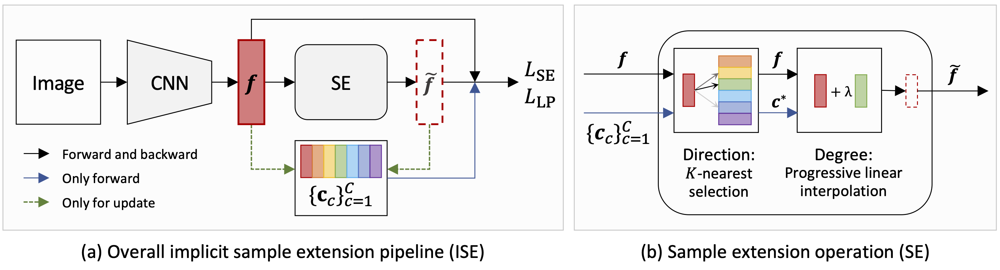

# ISE
---
## Catalogue

- [1. Introduction](#1)
- [2. Performance on Market1501 and MSMT17](#2)
- [3. Test](#3)
- [4. Reference](#4)

<a name='1'></a>
## 1. Introduction

ISE (Implicit Sample Extension) is a simple, efficient, and effective learning algorithm for unsupervised person Re-ID. ISE generates what we call support samples around the cluster boundaries. The sample generation process in ISE depends on two critical mechanisms, i.e., a progressive linear interpolation strategy and a label-preserving loss function. The generated support samples from ISE provide complementary information, which can nicely handle the "sub and mixed" clustering errors. ISE achieves superior performance than other unsupervised methods on Market1501 and MSMT17 datasets.

> [**Implicit Sample Extension for Unsupervised Person Re-Identification**](https://arxiv.org/abs/2204.06892v1)<br>
> Xinyu Zhang, Dongdong Li, Zhigang Wang, Jian Wang, Errui Ding, Javen Qinfeng Shi, Zhaoxiang Zhang, Jingdong Wang<br>
> CVPR2022



<a name='2'></a>
## 2. Performance on Market1501 and MSMT17

The main results on Market1501 (M) and MSMT17 (MS). PIL denotes the progressive linear interpolation strategy. LP represents the label-preserving loss function.

| Methods | M | Link | MS | Link |
| --- | -- | -- | -- | - |
| Baseline | 82.5 (92.5) | - | 30.1 (58.6) | - |
| ISE (+PIL) | 83.9 (93.9) | - | 33.5 (63.9) | - |
| ISE (+LP)  | 83.6 (92.7) | - | 31.4 (59.9) | - |
| ISE (Ours) (+PIL+LP) | **84.7 (94.0)** | [ISE_M](https://paddle-imagenet-models-name.bj.bcebos.com/dygraph/ISE_M_model.pdparams) | **35.0 (64.7)** | [ISE_MS](https://paddle-imagenet-models-name.bj.bcebos.com/dygraph/ISE_MS_model.pdparams) |

<a name="3"></a>
## 3. Test
The training code is coming soon. We first release the test code with the pretrained models.

**Test:** You can simply run the following script for the evaluation.

```
python tools/eval.py -c ./ppcls/configs/Person/ResNet50_UReID_infer.yaml
```
**Steps:**
1. Download the pretrained model first, and put the model into: ```./pd_model_trace/ISE/```.
2. Change the dataset name in: ```./ppcls/configs/Person/ResNet50_UReID_infer.yaml```.
3. Run the above script.


<a name="4"></a>
## 4. Reference

If you find ISE useful in your research, please kindly consider citing our paper:

```
@inproceedings{zhang2022Implicit,
  title={Implicit Sample Extension for Unsupervised Person Re-Identification},
  author={Xinyu Zhang, Dongdong Li, Zhigang Wang, Jian Wang, Errui Ding, Javen Qinfeng Shi, Zhaoxiang Zhang, Jingdong Wang},
  booktitle={IEEE Conference on Computer Vision and Pattern Recognition (CVPR)},
  year={2022}
}
```
