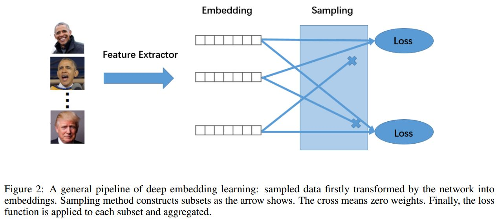

# Metric Learning

## Catalogue

- [1.Introduction](#1)
- [2.Applications](#2)
- [3.Algorithms](#3)
    - [3.1 Classification based](#3.1)
    - [3.2 Pairwise based](#3.2)

## 1.Introduction

Measuring the distance between data is a common practice in machine learning. Generally speaking, Euclidean Distance, Inner Product, or Cosine Similarity are all available to calculate measurable data. However, the same operation can hardly be replicated on unstructured data, such as calculating the compatibility between a video and a piece of music. Despite the difficulty in performing the aforementioned vector operation directly due to varied data formats, priori knowledge tells that ED(laugh_video, laugh_music) < ED(laugh_video, blue_music). And how to effectively characterize this "distance"?  This is exactly the focus of Metric Learning.

Metric learning, known as Distance Metric Learning, is to automatically construct a task-specific metric function based on training data in the form of machine learning. As shown in the figure below, the goal of Metric learning is to learn a transformation function (either linear or nonlinear) L that maps data points from the original vector space to a new one in which similar points are closer together and non-similar points are further apart, making the metric more task-appropriate. And Deep Metric Learning fits the transformation function by adopting a deep neural network. 

## 2.Applications

Metric Learning technologies are widely applied in real life, such as Face Recognition, Person ReID, Image Retrieval, Fine-grained classification, etc. With the growing prevalence of deep learning in industrial practice, Deep Metric Learning (DML) emerges as the current research direction.

Normally, DML consists of three parts: a feature extraction network for map embedding, a sampling strategy to combine samples in a mini-batch into multiple sub-sets, and  a loss function to compute the loss on each sub-set. Please refer to the figure below: 

## 3.Algorithms

Two learning paradigms are adopted in Metric Learning:

### 3.1 Classification based:

This refers to methods based on classification labels. They learn the effective feature representation by classifying each sample into the correct category and require the participation of  the explicit labels of each sample in the Loss calculation during the learning process. Common algorithms include [L2-Softmax](https://arxiv.org/abs/1703.09507), [Large-margin Softmax](https://arxiv.org/abs/1612.02295), [Angular Softmax](https://arxiv.org/pdf/1704.08063.pdf), [NormFace](https://arxiv.org/abs/1704.06369), [AM-Softmax](https://arxiv.org/abs/1801.05599), [CosFace](https://arxiv.org/abs/1801.09414), [ArcFace](https://arxiv.org/abs/1801.07698), etc. These methods are also called proxy-based, because what they optimize is essentially the similarity between a sample and a set of proxies.

### 3.2 Pairwise based:

This refers to the learning paradigm based on paired samples. It takes sample pairs as input and obtains an effective feature representation by directly learning the similarity between these pairs. Common algorithms include [Contrastive loss](http://yann.lecun.com/exdb/publis/pdf/hadsell-chopra-lecun-06.pdf), [ Triplet loss](https://arxiv.org/abs/1503.03832), [Lifted-Structure loss](https://arxiv.org/abs/1511.06452), [N-pair loss](https://), [Multi-Similarity loss](https://arxiv.org/pdf/1904.06627.pdf), etc.

[CircleLoss](https://arxiv.org/abs/2002.10857), released in 2020, unifies the two learning paradigms from a fresh perspective, prompting researchers and practitioners' further reflection on Metric Learning.
