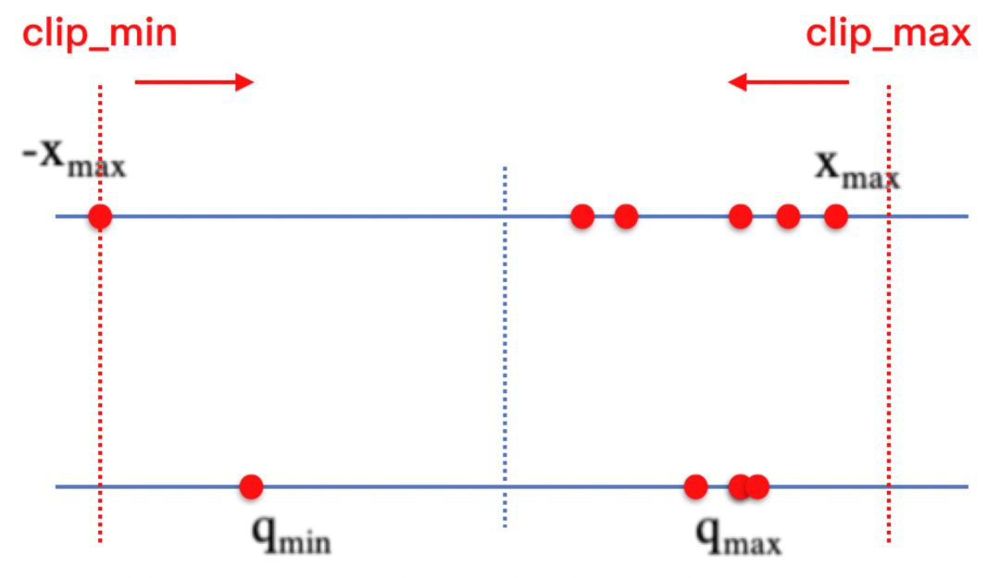
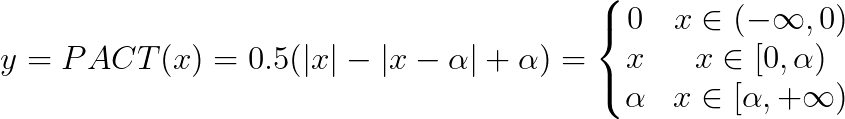
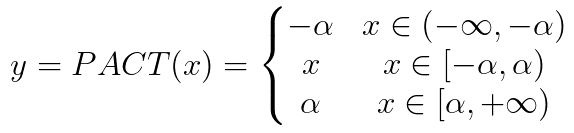
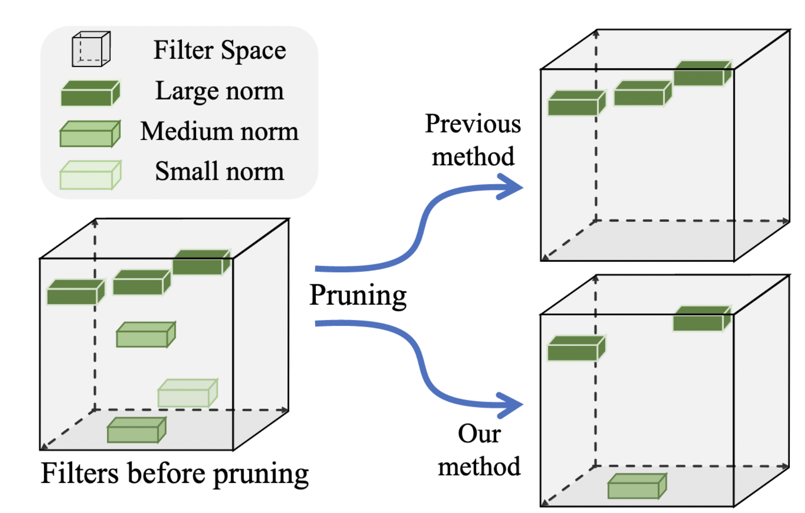

# Algorithms of Model Pruning and Quantization

Deep learning limits the deployment of corresponding models in some scenarios and devices due to its computational complexity or parameter redundancy, thus requiring model compression, optimization acceleration. Model compression algorithms can effectively decrease parameter redundancy, thus reducing storage footprint, communication bandwidth, and computational complexity, which are conducive to the application and deployment of models of deep learning. Among them, model quantization and pruning enjoy great popularity. In PaddleClas, the following two algorithms should be mainly applied.

- Quantization: PACT
- Pruning: FPGM

See [PaddeSlim](https://github.com/PaddlePaddle/PaddleSlim/) for detailed parameters.

## Catlogue

- [1. PACT](#1)
- [2. FPGM](#2)

## 1. PACT

The model quantization comprises two main parts, the quantization of the Weight and the Activation. Simultaneous quantization of the two parts is necessary to maximize the computational efficiency gain. The weight can be distributed as compactly as possible by means of network regularization to reduce outliers and uneven distribution, while there is a lack of effective means for activation.

**PACT (PArameterized Clipping acTivation)** is a new quantization method that minimizes the loss of accuracy, or even achieves great accuracy by removing some outliers before the quantization of activation. The method was proposed when the author found that "the quantized activation differed significantly from the full accuracy results when the weight quantization is adopted". The author also found that the quantization of activation can cause a great error (as a result of RELU, the range of activation is infinite compared to the weight which is basically within 0 to 1), so the activation function **clipped RELU** was introduced. The clipping ceiling, i.e., $α$, is a learnable parameter, which ensures that each layer can learn a different quantization range through training and minimizes the rounding error caused by quantization. The schematic diagram of quantization is shown below. **PACT** solves the problem by continuously trimming the activation range so that the activation distribution is narrowed, thus reducing the quantization mapping loss. It can acquire a more reasonable quantization scale and cut the quantization loss by clipping the activation, thus reducing the outliers in the activation distribution.

The quantization formula of **PACT** is as follows:

It is shown that PACT is about adopting the above quantization as a substitute for the *ReLU* function to clip the part greater than zero with a threshold of $a$. However, the above formula is further improved in *PaddleSlim* as follows:

After the above improvement, *PACT* preprocessing is inserted between the activation and the OP (convolution, full connection, etc.) to be quantized, which not only clips the distribution greater than 0 but also perform the same for the part less than 0, so as to better obtain the range to be quantized and minimize the quantization loss. At the same time, the clipping threshold is a trainable parameter, which can be detected automatically and reasonably by the model during the quantization training, thus further lowering the quantization accuracy loss.

For specific algorithm parameters, please refer to [Introduction to Parameters](https://github.com/PaddlePaddle/PaddleSlim/blob/release/2.0.0/docs/zh_cn/api_cn/dygraph/quanter/qat.rst#qat) in PaddleSlim.

## 2. FPGM

Model pruning is an essential practice to reduce the model size and improve inference efficiency. In previous articles on network pruning, the norm of the network filter is generally adopted to measure its importance, **the smaller the norm value, the less important the filter is** and the more significant it will be to clip it from the network. **FPGM** believes that the previous approach relies on the following two points:

- The deviation of the filter's norm should be large so that important and unimportant filters can be well separated
- The norm of the unimportant filter should be small enough

Based on this, **FPGM** takes advantage of the geometric center property of the filter. Since filters near the center can be expressed by others, they can be eliminated, thus avoiding the above two pruning conditions. As a result, the pruning is conducted in consideration of the redundancy of information instead of a small norm. The following figure shows how the **FPGM** differs from the previous method, see [paper](https://openaccess.thecvf.com/content_CVPR_2019/papers/He_Filter_Pruning_via_Geometric_Median_) for more details.

For specific algorithm parameters, please refer to [Introduction to Parameters](https://github.com/PaddlePaddle/PaddleSlim/blob/release/2.0.0/docs/zh_cn/api_cn/dygraph/pruners/fpgm_filter_pruner.rst#fpgmfilterpruner) in PaddleSlim.
