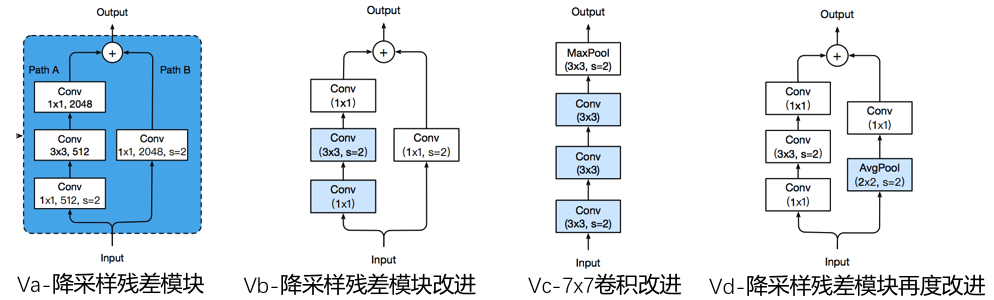

# Image Classification FAQ Summary - 2020 Season 1

## Catalogue

- [1. Issue 1](#1)(2020.11.03)
- [2. Issue 2](#2)(2020.11.11)
- [3. Issue 3](#3)(2020.11.18)
- [4. Issue 4](#4)(2020.12.07)
- [5. Issue 5](#5)(2020.12.17)
- [6. Issue 6](#6)(2020.12.30)

<a name="1"></a>

## Issue 1

### Q1.1: What can PaddleClas be used for?

**A**：PaddleClas is an image recognition toolset for industry and academia, helping users train better computer vision models and apply them in real scenarios.

It provides the whole process of model training, evaluation, inference, and deployment based on image classification to facilitate users' efficient learning. Specifically, PaddleClas contains the following features.

- PaddleClas provides 36 families of classification network structures (ResNet, ResNet_vd, MobileNetV3, Res2Net, HRNet, etc.) and training configurations, 175 pre-trained models, and performance evaluation and inference for free choice and application.
- PaddleClas provides a variety of inference deployment solutions such as TensorRT inference, python inference, c++ inference, Paddle-Lite inference deployment, PaddleServing, PaddleHub, etc., to facilitate inference deployment in multiple environments.
- PaddleClas provides a simple SSLD knowledge distillation scheme, based on which the recognition accuracy of distillation models register a general improvement of more than 3%.
- PaddleClas provides 8 data augmentation algorithms such as AutoAugment, Cutout, Cutmix, etc. with a detailed introduction, code replication, and evaluation of effectiveness in a unified experimental environment.
- PaddleClas supports CPU/GPU-based adoption in Windows/Linux/MacOS environments.

### Q1.2: What is the ResNet series model? What are they? Why are they so popular on the server side?

**A**: ResNet takes the lead to introduce the residual structure, and construct the ResNet network by stacking multiple residual structures. Experiments show that the use of residual blocks can effectively improve convergence speed and accuracy. In PaddleClas, ResNet has such structures containing 18, 34, 50, 101, 152, and 200 layers in order. These models, proposed in 2015, has been validated in different application scenarios, such as classification, detection, segmentation, etc., and has long been optimized by the industry and acquired obvious advantages in terms of speed and accuracy, let alone its well support for the inference of TensorRT and FP16. Therefore, it is recommended to adopt the ResNet series model. Considering their large storage footprint, they are often used on the server side.  For more information about ResNet models, please refer to the paper [Deep Residual Learning for Image Recognition](https://arxiv.org/abs/1512.03385).

### Q1.3: What's the difference between the structure of ResNet_vd, ResNet and ResNet_vc?

**A**: The structure of ResNet_va to vd is shown in the figure below. ResNet was first proposed as va structure, in the left feature transformation path (Path A) of the downsampling residual module, the first 1x1 convolution is downsampled, which leads to information loss (the kernel size of the convolution is 1, stride is 2, some features in the input feature graph are not involved in the calculation of convolution). In the vb structure, the downsampling step is adjusted from the first 1x1 convolution at the beginning to the 3x3 convolution in the middle, thus avoiding the loss of information, and the default ResNet model in PaddleClas is ResNet_vb. The vc structure turns the initial 7x7 convolution into 3 3x3 convolutions with almost the same computation and storage size and improved accuracy when the perceptual field remains unchanged. The vd structure is a modification of the feature path (Path B) on the right side of the downsampling residual module, replacing the downsampling with average pooling. This collection of improvements (va->vd), with little extra inference time, and combined with appropriate training strategies, such as label smoothing and mixup data augmentation, can improve the accuracy by up to 2.7%.



### Q1.4 How to choose appropriate ResNet models for the actual scenario?

**A**:

Among the ResNet series model, the ResNet_vd model is recommended for it has a significant improvement in accuracy with almost constant inference speed compared to other models. When the batch size=4, the variation of inference time, FLOPs, Params and accuracy for different models on T4 GPU are demonstrated in the [ResNet and its vd series models](../models/ResNet_and_vd_en.md). If you want the smallest possible model storage or the fastest inference speed, please use ResNet18_vd model, and if you want to get the highest possible accuracy, we recommend the ResNet152_vd or ResNet200_vd models. For more information about the ResNet series model, please refer to [ResNet and its vd series models](../models/ResNet_and_vd_en.md)

- Variation of precision-inference speed


- Variation of precision-params


- Variation of precision-flops


### Q1.5 Is conv-bn-relu a fixed form in a block of the network?

**A**:

Before the advent of batch-norm, the mainstream convolutional neural networks were fixed in the form of conv-relu. At the moment, conv-bn-relu is the fixed form of blocks in most of the convolutional networks, which is a relatively robust design. Besides, the block in DenseNet is adopted in the form of bn-relu-conv, which is the same combination used in ResNet-V2. In MobileNetV2, the middle layer of some blocks adopts conv-bn instead of the relu activation function to avoid information loss.

### Q1.6 What's the difference between ResNet34 and ResNet50？

**A**:

There are two different kinds of blocks in the ResNet series, basic-block and bottleneck-block, and the ResNet network is constructed by the stacking of such blocks. basic-block is a stack of two 3x3 convolutional kernels with shortcut, while bottleneck-block is a stack of a 1x1 convolutional kernel, 3x3 convolutional kernel, and 1x1 convolutional kernel with shortcut, so there are two layers in the former one and three in the latter. The number of blocks stacked in ResNet34 and ResNet50 is the same, but the types of stacking are basic-block and bottleneck-block, respectively.

### Q1.7 Do large convolution kernels necessarily lead to positive returns?

**A**:

Not really, increasing all the convolutional kernels in the network may not lead to performance improvement or even the opposite. In the paper [MixConv: Mixed Depthwise Convolutional Kernels](https://arxiv.org/abs/1907.09595), it is pointed out that increasing the size of the convolutional kernels within a certain range plays a positive role in the accuracy improvement, but a size beyond may lead to accuracy loss. Therefore, considering the size of the model and the computation, large convolutional kernels are generally abandoned to design the network. Also, there are experiments on large convolution kernels in the article [PP-LCNet](../models/PP-LCNet_en.md).

<a name="2"></a>

## Issue 2

### Q2.1: How does PaddleClas train its backbone?

**A**：The process is as follows:

- First, create a new model structure file under the folder `ppcls/arch/backbone/model_zoo/`, i.e. your own backbone. You can refer to resnet.py for model construction;
- Then add your own backbone class in `ppcls/arch/backbone/__init__.py`;
- Next, configure the yaml file for training, here you can refer to `ppcls/configs/ImageNet/ResNet/ResNet50.yaml`;
- Now you can start the training.

### Q2.2: How to transfer the existing models and weights to your own classification tasks?

**A**: The process is as follows:

- First, a good pre-training model tends to be better transferred, so it is recommended to adopt a pre-training model with higher accuracy, for instance, series of industry-leading pre-training models provided by PaddleClas;
- Second, determine and train hyperparameters based on the size of the dataset to be transferred, which need to be debugged to find a local optimal value. If you have no relevant experience, it is recommended to start with the learning rate, which generally has a smaller dataset adopting a small learning rate, such as 0.001. In addition, the warmup strategy is suggested for the learning rate to avoid the weight damage of the pre-training model resulting from a large learning rate. During the transfer, the learning rate of different layers in the backbone can also be set, and it is often better to gradually reduce the learning rate from the head to the tail of the network. Data augmentation strategies can also be useful for small datasets, and PaddleClas offers 8 powerful data augmentation strategies for higher accuracy.
- After training, the above process can be iterated repeatedly until a local optimal value is found.

### Q2.3: Is the default parameter under configs in PaddleClas available for all datasets?

**A**:

The default parameter of the configuration file under `ppcls/configs/ImageNet/` in PaddleClas is the training parameter of ImageNet-1k, which is not suitable for all datasets, and the specific datasets need to be further debugged on this basis.

### Q2.4 The resolution varies for different models in PaddleClas, so what is the standard?

**A**:

PaddleClas strictly follows the resolution used by the authors of the paper. Since AlexNet in 2012, most of the convolutional neural networks trained on ImageNet have a resolution of 224x224, and Google adjusted the resolution to 299x299 when designing InceptionV3 to fit the network structure, which was the same one for later  Xception and InceptionV4. In addition, in EfficeintNet, the authors analyze that different resolutions should be used for networks of different sizes, so does it in this series. In practical scenarios, it is recommended to adopt the default resolution, but networks with deeper layers or larger widths can also try larger ones.

### Q2.5 There are many ssld models available in PaddleClas, what is the value of their application?

**A**:

There are many ssld pre-training models available in PaddleClas, which obtain better pre-training weights by semi-supervised knowledge distillation, so that the accuracy can be improved by replacing the ssld pre-training models with higher accuracy in transfer tasks or downstream vision tasks without replacing the structure files. For example, in PaddleSeg, [HRNet](../models/HRNet_en.md) , with the weight of the ssld pre-training model, achieves much better accuracy than other same models in the industry; In PaddleDetection, [PP- YOLO](https://github.com/PaddlePaddle/PaddleDetection/blob/release/0.4/configs/ppyolo/README_cn.md)with ssld pre-training weights has further improvement in the already high baseline. The transfer of classification with ssld pre-training weights also yields impressive results, and the benefits of knowledge distillation for the transfer of classification task is detailed in  [SSLD Distillation Strategy](../advanced_tutorials/distillation/distillation_en.md)  

<a name="3"></a>

## Issue 3

### Q3.1: What is the improvement of DenseNet model over ResNet? What are the features or application scenarios?

**A**:

DenseNet is designed with a more aggressive dense connectivity mechanism compared to ResNet, which further reduces the number of parameters by considering feature reuse and bypass settings, and mitigates the gradient dispersion problem to some extent. What's more, the model is easier to train and equipped with some regularization effect due to the introduction of dense connectivity. DenseNet is a good choice in image classification scenarios where the amount of data is limited. More information about DenseNet and this series can be found in [DenseNet Models](../models/DPN_DenseNet_en.md).

### Q3.2: What are the improvements of the DPN network over DenseNet?

**A**：

The full name of DPN is Dual Path Networks, or Dual Channel Networks. It is a combination of DenseNet and ResNeXt, which demonstrates that DenseNet can extract new features from the previous layers, while ResNeXt is essentially reuse of features already extracted from the previous layers. The authors further analyze and find that ResNeXt has a high reuse rate for features but low redundancy, while DenseNet can create new features but has high redundancy. Combining the advantages of both structures, the DPN network is designed. Finally, the DPN network achieves better results than ResNeXt and DenseNet with the same FLOPS and number of parameters. More introduction and series models of DPN can be found in [DPN Models](../models/DPN_DenseNet_en.md).

### Q3.3: How to use multiple models for inference fusion?

**A**:

When adopting multiple models for inference, it is recommended to first export the pre-training model as an inference model to get rid of the dependence on the network structure definition, you can refer to [model export script](../../../tools/export_model.py) for model exporting, and then see [inference script for the inference model](../../../deploy/python/predict_cls.py), where you need to create multiple predictors according to the number of employed models.

### Q3.4: How to add your own data augmentation methods in PaddleClas?

**A**：

- For single-image augmentation, you can refer to [Single-image based data augmentation script](../../../ppcls/data/preprocess/ops). Learning from the data operator  ` ResizeImage ` or `CropImage` to create a new class, and then implement the corresponding augmentation method in `__call__`.
- For a batch image, you can refer to the [batch data-based data augmentation script](../../../ppcls/data/preprocess/batch_ops). Learning from the data operator `MixupOperator` or `CutmixOperator` to create a new class, and then implement the corresponding augmentation method in `__call__`.

## Q3.5: How to further accelerate the model training?

**A**：

- You can adopt auto-mixed precision training, which can gain a significantly faster speed with almost zero precision loss. Take ResNet50 as an example, the configuration file of auto-mixed precision training in PaddleClas can be found at: [ResNet50_amp_O1.yml](../../../ppcls/configs/ImageNet/ResNet/ResNet50_amp_O1.yaml). The main step is to add the following lines to the standard configuration file.

```
# mixed precision training
AMP:
  scale_loss: 128.0
  use_dynamic_loss_scaling: True
  use_pure_fp16: &use_pure_fp16 True
```

- You can turn on dali to run the data preprocessing method on GPU. When the model is relatively small (reader accounts for a higher percentage of time consumption), an obviously faster speed can be obtained with dali on, which could be employed by adding  `-o Global.use_dali=True` during training. You can refer to [dali installation tutorial](https://docs.nvidia.com/deeplearning/dali/user-guide/docs/installation.html#nightly-builds) for more details.

<a name="4"></a>

## Issue 4

### Q4.1: How many types of model files are there in PaddlePaddle?

**A**:

- There are two types of model-related files saved in PaddlePaddle.
- One is the files used for *inference deployment*, including files with the suffixes ``pdiparams``, ``model``, where the ``pdiparams` " file stores model parameter information, and "`model`" file stores model network structure information. For inference deployment files, the `paddle.jit.save` and `paddle.jit.load` interfaces are used for saving and loading.
- Another one is used in the *training tuning* process, including files with the suffixes "`pdparams`" and "`pdopt`", where the "`pdparams` " file stores the model parameters information during training, and "`pdopt`" file stores the optimizer information during model training. For training tuning files,  `paddle.save` and `paddle.load` interfaces are used for saving and loading.
- The inference deployment file enables you to build the model network structure and load the model parameters for inference, while the training tuning file allows you to load the model parameters and optimizer information for resuming the training process.

### Q4.2: What are the innovations of HRNet?

**A**:

- In the field of image classification, most neural networks are designed with the idea of extracting high-dimensional features of images. Specifically, the input image usually has a high spatial resolution, and through multi-layer convolution and pooling, a feature graph with lower spatial resolution but higher dimension can be gradually obtained and applied in scenarios such as classification.
- However, the authors of *HRNet* believe that the idea of gradually decreasing spatial resolution is not suitable for scenarios such as target detection (classification task of image region-level) and semantic segmentation (classification task of image pixel-level), because a lot of information is lost in this process and the final learned features can hardly represent the information of the original image at the high spatial resolution, while both the task of region-level and pixel-level classification are very sensitive to spatial accuracy.
- Therefore, the authors of *HRNet* propose the idea of paralleling feature graphs with different spatial resolutions, while in contrast, neural networks such as *VGG* cascade feature graphs with different spatial resolutions by different convolutional pooling layers. Moreover, *HRNet* connects feature graphs of equal depth and disparate spatial resolutions, so that the information can be fully exchanged. The specific network structure is shown in the figure below.


### Q4.3: In HRNet, how are connections made between feature graphs with different spatial resolutions?

**A**:

- First, in *HRNet*, the *3 × 3* convolution with *stride* of *2* can be used to obtain a feature graph with low spatial resolution but higher dimension; and for those with low spatial resolution, the *1 × 1* convolution is first used to match the number of channels, and then the nearest neighbor interpolation is used for upsampling to obtain a feature graph with the same spatial resolution and number of channels as the high spatial resolution graph. And for the feature map with the same spatial resolution, the constant mapping can be performed directly. The details are shown in the following figure.


### Q4.4: What does "SE" in the model stand for?

**A**:

- SE indicates that the model uses an SE structure, which is derived from the winning solution of the 2017 ImageNet classification competition *Squeeze-and-Excitation Networks (SENet)*, and can be migrated to any other networks. The *scale* vector dimension is the same as the number of channels in the feature map, and the value in each dimension of the learned *scale* vector indicates the enhancement or weakening of the feature channels in that dimension, so as to enhance the important feature channel and weaken the unimportant ones, thus making the extracted features more directional.

### Q4.5: How does the SE structure implemented?


**A**:

- The *SE* structure is shown in the figure above. First, *Ftr* represents the regular convolution operation, and *X* and *U* are the input and output feature maps of *Ftr*. After obtaining the feature map *U*, operate the *Fsq* and *Fex* to obtain the *scale* vector, which has a dimension of *C*, the same as the number of *U* channels, so it can be applied to *U* by multiplying, and then obtain *X~*.
- Specifically, *Fsq* is the *Global Average Pooling* operation, which is called *Squeeze* by  *SENet* authors because it compresses *U* from *C × H × W* to *C × 1 × 1*, and then conduct the *Fex* operation on the output of *Fsq*.
- The *Fex* operation represents two full joins, which is referred to as *Excitation* by the authors. The first full join compresses the dimension of the vector from *1 × 1 × C* to *1 × 1 × C/r*, followed by the use of *RELU*, and then restores the dimension of the vector to *C* by the second full join. The purpose of this operation is to reduce the computation. The *SENet* authors conclude experimentally that a balance between gain and computational effort could be obtained when *r=16*.
- For *Fsq*, the key is to obtain the vector of *C* dimension, so it is not limited to the *Global Average Pooling*. The *SENet* authors believe that the final *scale* is applied to *U* separately by channel, so it is necessary to calculate the corresponding *scale* based on the information of the corresponding channel, so the simplest *Global Average Pooling* is adopted, and the final *scale* vector represents the distribution between different channels, ignoring the situation in the same channel.
- For *Fex*, its role is to find the distribution based on all the training data through training on each *mini batch*. Since our training is performed on *mini batches* and the *scale* based on all training data is the best, we can adopt the *Fex* to train on each *mini batch* to obtain a more reliable *scale*.

<a name="5"></a>

## Issue 5

### Q5.1 How to choose an optimizer?

**A**:

Since the emergence of deep learning, there has been a lot of research on optimizers, which aim to minimize the loss function to find the right weights for a given task. Currently, the main optimizers used in the industry are SGD, RMSProp, Adam, AdaDelt, etc. Among them, since the SGD optimizer with momentum is widely used in academia and industry (only for classification tasks), most of the models we published also adopt this optimizer to achieve gradient descent of the loss function. It has two disadvantages, one is the slow convergence speed, and the other is the reliance on experiences of the initial learning rate setting. However, if the initial learning rate is set properly with the sufficient number of iterations, the optimizer will also stand out among many other optimizers, obtaining higher accuracy on the validation set. Some optimizers with adaptive learning rates, such as Adam and RMSProp, tend to converge fast, but the final convergence accuracy will be slightly worse. If you pursue faster convergence speed, we recommend using these adaptive learning rate optimizers, and SGD optimizers with momentum for higher convergence accuracy. The specific information of the dataset is as follows:

- ImageNet-1k: It is recommended to use the SGD optimizer with momentum only.
- Other datasets (ImageNet-1k pre-training by default): When loading the pre-training model, you can consider an optimizer such as Adam (which may work better), but the SGD optimizer with momentum is definitely a good solution.

In addition, to further speed up the training, Lookahead optimizer is also a good choice. On ImageNet-1k, it can guarantee the same convergence accuracy at a faster rate, but the performance is less stable on some datasets and requires further tuning.

### Q5.2 How to set the initial learning rate and the learning rate decay strategy?

**A**: The choice of learning rate is often related to the optimizer as well as the data and the task. The learning rate determines how quickly the network weights are updated. The lower the learning rate, the slower the loss function will change. While using a low learning rate ensures that no local minimal values are missed, it also means that it takes longer to converge, especially if trapped in a plateau region.

Throughout the whole training process, we cannot adopt the same learning rate to update the weights, otherwise, the optimal point cannot be reached, So we need to adjust the learning rate during the training. In the initial stage of training, since the weights are in a random initialization state and the loss function decreases fast, a larger learning rate can be set. And in the later stage of training, since the weights are close to the optimal value, a larger learning rate cannot further find the optimal value, so a smaller learning rate needs is a better choice. As for the learning rate decay strategy, many researchers or practitioners use piecewise_decay (step_decay), which is a stepwise decay learning rate. In addition, there are also other methods proposed by researchers, such as polynomial_decay, exponential_ decay, cosine_decay, etc. Among them, cosine_decay requires no adjustment of hyperparameters and has higher robustness, thus emerging as the preferred learning rate decay method to improve model accuracy.

The learning rates of cosine_decay and piecewise_decay are shown in the following figure. It is easy to observe that cosine_decay keeps a large learning rate throughout the training, so it is slow in convergence, but its final effect is better than peicewise_decay.


In addition, it is also observed that only a few rounds in cosine_decay use a small learning rate, which affects the final accuracy. So it is recommended to iterate more rounds for better results.

Finally, when training a neural network with a large batch_size, it is recommended to use the warmup strategy, which, as the name implies, is a warm-up for the learning rate with no direct adoption of maximum learning rate at the beginning of training, but to train the network with a gradually increasing rate, and then decay the learning rate when it peaks. Experiments show that warmup can steadily improve the accuracy of the model when the batch_size is large. Specifically for the dataset. The specific information of the dataset is as follows:

- ImageNet-1k: The recommended batch-size is 256, the initial learning rate is 0.1, and the cosine-decay to decrease the learning rate.
- Other datasets (ImageNet-1k pre-training by default): the larger the dataset, the larger the initial learning rate, not exceeding 0.1 for the best (when the batch-size is 256); the smaller the dataset, the smaller the initial learning rate, when the dataset is small, the use of warmup will also bring some accuracy improvement, and cosine-decay is still recommended as the learning rate decay strategy.

### Q5.3 How to set the batch-size?

**A**:

Batch_size is an important hyperparameter in neural networks training, whose value determines how much data is fed into the neural network for training at a time. Previous researchers have experimentally found that when the value of batch_size is linearly related to the value of learning rate, the convergence accuracy is almost unaffected. When training ImageNet-1k data, most of the neural networks choose an initial learning rate of 0.1 and a batch_size of 256. The specific information of the dataset is as follows:

- ImageNet-1k: learning rate is set to 0.1*k, batch_size is set to 256*k.
- Other datasets (ImageNet-1k pre-training by default): can be set according to the actual situation (e.g. smaller learning rate), but when adjusting the learning rate or batch size, another value should be adjusted at the same time.

### Q5.4 What is weight_decay? How to set it?

**A**:

Overfitting is a common term in machine learning, which is simply understood as a model that performs well on training data but less satisfactory on test data. In image classification, there is also the problem of overfitting, and many regularization methods are proposed to avoid it, among which weight_decay is one of the widely used ways. When using SGD optimizer, weight_decay is equivalent to adding L2 regularization after the final loss function, which makes the weights of the network tend to choose smaller values, so eventually, the parameter values in the whole network tend to be more towards 0, and the generalization performance of the model is improved accordingly. In the implementation of major deep learning frameworks, this value means the coefficient before the L2 regularization, which is called L2Decay in the PaddlePaddle framework. The larger the coefficient is, the stronger the added regularization is, and the more the model tends to be underfitted. The specific information of the dataset is as follows:

- ImageNet-1k: Most networks set the value of this parameter to 1e-4, and in some smaller networks such as the MobileNet series network, the value is set between 1e-5 and 4e-5 to avoid the underfitting. The following table shows the accuracy of MobileNetV1_x0_25 on ImageNet-1k using different L2Decay. Since MobileNetV1_x0_25 is a relatively small network, an overly large L2Decay will tend to underfit the network, so 3e-5 is a better choice in this network compared to 1e-4.

| Model             | L2Decay | Train acc1/acc5 | Test acc1/acc5 |
| ----------------- | ------- | --------------- | -------------- |
| MobileNetV1_x0_25 | 1e-4    | 43.79%/67.61%   | 50.41%/74.70%  |
| MobileNetV1_x0_25 | 3e-5    | 47.38%/70.83%   | 51.45%/75.45%  |

In addition, the setting of this value is also related to whether other regularizations are used during training. If the data preprocessing is complicated, which equates with a harder training task, the value can be reduced appropriately. The following table shows the accuracy of ResNet50 on ImageNet-1k using different L2Decay after the RandAugment preprocessing. It is easy to observe that a smaller l2_decay helps to improve the model accuracy for a harder task.

| Model    | L2Decay | Train acc1/acc5 | Test acc1/acc5 |
| -------- | ------- | --------------- | -------------- |
| ResNet50 | 1e-4    | 75.13%/90.42%   | 77.65%/93.79%  |
| ResNet50 | 7e-5    | 75.56%/90.55%   | 78.04%/93.74%  |

- Other datasets (ImageNet-1k pre-training loaded by default): When transferring, it is better not to change the value of L2Decay when training ImageNet-1k (i.e. training to get the L2Decay value of pre-training, the L2Decay value of each backbone is in the corresponding yaml file), and the change of learning rate is enough for general datasets.

### Q5.5  Should I use label_smoothing and how to set the value of the parameter?

**A**:

Label_smoothing is a regularization method in deep learning, whose full name is Label Smoothing Regularization (LSR). In the traditional classification task, the loss function is calculated by the cross-entropy of the real one hot label and the output of the neural network, while label_smoothing is a label smoothing of the real one hot label, so that the label learned by the network is no longer a hard label, but a soft label with a probability value, where the probability at the position corresponding to the category is the largest and others small. In label_smoothing, the epsilon parameter describes the degree of label softening, the larger the value, the smaller the label probability value of the label vector after label smoothing, the smoother the label, and vice versa. The specific information of the dataset is as follows:

- ImageNet-1k: This value is usually set to 0.1 in experiments training ImageNet-1k, and there is a steady increase in accuracy for models of the ResNet50 size and above after using label_smooting. The following table shows the accuracy metrics of ResNet50_vd before and after using label_smoothing.

| Model       | Use_label_smoothing(0.1) | Test acc1 |
| ----------- | ------------------------ | --------- |
| ResNet50_vd | 0                        | 77.9%     |
| ResNet50_vd | 1                        | 78.4%     |

At the same time, since label_smoohing can be regarded as a regularization method, the accuracy improvement is not obvious or even decreases on a relatively small model. The following table shows the accuracy metrics of ResNet18 before and after using label_smoothing on ImageNet-1k. It is clear that the accuracy drops after using label_smoothing.

| Model    | Use_label_smoohing(0.1) | Train acc1/acc5 | Test acc1/acc5 |
| -------- | ----------------------- | --------------- | -------------- |
| ResNet18 | 0                       | 69.81%/87.70%   | 70.98%/89.92%  |
| ResNet18 | 1                       | 68.00%/86.56%   | 70.81%/89.89%  |

Here is a trick to make label-smoothing effective even in smaller models, i.e., a fully connected layer of size 1000-2000 after the Global-Average-Pool, which works better with label-smoothing.

- Other datasets (loaded with ImageNet-1k pre-training by default): the use of label-smooth tends to improve the accuracy, the smaller the dataset the larger the epsilon value can be. And in some smaller fine-grained images, the best model is usually obtained with the value set to 0.4-0.5.

### Q5.6 Is random-crop still adjustable in the default image preprocessing? How ?

**A**:

In the standard preprocessing of ImageNet-1k data, the random_crop function defines two values, scale and ratio, which respectively determine the size of the image crop and the degree of image stretching, where the default value of the former is 0.08-1 (lower_scale-upper_scale), and the latter is 3/4-4/3 (lower_ratio-upper_ratio). In very small networks, this kind of data augmentation can lead to network underfitting and decreased accuracy. To the end, the data augmentation can be made weaker by increasing the crop area of the image or decreasing the stretching of the image. Weaker image transformation can be achieved by increasing the value of lower_scale or reducing the difference between lower_ratio and upper_scale, respectively. The specific information of the dataset is as follows:

- ImageNet-1k: It is recommended to use only the default value for networks that are not particularly small, and to increase the value of lower_scale (to increase the crop area) or decrease the range of ratio values (to weaken the image stretching) for networks that are particularly small, and conduct the opposite for networks that are particularly large. The following table shows the accuracy of training MobileNetV2_x0_25 with different lower_scale, and we can see that the training accuracy and verification accuracy are improved by increasing the crop area of the images.

| Model             | Range of Scale | Train_acc1/acc5 | Test_acc1/acc5 |
| ----------------- | -------------- | --------------- | -------------- |
| MobileNetV2_x0_25 | [0.08,1]       | 50.36%/72.98%   | 52.35%/75.65%  |
| MobileNetV2_x0_25 | [0.2,1]        | 54.39%/77.08%   | 53.18%/76.14%  |

- Other datasets (ImageNet-1k pre-training is loaded by default): it is recommended to use the default value, if the overfitting is too over, please consider adjusting the value of lower_scale (to reduce the crop area) or increasing the range of ratio values (to enhance the image stretching).

### Q5.7 What are the common data augmentation? How to choose?

**A**:

In general, the size of the dataset is crucial to the performance, but the annotation of images is often expensive, hence there are rare annotated images, which highlight the importance of data augmentation. In the standard data augmentation for training ImageNet-1k, two methods, Random_Crop and Random_Flip, are mainly adopted. However, in recent years, an increasing number of data augmentation methods have been proposed, such as cutout, mixup, cutmix, AutoAugment, etc. Experiments show that these methods can effectively improve the accuracy of the model. The specific information of the dataset is as follows:

- ImageNet-1k: The following table lists the performance of ResNet50 adopting 8 different data augmentation methods. It can be seen that all of them are beneficial compared to baseline, with cutmix being the most effective data augmentation so far. For more information about data augmentation, please refer to the chapter of [**Data Augmentation**](../advanced_tutorials/DataAugmentation_en.md).

| Model    | Date Augmentation Method | Test top-1 |
| -------- | ------------------------ | ---------- |
| ResNet50 | Standard Transformation  | 77.31%     |
| ResNet50 | Auto-Augment             | 77.95%     |
| ResNet50 | Mixup                    | 78.28%     |
| ResNet50 | Cutmix                   | 78.39%     |
| ResNet50 | Cutout                   | 78.01%     |
| ResNet50 | Gridmask                 | 77.85%     |
| ResNet50 | Random-Augment           | 77.70%     |
| ResNet50 | Random-Erasing           | 77.91%     |
| ResNet50 | Hide-and-Seek            | 77.43%     |

- Other datasets (ImageNet-1k pre-training is loaded by default): In other datasets except those using Auto-Augment, there is generally an accuracy gain. Auto-Augment will search for each dataset with an independent hyper-parameter which determines how the data is processed, so the default ImageNet-1k hyper-parameter is not suitable for all datasets, but you can use Random-Augmentation instead of Auto-Augmentation. Other strategies can be used normally, but for harder tasks or smaller networks, it is not recommended to adopt strong data augmentation.

In addition, multiple data augmentations can be overlaid to further improve accuracy when the data set is simple or the data size is small.

### Q5.8 How to determine the tuning strategy by train_acc and test_acc?

**A**:

In the process of training a network, the accuracy of the training set and validation set are usually printed for each epoch, which portrays the performance of the model on both datasets. Generally speaking, the training set accuracy reflects the data accuracy after Random-Crop, and since the data is often more complex after Random-Crop, the training set accuracy and the validation set accuracy are often not the same concepts.

- ImageNet-1k: Generally speaking, it is good to have a comparable accuracy or a slightly higher accuracy in the training set than in the validation set. If we find that the accuracy of the training set is much higher than the validation set, it means that the training set is overfitted and we need to add more regularity, such as increasing the value of L2Decay, adding more data augmentation strategies, introducing label_smoothing strategies, etc. If we find that the accuracy of the training set is lower than the validation set, it means that the training set is probably underfitted, and the regularization effect should be weakened during the training, such as reducing the value of L2Decay, decreasing the data augmentation methods, increasing the area of the crop area, weakening the image stretching, removing label_smoothing, etc.
- Other datasets (ImageNet-1k pretraining loaded by default): basically the same as ImageNet-1k training, in addition, if the model on other datasets tends to overfit (train acc much larger than test acc), you can also use better pretraining weights. PaddleClas provides distillation pretraining weights of SSLD for common networks, which are better than those of ImageNet-1k, expecting your preference.
- **[Note]** It is not recommended to readjust the training strategy according to the loss. After using different data augmentation, the size of the train loss varies greatly. For example, after using Cutmix or RandAugmentation, the train loss will exceed the test loss, and when the data augmentation strategy is weakened, the train loss will be smaller than the test loss, making it more difficult to adjust.

### Q5.9 How to improve the accuracy of your own dataset by pre-training the model?

**A**:

At this stage, it has become a common practice in the image recognition field to load pre-trained models to train their own tasks, which can often improve the accuracy of a particular task compared to training from random initialization. In general, the pre-training model widely used in the industry is obtained by training the ImageNet-1k dataset of 1.28 million images of 1000 classes. The fc layer weights of this pre-training model are a matrix of k*1000, where k is the number of neurons before the fc layer, and it is not necessary to load the fc layer weights when loading the pre-training weights. In terms of the learning rate, if your dataset is particularly small (e.g., less than 1,000), we recommend you to adopt a small initial learning rate, e.g., 0.001 (batch_size:256, the same below), so as not to corrupt the pre-training weights with a larger learning rate. If your training dataset is relatively large (>100,000), we suggest you try a larger initial learning rate, such as 0.01 or above. If the target dataset is small, you can also freeze some shallow weights. Also, if you want to train a small dataset for a specific vertical class, you can train a pre-training weight on a related large dataset first, and then fine-tune the model with a smaller learning rate on that weight.

### Q5.10 Existing strategies have saturated the accuracy of the model, how can the accuracy of a particular model be further improved?

**A**: If the existing strategy cannot further improve the accuracy of the model, it means that the model has almost reached saturation with the existing dataset and strategy, and two methods are provided here.

- Mining relevant data: Use the model trained on the existing dataset to make predictions on the relevant data, label the data with higher confidence and add it to the training set for further training. Repeat the steps above to further improve the accuracy of the model.
- Knowledge distillation: You can use a larger model to train a teacher model with higher accuracy on the dataset, and then adopt the teacher model to teach a Student model, where the Student model is the target model. PaddleClas provides Baidu's own SSLD knowledge distillation scheme, which can steadily improve by more than 3% even on such a challenging classification task as ImageNet-1k. For the chapter on SSLD knowledge distillation, please refer to [**SSLD Knowledge Distillation**](../advanced_tutorials/distillation/distillation_en.md).

<a name="6"></a>

## Issue 6

### Q6.1: What are the differences between the several branches of PaddleClas? How should I choose?

**A**: PaddleClas currently has 3 branches:

- Develop: develop branch is the development branch of PaddleClas as well as the most updated branch. All new features and changes will proceed on this branch first. If you want to keep track of the latest progress of PaddleClas, you can follow this branch. This branch mainly supports dynamic graphs and will be updated along with the version of paddlepaddle.
- Stable release (e.g. release/2.1.3): Fast updates keep followers informed of the latest progress, but they can also bring instability. Therefore, at critical points, we pull branches from the develop branch to provide stable releases, and the latest stable branch is also the default branch. Note that we only maintain the latest stable release, and generally fix bugs only without updating new features and models unless there are special circumstances.
- Static branch is a branch mainly for old users that adopts the static version of the graph, receiving simple maintenance only with no new features and models updated. It is not recommended for new users, and those who still employ it is recommended to turn to the dynamic graph branch or the stable release branch if the condition permits.

In general, it is recommended to choose the develop branch if you want to keep up with the latest developments of PaddleClas, and the latest stable release branch if you need a stable version.

### Q6.2: What is the static graph mode?

**A**:

The static graph mode is declarative programming, which is initially adopted by many deep learning frameworks such as tensorflow, mxnet, etc. In the static graph mode, you need to define the model structure first, and then the framework will compile and optimize the model structure to build the "computational graph". It can be simply understood that the mode is a static and unchanging pattern of the "computational graph". The advantage of it is that the compiler generally builds the graph once, which is relatively efficient, but the disadvantage lies in that it is not flexible enough and troublesome to debug. For example, if you run a static graph model in paddle, you need to complete all the operations, then extract the output according to a specific key, which means you cannot get the result in real-time.

### Q6.3: What is the dynamic graph mode?

**A**:

Dynamic diagram mode is imperative programming, where users do not need to pre-define the network structure, and each line of code can be run directly to get the result. Compared with static graph mode, this one is more user-friendly and easier to debug. In addition, the structure design of dynamic graph mode is more flexible, and the structure can be adjusted at any time during the operation.

PaddleClas currently uses a dynamic graph model for its continuously updated develop branch and the stable release branch. If you are new, it is recommended to use dynamic graph mode for development and training. If there is a performance requirement for inference and prediction, you can convert the dynamic graph model to a static one to improve efficiency after the training.

### Q6.5: When building a classification dataset, how to build the data of the "background" category?

**A**:

In practice, it is often necessary to construct your own classification dataset for training purposes. In addition to the required category data, an additional category is needed, i.e., a "background" category. For example, if we create a cat and dog classification, with cats as one category and dogs as another, then an input image of a rabbit will be forced into one of these two categories. Therefore, during training, we should add some data from non-target categories as the "background" category data.

When constructing the data for the "background" category, the first step is to consider the actual requirements. For example, if the actual test data are all animals, the "background" category data should include some animals other than dogs and cats. If the test data contains more categories, such as a tree, then the "background" category should be enriched. To put it simply, the data in the "background" category should be collected according to the situations that may occur in the actual scenario. The more situations included, the more types of data need to be covered, and the more difficult the task will be. Therefore, in practice, it is better to limit the problem to avoid the waste of resources and computing power.
