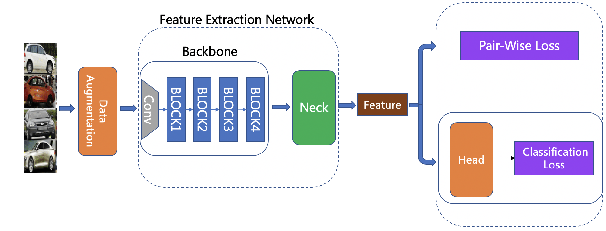

# Feature Extraction

## Catalogue

- [1.Introduction](#1)
- [2.Network Structure](#2)
- [3.General Recognition Models](#3)
- [4.Customized Feature Extraction](#4)
    - [4.1 Data Preparation](#4.1)
    - [4.2 Model Training](#4.2)
    - [4.3 Model Evaluation](#4.3)
    - [4.4 Model Inference](#4.4)

<a name="1"></a>
## 1.Introduction

Feature extraction plays a key role in image recognition, which serves to transform the input image into a fixed dimensional feature vector for subsequent [vector search](./vector_search_en.md). Good features boast great similarity preservation, i.e., in the feature space, pairs of images with high similarity should have higher feature similarity (closer together), and pairs of images with low similarity should have less feature similarity (further apart). [Deep Metric Learning](../algorithm_introduction/metric_learning_en.md) is applied to explore how to obtain features with high representational power through deep learning.

<a name="2"></a>
## 2.Network Structure

In order to customize the image recognition task flexibly, the whole network is divided into Backbone, Neck, Head, and Loss. The figure below illustrates the overall structure:



Functions of the above modules :

- **Backbone**: Specifies the backbone network to be used. It is worth noting that the ImageNet-based pre-training model provided by PaddleClas has an output of 1000 for the last layer, which demands for customization according to the required feature dimensions.
- **Neck**: Used for feature augmentation and feature dimension transformation. Here it can be a simple Linear Layer for feature dimension transformation, or a more complex FPN structure for feature augmentation.
- **Head**: Used to transform features into logits. In addition to the common Fc Layer, cosmargin, arcmargin, circlemargin and other modules are all available choices.
- **Loss**: Specifies the Loss function to be used. It is designed as a combined form to facilitate the combination of Classification Loss and Pair_wise Loss.

<a name="3"></a>
## 3.General Recognition Models

In PP-Shitu, we have [PP_LCNet_x2_5](../models/PP-LCNet.md) as the backbone network, Linear Layer for Neck, [ArcMargin](../../../ppcls/arch/gears/arcmargin.py) for Head, and CELoss for Loss. See the details in  [General Recognition_configuration files](../../../ppcls/configs/GeneralRecognition/). The involved training data covers the following seven public datasets:

| Datasets     | Data Size | Class Number | Scenarios          | URL                                                          |
| ------------ | --------- | ------------ | ------------------ | ------------------------------------------------------------ |
| Aliproduct   | 2498771   | 50030        | Commodities        | [URL](https://retailvisionworkshop.github.io/recognition_challenge_2020/) |
| GLDv2        | 1580470   | 81313        | Landmarks          | [URL](https://github.com/cvdfoundation/google-landmark)      |
| VeRI-Wild    | 277797    | 30671        | Vehicle            | [URL](https://github.com/PKU-IMRE/VERI-Wild)                 |
| LogoDet-3K   | 155427    | 3000         | Logo               | [URL](https://github.com/Wangjing1551/LogoDet-3K-Dataset)    |
| iCartoonFace | 389678    | 5013         | Cartoon Characters | [URL](http://challenge.ai.iqiyi.com/detail?raceId=5def69ace9fcf68aef76a75d) |
| SOP          | 59551     | 11318        | Commodities        | [URL](https://cvgl.stanford.edu/projects/lifted_struct/)     |
| Inshop       | 25882     | 3997         | Commodities        | [URL](http://mmlab.ie.cuhk.edu.hk/projects/DeepFashion.html) |
| **Total**    | **5M**    | **185K**     | ----               | ----                                                         |

The results are shown in the table below:

| Model         | Aliproduct | VeRI-Wild | LogoDet-3K | iCartoonFace | SOP   | Inshop | Latency(ms) |
| ------------- | ---------- | --------- | ---------- | ------------ | ----- | ------ | ----------- |
| PP-LCNet-2.5x | 0.839      | 0.888     | 0.861      | 0.841        | 0.793 | 0.892  | 5.0         |

- Evaluation metric: `Recall@1`
- CPU of the speed evaluation machine: `Intel(R) Xeon(R) Gold 6148 CPU @ 2.40GHz`.
- Evaluation conditions for the speed metric: MKLDNN enabled, number of threads set to 10
- Address of the pre-training model: [General recognition pre-training model](https://paddle-imagenet-models-name.bj.bcebos.com/dygraph/rec/models/pretrain/general_PPLCNet_x2_5_pretrained_v1.0.pdparams)

<a name="4"></a>
## 4.Customized Feature Extraction

Customized feature extraction refers to retraining the feature extraction model based on one's own task. It consists of four main steps: 1) data preparation, 2) model training, 3) model evaluation, and 4) model inference.

<a name="4.1"></a>
### 4.1 Data Preparation

To start with, customize your dataset based on the task (See [Format description](../data_preparation/recognition_dataset_en.md#1) for the dataset format). Before initiating the model training, modify the data-related content in the configuration files, including the address of the dataset and the class number. The corresponding locations in configuration files are shown below:

```
 Head:
    name: ArcMargin
    embedding_size: 512
    class_num: 185341    #Number of class
```

```
Train:
    dataset:
      name: ImageNetDataset
      image_root: ./dataset/     #The directory where the train dataset is located
      cls_label_path: ./dataset/train_reg_all_data.txt  #The address of label file for train dataset
```

```
 Query:
      dataset:
        name: VeriWild
        image_root: ./dataset/Aliproduct/.    #The directory where the query dataset is located
        cls_label_path: ./dataset/Aliproduct/val_list.txt.    #The address of label file for query dataset
```

```
 Gallery:
      dataset:
        name: VeriWild
        image_root: ./dataset/Aliproduct/    #The directory where the gallery dataset is located
        cls_label_path: ./dataset/Aliproduct/val_list.txt.   #The address of label file for gallery dataset
```

<a name="4.2"></a>
### 4.2 Model Training

- Single machine single card training

```
export CUDA_VISIBLE_DEVICES=0
python tools/train.py -c ppcls/configs/GeneralRecognition/GeneralRecognition_PPLCNet_x2_5.yaml
```

- Single machine multi card training

```
export CUDA_VISIBLE_DEVICES=0,1,2,3
python -m paddle.distributed.launch \
    --gpus="0,1,2,3" tools/train.py \
    -c ppcls/configs/GeneralRecognition/GeneralRecognition_PPLCNet_x2_5.yaml
```

**Note:** The configuration file adopts `online evaluation` by default, if you want to speed up the training and remove `online evaluation`, just add `-o eval_during_train=False` after the above command. After training, the final model files `latest`, `best_model` and the training log file `train.log` will be generated under the directory output. Among them, `best_model` is utilized to store the best model under the current evaluation metrics while`latest` is adopted to store the latest generated model, making it convenient to resume the training from where it was interrupted.

- Resumption of Training：

```
export CUDA_VISIBLE_DEVICES=0,1,2,3
python -m paddle.distributed.launch \
    --gpus="0,1,2,3" tools/train.py \
    -c ppcls/configs/GeneralRecognition/GeneralRecognition_PPLCNet_x2_5.yaml \
    -o Global.checkpoint="output/RecModel/latest"
```

<a name="4.3"></a>
### 4.3 Model Evaluation

- Single Card Evaluation

```
export CUDA_VISIBLE_DEVICES=0
python tools/eval.py \
-c ppcls/configs/GeneralRecognition/GeneralRecognition_PPLCNet_x2_5.yaml \
-o Global.pretrained_model="output/RecModel/best_model"
```

- Multi Card Evaluation

```
export CUDA_VISIBLE_DEVICES=0,1,2,3
python -m paddle.distributed.launch \
    --gpus="0,1,2,3" tools/eval.py \
    -c  ppcls/configs/GeneralRecognition/GeneralRecognition_PPLCNet_x2_5.yaml \
    -o  Global.pretrained_model="output/RecModel/best_model"
```

**Recommendation:** It is suggested to employ multi-card evaluation, which can quickly obtain the feature set of the overall dataset using multi-card parallel computing, accelerating the evaluation process.

<a name="4.4"></a>
### 4.4 Model Inference

Two steps are included in the inference: 1)exporting the inference model; 2)obtaining the feature vector.

#### 4.4.1 Export Inference Model

```
python tools/export_model.py \
-c ppcls/configs/GeneralRecognition/GeneralRecognition_PPLCNet_x2_5.yaml \
-o Global.pretrained_model="output/RecModel/best_model"
```

The generated inference models are under the directory `inference`, which comprises three files, namely, `inference.pdmodel`、`inference.pdiparams`、`inference.pdiparams.info`. Among them, `inference.pdmodel` serves to store the structure of inference model while  `inference.pdiparams` and `inference.pdiparams.info` are mobilized to store model-related parameters.

#### 4.4.2 Obtain Feature Vector

```
cd deploy
python python/predict_rec.py \
-c configs/inference_rec.yaml \
-o Global.rec_inference_model_dir="../inference"
```

The output format of the obtained features is shown in the figure below:

In practical use, however, business operations require more than simply obtaining features. To further perform image recognition by feature retrieval, please refer to the document [vector search](./vector_search_en.md).
