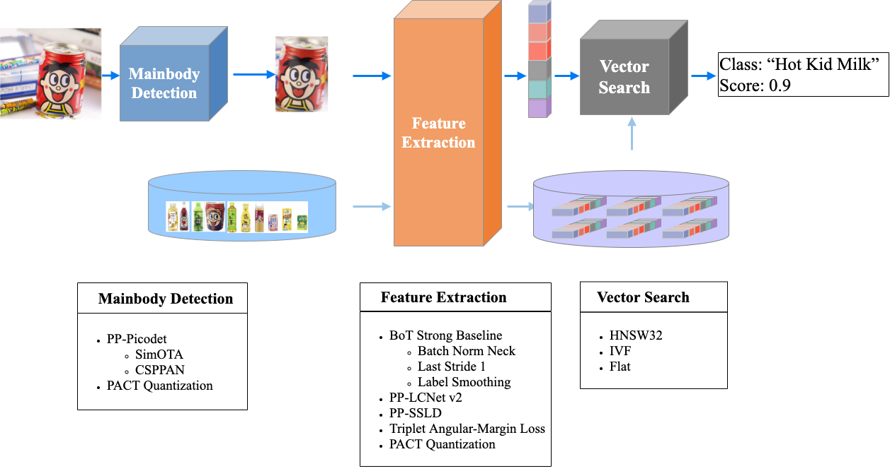

# Vector Search

Vector search finds wide applications in image recognition and image retrieval. It aims to obtain the similarity ranking for a given query vector by performing a similarity or distance calculation of feature vectors with all the vectors to be queried in an established vector library. In the image recognition system, [Faiss](https://github.com/facebookresearch/faiss) is adopted for corresponding support, please check [the official website of Faiss](https://github.com/facebookresearch/faiss) for more details. The main advantages of `Faiss` can be generalized as the following:

- Great adaptability: support Windows, Linux, and MacOS systems
- Easy installation: support `python` interface and direct installation with `pip`
- Rich algorithms: support a variety of search algorithms to cover different scenarios
- Support both CPU and GPU, which accelerates the search process

It is worth noting that the current version of `PaddleClas` **only uses CPU for vector retrieval** for the moment in pursuit of better adaptability.

[](https://github.com/PaddlePaddle/PaddleClas/blob/develop/docs/images/structure.jpg)

As shown in the figure above, two parts constitute the vector search in the whole `PP-ShiTu` system.

- The green part: the establishment of search libraries for the search query, while providing functions such as adding and deleting images.
- The blue part: the search function, i.e., given the feature vector of a picture and return the label of similar images in the library.

This document mainly introduces the installation of the search module in PaddleClas, the adopted search algorithms, the library building process, and the parameters in the relevant configuration files.

------

## Catalogue

- [1. Installation of the Search Library](#1)
- [2. Search Algorithms](#2)
- [3. Introduction of and Configuration Files](#3)
  - [3.1 Parameters of Library Building and Configuration Files](#3.1)
  - [3.2 Parameters of Search Configuration Files](#3.2)

<a name="1"></a>

## 1. Installation of the Search Library

`Faiss` can be installed as follows:

```
pip install faiss-cpu==1.7.1post2
```

If the above cannot be properly used, please `uninstall` and then  `install` again, especially when you are using`windows`.

<a name="2"></a>

## 2. Search Algorithms

Currently, the search module in `PaddleClas` supports the following three search algorithms:

- **HNSW32**: A graph indexing method boasts high retrieval accuracy and fast speed. However, the feature library only supports the function of adding images, not deleting image features. (Default method)
- **IVF**: An inverted index search method with fast speed but slightly lower precision. The feature library supports functions of adding and deleting image features.
- **FLAT**: A violent search algorithm presenting the highest precision, but slower retrieval speed in face of large data volume. The feature library supports functions of adding and deleting image features.

Each search algorithm can find its right place in different scenarios. `HNSW32`, as the default method, strikes a balance between accuracy and  speed, see its detailed introduction in the [official document](https://github.com/facebookresearch/faiss/wiki).

<a name="3"></a>

## 3. Introduction of Configuration Files

Configuration files involving the search module are under `deploy/configs/`, where `build_*.yaml` is related to building the feature library, and `inference_*.yaml` is the inference file for retrieval or classification.

<a name="3.1"></a>

### 3.1 Parameters of Library Building and Configuration Files

The building of the library is detailed as follows:

```
# Enter deploy directory
cd deploy
# Change the yaml file to the specific one you need
python python/build_gallery.py -c configs/build_***.yaml
```

The `yaml` file is configured as follows for library building, please make necessary corrections to fit the real operation. The construction will extract the features of the images under `image_root` according to the image list in `data_file` and store them under `index_dir` for subsequent search.

The `data_file` stores the path and label of the image file, with each line presenting the format `image_path label`. The intervals are spaced by the `delimiter` parameter in the `yaml` file.

The specific model parameters for feature extraction can be found in the `yaml` file.

```
# indexing engine config
IndexProcess:
  index_method: "HNSW32" # supported: HNSW32, IVF, Flat
  index_dir: "./recognition_demo_data_v1.1/gallery_product/index"
  image_root: "./recognition_demo_data_v1.1/gallery_product/"
  data_file:  "./recognition_demo_data_v1.1/gallery_product/data_file.txt"
  index_operation: "new" # suported: "append", "remove", "new"
  delimiter: "\t"
  dist_type: "IP"
  embedding_size: 512
```

- **index_method**: the search algorithm. It currently supports three, HNSW32, IVF, and Flat.
- **index_dir**: the folder where the built feature library is stored.
- **image_root**: the location of the folder where the annotated images needed to build the feature library are stored.
- **data_file**: the data list of the annotated images needed to build the feature library, the format of each line: relative_path label.
- **index_operation**: the operation to build a library: `new` for initiating an operation, `append` for adding the image feature of data_file to the feature library, `remove` for deleting the image of data_file from the feature library.
- **delimiter**: delimiter for each line in **data_file**
- **dist_type**: the method of similarity calculation adopted in feature matching. For example, Inner Product(`IP`) and Euclidean distance(`L2`).
- **embedding_size**: feature dimensionality

<a name="3.2"></a>

### 3.2 Parameters of Search Configuration Files

To integrate the search into the overall `PP-ShiTu` process, please refer to `The Introduction of PP-ShiTu Image Recognition System` in [README](../../../README_en.md). Please check the [Quick Start for Image Recognition](../quick_start/quick_start_recognition_en.md) for the specific operation of the search.

The search part is configured as follows. Please refer to `deploy/configs/inference_*.yaml` for the complete version.

```
IndexProcess:
  index_dir: "./recognition_demo_data_v1.1/gallery_logo/index/"
  return_k: 5
  score_thres: 0.5
```

The following are new parameters other than those of the library building configuration file:

- `return_k`:  `k` results are returned
- `score_thres`: the threshold for retrieval and match
