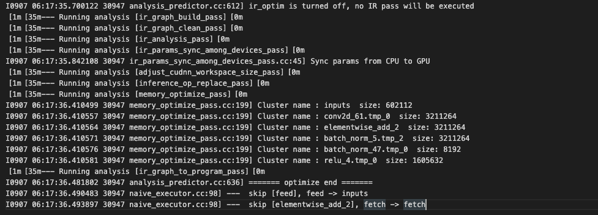
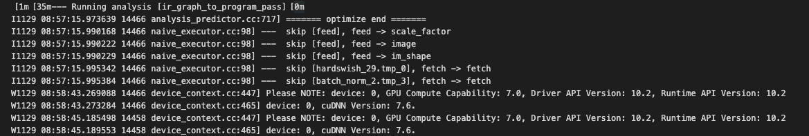
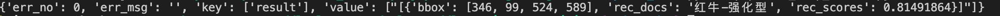

# Model Service Deployment

## Catalogue

- [1. Introduction](#1)
- [2. Installation of Serving](#2)
- [3. Service Deployment for Image Classification](#3)
  - [3.1 Model Transformation](#3.1)
  - [3.2 Service Deployment and Request](#3.2)
- [4. Service Deployment for Image Recognition](#4)
  - [4.1 Model Transformation](#4.1)
  - [4.2 Service Deployment and Request](#4.2)
- [5. FAQ](#5)

<a name="1"></a>
## 1. Introduction

[Paddle Serving](https://github.com/PaddlePaddle/Serving) is designed to provide easy deployment of on-line prediction services for deep learning developers, it supports one-click deployment of industrial-grade services, highly concurrent and efficient communication between client and server, and multiple programming languages for client development.

This section, exemplified by HTTP deployment of prediction service, describes how to deploy model services in PaddleClas with PaddleServing. Currently, only deployment on Linux platform is supported. Windows platform is not supported.

<a name="2"></a>
## 2. Installation of Serving

It is officially recommended to use docker for the installation and environment deployment of Serving. First, pull the docker and create a Serving-based one.

```
docker pull paddlepaddle/serving:0.7.0-cuda10.2-cudnn7-devel
nvidia-docker run -p 9292:9292 --name test -dit paddlepaddle/serving:0.7.0-cuda10.2-cudnn7-devel bash
nvidia-docker exec -it test bash
```

Once you are in docker,  install the Serving-related python packages.

```
pip3 install paddle-serving-client==0.7.0
pip3 install paddle-serving-server==0.7.0 # CPU
pip3 install paddle-serving-app==0.7.0
pip3 install paddle-serving-server-gpu==0.7.0.post102 #GPU with CUDA10.2 + TensorRT6
# For other GPU environemnt, confirm the environment before choosing which one to execute
pip3 install paddle-serving-server-gpu==0.7.0.post101 # GPU with CUDA10.1 + TensorRT6
pip3 install paddle-serving-server-gpu==0.7.0.post112 # GPU with CUDA11.2 + TensorRT8
```

- Speed up the installation process by replacing the source with `-i https://pypi.tuna.tsinghua.edu.cn/simple`.
- For other environment configuration and installation, please refer to [Install Paddle Serving using docker](https://github.com/PaddlePaddle/Serving/blob/v0.7.0/doc/Install_EN.md)
- To deploy CPU services, please install the CPU version of serving-server with the following command.

```
pip install paddle-serving-server
```

<a name="3"></a>
## 3. Service Deployment for Image Classification

<a name="3.1"></a>
### 3.1 Model Transformation

When adopting PaddleServing for service deployment, the saved inference model needs to be converted to a Serving model. The following part takes the classic ResNet50_vd model as an example to introduce the deployment of image classification service.

- Enter the working directory:

```
cd deploy/paddleserving
```

- Download the inference model of ResNet50_vd：

```
# Download and decompress the ResNet50_vd model
wget https://paddle-imagenet-models-name.bj.bcebos.com/dygraph/inference/ResNet50_vd_infer.tar && tar xf ResNet50_vd_infer.tar
```

- Convert the downloaded inference model into a format that is readily deployable by Server with the help of paddle_serving_client.

```
# Convert the ResNet50_vd model
python3 -m paddle_serving_client.convert --dirname ./ResNet50_vd_infer/ \
                                         --model_filename inference.pdmodel  \
                                         --params_filename inference.pdiparams \
                                         --serving_server ./ResNet50_vd_serving/ \
                                         --serving_client ./ResNet50_vd_client/
```

After the transformation, `ResNet50_vd_serving` and `ResNet50_vd_client` will be added to the current folder in the following format:

```
|- ResNet50_vd_server/
  |- __model__  
  |- __params__
  |- serving_server_conf.prototxt  
  |- serving_server_conf.stream.prototxt
|- ResNet50_vd_client
  |- serving_client_conf.prototxt  
  |- serving_client_conf.stream.prototxt
```

Having obtained the model file, modify the alias name in `serving_server_conf.prototxt` under directory `ResNet50_vd_server` by changing `alias_name` in `fetch_var` to `prediction`.

**Notes**: Serving supports input and output renaming to ensure its compatibility with the deployment of different models. In this case, modifying the alias_name of the configuration file is the only step needed to complete the inference and deployment of all kinds of models. The modified serving_server_conf.prototxt is shown below:

```
feed_var {
  name: "inputs"
  alias_name: "inputs"
  is_lod_tensor: false
  feed_type: 1
  shape: 3
  shape: 224
  shape: 224
}
fetch_var {
  name: "save_infer_model/scale_0.tmp_1"
  alias_name: "prediction"
  is_lod_tensor: true
  fetch_type: 1
  shape: -1
}
```

<a name="3.2"></a>
### 3.2 Service Deployment and Request

Paddleserving's directory contains the code to start the pipeline service and send prediction requests, including:

```
__init__.py
config.yml                 # Configuration file for starting the service
pipeline_http_client.py    # Script for sending pipeline prediction requests by http
pipeline_rpc_client.py     # Script for sending pipeline prediction requests by rpc
classification_web_service.py    # Script for starting the pipeline server
```

- Start the service：

```
# Start the service and the run log is saved in log.txt
python3 classification_web_service.py &>log.txt &
```

Once the service is successfully started, a log will be printed in log.txt similar to the following 

- Send request：

```
# Send service request
python3 pipeline_http_client.py
```

Once the service is successfully started, the prediction results will be printed in the cmd window, see the following example:


<a name="4"></a>
## 4. Service Deployment for Image Recognition

When using PaddleServing for service deployment, the saved inference model needs to be converted to a Serving model. The following part, exemplified by the ultra-lightweight model for image recognition in PP-ShiTu, details the deployment of image recognition service.


<a name="4.1"></a>
## 4.1 Model Transformation

- Download inference models for general detection and general recognition

```
cd deploy
# Download and decompress general recogntion models
wget -P models/ https://paddle-imagenet-models-name.bj.bcebos.com/dygraph/rec/models/inference/general_PPLCNet_x2_5_lite_v1.0_infer.tar
cd models
tar -xf general_PPLCNet_x2_5_lite_v1.0_infer.tar
# Download and decompress general detection models
wget https://paddle-imagenet-models-name.bj.bcebos.com/dygraph/rec/models/inference/picodet_PPLCNet_x2_5_mainbody_lite_v1.0_infer.tar
tar -xf picodet_PPLCNet_x2_5_mainbody_lite_v1.0_infer.tar
```

- Convert the inference model for recognition into a Serving model:

```
# Convert the recognition model
python3 -m paddle_serving_client.convert --dirname ./general_PPLCNet_x2_5_lite_v1.0_infer/ \
                                         --model_filename inference.pdmodel  \
                                         --params_filename inference.pdiparams \
                                         --serving_server ./general_PPLCNet_x2_5_lite_v1.0_serving/ \
                                         --serving_client ./general_PPLCNet_x2_5_lite_v1.0_client/
```

After the transformation,  `general_PPLCNet_x2_5_lite_v1.0_serving/` and `general_PPLCNet_x2_5_lite_v1.0_serving/` will be added to the current folder. Modify the alias name in serving_server_conf.prototxt under the directory `general_PPLCNet_x2_5_lite_v1.0_serving/` by changing `alias_name` to `features` in `fetch_var`. The modified serving_server_conf.prototxt is similar to the following:

```
feed_var {
  name: "x"
  alias_name: "x"
  is_lod_tensor: false
  feed_type: 1
  shape: 3
  shape: 224
  shape: 224
}
fetch_var {
  name: "save_infer_model/scale_0.tmp_1"
  alias_name: "features"
  is_lod_tensor: true
  fetch_type: 1
  shape: -1
}
```

- Convert the inference model for detection into a Serving model:

```
# Convert the general detection model
python3 -m paddle_serving_client.convert --dirname ./picodet_PPLCNet_x2_5_mainbody_lite_v1.0_infer/ \
                                         --model_filename inference.pdmodel  \
                                         --params_filename inference.pdiparams \
                                         --serving_server ./picodet_PPLCNet_x2_5_mainbody_lite_v1.0_serving/ \
                                         --serving_client ./picodet_PPLCNet_x2_5_mainbody_lite_v1.0_client/
```

After the transformation, `picodet_PPLCNet_x2_5_mainbody_lite_v1.0_serving/` and `picodet_PPLCNet_x2_5_ mainbody_lite_v1.0_client/` will be added to the current folder.

**Note:** The alias name in the serving_server_conf.prototxt under the directory`picodet_PPLCNet_x2_5_mainbody_lite_v1.0_serving/` requires no modification.

- Download and decompress the constructed search library index

```
cd ../
wget https://paddle-imagenet-models-name.bj.bcebos.com/dygraph/rec/data/drink_dataset_v1.0.tar && tar -xf drink_dataset_v1.0.tar
```

<a name="4.2"></a>
## 4.2 Service Deployment and Request

**Note:** Since the recognition service involves multiple models, PipeLine is adopted for better performance. This deployment method does not support the windows platform for now.

- Enter the working directory

```
cd ./deploy/paddleserving/recognition
```

Paddleserving's directory contains the code to start the pipeline service and send prediction requests, including:

```
__init__.py
config.yml                    # Configuration file for starting the service
pipeline_http_client.py       # Script for sending pipeline prediction requests by http
pipeline_rpc_client.py        # Script for sending pipeline prediction requests by rpc
recognition_web_service.py    # Script for starting the pipeline server
```

- Start the service：

```
# Start the service and the run log is saved in log.txt
python3 recognition_web_service.py &>log.txt &
```

Once the service is successfully started, a log will be printed in log.txt similar to the following  

- Send request：

```
python3 pipeline_http_client.py
```

Once the service is successfully started, the prediction results will be printed in the cmd window, see the following example: 


<a name="5"></a>
## 5.FAQ

**Q1**： After sending a request, no result is returned or the output is prompted with a decoding error.

**A1**： Please turn off the proxy before starting the service and sending requests, try the following command:

```
unset https_proxy
unset http_proxy
```

For more types of service deployment, such as `RPC prediction services`, you can refer to the [github official website](https://github.com/PaddlePaddle/Serving/tree/v0.7.0/examples) of Serving.
