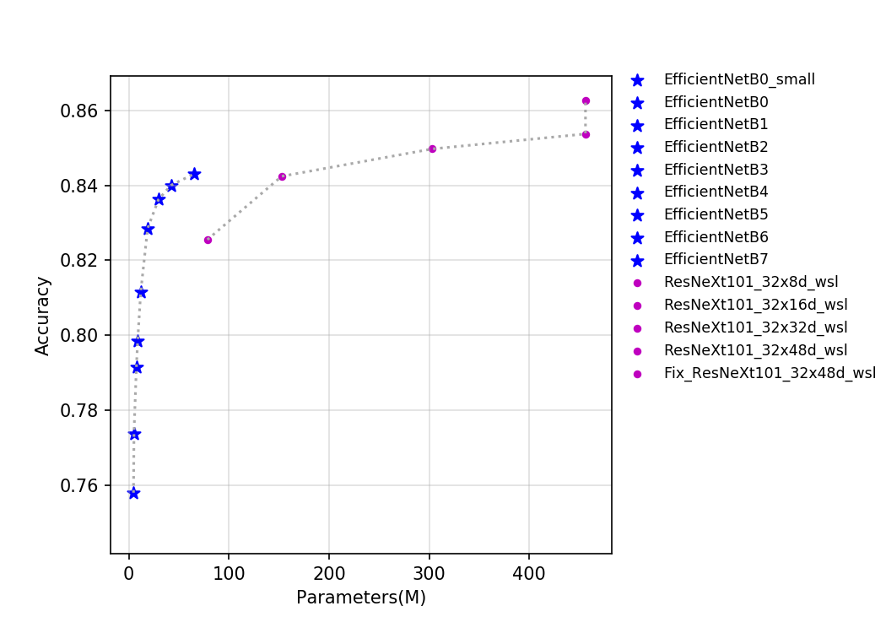
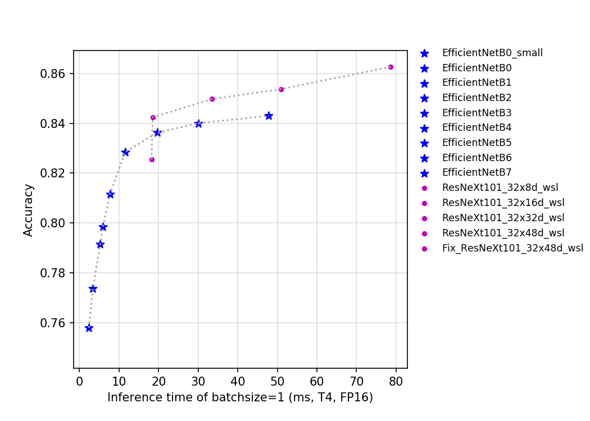

# EfficientNet and ResNeXt101_wsl series
---
## Catalogue

* [1. Overview](#1)
* [2. Accuracy, FLOPs and Parameters](#2)
* [3. Inference speed based on V100 GPU](#3)
* [4. Inference speed based on T4 GPU](#4)

## 1. Overview

EfficientNet is a lightweight NAS-based network released by Google in 2019. EfficientNetB7 refreshed the classification accuracy of ImageNet-1k at that time. In this paper, the author points out that the traditional methods to improve the performance of neural networks mainly start with the width of the network, the depth of the network, and the resolution of the input picture.
However, the author found that balancing these three dimensions is essential for improving accuracy and efficiency through experiments.
Therefore, the author summarized how to balance the three dimensions at the same time through a series of experiments.
At the same time, based on this scaling method, the author built a total of 7 networks B1-B7 in the EfficientNet series on the basis of EfficientNetB0, and with the same FLOPs and parameters, the accuracy reached state-of-the-art effect.

ResNeXt is an improved version of ResNet that proposed by Facebook in 2016. In 2019, Facebook researchers studied the accuracy limit of the series network on ImageNet through weakly-supervised-learning. In order to distinguish the previous ResNeXt network, the suffix of this series network is WSL, where WSL is the abbreviation of weakly-supervised-learning. In order to have stronger feature extraction capability, the researchers further enlarged the network width, among which the largest ResNeXt101_32x48d_wsl has 800 million parameters. It was trained under 940 million weak-labeled images, and the results were finetune trained on imagenet-1k. Finally, the acc-1 of imagenet-1k reaches 85.4%, which is also the network with the highest precision under the resolution of 224x224 on imagenet-1k so far. In Fix-ResNeXt, the author used a larger image resolution, made a special Fix strategy for the inconsistency of image data preprocessing in training and testing, and made ResNeXt101_32x48d_wsl have a higher accuracy. Since it used the Fix strategy, it was named Fix-ResNeXt101_32x48d_wsl.

The FLOPs, parameters, and inference time on the T4 GPU of this series of models are shown in the figure below.

At present, there are a total of 14 pretrained models of the two types of models that PaddleClas open source. It can be seen from the above figure that the advantages of the EfficientNet series network are very obvious. The ResNeXt101_wsl series model uses more data, and the final accuracy is also higher. EfficientNet_B0_small removes SE_block based on EfficientNet_B0, which has faster inference speed.

## 2. Accuracy, FLOPs and Parameters

| Models                        | Top1   | Top5   | Reference top1 | Reference top5 | FLOPs (G) | Parameters (M) |
|:--:|:--:|:--:|:--:|:--:|:--:|:--:|
| ResNeXt101_ 32x8d_wsl      | 0.826  | 0.967  | 0.822             | 0.964             | 29.140       | 78.440            |
| ResNeXt101_ 32x16d_wsl     | 0.842  | 0.973  | 0.842             | 0.972             | 57.550       | 152.660           |
| ResNeXt101_ 32x32d_wsl     | 0.850  | 0.976  | 0.851             | 0.975             | 115.170      | 303.110           |
| ResNeXt101_ 32x48d_wsl     | 0.854  | 0.977  | 0.854             | 0.976             | 173.580      | 456.200           |
| Fix_ResNeXt101_ 32x48d_wsl | 0.863  | 0.980  | 0.864             | 0.980             | 354.230      | 456.200           |
| EfficientNetB0                | 0.774  | 0.933  | 0.773             | 0.935             | 0.720        | 5.100             |
| EfficientNetB1                | 0.792  | 0.944  | 0.792             | 0.945             | 1.270        | 7.520             |
| EfficientNetB2                | 0.799  | 0.947  | 0.803             | 0.950             | 1.850        | 8.810             |
| EfficientNetB3                | 0.812  | 0.954  | 0.817             | 0.956             | 3.430        | 11.840            |
| EfficientNetB4                | 0.829  | 0.962  | 0.830             | 0.963             | 8.290        | 18.760            |
| EfficientNetB5                | 0.836  | 0.967  | 0.837             | 0.967             | 19.510       | 29.610            |
| EfficientNetB6                | 0.840  | 0.969  | 0.842             | 0.968             | 36.270       | 42.000            |
| EfficientNetB7                | 0.843  | 0.969  | 0.844             | 0.971             | 72.350       | 64.920            |
| EfficientNetB0_ small      | 0.758  | 0.926  |                   |                   | 0.720        | 4.650             |

## 3. Inference speed based on V100 GPU

| Models                               | Crop Size | Resize Short Size | FP32 Batch Size=1 (ms) |
|-------------------------------|-----------|-------------------|--------------------------|
| ResNeXt101_ 32x8d_wsl      | 224       | 256               | 19.127                   |
| ResNeXt101_ 32x16d_wsl     | 224       | 256               | 23.629                   |
| ResNeXt101_ 32x32d_wsl     | 224       | 256               | 40.214                   |
| ResNeXt101_ 32x48d_wsl     | 224       | 256               | 59.714                   |
| Fix_ResNeXt101_ 32x48d_wsl | 320       | 320               | 82.431                   |
| EfficientNetB0                | 224       | 256               | 2.449                    |
| EfficientNetB1                | 240       | 272               | 3.547                    |
| EfficientNetB2                | 260       | 292               | 3.908                    |
| EfficientNetB3                | 300       | 332               | 5.145                    |
| EfficientNetB4                | 380       | 412               | 7.609                    |
| EfficientNetB5                | 456       | 488               | 12.078                   |
| EfficientNetB6                | 528       | 560               | 18.381                   |
| EfficientNetB7                | 600       | 632               | 27.817                   |
| EfficientNetB0_ small      | 224       | 256               | 1.692                    |

## 4. Inference speed based on T4 GPU

| Models                    | Crop Size | Resize Short Size | FP16 Batch Size=1 (ms) | FP16 Batch Size=4 (ms) | FP16 Batch Size=8 (ms) | FP32 Batch Size=1 (ms) | FP32 Batch Size=4 (ms) | FP32 Batch Size=8 (ms) |
|---------------------------|-----------|-------------------|------------------------------|------------------------------|------------------------------|------------------------------|------------------------------|------------------------------|
| ResNeXt101_ 32x8d_wsl      | 224       | 256               | 18.19374                     | 21.93529                     | 34.67802                     | 18.52528                     | 34.25319                     | 67.2283                      |
| ResNeXt101_ 32x16d_wsl     | 224       | 256               | 18.52609                     | 36.8288                      | 62.79947                     | 25.60395                     | 71.88384                     | 137.62327                    |
| ResNeXt101_ 32x32d_wsl     | 224       | 256               | 33.51391                     | 70.09682                     | 125.81884                    | 54.87396                     | 160.04337                    | 316.17718                    |
| ResNeXt101_ 32x48d_wsl     | 224       | 256               | 50.97681                     | 137.60926                    | 190.82628                    | 99.01698256                  | 315.91261                    | 551.83695                    |
| Fix_ResNeXt101_ 32x48d_wsl | 320       | 320               | 78.62869                     | 191.76039                    | 317.15436                    | 160.0838242                  | 595.99296                    | 1151.47384                   |
| EfficientNetB0            | 224       | 256               | 3.40122                      | 5.95851                      | 9.10801                      | 3.442                        | 6.11476                      | 9.3304                       |
| EfficientNetB1            | 240       | 272               | 5.25172                      | 9.10233                      | 14.11319                     | 5.3322                       | 9.41795                      | 14.60388                     |
| EfficientNetB2            | 260       | 292               | 5.91052                      | 10.5898                      | 17.38106                     | 6.29351                      | 10.95702                     | 17.75308                     |
| EfficientNetB3            | 300       | 332               | 7.69582                      | 16.02548                     | 27.4447                      | 7.67749                      | 16.53288                     | 28.5939                      |
| EfficientNetB4            | 380       | 412               | 11.55585                     | 29.44261                     | 53.97363                     | 12.15894                     | 30.94567                     | 57.38511                     |
| EfficientNetB5            | 456       | 488               | 19.63083                     | 56.52299                     | -                            | 20.48571                     | 61.60252                     | -                            |
| EfficientNetB6            | 528       | 560               | 30.05911                     | -                            | -                            | 32.62402                     | -                            | -                            |
| EfficientNetB7            | 600       | 632               | 47.86087                     | -                            | -                            | 53.93823                     | -                            | -                            |
| EfficientNetB0_small      | 224       | 256               | 2.39166                      | 4.36748                      | 6.96002                      | 2.3076                       | 4.71886                      | 7.21888                      |
