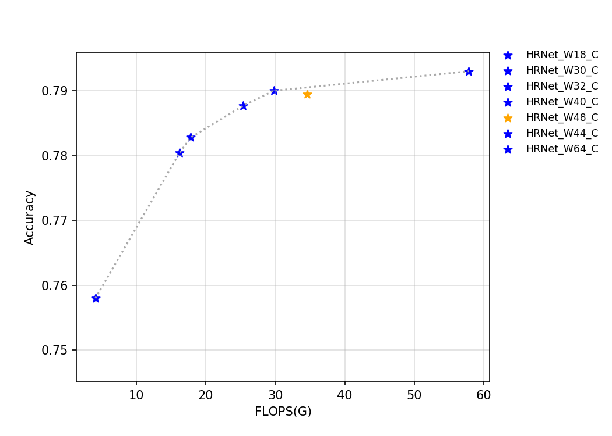
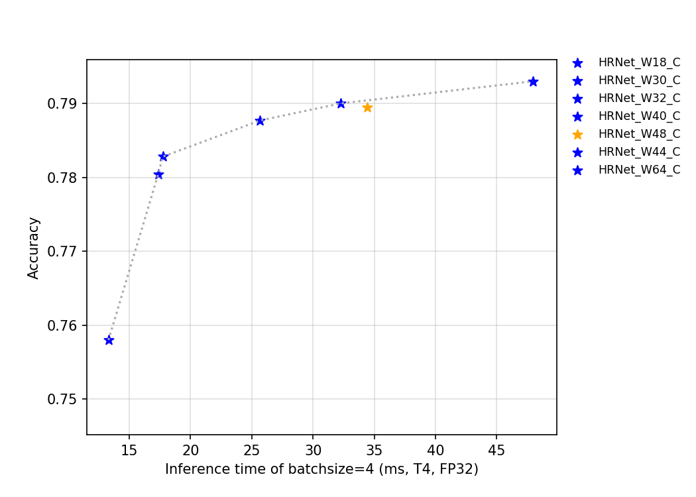
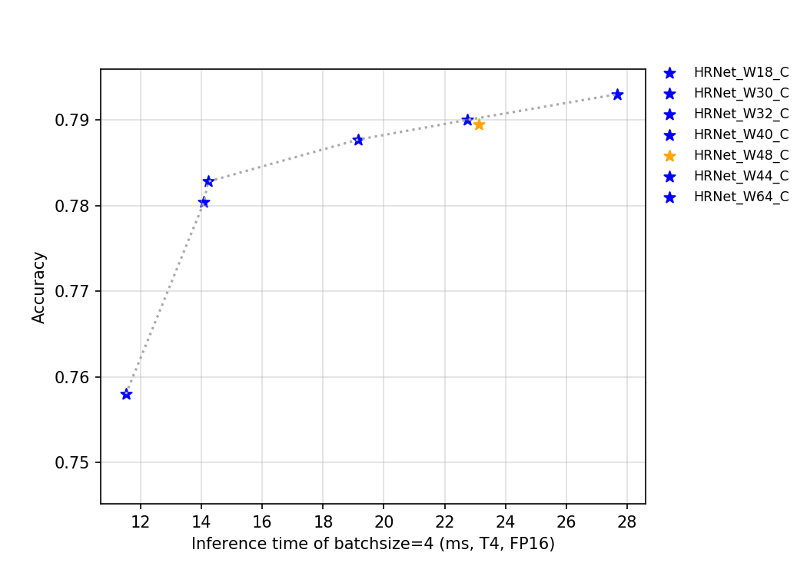

# HRNet series
---
## Catalogue

* [1. Overview](#1)
* [2. Accuracy, FLOPs and Parameters](#2)
* [3. Inference speed based on V100 GPU](#3)
* [4. Inference speed based on T4 GPU](#4)

## 1. Overview

HRNet is a brand new neural network proposed by Microsoft research Asia in 2019. Different from the previous convolutional neural network, this network can still maintain high resolution in the deep layer of the network, so the heat map of the key points predicted is more accurate, and it is also more accurate in space. In addition, the network performs particularly well in other visual tasks sensitive to resolution, such as detection and segmentation.

The FLOPs, parameters, and inference time on the T4 GPU of this series of models are shown in the figure below.

At present, there are 7 pretrained models of such models open-sourced by PaddleClas, and their indicators are shown in the figure. Among them, the reason why the accuracy of the HRNet_W48_C indicator is abnormal may be due to fluctuations in training.

## 2. Accuracy, FLOPs and Parameters

| Models      | Top1   | Top5   | Reference top1 | Reference top5 | FLOPs (G) | Parameters (M) |
|:--:|:--:|:--:|:--:|:--:|:--:|:--:|
| HRNet_W18_C | 0.769  | 0.934  | 0.768             | 0.934             | 4.140        | 21.290            |
| HRNet_W18_C_ssld | 0.816  | 0.958  | 0.768             | 0.934             | 4.140        | 21.290            |
| HRNet_W30_C | 0.780  | 0.940  | 0.782             | 0.942             | 16.230       | 37.710            |
| HRNet_W32_C | 0.783  | 0.942  | 0.785             | 0.942             | 17.860       | 41.230            |
| HRNet_W40_C | 0.788  | 0.945  | 0.789             | 0.945             | 25.410       | 57.550            |
| HRNet_W44_C | 0.790  | 0.945  | 0.789             | 0.944             | 29.790       | 67.060            |
| HRNet_W48_C | 0.790  | 0.944  | 0.793             | 0.945             | 34.580       | 77.470            |
| HRNet_W48_C_ssld | 0.836  | 0.968  | 0.793             | 0.945             | 34.580       | 77.470            |
| HRNet_W64_C | 0.793  | 0.946  | 0.795             | 0.946             | 57.830       | 128.060           |
| SE_HRNet_W64_C_ssld | 0.847  | 0.973  |                |                   | 57.830       | 128.970           |

## 3. Inference speed based on V100 GPU

| Models      | Crop Size | Resize Short Size | FP32 Batch Size=1 (ms) |
|-------------|-----------|-------------------|--------------------------|
| HRNet_W18_C | 224       | 256               | 7.368                    |
| HRNet_W18_C_ssld | 224       | 256               | 7.368                    |
| HRNet_W30_C | 224       | 256               | 9.402                    |
| HRNet_W32_C | 224       | 256               | 9.467                    |
| HRNet_W40_C | 224       | 256               | 10.739                   |
| HRNet_W44_C | 224       | 256               | 11.497                   |
| HRNet_W48_C | 224       | 256               | 12.165                   |
| HRNet_W48_C_ssld | 224       | 256               | 12.165                   |
| HRNet_W64_C | 224       | 256               | 15.003                   |

## 4. Inference speed based on T4 GPU

| Models      | Crop Size | Resize Short Size | FP16 Batch Size=1 (ms) | FP16 Batch Size=4 (ms) | FP16 Batch Size=8 (ms) | FP32 Batch Size=1 (ms) | FP32 Batch Size=4 (ms) | FP32 Batch Size=8 (ms) |
|-------------|-----------|-------------------|------------------------------|------------------------------|------------------------------|------------------------------|------------------------------|------------------------------|
| HRNet_W18_C | 224       | 256               | 6.79093                      | 11.50986                     | 17.67244                     | 7.40636                      | 13.29752                     | 23.33445                     |
| HRNet_W18_C_ssld | 224       | 256               | 6.79093                      | 11.50986                     | 17.67244                     | 7.40636                      | 13.29752                     | 23.33445                     |
| HRNet_W30_C | 224       | 256               | 8.98077                      | 14.08082                     | 21.23527                     | 9.57594                      | 17.35485                     | 32.6933                      |
| HRNet_W32_C | 224       | 256               | 8.82415                      | 14.21462                     | 21.19804                     | 9.49807                      | 17.72921                     | 32.96305                     |
| HRNet_W40_C | 224       | 256               | 11.4229                      | 19.1595                      | 30.47984                     | 12.12202                     | 25.68184                     | 48.90623                     |
| HRNet_W44_C | 224       | 256               | 12.25778                     | 22.75456                     | 32.61275                     | 13.19858                     | 32.25202                     | 59.09871                     |
| HRNet_W48_C | 224       | 256               | 12.65015                     | 23.12886                     | 33.37859                     | 13.70761                     | 34.43572                     | 63.01219                     |
| HRNet_W48_C_ssld | 224       | 256               | 12.65015                     | 23.12886                     | 33.37859                     | 13.70761                     | 34.43572                     | 63.01219                     |
| HRNet_W64_C | 224       | 256               | 15.10428                     | 27.68901                     | 40.4198                      | 17.57527                     | 47.9533                      | 97.11228                     |
| SE_HRNet_W64_C_ssld | 224       | 256               |           32.33651           |          69.31189            |           116.07245            |                   31.69770   |           94.99546            |             174.45766        |

