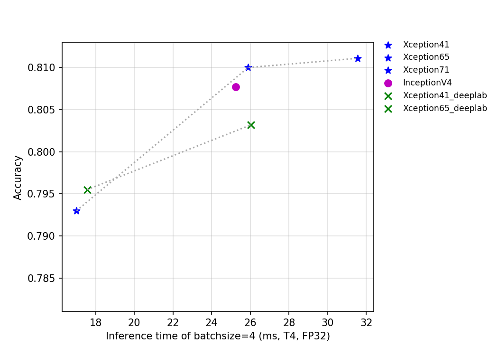
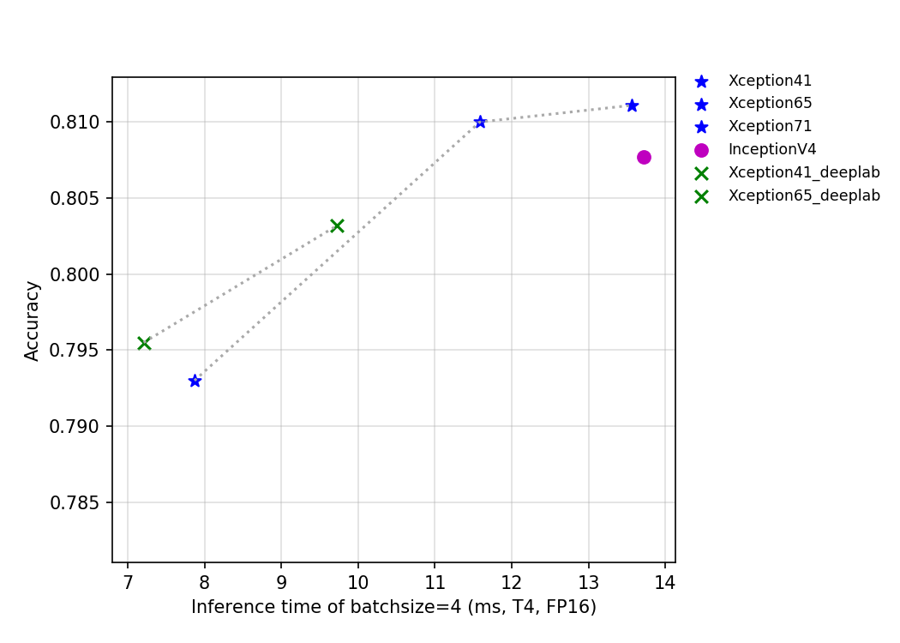

# Inception series
---
## Catalogue

* [1. Overview](#1)
* [2. Accuracy, FLOPs and Parameters](#2)
* [3. Inference speed based on V100 GPU](#3)
* [4. Inference speed based on T4 GPU](#4)

## 1. Overview

GoogLeNet is a new neural network structure designed by Google in 2014, which, together with VGG network, became the twin champions of the ImageNet challenge that year. GoogLeNet introduces the Inception structure for the first time, and stacks the Inception structure in the network so that the number of network layers reaches 22, which is also the mark of the convolutional network exceeding 20 layers for the first time. Since 1x1 convolution is used in the Inception structure to reduce the dimension of channel number, and Global pooling is used to replace the traditional method of processing features in multiple fc layers, the final GoogLeNet network has much less FLOPs and parameters than VGG network, which has become a beautiful scenery of neural network design at that time.

InceptionV3 is an improvement of InceptionV2 by Google. First of all, the author optimized the Inception module in InceptionV3. At the same time, more types of Inception modules were designed and used. Further, the larger square two-dimensional convolution kernel in some Inception modules in InceptionV3 was disassembled into two smaller asymmetric convolution kernels, which can greatly save the amount of parameters.

Xception is another improvement to InceptionV3 that Google proposed after Inception. In Xception, the author used the depthwise separable convolution to replace the traditional convolution operation, which greatly saved the network FLOPs and the number of parameters, but improved the accuracy. In DeeplabV3+, the author further improved the Xception and increased the number of Xception layers, and designed the network of Xception65 and Xception71.

InceptionV4 is a new neural network designed by Google in 2016, when residual structure were all the rage, but the authors believe that high performance can be achieved using only Inception structure. InceptionV4 uses more Inception structure to achieve even greater precision on Imagenet-1k.

The FLOPs, parameters, and inference time on the T4 GPU of this series of models are shown in the figure below.

The figure above reflects the relationship between the accuracy of Xception series and InceptionV4 and other indicators. Among them, Xception_deeplab is consistent with the structure of the paper, and Xception is an improved model developed by PaddleClas, which improves the accuracy by about 0.6% when the inference speed is basically unchanged. Details of the improved model are being updated, so stay tuned.

## 2. Accuracy, FLOPs and Parameters

| Models             | Top1   | Top5   | Reference top1 | Reference top5 | FLOPs (G) | Parameters (M) |
|:--:|:--:|:--:|:--:|:--:|:--:|:--:|
| GoogLeNet          | 0.707  | 0.897  | 0.698             |                   | 2.880        | 8.460             |
| Xception41         | 0.793  | 0.945  | 0.790             | 0.945             | 16.740       | 22.690            |
| Xception41 _deeplab | 0.796  | 0.944  |                   |                   | 18.160       | 26.730            |
| Xception65         | 0.810  | 0.955  |                   |                   | 25.950       | 35.480            |
| Xception65 _deeplab | 0.803  | 0.945  |                   |                   | 27.370       | 39.520            |
| Xception71         | 0.811  | 0.955  |                   |                   | 31.770       | 37.280            |
| InceptionV3        | 0.791  | 0.946  | 0.788             | 0.944             | 11.460       | 23.830            |
| InceptionV4        | 0.808  | 0.953  | 0.800             | 0.950             | 24.570       | 42.680            |

## 3. Inference speed based on V100 GPU

| Models                 | Crop Size | Resize Short Size | FP32 Batch Size=1 (ms) |
|------------------------|-----------|-------------------|--------------------------|
| GoogLeNet              | 224       | 256               | 1.807                    |
| Xception41             | 299       | 320               | 3.972                    |
| Xception41_ deeplab | 299       | 320               | 4.408                    |
| Xception65             | 299       | 320               | 6.174                    |
| Xception65_ deeplab | 299       | 320               | 6.464                    |
| Xception71             | 299       | 320               | 6.782                    |
| InceptionV4            | 299       | 320               | 11.141                   |

## 4. Inference speed based on T4 GPU

| Models             | Crop Size | Resize Short Size | FP16 Batch Size=1 (ms) | FP16 Batch Size=4 (ms) | FP16 Batch Size=8 (ms) | FP32 Batch Size=1 (ms) | FP32 Batch Size=4 (ms) | FP32 Batch Size=8 (ms) |
|--------------------|-----------|-------------------|------------------------------|------------------------------|------------------------------|------------------------------|------------------------------|------------------------------|
| GoogLeNet          | 299       | 320               | 1.75451                      | 3.39931                      | 4.71909                      | 1.88038                      | 4.48882                      | 6.94035                      |
| Xception41         | 299       | 320               | 2.91192                      | 7.86878                      | 15.53685                     | 4.96939                      | 17.01361                     | 32.67831                     |
| Xception41_ deeplab | 299       | 320               | 2.85934                      | 7.2075                       | 14.01406                     | 5.33541                      | 17.55938                     | 33.76232                     |
| Xception65         | 299       | 320               | 4.30126                      | 11.58371                     | 23.22213                     | 7.26158                      | 25.88778                     | 53.45426                     |
| Xception65_ deeplab | 299       | 320               | 4.06803                      | 9.72694                      | 19.477                       | 7.60208                      | 26.03699                     | 54.74724                     |
| Xception71         | 299       | 320               | 4.80889                      | 13.5624                      | 27.18822                     | 8.72457                      | 31.55549                     | 69.31018                     |
| InceptionV3        | 299       | 320               | 3.67502                      | 6.36071                     | 9.82645                     | 6.64054                     | 13.53630                     | 22.17355                     |
| InceptionV4        | 299       | 320               | 9.50821                      | 13.72104                     | 20.27447                     | 12.99342                     | 25.23416                     | 43.56121                     |
