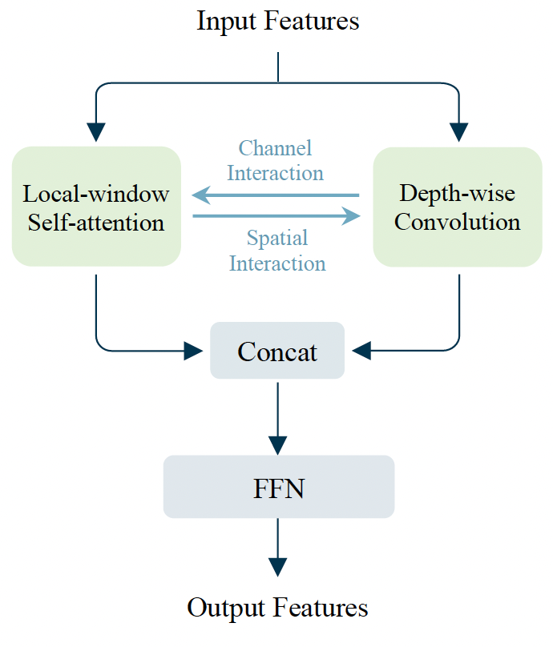

# MixFormer
---
## Catalogue

- [1. Introduction](#1)
- [2. Main Results](#2)
    - [2.1 Results on ImageNet-1K](#2.1)
    - [2.2 Results on MS COCO with Mask R-CNN](#2.2)
    - [2.3 Results on ADE20K with UperNet](#2.3)
    - [2.4 Results on MS COCO for Keypoint Detection](#2.4)
    - [2.4 Results on LVIS 1.0 with Mask R-CNN](#2.5)
- [3. Reference](#3)

<a name='1'></a>
## 1. Introduction

MixFormer is an efficient and general-purpose hybrid vision transformer. There are two main designs in MixFormer: (1) combining local-window self-attention and depth-wise convolution in a parallel design, (2) proposing bi-directional interactions across branches to provide complementary clues in channel and spatial dimensions. These two designs are integrated to achieve efficient feature mixing among windows and dimensions. MixFormer provides superior performance than other vision transformer variants on image classification and 5 dense prediction tasks.

> [**MixFormer: Mixing Features across Windows and Dimensions**](https://arxiv.org/abs/2204.02557)<br> 
> Qiang Chen, Qiman Wu, Jian Wang, Qinghao Hu, Tao Hu, Errui Ding, Jian Cheng, Jingdong Wang<br>
> CVPR2022, **Oral** presentation



<a name='2'></a>
## 2. Main Results

<a name='2.1'></a>
### Results on ImageNet-1K
We provide the accuracy with FLOPs of MixFormer on ImageNet-1K. Unlike other vision transformer variants, they only show promising results when the FLOPs are pretty large (e.g., 4.5G). MixFormer can achieve favorable results **with small model sizes (FLOPs < 1G)**, which are nontrivial results.

| Models | Top1 | Top5 | Reference top1| FLOPs (G) |
|:--:|:--:|:--:|:--:|:--:|
| MixFormer-B0 | - | - | 0.765 |  0.4  |
| MixFormer-B1 | - | - | 0.789 |  0.7  |
| MixFormer-B2 | - | - | 0.800 |  0.9  |
| MixFormer-B3 | - | - | 0.817 |  1.9  |
| MixFormer-B4 | - | - | 0.830 |  3.6  |
| MixFormer-B5 | - | - | 0.835 |  6.8  |
| MixFormer-B6 | - | - | 0.838 |  12.7  |

The models are coming soon.

<a name='2.2'></a>
### Results on MS COCO with Mask R-CNN
All results are trained with a multi-scale 3x schedule.

| Backbone | Params (M) | FLOPs (G) | schedule | mAP_box| mAP_mask |
|:--:|:--:|:--:|:--:|:--:| :--:|
| Swin-T | 48 | 264 | 3x | 46.0| 41.6 |
| MixFormer-B1 | 26 | 183 | 3x | 43.9 | 40.0 |
| MixFormer-B2 | 28 | 187 | 3x | 45.1 | 40.8 |
| MixFormer-B3 | 35 | 207 | 3x | 46.2 | 41.9 |
| MixFormer-B4 | 53 | 243 | 3x | **47.6** | **43.0** |

<a name='2.3'></a>
### Results on ADE20K with UperNet

| Backbone | Params (M) | FLOPs (G) | iterations | mIoU_ss | mIoU_ms |
|:--:|:--:|:--:|:--:|:--:| :--:|
| Swin-T | 60 | 945 | 160k | 44.5| 45.8 |
| MixFormer-B1 | 35 | 854 | 160k | 42.0 | 43.5 |
| MixFormer-B2 | 37 | 859 | 160k | 43.1 | 43.9 |
| MixFormer-B3 | 44 | 880 | 160k | 44.5 | 45.5 |
| MixFormer-B4 | 63 | 918 | 160k | **46.8** | **48.0** |

<a name='2.4'></a>
### Results on MS COCO for Keypoint Detection

| Backbone | mAP | mAP_50 | mAP_75 |
|:--:|:--:|:--:|:--:|
| ResNet50 | 71.8 | 89.8 | 79.5 |
| Swin-T | 74.2 | 92.5 | 82.5 |
| HRFormer-S | 74.5 | 92.3 | 82.1 |
| MixFormer-B4 | **75.3** | **93.5** | **83.5** |

<a name='2.5'></a>
### Results on LVIS 1.0 with Mask R-CNN

| Backbone | mAP_mask | mAP_mask_50 | mAP_mask_75 |
|:--:|:--:|:--:|:--:|
| ResNet50 | 21.7 | 34.3 | 23.0 |
| Swin-T | 27.6 | 43.0 | 29.3 |
| MixFormer-B4 | **28.6** | **43.4** | **30.5** |

<a name="3"></a>
## 3. Reference

If you find MixFormer helpful, please consider citing:
```
@inproceedings{chen2022mixformer,
  title={MixFormer: Mixing Features across Windows and Dimensions},
  author={Chen, Qiang and Wu, Qiman and Wang, Jian and Hu, Qinghao and Hu, Tao and Ding, Errui and Cheng, Jian and Wang, Jingdong},
  booktitle={IEEE Conference on Computer Vision and Pattern Recognition},
  year={2022}
}
```
