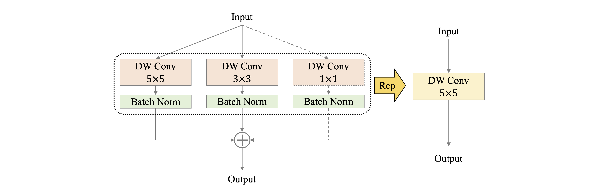

# PP-LCNetV2 Series
---

## Catalogue

- [1. Introduction ](#2)
- [2. Methods](#3)
    - [2.1 Re-parameterization](#2.1)
    - [2.2 PW Conv](#2.2)
    - [2.3 Shortcut](#2.3)
    - [2.4 Activation Function](#2.4)
    - [2.5 SE](#2.5)
- [3. Experiments](#3)

### 1. Instroduction

At present, although the lightweight models are so plentiful, there are few models specially optimized for Intel CPU platform. We have proposed [PPLCNetV1](PP-LCNet_en.md) , which pursues faster inference speed, so its performance is limited and the performance is insufficient when dealing with complex tasks. Therefore, we now propose PPLCNetV2 to fill the gap in the lack of a higher performance model on CPU platform. For the consideration of compatibility, OpenVINO is currently a widely used deployment framework in Intel CPU platform. Therefore, we focus on optimizing the model for the deployment scheme of Intel CPU with OpenVINO.

## 2. Methods

The overview of PPLCNetV2 is shown in the figure above. PPLCNetV2 is obtained on PPLCNet. The details of optimization tracks is shown in this section.

### 2.1 Re-parameterization

There are lots of depthwise convolution in PPLCNetV2, so we optimize some of the depthwise convolution by the re-parameterization. The size of the convolution kernel affects the size of the model's receptive field, which affects the model's ability to capture more global or local features. In order to help the model build different scales features, we use 5\*5, 3\*3 and 1\*1 size convolution kernel. The details is shown in the figure below.

### 2.2 PW Conv

We know that the network is more deeper, the model is more stronger. So we replaced some point convolution layer with two layers that squeeze and expand the channel dimensions of the feature, respectively. The details is shown in the figure below. Finally, we use this optimization method in the second last-to-last block.

### 2.3 Shortcut

It is believed that the Shortcut can alleviate the vanishing gradient problem, so it is more important for the improvement of deep networks. However, Shortcut is generally used with caution in the lightweight models because it results in an elementwise addition operation and possibly memory access. We experimented on the influence of shortcut on the model at different stage. Finally, we only used Shortcut in the last block, as shown in the figure below.

### 2.4 Activation Function

 In recent years, many activation functions have been proposed, such as ReLU, Swish, Hard-Swish, Mish, but they usually pay more attention to the improvement of model performance without considering the impact on model efficiency. In particular, some activation functions contain complex operations, or are difficult to the optimization of the inference platform. So some act functions can have a serious efficiency impact in model. We experimented with different activation functions to evaluate their efficiency. We found that although the ReLU activation function is slightly lower than H-Swish in model performance, the gap is very small in larger models of this magnitude, but ReLU has a huge advantage in speed because which is so brief that very easy to optimize. There is no doubt that we chose the ReLU activation function after considering it all.

### 2.5 SE

SE Module has been concerned since it was proposed and has almost become a necessary option for model designs. It can significantly improve model performance by helping the model to improve the channel attention ability. However, in the lightweight models, SE Module will not only improve the performance of the model, but also increase the inference latency. In PPLCNetV2, we used SE more sparingly, only on the penultimate blocks.

## 3. Experiments

The accuracy on ImageNet1k, latency of inference and download links of pretrained models are provided as follows.

| Model | Params(M) | FLOPs(M) | Top-1 Acc(\%) | Top-5 Acc(\%) | Latency(ms) | download links of pretrained model | download links of inference model |
|:--:|:--:|:--:|:--:|:--:|:--:|:--:|:--:|
| <b>PPLCNetV2_base<b>  | <b>6.6<b> | <b>604<b>  | <b>77.04<b> | <b>93.27<b> | <b>4.32<b> | [link](https://paddle-imagenet-models-name.bj.bcebos.com/dygraph/legendary_models/PPLCNetV2_base_pretrained.pdparams) | [link](https://paddle-imagenet-models-name.bj.bcebos.com/dygraph/inference/PPLCNetV2_base_infer.tar) |
| <b>PPLCNetV2_base_ssld<b>  | <b>6.6<b> | <b>604<b>  | <b>80.07<b> | <b>94.87<b> | <b>4.32<b> | [link](https://paddle-imagenet-models-name.bj.bcebos.com/dygraph/legendary_models/PPLCNetV2_base_ssld_pretrained.pdparams) | [link](https://paddle-imagenet-models-name.bj.bcebos.com/dygraph/inference/PPLCNetV2_base_ssld_infer.tar) |

**Note:**

* 1. where `_ssld` represents the model after using `SSLD distillation`. For details about `SSLD distillation`, see [SSLD distillation](../advanced_tutorials/distillation/distillation_en.md);
* 2. The latency is tested with officially OpenVINO benchmark tool on Intel(R) Xeon(R) Gold 6271C CPU @ 2.60GHz.
