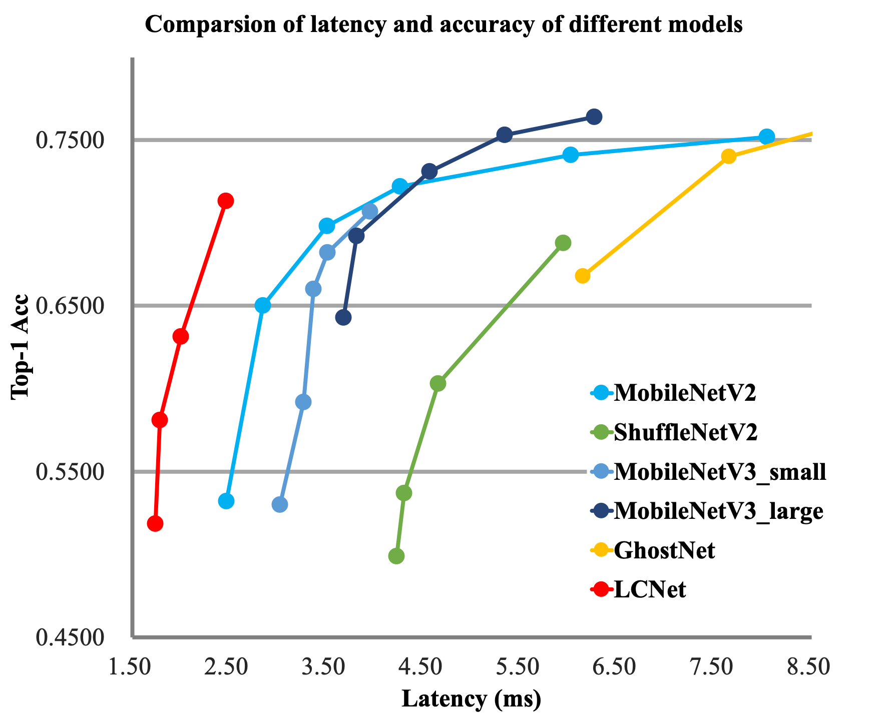

# PP-LCNet Series
---


## Catalogue

- [1. Abstract](#1)
- [2. Introduction](#2)
- [3. Method](#3)
   - [3.1 Better Activation Function](#3.1)
   - [3.2 SE Modules at Appropriate Positions](#3.2)
   - [3.3 Larger Convolution Kernels](#3.3)
   - [3.4 Larger Dimensional 1 × 1 Conv Layer after GAP](#3.4)
- [4. Experiments](#4)
   - [4.1 Image Classification](#4.1)
   - [4.2 Object Detection](#4.2)
   - [4.3 Semantic Segmentation](#4.3)
- [5. Inference speed based on V100 GPU](#5)
- [6. Inference speed based on SD855](#6)
- [7. Conclusion](#7)
- [8. Reference](#8)

<a name="1"></a>
## 1. Abstract

In the field of computer vision, the quality of backbone network determines the outcome of the whole vision task. In previous studies, researchers generally focus on the optimization of FLOPs or Params, but inference speed actually serves as an importance indicator of model quality in real-world scenarios. Nevertheless, it is difficult to balance inference speed and accuracy. In view of various CPU-based applications in industry, we are now working to raise the adaptability of the backbone network to Intel CPU, so as to obtain a faster and more accurate lightweight backbone network. At the same time, the performance of downstream vision tasks such as object detection and semantic segmentation are also improved.

<a name="2"></a>
## 2. Introduction

Recent years witnessed the emergence of many lightweight backbone networks. In past two years, in particular, there were abundant networks searched by NAS that either enjoy advantages on FLOPs or Params, or have an edge in terms of inference speed on ARM devices. However, few of them dedicated to specified optimization of Intel CPU, resulting their imperfect inference speed on the intel CPU side. Based on this, we specially design the backbone network PP-LCNet for Intel CPU devices with its acceleration library MKLDNN. Compared with other lightweight SOTA models, this backbone network can further improve the performance of the model without increasing the inference time, significantly outperforming the existing SOTA models. A comparison chart with other models is shown below.


<a name="3"></a>
## 3. Method

The overall structure of the network is shown in the figure below.


Build on extensive experiments, we found that many seemingly less time-consuming operations will increase the latency  on Intel CPU-based devices, especially when the MKLDNN acceleration library is enabled. Therefore, we finally chose a block with the leanest possible structure and the fastest possible speed to form our BaseNet (similar to MobileNetV1). Based on BaseNet, we summarized four strategies that can improve the accuracy of the model without increasing the latency, and we combined these four strategies to form PP-LCNet. Each of these four strategies is introduced as below:

<a name="3.1"></a>
### 3.1 Better Activation Function

Since the adoption of ReLU activation function by convolutional neural network, the network performance has been improved substantially, and variants of the ReLU activation function have appeared in recent years, such as Leaky-ReLU, P-ReLU, ELU, etc. In 2017, Google Brain searched to obtain the swish activation function, which performs well on lightweight networks. In 2019, the authors of MobileNetV3 further optimized this activation function to H-Swish, which removes the exponential operation, leading to faster speed and an almost unaffected network accuracy. After many experiments, we also recognized its excellent performance on lightweight networks. Therefore, this activation function is adopted in PP-LCNet.

<a name="3.2"></a>
### 3.2 SE Modules at Appropriate Positions

The SE module is a channel attention mechanism proposed by SENet, which can effectively improve the accuracy of the model. However, on the Intel CPU side, the module also presents a large latency, leaving us the task of balancing accuracy and speed. The search of the location of the SE module in NAS search-based networks such as MobileNetV3 brings no general conclusions, but we found through our experiments that the closer the SE module is to the tail of the network the greater the improvement in model accuracy. The following table also shows some of our experimental results：

| SE Location       | Top-1 Acc(\%) | Latency(ms) |
|-------------------|---------------|-------------|
| 1100000000000     | 61.73           | 2.06         |
| 0000001100000     | 62.17           | 2.03         |
| <b>0000000000011<b>     | <b>63.14<b>           | <b>2.05<b>         |
| 1111111111111     | 64.27           | 3.80         |

The option in the third row of the table was chosen for the location of the SE module in PP-LCNet.

<a name="3.3"></a>
### 3.3 Larger Convolution Kernels

In the paper of MixNet, the author analyzes the effect of convolutional kernel size on model performance and concludes that larger convolutional kernels within a certain range can improve the performance of the model, but beyond this range will be detrimental to the model’s performance. So the author forms MixConv with split-concat paradigm combined, which can improve the performance of the model but is not conducive to inference. We experimentally summarize the role of some larger convolutional kernels at different positions that are similar to those of the SE module, and find that larger convolutional kernels display more prominent roles in the middle and tail of the network. The following table shows the effect of the position of the 5x5 convolutional kernels on the accuracy：

| Larger Convolution Location       | Top-1 Acc(\%) | Latency(ms) |
|----------------------------|---------------|-------------|
| 1111111111111     | 63.22           | 2.08         |
| 1111111000000     | 62.70           | 2.07        |
| <b>0000001111111<b>     | <b>63.14<b>           | <b>2.05<b>         |


Experiments show that a larger convolutional kernel placed at the middle and tail of the network can achieve the same accuracy as placed at all positions, coupled with faster inference. The option in the third row of the table was the final choice of PP-LCNet.

<a name="3.4"></a>
### 3.4 Larger Dimensional 1 × 1 Conv Layer after GAP

Since the introduction of GoogLeNet, GAP (Global-Average-Pooling) is often directly followed by a classification layer, which fails to result in further integration and processing of features extracted after GAP in the lightweight network. If a larger 1x1 convolutional layer (equivalent to the FC layer) is used after GAP, the extracted features, instead of directly passing through the classification layer, will first be integrated, and then classified. This can greatly improve the accuracy rate without affecting the inference speed of the model. The above four improvements were made to BaseNet to obtain PP-LCNet. The following table further illustrates the impact of each scheme on the results：

| Activation | SE-block | Large-kernal | last-1x1-conv | Top-1 Acc(\%) | Latency(ms) |
|------------|----------|--------------|---------------|---------------|-------------|
| 0       | 1       | 1               | 1                | 61.93 | 1.94 |
| 1       | 0       | 1               | 1                | 62.51 | 1.87 |
| 1       | 1       | 0               | 1                | 62.44 | 2.01 |
| 1       | 1       | 1               | 0                | 59.91 | 1.85 |
| <b>1<b>       | <b>1<b>       | <b>1<b>               | <b>1<b>                | <b>63.14<b> | <b>2.05<b> |

<a name="4"></a>
## 4. Experiments

<a name="4.1"></a>
### 4.1 Image Classification

For image classification, ImageNet dataset is adopted. Compared with the current mainstream lightweight network, PP-LCNet can obtain faster inference speed with the same accuracy. When using Baidu’s self-developed SSLD distillation strategy, the accuracy is further improved, with the Top-1 Acc of ImageNet exceeding 80% at an inference speed of about 5ms on the Intel CPU side.

| Model | Params(M) | FLOPs(M) | Top-1 Acc(\%) | Top-5 Acc(\%) | Latency(ms) |
|-------|-----------|----------|---------------|---------------|-------------|
| PPLCNet_x0_25  | 1.5 | 18  | 51.86 | 75.65 | 1.74 |
| PPLCNet_x0_35  | 1.6 | 29  | 58.09 | 80.83 | 1.92 |
| PPLCNet_x0_5   | 1.9 | 47  | 63.14 | 84.66 | 2.05 |
| PPLCNet_x0_75  | 2.4 | 99  | 68.18 | 88.30 | 2.29 |
| PPLCNet_x1_0     | 3.0 | 161 | 71.32 | 90.03 | 2.46 |
| PPLCNet_x1_5   | 4.5 | 342 | 73.71 | 91.53 | 3.19 |
| PPLCNet_x2_0     | 6.5 | 590 | 75.18 | 92.27 | 4.27 |
| PPLCNet_x2_5   | 9.0 | 906 | 76.60 | 93.00 | 5.39 |
| PPLCNet_x0_5_ssld | 1.9 | 47  | 66.10 | 86.46 | 2.05 |
| PPLCNet_x1_0_ssld | 3.0 | 161 | 74.39 | 92.09 | 2.46 |
| PPLCNet_x2_5_ssld | 9.0 | 906 | 80.82 | 95.33 | 5.39 |

where `_ssld` represents the model after using `SSLD distillation`. For details about `SSLD distillation`, see [SSLD distillation](../advanced_tutorials/distillation/distillation_en.md).

Performance comparison with other lightweight networks:

| Model | Params(M) | FLOPs(M) | Top-1 Acc(\%) | Top-5 Acc(\%) | Latency(ms) |
|-------|-----------|----------|---------------|---------------|-------------|
| MobileNetV2_x0_25  | 1.5 | 34  | 53.21 | 76.52 | 2.47 |
| MobileNetV3_small_x0_35  | 1.7 | 15  | 53.03 | 76.37 | 3.02 |
| ShuffleNetV2_x0_33  | 0.6 | 24  | 53.73 | 77.05 | 4.30 |
| <b>PPLCNet_x0_25<b>  | <b>1.5<b> | <b>18<b>  | <b>51.86<b> | <b>75.65<b> | <b>1.74<b> |
| MobileNetV2_x0_5  | 2.0 | 99  | 65.03 | 85.72 | 2.85 |
| MobileNetV3_large_x0_35  | 2.1 | 41  | 64.32 | 85.46 | 3.68 |
| ShuffleNetV2_x0_5  | 1.4 | 43  | 60.32 | 82.26 | 4.65 |
| <b>PPLCNet_x0_5<b>   | <b>1.9<b> | <b>47<b>  | <b>63.14<b> | <b>84.66<b> | <b>2.05<b> |
| MobileNetV1_x1_0 | 4.3 | 578  | 70.99 | 89.68 | 3.38 |
| MobileNetV2_x1_0 | 3.5 | 327  | 72.15 | 90.65 | 4.26 |
| MobileNetV3_small_x1_25  | 3.6 | 100  | 70.67 | 89.51 | 3.95 |
| <b>PPLCNet_x1_0<b>     |<b> 3.0<b> | <b>161<b> | <b>71.32<b> | <b>90.03<b> | <b>2.46<b> |

<a name="4.2"></a>
### 4.2 Object Detection

For object detection, we adopt Baidu’s self-developed PicoDet, which focuses on lightweight object detection scenarios. The following table shows the comparison between the results of PP-LCNet and MobileNetV3 on the COCO dataset. PP-LCNet has an obvious advantage in both accuracy and speed.

| Backbone | mAP(%) | Latency(ms) |
|-------|-----------|----------|
MobileNetV3_large_x0_35 | 19.2 | 8.1 |
<b>PPLCNet_x0_5<b> | <b>20.3<b> | <b>6.0<b> |
MobileNetV3_large_x0_75 | 25.8 | 11.1 |
<b>PPLCNet_x1_0<b> | <b>26.9<b> | <b>7.9<b> |

<a name="4.3"></a>
### 4.3 Semantic Segmentation

For semantic segmentation, DeeplabV3+ is adopted. The following table presents the comparison between PP-LCNet and MobileNetV3 on the Cityscapes dataset, and PP-LCNet also stands out in terms of accuracy and speed.

| Backbone | mIoU(%) | Latency(ms) |
|-------|-----------|----------|
MobileNetV3_large_x0_5 | 55.42 | 135 |
<b>PPLCNet_x0_5<b> | <b>58.36<b> | <b>82<b> |
MobileNetV3_large_x0_75 | 64.53 | 151 |
<b>PPLCNet_x1_0<b> | <b>66.03<b> | <b>96<b> |

<a name="5"></a>
## 5. Inference speed based on V100 GPU

| Models        | Crop Size | Resize Short Size | FP32<br>Batch Size=1<br>(ms) | FP32<br/>Batch Size=1\4<br/>(ms) | FP32<br/>Batch Size=8<br/>(ms) |
| ------------- | --------- | ----------------- | ---------------------------- | -------------------------------- | ------------------------------ |
| PPLCNet_x0_25 | 224       | 256               | 0.72                         | 1.17                             | 1.71                           |
| PPLCNet_x0_35 | 224       | 256               | 0.69                         | 1.21                             | 1.82                           |
| PPLCNet_x0_5  | 224       | 256               | 0.70                         | 1.32                             | 1.94                           |
| PPLCNet_x0_75 | 224       | 256               | 0.71                         | 1.49                             | 2.19                           |
| PPLCNet_x1_0  | 224       | 256               | 0.73                         | 1.64                             | 2.53                           |
| PPLCNet_x1_5  | 224       | 256               | 0.82                         | 2.06                             | 3.12                           |
| PPLCNet_x2_0  | 224       | 256               | 0.94                         | 2.58                             | 4.08                           |

<a name="6"></a>

## 6. Inference speed based on SD855

| Models        | SD855 time(ms)<br>bs=1, thread=1 | SD855 time(ms)<br/>bs=1, thread=2 | SD855 time(ms)<br/>bs=1, thread=4 |
| ------------- | -------------------------------- | --------------------------------- | --------------------------------- |
| PPLCNet_x0_25 | 2.30                             | 1.62                              | 1.32                              |
| PPLCNet_x0_35 | 3.15                             | 2.11                              | 1.64                              |
| PPLCNet_x0_5  | 4.27                             | 2.73                              | 1.92                              |
| PPLCNet_x0_75 | 7.38                             | 4.51                              | 2.91                              |
| PPLCNet_x1_0  | 10.78                            | 6.49                              | 3.98                              |
| PPLCNet_x1_5  | 20.55                            | 12.26                             | 7.54                              |
| PPLCNet_x2_0  | 33.79                            | 20.17                             | 12.10                             |
| PPLCNet_x2_5  | 49.89                            | 29.60                             | 17.82                             |


<a name="7"></a>
## 7. Conclusion

Rather than holding on to perfect FLOPs and Params as academics do, PP-LCNet focuses on analyzing how to add Intel CPU-friendly modules to improve the performance of the model, which can better balance accuracy and inference time. The experimental conclusions therein are available to other researchers in network structure design, while providing NAS search researchers with a smaller search space and general conclusions. The finished PP-LCNet can also be better accepted and applied in industry.

<a name="8"></a>
## 8. Reference

Reference to cite when you use PP-LCNet in a paper:
```
@misc{cui2021pplcnet,
      title={PP-LCNet: A Lightweight CPU Convolutional Neural Network},
      author={Cheng Cui and Tingquan Gao and Shengyu Wei and Yuning Du and Ruoyu Guo and Shuilong Dong and Bin Lu and Ying Zhou and Xueying Lv and Qiwen Liu and Xiaoguang Hu and Dianhai Yu and Yanjun Ma},
      year={2021},
      eprint={2109.15099},
      archivePrefix={arXiv},
      primaryClass={cs.CV}
}
```
