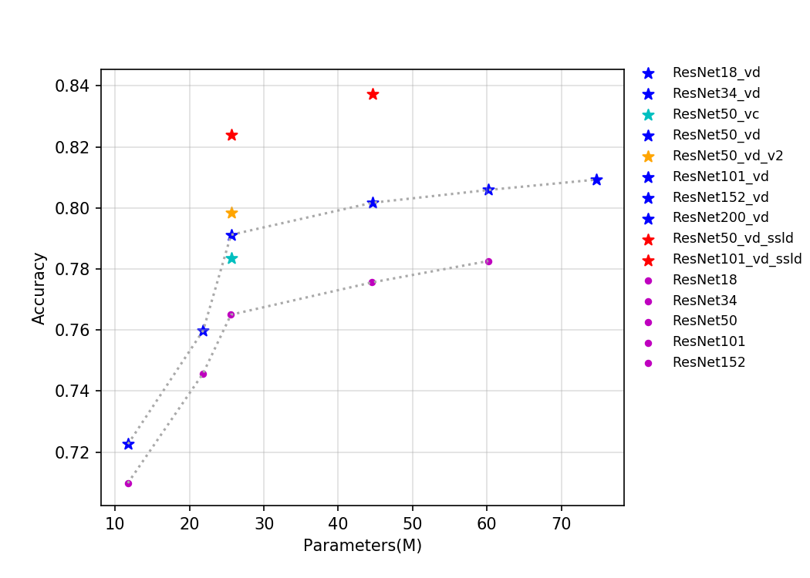
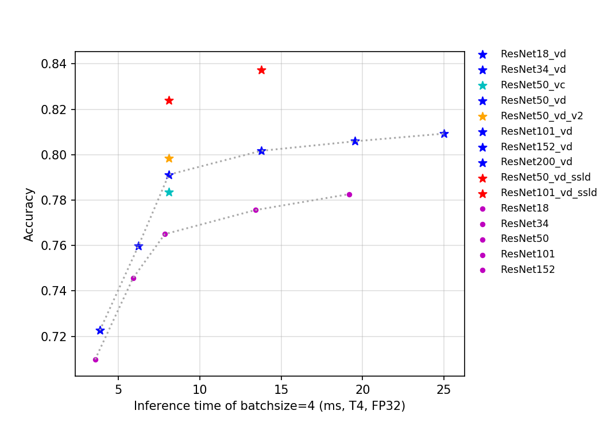
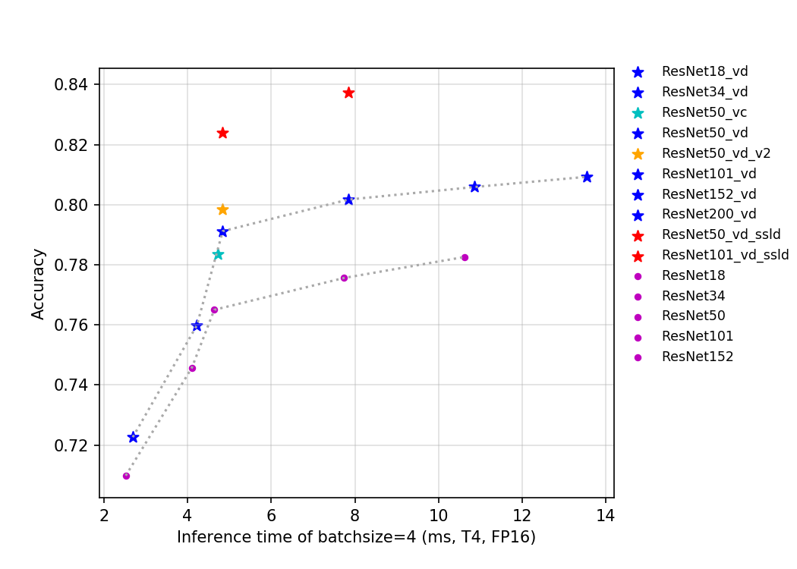

# ResNet and ResNet_vd series
---
## Catalogue

* [1. Overview](#1)
* [2. Accuracy, FLOPs and Parameters](#2)
* [3. Inference speed based on V100 GPU](#3)
* [4. Inference speed based on T4 GPU](#4)

## 1. Overview

The ResNet series model was proposed in 2015 and won the championship in the ILSVRC2015 competition with a top5 error rate of 3.57%. The network innovatively proposed the residual structure, and built the ResNet network by stacking multiple residual structures. Experiments show that using residual blocks can improve the convergence speed and accuracy effectively.

Joyce Xu of Stanford university calls ResNet one of three architectures that "really redefine the way we think about neural networks." Due to the outstanding performance of ResNet, more and more scholars and engineers from academia and industry have improved its structure. The well-known ones include wide-resnet, resnet-vc, resnet-vd, Res2Net, etc. The number of parameters and FLOPs of resnet-vc and resnet-vd are almost the same as those of ResNet, so we hereby unified them into the ResNet series.

The models of the ResNet series released this time include 14 pre-trained models including ResNet50, ResNet50_vd, ResNet50_vd_ssld, and ResNet200_vd. At the training level, ResNet adopted the standard training process for training ImageNet, while the rest of the improved model adopted more training strategies, such as cosine decay for the decline of learning rate and the regular label smoothing method,mixup was added to the data preprocessing, and the total number of iterations increased from 120 epoches to 200 epoches.

Among them, ResNet50_vd_v2 and ResNet50_vd_ssld adopted knowledge distillation, which further improved the accuracy of the model while keeping the structure unchanged. Specifically, the teacher model of ResNet50_vd_v2 is ResNet152_vd (top1 accuracy 80.59%), the training set is imagenet-1k, the teacher model of ResNet50_vd_ssld is ResNeXt101_32x16d_wsl (top1 accuracy 84.2%), and the training set is the combination of 4 million data mined by imagenet-22k and ImageNet-1k . The specific methods of knowledge distillation are being continuously updated.

The FLOPs, parameters, and inference time on the T4 GPU of this series of models are shown in the figure below.

As can be seen from the above curves, the higher the number of layers, the higher the accuracy, but the corresponding number of parameters, calculation and latency will increase. ResNet50_vd_ssld further improves the accuracy of top-1 of the ImageNet-1k validation set by using stronger teachers and more data, reaching 82.39%, refreshing the accuracy of ResNet50 series models.

## 2. Accuracy, FLOPs and Parameters

| Models           | Top1 | Top5 | Reference top1 | Reference top5 | FLOPs (G) | Parameters (M) |
|:--:|:--:|:--:|:--:|:--:|:--:|:--:|
| ResNet18         | 0.710           | 0.899           | 0.696                    | 0.891                    | 3.660     | 11.690    |
| ResNet18_vd      | 0.723           | 0.908           |                          |                          | 4.140     | 11.710    |
| ResNet34         | 0.746           | 0.921           | 0.732                    | 0.913                    | 7.360     | 21.800    |
| ResNet34_vd      | 0.760           | 0.930           |                          |                          | 7.390     | 21.820    |
| ResNet34_vd_ssld      | 0.797           | 0.949           |                          |                          | 7.390     | 21.820    |
| ResNet50         | 0.765           | 0.930           | 0.760                    | 0.930                    | 8.190     | 25.560    |
| ResNet50_vc      | 0.784           | 0.940           |                          |                          | 8.670     | 25.580    |
| ResNet50_vd      | 0.791           | 0.944           | 0.792                    | 0.946                    | 8.670     | 25.580    |
| ResNet50_vd_v2   | 0.798           | 0.949           |                          |                          | 8.670     | 25.580    |
| ResNet101        | 0.776           | 0.936           | 0.776                    | 0.938                    | 15.520    | 44.550    |
| ResNet101_vd     | 0.802           | 0.950           |                          |                          | 16.100    | 44.570    |
| ResNet152        | 0.783           | 0.940           | 0.778                    | 0.938                    | 23.050    | 60.190    |
| ResNet152_vd     | 0.806           | 0.953           |                          |                          | 23.530    | 60.210    |
| ResNet200_vd     | 0.809           | 0.953           |                          |                          | 30.530    | 74.740    |
| ResNet50_vd_ssld | 0.824           | 0.961           |                          |                          | 8.670     | 25.580    |
| ResNet50_vd_ssld_v2 | 0.830           | 0.964           |                          |                          | 8.670     | 25.580    |
| Fix_ResNet50_vd_ssld_v2 | 0.840           | 0.970           |                          |                          | 17.696     | 25.580    |
| ResNet101_vd_ssld | 0.837           | 0.967           |                          |                          | 16.100    | 44.570     |

* Note: `ResNet50_vd_ssld_v2` is obtained by adding AutoAugment in training process on the basis of `ResNet50_vd_ssld` training strategy.`Fix_ResNet50_vd_ssld_v2` stopped all parameter updates of `ResNet50_vd_ssld_v2` except the FC layer,and fine-tuned on ImageNet1k dataset, the resolution is 320x320.

## 3. Inference speed based on V100 GPU

| Models                 | Crop Size | Resize Short Size | FP32 Batch Size=1 (ms) |
|------------------|-----------|-------------------|--------------------------|
| ResNet18         | 224       | 256               | 1.499                    |
| ResNet18_vd      | 224       | 256               | 1.603                    |
| ResNet34         | 224       | 256               | 2.272                    |
| ResNet34_vd      | 224       | 256               | 2.343                    |
| ResNet34_vd_ssld      | 224       | 256               | 2.343                    |
| ResNet50         | 224       | 256               | 2.939                    |
| ResNet50_vc      | 224       | 256               | 3.041                    |
| ResNet50_vd      | 224       | 256               | 3.165                    |
| ResNet50_vd_v2   | 224       | 256               | 3.165                    |
| ResNet101        | 224       | 256               | 5.314                    |
| ResNet101_vd     | 224       | 256               | 5.252                    |
| ResNet152        | 224       | 256               | 7.205                    |
| ResNet152_vd     | 224       | 256               | 7.200                    |
| ResNet200_vd     | 224       | 256               | 8.885                    |
| ResNet50_vd_ssld | 224       | 256               | 3.165                    |
| ResNet101_vd_ssld  | 224       | 256             | 5.252                  |

## 4. Inference speed based on T4 GPU

| Models            | Crop Size | Resize Short Size | FP16 Batch Size=1 (ms) | FP16 Batch Size=4 (ms) | FP16 Batch Size=8 (ms) | FP32 Batch Size=1 (ms) | FP32 Batch Size=4 (ms) | FP32 Batch Size=8 (ms) |
|-------------------|-----------|-------------------|------------------------------|------------------------------|------------------------------|------------------------------|------------------------------|------------------------------|
| ResNet18          | 224       | 256               | 1.3568                       | 2.5225                       | 3.61904                      | 1.45606                      | 3.56305                      | 6.28798                      |
| ResNet18_vd       | 224       | 256               | 1.39593                      | 2.69063                      | 3.88267                      | 1.54557                      | 3.85363                      | 6.88121                      |
| ResNet34          | 224       | 256               | 2.23092                      | 4.10205                      | 5.54904                      | 2.34957                      | 5.89821                      | 10.73451                     |
| ResNet34_vd       | 224       | 256               | 2.23992                      | 4.22246                      | 5.79534                      | 2.43427                      | 6.22257                      | 11.44906                     |
| ResNet34_vd       | 224       | 256               | 2.23992                      | 4.22246                      | 5.79534                      | 2.43427                      | 6.22257                      | 11.44906                     |
| ResNet50          | 224       | 256               | 2.63824                      | 4.63802                      | 7.02444                      | 3.47712                      | 7.84421                      | 13.90633                     |
| ResNet50_vc       | 224       | 256               | 2.67064                      | 4.72372                      | 7.17204                      | 3.52346                      | 8.10725                      | 14.45577                     |
| ResNet50_vd       | 224       | 256               | 2.65164                      | 4.84109                      | 7.46225                      | 3.53131                      | 8.09057                      | 14.45965                     |
| ResNet50_vd_v2    | 224       | 256               | 2.65164                      | 4.84109                      | 7.46225                      | 3.53131                      | 8.09057                      | 14.45965                     |
| ResNet101         | 224       | 256               | 5.04037                      | 7.73673                      | 10.8936                      | 6.07125                      | 13.40573                     | 24.3597                      |
| ResNet101_vd      | 224       | 256               | 5.05972                      | 7.83685                      | 11.34235                     | 6.11704                      | 13.76222                     | 25.11071                     |
| ResNet152         | 224       | 256               | 7.28665                      | 10.62001                     | 14.90317                     | 8.50198                      | 19.17073                     | 35.78384                     |
| ResNet152_vd      | 224       | 256               | 7.29127                      | 10.86137                     | 15.32444                     | 8.54376                      | 19.52157                     | 36.64445                     |
| ResNet200_vd      | 224       | 256               | 9.36026                      | 13.5474                      | 19.0725                      | 10.80619                     | 25.01731                     | 48.81399                     |
| ResNet50_vd_ssld  | 224       | 256               | 2.65164                      | 4.84109                      | 7.46225                      | 3.53131                      | 8.09057                      | 14.45965                     |
| ResNet50_vd_ssld_v2  | 224       | 256               | 2.65164                      | 4.84109                      | 7.46225                      | 3.53131                      | 8.09057                      | 14.45965                     |
| Fix_ResNet50_vd_ssld_v2  | 320       | 320               | 3.42818                      | 7.51534                      | 13.19370                      | 5.07696                      | 14.64218                      | 27.01453                     |
| ResNet101_vd_ssld | 224       | 256               | 5.05972                      | 7.83685                      | 11.34235                     | 6.11704                      | 13.76222                     | 25.11071                     |
