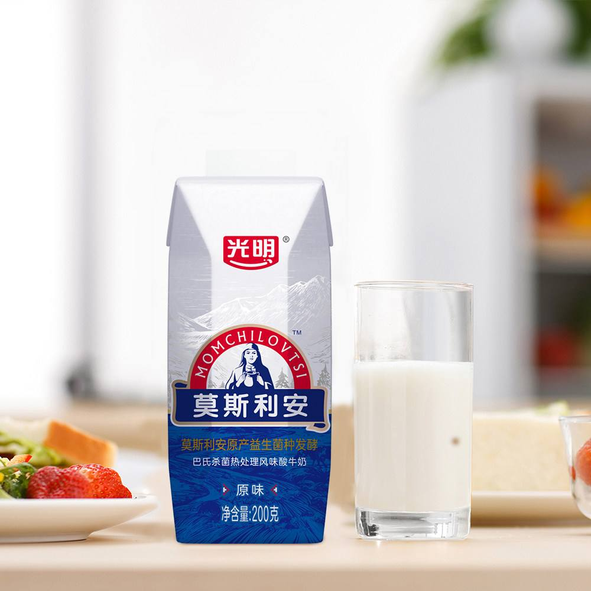
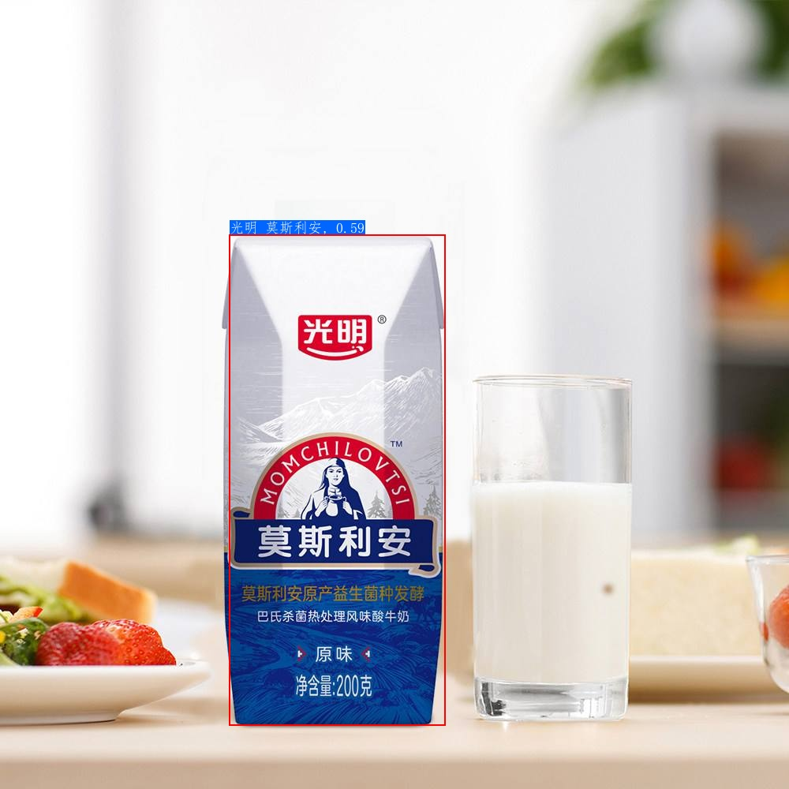

# Quick Start of Recognition

This document contains 2 parts: PP-ShiTu android demo quick start and PP-ShiTu PC demo quick start.

If the image category already exists in the image index library, you can directly refer to the [Image Recognition Experience](#image recognition experience) chapter to complete the image recognition process; if you want to recognize images of unknown classes, that is, the image category did not exist in the index library before , then you can refer to the [Unknown Category Image Recognition Experience](#Unknown Category Image Recognition Experience) chapter to complete the process of indexing and recognition.

## Catalogue

- [1. PP-ShiTu android demo for quick start](#1-pp-shitu-android-demo-for-quick-start)
  - [1.1 Install PP-ShiTu android demo](#11-install-pp-shitu-android-demo)
  - [1.2 Feature Experience](#12-feature-experience)
    - [1.2.1 Image Retrieval](#121-image-retrieval)
    - [1.2.2 Update Index](#122-update-index)
    - [1.2.3 Save Index](#123-save-index)
    - [1.2.4 Initialize Index](#124-initialize-index)
    - [1.2.5 Preview Index](#125-preview-index)
  - [1.3 Feature Details](#13-feature-details)
    - [1.3.1 Image Retrieval](#131-image-retrieval)
    - [1.3.2 Update Index](#132-update-index)
    - [1.3.3 Save Index](#133-save-index)
    - [1.3.4 Initialize Index](#134-initialize-index)
    - [1.3.5 Preview Index](#135-preview-index)
- [2. PP-ShiTu PC demo for quick start](#2-pp-shitu-pc-demo-for-quick-start)
  - [2.1 Environment configuration](#21-environment-configuration)
  - [2.2 Image recognition experience](#22-image-recognition-experience)
    - [2.2.1 Download and unzip the inference model and demo data](#221-download-and-unzip-the-inference-model-and-demo-data)
    - [2.2.2 Drink recognition and retrieval](#222-drink-recognition-and-retrieval)
      - [2.2.2.1 single image recognition](#2221-single-image-recognition)
      - [2.2.2.2 Folder-based batch recognition](#2222-folder-based-batch-recognition)
  - [2.3 Image of Unknown categories recognition experience](#23-image-of-unknown-categories-recognition-experience)
    - [2.3.1 Prepare new data and labels](#231-prepare-new-data-and-labels)
    - [2.3.2 Create a new index database](#232-create-a-new-index-database)
    - [2.3.3 Image recognition based on the new index database](#233-image-recognition-based-on-the-new-index-database)
  - [2.4 List of server recognition models](#24-list-of-server-recognition-models)

<a name="PP-ShiTu android quick start"></a>

## 1. PP-ShiTu android demo for quick start

<a name="install"></a>

### 1.1 Install PP-ShiTu android demo

You can download and install the APP by scanning the QR code or [click the link](https://paddle-imagenet-models-name.bj.bcebos.com/demos/PP-ShiTu.apk)

<div align=center></div>

<a name="Feature Experience"></a>

### 1.2 Feature Experience
At present, the PP-ShiTu android demo has basic features such as image retrieval, add image to the index database, saving the index database, initializing the index database, and viewing the index database. Next, we will introduce how to experience these features.

#### 1.2.1 Image Retrieval
Click the "photo recognition" button below  or the "file recognition" button, you can take an image or select an image, then wait a few seconds, main object in the image will be marked and the predicted class and inference time will be shown below the image.

Take the following image as an example:


The retrieval results obtained are visualized as follows:


#### 1.2.2 Update Index
Click the "photo upload" button above  or the "file upload" button , you can take an image or select an image and enter the class name of the uploaded image (such as `keyboard`), click the "OK" button, then the feature vector and classname corresponding to the image will be added to the index database.

#### 1.2.3 Save Index
Click the "save index" button above , you can save the current index database as `latest`.

#### 1.2.4 Initialize Index
Click the "initialize index" button above  to initialize the current library to `original`.

#### 1.2.5 Preview Index
Click the "class preview" button  to view it in the pop-up window.

<a name="Feature introduction"></a>

### 1.3 Feature Details

#### 1.3.1 Image Retrieval
After selecting the image to be retrieved, firstly, the mainbody detection will be performed through the detection model to obtain the bounding box of ​the object in the image, and then the image will be cropped and is input into the feature extraction model to obtain the corresponding feature vector and retrieved in the index database, returns and displays the final search result.

#### 1.3.2 Update Index
After selecting the picture to be stored, firstly, the mainbody detection will be performed through the detection model to obtain the bounding box of ​the object in the image, and then the image will be cropped and is input into the feature extraction model to obtain the corresponding feature vector, and then added into index database.

#### 1.3.3 Save Index
Save the index database in the current program index database name of `latest`, and automatically switch to `latest`. The saving logic is similar to "Save As" in general software. If the current index is already `latest`, it will be automatically overwritten, or it will switch to `latest`.

#### 1.3.4 Initialize Index
When initializing the index database, it will automatically switch the search index database to `original.index` and `original.txt`, and automatically delete `latest.index` and `latest.txt` (if exists).

#### 1.3.5 Preview Index
One can preview it according to the instructions in [Function Experience - Preview Index](#125-preview-index).


## 2. PP-ShiTu PC demo for quick start

<a name="Environment Configuration"></a>

### 2.1 Environment configuration

* Installation: Please refer to the document [Environment Preparation](../installation/install_paddleclas.md) to configure the PaddleClas operating environment.

* Go to the `deploy` run directory. All the content and scripts in this section need to be run in the `deploy` directory, you can enter the `deploy` directory with the following scripts.

  ```shell
  cd deploy
  ```

<a name="Image Recognition Experience"></a>

### 2.2 Image recognition experience

The lightweight general object detection model, lightweight general recognition model and configuration file are available in following table.

<a name="Lightweight General object Detection Model and Lightweight General Recognition Model"></a>

| Model Introduction                         | Recommended Scenarios | Inference Model    | Prediction Profile                                                       |
| ------------------------------------------ | --------------------- | ------------------ | ------------------------------------------------------------------------ |
| Lightweight General MainBody Detection Model | General Scene       | [tar format download link](https://paddle-imagenet-models-name.bj.bcebos.com/dygraph/rec/models/inference/picodet_PPLCNet_x2_5_mainMainBody_lite_v1.0_infer.tar ) \| [zip format download link](https://paddle-imagenet-models-name.bj.bcebos.com/dygraph/rec/models/inference/picodet_PPLCNet_x2_5_mainMainBody_lite_v1.0_infer.zip)                     | -                                                                        |
| Lightweight General Recognition Model      | General Scene         | [tar format download link](https://paddle-imagenet-models-name.bj.bcebos.com/dygraph/rec/models/inference/PP-ShiTuV2/general_PPLCNetV2_base_pretrained_v1.0_infer.tar) \| [zip format download link](https://paddle-imagenet-models-name.bj.bcebos.com/dygraph/rec/models/inference/PP-ShiTuV2/general_PPLCNetV2_base_pretrained_v1.0_infer.zip) | [inference_general.yaml](../../../deploy/configs/inference_general.yaml) |

Note: Since some decompression software has problems in decompressing the above `tar` format files, it is recommended that non-script line users download the `zip` format files and decompress them. `tar` format file is recommended to use the script `tar -xf xxx.tar`unzip.

The demo data download path of this chapter is as follows: [drink_dataset_v2.0.tar (drink data)](https://paddle-imagenet-models-name.bj.bcebos.com/dygraph/rec/data/drink_dataset_v2.0.tar),

The following takes **drink_dataset_v2.0.tar** as an example to introduce the PP-ShiTu quick start process on the PC. Users can also download and decompress the data of other scenarios to experience: [22 scenarios data download](../../zh_CN/introduction/ppshitu_application_scenarios.md#22-下载解压场景库数据).

If you want to experience the server object detection and the recognition model of each scene, you can refer to [2.4 Server recognition model list](#24-list-of-server-identification-models)

**Notice**

- If wget is not installed in the windows environment, you can install the `wget` and tar scripts according to the following steps, or you can copy the link to the browser to download the model, decompress it and place it in the corresponding directory.
- If the `wget` script is not installed in the macOS environment, you can run the following script to install it.
    ```shell
    # install homebrew
    ruby -e "$(curl -fsSL https://raw.githubusercontent.com/Homebrew/install/master/install)";
    # install wget
    brew install wget
    ```
- If you want to install `wget` in the windows environment, you can refer to: [link](https://www.cnblogs.com/jeshy/p/10518062.html); if you want to install the `tar` script in the windows environment, you can refer to: [Link](https://www.cnblogs.com/chooperman/p/14190107.html).

<a name="2.2.1"></a>

#### 2.2.1 Download and unzip the inference model and demo data

Download the demo dataset and the lightweight subject detection and recognition model. The scripts are as follows.

```shell
mkdir models
cd models
# Download the mainbody detection inference model and unzip it
wget https://paddle-imagenet-models-name.bj.bcebos.com/dygraph/rec/models/inference/picodet_PPLCNet_x2_5_mainbody_lite_v1.0_infer.tar && tar -xf picodet_PPLCNet_x2_5_mainbody_lite_v1.0_infer.tar
# Download the feature extraction inference model and unzip it
wget https://paddle-imagenet-models-name.bj.bcebos.com/dygraph/rec/models/inference/PP-ShiTuV2/general_PPLCNetV2_base_pretrained_v1.0_infer.tar && tar -xf general_PPLCNetV2_base_pretrained_v1.0_infer.tar

cd ../
# Download demo data and unzip it
wget https://paddle-imagenet-models-name.bj.bcebos.com/dygraph/rec/data/drink_dataset_v2.0.tar && tar -xf drink_dataset_v2.0.tar
```

After decompression, the `drink_dataset_v2.0/` folder be structured as follows:

```log
├── drink_dataset_v2.0/
│   ├── gallery/
│   ├── index/
│   ├── index_all/
│   └── test_images/
├── ...
```

The `gallery` folder stores the original images used to build the index database, `index` represents the index database constructed based on the original images, and the `test_images` folder stores the list of images for query.

The `models` folder should be structured as follows:

```log
├── general_PPLCNetV2_base_pretrained_v1.0_infer
│   ├── inference.pdiparams
│   ├── inference.pdiparams.info
│   └── inference.pdmodel
├── picodet_PPLCNet_x2_5_mainbody_lite_v1.0_infer
│   ├── inference.pdiparams
│   ├── inference.pdiparams.info
│   └── inference.pdmodel
```

**Notice**

If the general feature extraction model is changed, the index for demo data must be rebuild, as follows:

```shell
python3.7 python/build_gallery.py \
-c configs/inference_general.yaml \
-o Global.rec_inference_model_dir=./models/general_PPLCNetV2_base_pretrained_v1.0_infer
```

<a name="Drink Recognition and Retrieval"></a>

#### 2.2.2 Drink recognition and retrieval

Take the drink recognition demo as an example to show the recognition and retrieval process.

Note that this section will uses `faiss` as the retrieval tool, and the installation script is as follows:

```python
python3.7 -m pip install faiss-cpu==1.7.1post2
```

If `faiss` cannot be importted, try reinstall it, especially for windows users.

<a name="single image recognition"></a>

##### 2.2.2.1 single image recognition

Run the following script to recognize the image `./drink_dataset_v2.0/test_images/100.jpeg`

The images to be retrieved are as follows


```shell
# Use the script below to make predictions using the GPU
python3.7 python/predict_system.py -c configs/inference_general.yaml

# Use the following script to make predictions using the CPU
python3.7 python/predict_system.py -c configs/inference_general.yaml -o Global.use_gpu=False
```

The final output is as follows.

```log
[{'bbox': [437, 71, 660, 728], 'rec_docs': '元气森林', 'rec_scores': 0.7740249}, {'bbox': [221, 72, 449, 701], 'rec_docs' : '元气森林', 'rec_scores': 0.6950992}, {'bbox': [794, 104, 979, 652], 'rec_docs': '元气森林', 'rec_scores': 0.6305153}]
```

Where `bbox` represents the location of the detected object, `rec_docs` represents the most similar category to the detection box in the index database, and `rec_scores` represents the corresponding similarity.

The visualization results of the recognition are saved in the `output` folder by default. For this image, the visualization of the recognition results is shown below.


<a name="Folder-based batch recognition"></a>

##### 2.2.2.2 Folder-based batch recognition

If you want to use multi images in the folder for prediction, you can modify the `Global.infer_imgs` field in the configuration file, or you can modify the corresponding configuration through the `-o` parameter below.

```shell
# Use the following script to use GPU for prediction, if you want to use CPU prediction, you can add -o Global.use_gpu=False after the script
python3.7 python/predict_system.py -c configs/inference_general.yaml -o Global.infer_imgs="./drink_dataset_v2.0/test_images/"
```

The recognition results of all images in the folder will be output in the terminal, as shown below.

```log
...
[{'bbox': [0, 0, 600, 600], 'rec_docs': '红牛-强化型', 'rec_scores': 0.74081033}]
Inference: 120.39852142333984 ms per batch image
[{'bbox': [0, 0, 514, 436], 'rec_docs': '康师傅矿物质水', 'rec_scores': 0.6918598}]
Inference: 32.045602798461914 ms per batch image
[{'bbox': [138, 40, 573, 1198], 'rec_docs': '乐虎功能饮料', 'rec_scores': 0.68214047}]
Inference: 113.41428756713867 ms per batch image
[{'bbox': [328, 7, 467, 272], 'rec_docs': '脉动', 'rec_scores': 0.60406065}]
Inference: 122.04337120056152 ms per batch image
[{'bbox': [242, 82, 498, 726], 'rec_docs': '味全_每日C', 'rec_scores': 0.5428652}]
Inference: 37.95266151428223 ms per batch image
[{'bbox': [437, 71, 660, 728], 'rec_docs': '元气森林', 'rec_scores': 0.7740249}, {'bbox': [221, 72, 449, 701], 'rec_docs': '元气森林', 'rec_scores': 0.6950992}, {'bbox': [794, 104, 979, 652], 'rec_docs': '元气森林', 'rec_scores': 0.6305153}]
...
```

Visualizations of recognition results for all images are also saved in the `output` folder.

Furthermore, you can change the path of the recognition inference model by modifying the `Global.rec_inference_model_dir` field, and change the path of the index database by modifying the `IndexProcess.index_dir` field.

<a name="Image of Unknown categories recognition experience"></a>

### 2.3 Image of Unknown categories recognition experience

Now we try to recognize the unseen image `./drink_dataset_v2.0/test_images/mosilian.jpeg`

The images to be retrieved are as follows



Execute the following identification script

```shell
# Use the following script to use GPU for prediction, if you want to use CPU prediction, you can add -o Global.use_gpu=False after the script
python3.7 python/predict_system.py -c configs/inference_general.yaml -o Global.infer_imgs="./drink_dataset_v2.0/test_images/mosilian.jpeg"
```

It can be found that the output result is empty

Since the default index database does not contain the unknown category's information, the recognition result here is wrong. At this time, we can achieve the image recognition of unknown classes by building a new index database.

When the images in the index database cannot cover the scene we actually recognize, i.e. recognizing an image of an unknown category, we need to add a similar image(at least one) belong the unknown category to the index database. This process does not require re-training the model. Take `mosilian.jpeg` as an example, just follow the steps below to rebuild a new index database.

<a name="Prepare new data and labels"></a>

#### 2.3.1 Prepare new data and labels

First, copy the image(s) belong to unknown category(except the query image) to the original image folder of the index database. Here we already put all the image data in the folder `drink_dataset_v2.0/gallery/`.

Then we need to edit the text file that records the image path and label information. Here we already  put the updated label information file in the `drink_dataset_v2.0/gallery/drink_label_all.txt` file. Comparing with the original `drink_dataset_v2.0/gallery/drink_label.txt` label file, it can be found that the index images of the bright and ternary series of milk have been added.

In each line of text, the first field represents the relative path of the image, and the second field represents the label information corresponding to the image, separated by the `\t` key (Note: some editors will automatically convert `tab` is `space`, in which case it will cause a file parsing error).

<a name="Create a new index database"></a>

#### 2.3.2 Create a new index database

Build a new index database `index_all` with the following scripts.

```shell
python3.7 python/build_gallery.py -c configs/inference_general.yaml -o IndexProcess.data_file="./drink_dataset_v2.0/gallery/drink_label_all.txt" -o IndexProcess.index_dir="./drink_dataset_v2.0/index_all"
```

The final constructed new index database is saved in the folder `./drink_dataset_v2.0/index_all`. For specific instructions on yaml `yaml`, please refer to [Vector Search Documentation](../image_recognition_pipeline/vector_search.md).

<a name="Image recognition based on the new index database"></a>

#### 2.3.3 Image recognition based on the new index database

To re-recognize the `mosilian.jpeg` image using the new index database, run the following scripts.

```shell
# run the following script predict with GPU, if you want to use CPU, you can add -o Global.use_gpu=False after the script
python3.7 python/predict_system.py -c configs/inference_general.yaml -o Global.infer_imgs="./drink_dataset_v2.0/test_images/mosilian.jpeg" -o IndexProcess.index_dir="./drink_dataset_v2.0/index_all"
```

The output is as follows.

```log
[{'bbox': [290, 297, 564, 919], 'rec_docs': 'Bright_Mosleyan', 'rec_scores': 0.59137374}]
```

The final recognition result is `光明_莫斯利安`, we can see the recognition result is correct now , and the visualization of the recognition result is shown below.




<a name="5"></a>

### 2.4 List of server recognition models

At present, we recommend to use model in [Lightweight General Object Detection Model and Lightweight General Recognition Model](#22-image-recognition-experience) to get better test results. However, if you want to experience the general recognition model, general object detection model and other recognition model for server, the test data download path, and the corresponding configuration file path are as follows.

| Model Introduction                | Recommended Scenarios | Inference Model                                                                                                                                     | Prediction Profile                                                        |
| --------------------------------- | --------------------- | --------------------------------------------------------------------------------------------------------------------------------------------------- | ------------------------------------------------------------------------- |
| General Body Detection Model      | General Scene         | [Model download link](https://paddle-imagenet-models-name.bj.bcebos.com/dygraph/rec/models/inference/ppyolov2_r50vd_dcn_mainbody_v1.0_infer.tar)    | -                                                                         |
| Logo Recognition Model            | Logo Scene            | [Model download link](https://paddle-imagenet-models-name.bj.bcebos.com/dygraph/rec/models/inference/logo_rec_ResNet50_Logo3K_v1.0_infer.tar)       | [inference_logo. yaml](../../../deploy/configs/inference_logo.yaml)       |
| Anime Character Recognition Model | Anime Character Scene | [Model download link](https://paddle-imagenet-models-name.bj.bcebos.com/dygraph/rec/models/inference/cartoon_rec_ResNet50_iCartoon_v1.0_infer.tar)  | [ inference_cartoon.yaml](../../../deploy/configs/inference_cartoon.yaml) |
| Vehicle Subdivision Model         | Vehicle Scene         | [Model download link](https://paddle-imagenet-models-name.bj.bcebos.com/dygraph/rec/models/inference/vehicle_cls_ResNet50_CompCars_v1.0_infer.tar)  | [inference_vehicle .yaml](../../../deploy/configs/inference_vehicle.yaml) |
| Product Recognition Model         | Product Scene         | [Model Download Link](https://paddle-imagenet-models-name.bj.bcebos.com/dygraph/rec/models/inference/product_ResNet50_vd_aliproduct_v1.0_infer.tar) | [inference_product. yaml](../../../deploy/configs/inference_product.yaml) |
| Vehicle ReID Model                | Vehicle ReID Scene    | [Model download link](https://paddle-imagenet-models-name.bj.bcebos.com/dygraph/rec/models/inference/vehicle_reid_ResNet50_VERIWild_v1.0_infer.tar) | [inference_vehicle .yaml](../../../deploy/configs/inference_vehicle.yaml) |

The above models can be downloaded to the `deploy/models` folder by the following script for use in recognition tasks
```shell
cd ./deploy
mkdir -p models

cd ./models
# Download the generic object detection model for server and unzip it
wget https://paddle-imagenet-models-name.bj.bcebos.com/dygraph/rec/models/inference/ppyolov2_r50vd_dcn_mainbody_v1.0_infer.tar && tar -xf ppyolov2_r50vd_dcn_mainbody_v1.0_infer.tar
# Download the generic recognition model and unzip it
wget {recognize model download link path} && tar -xf {name of compressed package}
```

Then use the following scripts to download the test data for other recognition scenario:

```shell
# Go back to the deploy directory
cd..
# Download test data and unzip
wget https://paddle-imagenet-models-name.bj.bcebos.com/dygraph/rec/data/recognition_demo_data_en_v1.1.tar && tar -xf recognition_demo_data_en_v1.1.tar
```

After decompression, the `recognition_demo_data_v1.1` folder should have the following file structure:

```log
├── recognition_demo_data_v1.1
│   ├── gallery_cartoon
│   ├── gallery_logo
│   ├── gallery_product
│   ├── gallery_vehicle
│   ├── test_cartoon
│   ├── test_logo
│   ├── test_product
│   └── test_vehicle
├── ...
```

After downloading the model and test data according to the above steps, you can re-build the index database and test the relevant recognition model.

* For more introduction to object detection, please refer to: [Object Detection Tutorial Document](../image_recognition_pipeline/mainbody_detection.md); for the introduction of feature extraction, please refer to: [Feature Extraction Tutorial Document](../image_recognition_pipeline/feature_extraction.md); for the introduction to vector search, please refer to: [vector search tutorial document](../image_recognition_pipeline/vector_search.md).
