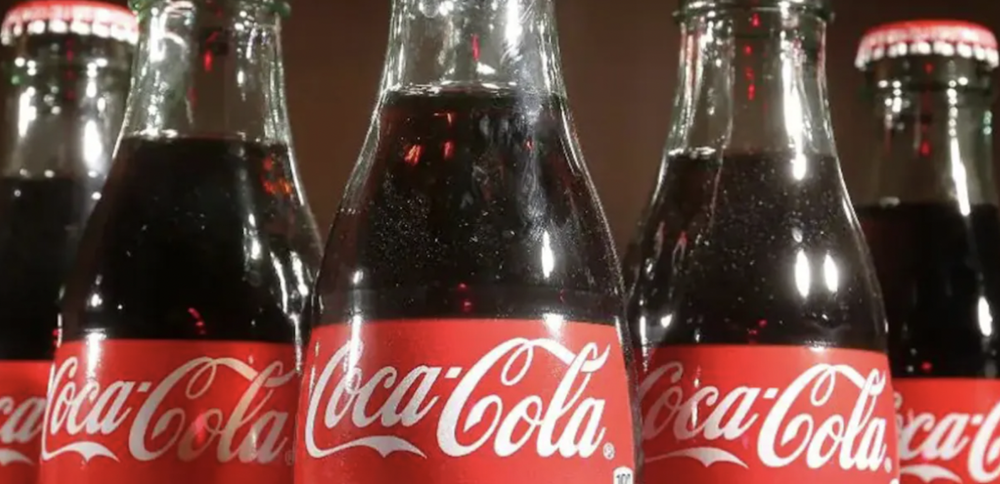

# Quick Start of Recognition

This tutorial contains 3 parts: Environment Preparation, Image Recognition Experience, and Unknown Category Image Recognition Experience.

If the image category already exists in the image index database, then you can take a reference to chapter [Image Recognition Experience](#image_recognition_experience)，to complete the progress of image recognition；If you wish to recognize unknow category image, which is not included in the index database，you can take a reference to chapter [Unknown Category Image Recognition Experience](#unkonw_category_image_recognition_experience)，to complete the process of creating an index to recognize it。

## Catalogue

* [1. Enviroment Preparation](#enviroment_preperation )
* [2. Image Recognition Experience](#image_recognition_experience)
  * [2.1 Download and Unzip the Inference Model and Demo Data](#download_and_unzip_the_inference_model_and_demo_data)
  * [2.2 Logo Recognition and Retrieval](#Logo_recognition_and_retrival)
    * [2.2.1 Single Image Recognition](#recognition_of_single_image)
    * [2.2.2 Folder-based Batch Recognition](#folder_based_batch_recognition)
* [3. Unknown Category Image Recognition Experience](#unkonw_category_image_recognition_experience)
  * [3.1 Build the Base Library Based on Our Own Dataset](#build_the_base_library_based_on_your_own_dataset)
  * [3.2 ecognize the Unknown Category Images](#Image_differentiation_based_on_the_new_index_library)


<a name="enviroment_preparation"></a>
## 1. Enviroment Preparation

* Installation：Please take a reference to [Quick Installation ](./installation.md)to configure the PaddleClas environment.

* Using the following command to enter Folder `deploy`. All content and commands in this section need to be run in folder `deploy`.

  ```
  cd deploy
  ```

<a name="image_recognition_experience"></a>
## 2. Image Recognition Experience

The detection model with the recognition inference model for the 4 directions (Logo, Cartoon Face, Vehicle, Product), the address for downloading the test data and the address of the corresponding configuration file are as follows.

| Models Introduction       | Recommended Scenarios   | Test Data Address  | inference Model  | Predict Config File  | Config File to Build Index Database |
| ------------  | ------------- | ------- | -------- | ------- | -------- |
| Generic mainbody detection model | General Scenarios  | -  |[Model Download Link](https://paddle-imagenet-models-name.bj.bcebos.com/dygraph/rec/models/inference/ppyolov2_r50vd_dcn_mainbody_v1.0_infer.tar) | - | - |
| Logo Recognition Model | Logo Scenario  | [Data Download Link](https://paddle-imagenet-models-name.bj.bcebos.com/dygraph/rec/data/logo_demo_data_v1.0.tar) |  [Model Download Link](https://paddle-imagenet-models-name.bj.bcebos.com/dygraph/rec/models/inference/logo_rec_ResNet50_Logo3K_v1.0_infer.tar) | [inference_logo.yaml](../../../deploy/configs/inference_logo.yaml) | [build_logo.yaml](../../../deploy/configs/build_logo.yaml) |
| Cartoon Face Recognition Model| Cartoon Face Scenario  | [Data Download Link](https://paddle-imagenet-models-name.bj.bcebos.com/dygraph/rec/data/cartoon_demo_data_v1.0.tar) | [Model Download Link](https://paddle-imagenet-models-name.bj.bcebos.com/dygraph/rec/models/inference/cartoon_rec_ResNet50_iCartoon_v1.0_infer.tar) | [inference_cartoon.yaml](../../../deploy/configs/inference_cartoon.yaml) | [build_cartoon.yaml](../../../deploy/configs/build_cartoon.yaml) |
| Vehicle Subclassification Model | Vehicle Scenario  | [Data Download Link](https://paddle-imagenet-models-name.bj.bcebos.com/dygraph/rec/data/vehicle_demo_data_v1.0.tar) |  [Model Download Link](https://paddle-imagenet-models-name.bj.bcebos.com/dygraph/rec/models/inference/vehicle_cls_ResNet50_CompCars_v1.0_infer.tar) | [inference_vehicle.yaml](../../../deploy/configs/inference_vehicle.yaml) | [build_vehicle.yaml](../../../deploy/configs/build_vehicle.yaml) |
| Product Recignition Model | Product Scenario  | [Data Download Link](https://paddle-imagenet-models-name.bj.bcebos.com/dygraph/rec/data/product_demo_data_v1.0.tar) |  [Model Download Link](https://paddle-imagenet-models-name.bj.bcebos.com/dygraph/rec/models/inference/product_ResNet50_vd_Inshop_v1.0_infer.tar) | [inference_inshop.yaml](../../../deploy/configs/) | [build_inshop.yaml](../../../deploy/configs/build_inshop.yaml) |


**Attention**：If you do not have wget installed on Windows, you can download the model by copying the link into your browser and unzipping it in the appropriate folder; for Linux or macOS users, you can right-click and copy the download link to download it via the `wget` command.


* You can download and unzip the data and models by following the command below

```shell
mkdir dataset
cd dataset
# Download the demo data and unzip
wget {Data download link} && tar -xf {Name of the tar archive}
cd ..

mkdir models
cd models
# Download and unzip the inference model
wget {Models download link} && tar -xf {Name of the tar archive}
cd ..
```


<a name="download_and_unzip_the_inference_model_and_demo_data"></a>
### 2.1 Download and Unzip the Inference Model and Demo Data

Take the Logo recognition as an example, download the detection model, recognition model and Logo recognition demo data with the following commands.

```shell
mkdir models
cd models
# Download the generic detection inference model and unzip it
wget https://paddle-imagenet-models-name.bj.bcebos.com/dygraph/rec/models/inference/ppyolov2_r50vd_dcn_mainbody_v1.0_infer.tar && tar -xf ppyolov2_r50vd_dcn_mainbody_v1.0_infer.tar
# Download and unpack the inference model
wget https://paddle-imagenet-models-name.bj.bcebos.com/dygraph/rec/models/inference/logo_rec_ResNet50_Logo3K_v1.0_infer.tar && tar -xf logo_rec_ResNet50_Logo3K_v1.0_infer.tar

cd ..
mkdir dataset
cd dataset
# Download the demo data and unzip it
wget https://paddle-imagenet-models-name.bj.bcebos.com/dygraph/rec/data/logo_demo_data_v1.0.tar && tar -xf logo_demo_data_v1.0.tar
cd ..
```

Once unpacked, the `dataset` folder should have the following file structure.

```
├── logo_demo_data_v1.0
│   ├── data_file.txt
│   ├── gallery
│   ├── index
│   └── query
├── ...
```

The `data_file.txt` is images list used to build the index database, the `gallery` folder contains all the original images used to build the index database, the `index` folder contains the index files generated by building the index database, and the `query` is the demo image used to test the recognition effect.

The `models` folder should have the following file structure.

```
├── logo_rec_ResNet50_Logo3K_v1.0_infer
│   ├── inference.pdiparams
│   ├── inference.pdiparams.info
│   └── inference.pdmodel
├── ppyolov2_r50vd_dcn_mainbody_v1.0_infer
│   ├── inference.pdiparams
│   ├── inference.pdiparams.info
│   └── inference.pdmodel
```

<a name="Logo_recognition_and_retrival"></a>
### 2.2 Logo Recognition and Retrival

Take the Logo recognition demo as an example to show the recognition and retrieval process (if you wish to try other scenarios of recognition and retrieval, replace the corresponding configuration file after downloading and unzipping the corresponding demo data and model to complete the prediction)。


<a name="recognition_of_single_image"></a>
#### 2.2.1 Single Image Recognition

Run the following command to identify and retrieve the image `. /dataset/logo_demo_data_v1.0/query/logo_auxx-1.jpg` for recognition and retrieval

```shell
python3.7 python/predict_system.py -c configs/inference_logo.yaml
```

The image to be retrieved is shown below.

<div align="center">

</div>


The final output is shown below.

```
[{'bbox': [129, 219, 230, 253], 'rec_docs': ['auxx-2', 'auxx-1', 'auxx-2', 'auxx-1', 'auxx-2'], 'rec_scores': array([3.09635019, 3.09635019, 2.83965826, 2.83965826, 2.64057827])}]
```
where bbox indicates the location of the detected subject, rec_docs indicates the labels corresponding to a number of images in the index dabase that are most similar to the detected subject, and rec_scores indicates the corresponding similarity.


<a name="folder_based_batch_recognition"></a>
#### 2.2.2 Folder-based Batch Recognition

If you want to predict the images in the folder, you can directly modify the `Global.infer_imgs` field in the configuration file, or you can also modify the corresponding configuration through the following `-o` parameter.

```shell
python3.7 python/predict_system.py -c configs/inference_logo.yaml -o Global.infer_imgs="./dataset/logo_demo_data_v1.0/query"
```

Furthermore, the recognition inference model path can be changed by modifying the `Global.rec_inference_model_dir` field, and the path of the index to the index databass can be changed by modifying the `IndexProcess.index_path` field.


<a name="unkonw_category_image_recognition_experience"></a>
## 3. Recognize Images of Unknown Category

To recognize the image `./dataset/logo_demo_data_v1.0/query/logo_cola.jpg`, run the command as follows:

```shell
python3.7 python/predict_system.py -c configs/inference_logo.yaml -o Global.infer_imgs="./dataset/logo_demo_data_v1.0/query/logo_cola.jpg"
```

The image to be retrieved is shown below.

<div align="center">

</div>

The output is as follows:

```
[{'bbox': [635, 0, 1382, 1043], 'rec_docs': ['Arcam', 'univox', 'univox', 'Arecont Vision', 'univox'], 'rec_scores': array([0.47730467, 0.47625482, 0.46496609, 0.46296868, 0.45239362])}]
```

Since the index infomation is not included in the corresponding index databse, the recognition results are not proper. At this time, we can complete the image recognition of unknown categories by constructing a new index database.

When the index database cannot cover the scenes we actually recognise, i.e. when predicting images of unknown categories, we need to add similar images of the corresponding categories to the index databasey, thus completing the recognition of images of unknown categories ，which does not require retraining.

<a name="build_the_base_library_based_on_your_own_dataset"></a>
### 3.1 Build the Base Library Based on Your Own Dataset


First, you need to obtain the original images to store in the database (store in `./dataset/logo_demo_data_v1.0/gallery`) and the corresponding label infomation，recording the category of the original images and the label information）store in the text file `./dataset/logo_demo_data_v1.0/data_file_update.txt`

Then use the following command to build the index to accelerate the retrieval process after recognition.

```shell
python3.7 python/build_gallery.py -c configs/build_logo.yaml -o IndexProcess.data_file="./dataset/logo_demo_data_v1.0/data_file_update.txt" -o IndexProcess.index_path="./dataset/logo_demo_data_v1.0/index_update"
```

Finally, the new index information is stored in the folder`./dataset/logo_demo_data_v1.0/index_update`. Use the new index database for the above index.


<a name="Image_differentiation_based_on_the_new_index_library"></a>
### 3.2 Recognize the Unknown Category Images

To recognize the image `./dataset/logo_demo_data_v1.0/query/logo_cola.jpg`, run the command as follows.

```shell
python3.7 python/predict_system.py -c configs/inference_logo.yaml -o Global.infer_imgs="./dataset/logo_demo_data_v1.0/query/logo_cola.jpg" -o IndexProcess.index_path="./dataset/logo_demo_data_v1.0/index_update"
```

The output is as follows:

```
[{'bbox': [635, 0, 1382, 1043], 'rec_docs': ['coca cola', 'coca cola', 'coca cola', 'coca cola', 'coca cola'], 'rec_scores': array([0.57111013, 0.56019932, 0.55656564, 0.54122502, 0.48266801])}]
```

The recognition result is correct.
