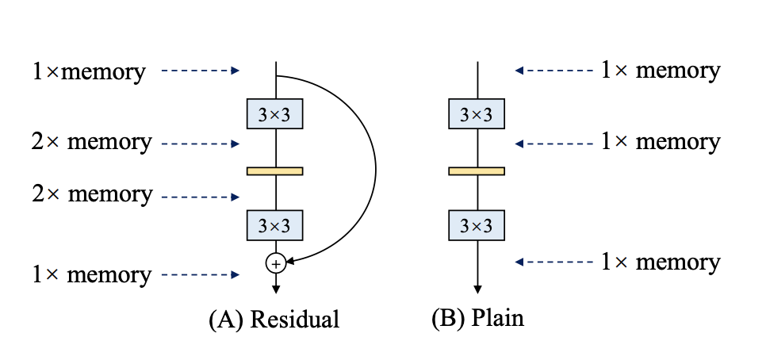
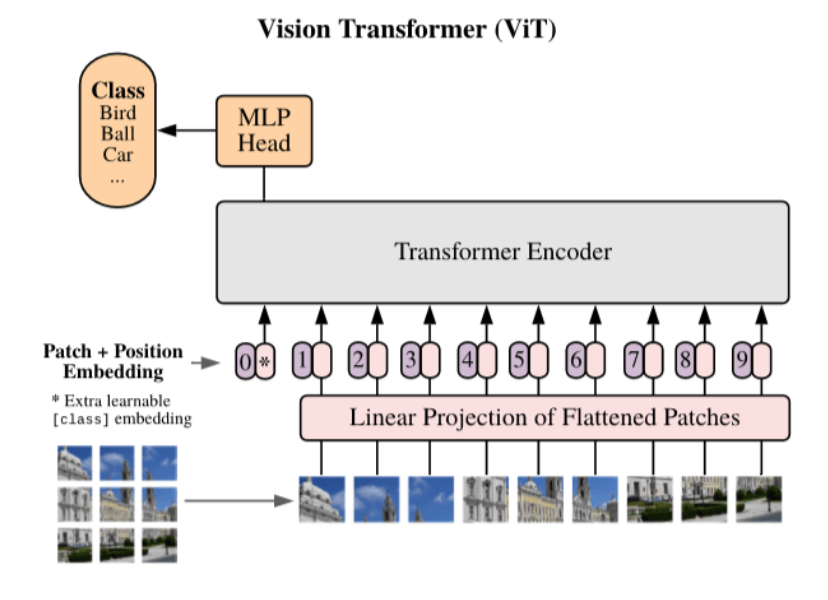

# 图像分类常见问题汇总 - 2021 第 1 季

## 目录
* [1. 第 1 期](#1)(2021.01.05)
* [2. 第 2 期](#2)(2021.01.14)
* [3. 第 3 期](#3)(2020.01.21)
* [4. 第 4 期](#4)(2021.01.28)
* [5. 第 5 期](#5)(2021.02.03)

## 第 1 期

### Q1.1: 在模型导出时，发现导出的 inference model 预测精度很低，这块是为什么呢？

**A**：可以从以下几个方面排查

* 需要先排查下预训练模型路径是否正确。
* 模型导出时，默认的类别数为 1000，如果预训练模型是自定义的类别数，则在导出的时候需要指定参数 `--class_num=k`，k 是自定义的类别数。
* 可以对比下 `tools/infer/infer.py` 和 `tools/infer/predict.py` 针对相同输入的输出 class id 与 score，如果完全相同，则可能是预训练模型自身的精度很差。

### Q1.2: 训练样本的类别不均衡，这个该怎么处理呢？

**A**：有以下几种比较常用的处理方法。

* 从采样的角度出发的话
    * 可以对样本根据类别进行动态采样，每个类别都设置不同的采样概率，保证不同类别的图片在同一个 minibatch 或者同一个 epoch 内，不同类别的训练样本数量基本一致或者符合自己期望的比例。
    * 可以使用过采样的方法，对图片数量较少的类别进行过采样。
* 从损失函数的角度出发的话
    * 可以使用 OHEM(online hard example miniing)的方法，对根据样本的 loss 进行筛选，筛选出 hard example 用于模型的梯度反传和参数更新。
    * 可以使用 Focal loss 的方法，对一些比较容易的样本的 loss 赋予较小的权重，对于难样本的 loss 赋予较大的权重，从而让容易样本的 loss 对网络整体的 loss 有贡献，但是又不会主导 loss。

### Q1.3 在 docker 中训练的时候，数据路径和配置均没问题，但是一直报错 `SystemError: (Fatal) Blocking queue is killed because the data reader raises an exception`，这是为什么呢？

**A**：这可能是因为 docker 中共享内存太小导致的。创建 docker 的时候，`/dev/shm` 的默认大小为 64M，如果使用多进程读取数据，共享内存可能不够，因此需要给 `/dev/shm` 分配更大的空间，在创建 docker 的时候，传入 `--shm-size=8g` 表示给 `/dev/shm`  分配 8G 的空间，一般是够用的。

### Q1.4 PaddleClas 提供的 10W 类图像分类预训练模型在哪里下载，应该怎么使用呢？

**A**：基于 ResNet50_vd, 百度开源了自研的大规模分类预训练模型，其中训练数据为 10 万个类别，4300 万张图片。10 万类预训练模型的下载地址：[下载地址](https://paddle-imagenet-models-name.bj.bcebos.com/ResNet50_vd_10w_pretrained.tar)，在这里需要注意的是，该预训练模型没有提供最后的 FC 层参数，因此无法直接拿来预测；但是可以使用它作为预训练模型，在自己的数据集上进行微调。经过验证，该预训练模型相比于基于 ImageNet1k 数据集的 ResNet50_vd 预训练模型，在不同的数据集上均有比较明显的精度收益，最多可达 30%。
<!-- TODO(gaotingquan): -->
<!-- ，更多的对比实验可以参考：[图像分类迁移学习教程](../application/transfer_learning.md)。 -->

### Q1.5 使用 C++ 进行预测部署的时候怎么进行加速呢？

**A**：可以从以下几个方面加速预测过程。

1. 如果是 CPU 预测的话，可以开启 mkldnn 进行预测，同时适当增大运算的线程数(cpu_math_library_num_threads，在 `tools/config.txt` 中)，一般设置为 6~10 比较有效。
2. 如果是 GPU 预测的话，在硬件条件允许的情况下，可以开启 TensorRT 预测以及 FP16 预测，这可以进一步加快预测速度。
3. 在内存或者显存足够的情况下，可以增大预测的 batch size。
4. 可以将图像预处理的逻辑(主要设计 resize、crop、normalize 等)放在 GPU 上运行，这可以进一步加速预测过程。

更多的预测部署加速技巧，也欢迎大家补充。

## 第 2 期

### Q2.1: PaddleClas 在设置标签的时候必须从 0 开始吗？class_num 必须等于数据集的类别数吗？

**A**：在 PaddleClas 中，标签默认是从 0 开始，所以，尽量从 0 开始设置标签，当然，从其他值开始设置也可以，这样会导致设置的 class_num 增大，进而导致分类的 FC 层参数量较大，权重文件会占用更多的存储空间。在数据集类别连续的情况下，设置的 class_num 要等于数据集类别数（当然大于数据集类别数也可以，在很多数据集上甚至可以获得更高的精度，但同样会使 FC 层参数量较大），在数据集类别数不连续的情况下，设置的 class_num 要等于数据集中最大的 class_id+1。

### Q2.2: 当类别数特别多的时候，最后的 FC 特别大，导致权重文件占用较大的存储空间，该怎么解决？

**A**：最终的 FC 的权重是一个大的矩阵，大小为 C*class_num，其中 C 为 FC 前一层的神经单元个数，如 ResNet50 中的 C 为 2048，可以通过降低 C 的值来进一步减小 FC 权重的大小，比如，可以在 GAP 之后加一层维数较小的 FC 层，这样可以大大缩小最终分类层的权重大小。

### Q2.3: 为什么使用 PaddleClas 在自定义的数据集上训练 ssld 蒸馏没有达到预期？

首先，需要确保 Teacher 模型的精度是否存在问题，其次，需要确保 Student 模型是否成功加载了 ImageNet-1k 的预训练权重以及 Teacher 模型是否成功加载了训练自定义数据集的权重，最后，要确保初次学习率不应太大，至少保证初始学习率不要超过训练 ImageNet-1k 的值。

### Q2.4: 移动端或嵌入式端上哪些网络具有优势？

建议使用移动端系列的网络，网络详情可以参考[移动端系列网络结构介绍](../models/Mobile.md)。如果任务的速度更重要，可以考虑 MobileNetV3 系列，如果模型大小更重要，可以根据移动端系列网络结构介绍中的 StorageSize-Accuracy 来确定具体的结构。

### Q2.5: 既然移动端网络非常快，为什么还要使用诸如 ResNet 这样参数量和计算量较大的网络？

不同的网络结构在不同的设备上运行速度优势不同。在移动端，移动端系列的网络比服务器端的网络运行速度更快，但是在服务器端，相同精度下，ResNet 等经过特定优化后的网络具有更大的优势，所以需要根据具体情况来选择具体的网络结构。

## 第 3 期

### Q3.1: 双（多）分支结构与 Plain 结构，各自有什么特点？

**A**：
以 VGG 为代表的 Plain 网络，发展到以 ResNet 系列（带有残差模块）、Inception 系列（多卷积核并行）为代表的的多分支网络结构，人们发现多分支结构在模型训练阶段更为友好，更大的网络宽度可以带来更强的特征拟合能力，而残差结构则可以避免深度网络梯度消失的问题，但是在推理阶段，带有多分支结构的模型在速度上并无优势，即使多分支结构模型的 FLOPs 要更低，但多分支结构的模型计算密度也更低。例如 VGG16 模型的 FLOPs 远远大于 EfficientNetB3，但是 VGG16 模型的推理速度却显著快于 EfficientNetB3，因此多分支结构在模型训练阶段更为友好，而 Plain 结构模型则更适合于推理阶段，那么以此为出发点，可以在训练阶段使用多分支网络结构，以更大的训练时间成本换取特征拟合能力更强的模型，而在推理阶段，将多分支结构转为 Plain 结构，从而换取更短的推理时间。实现多分支结构到 Plain 结构的转换，可以通过结构重参数化(structural re-parameterization)技术实现。

另外，Plain 结构对于剪枝操作也更为友好。

注：“Plain 结构”与“结构重参数化(structural re-parameterization)技术”出自论文“RepVGG: Making VGG-style ConvNets Great Again”。Plain 结构网络模型指整个网络不存在分支结构，也即网络中第 `i` 层 layer 的输入为第 `i-1` 层 layer 的输出，第 `i` 层 layer 的输出为第 `i+1` 层 layer 的输入。

### Q3.2:  ACNet 的创新点主要在哪里？
**A**：
ACNet 意为“Asymmetric Convolution Block”，即为非对称卷积模块，该思想出自论文“ACNet: Strengthening the Kernel Skeletons for Powerful CNN via Asymmetric Convolution Blocks”，文章提出了以“ACB”结构的三个 CNN 卷积核为一组，用来在训练阶段替代现有卷积神经网络中的传统方形卷积核。

方形卷积核的尺寸为假设为 `d*d`，即宽、高相等均为 `d`，则用于替换该卷积核的 ACB 结构是尺寸为 `d*d`、`1*d`、`d*1` 的三个卷积核，然后再将三个卷积核的输出直接相加，可以得到与原有方形卷积核相同尺寸的计算结果。
而在训练完成后，将 ACB 结构换回原有的方形卷积核，方形卷积核的参数则为 ACB 结构的三个卷积核的参数直接相加（见 `Q3.4`，因此还是使用与之前相同的模型结构用于推理，ACB 结构只是在训练阶段使用。

在训练中，通过 ACB 结构，模型的网络宽度得到了提高，利用 `1*d`、`d*1` 的两个非对称卷积核提取得到更多的特征用于丰富 `d*d` 卷积核提取的特征图的信息。而在推理阶段，这种设计思想并没有带来额外的参数与计算开销。如下图所示，分别是用于训练阶段和部署推理阶段的卷积核形式。

文章作者的实验表明，通过在原有网络模型训练中使用 ACNet 结构可以显著提高模型能力，原作者对此有如下解释：

1. 实验表明，对于一个 `d*d` 的卷积核，相对于消除卷积核角落位置（如上图中卷积核的 `corners` 位置）的参数而言，消除骨架位置（如上图中卷积核的 `skeleton` 位置）的参数会给模型精度带来更大的影响，因此卷积核骨架位置的参数要更为重要，而 ACB 结构中的两个非对称卷积核增强了方形卷积核骨架位置参数的权重，使之作用更为显著。这种相加是否会因正负数抵消作用而减弱骨架位置的参数作用，作者通过实验发现，网络的训练总是会向着提高骨架位置参数作用的方向发展，并没有出现正负数抵消而减弱的现象。
2. 非对称卷积核对于翻转的图像具有更强的鲁棒性，如下图所示，水平的非对称卷积核对于上下翻转的图像具有更强的鲁棒性。对于翻转前后图像中语义上的同一位置，非对称卷积核提取的特征图是相同的，这一点要强于方形卷积核。

### Q3.3:  RepVGG 的创新点主要在哪里？

**A**：
通过 Q3.1 与 Q3.2，我们可以大胆想到，是否可以借鉴 ACNet 将训练阶段与推理阶段解耦，并且训练阶段使用多分支结构，推理阶段使用 Plain 结构，这也就是 RepVGG 的创新点。下图为 ResNet、RepVGG 训练和推理阶段网络结构的对比。

首先训练阶段的 RepVGG 采用多分支结构，可以看作是在传统 VGG 网络的基础上，增加了 `1*1` 卷积和恒等映射的残差结构，而推理阶段的 RepVGG 则退化为 VGG 结构。训练阶段 RepVGG 到推理阶段 RepVGG 的网络结构转换使用“结构重参数化”技术实现。

对于恒等映射，可将其视为参数均为 `1` 的 `1*1` 卷积核作用在输入特征图的输出结果，因此训练阶段的 RepVGG 的卷积模块可以视为两个 `1*1` 卷积和一个 `3*3` 卷积，而 `1*1` 卷积的参数又可以直接相加到 `3*3` 卷积核中心位置的参数上（该操作类似于 ACNet 中，非对称卷积核参数相加到方形卷积核骨架位置参数的操作），通过上述操作，即可在推理阶段，将网络结构中的恒等映射、`1*1 `卷积、`3*3` 卷积三个分支合并为一个 `3*3` 卷积，详见 `Q3.4`。

### Q3.4:  ACNet 与 RepVGG 中的 struct re-parameters 有何异同？

**A**：
通过上面的了解，可以简单理解 RepVGG 是更为极端的 ACNet。ACNet 中的 re-parameters 操作如下图所示：

观察上图，以其中的 `conv2` 为例，该非对称卷积可以视为 `3*3` 的方形卷积核，只不过该方形卷积核的上下六个参数为 `0`，`conv3` 同理。并且，`conv1`、`conv2`、`conv3` 的结果相加，等同于三个卷积核相加再做卷积，以 `Conv` 表示卷积操作，`+`表示矩阵的加法操作，则：`Conv1(A)+Conv2(A)+Conv3(A) == Convk(A)`，其中 `Conv1`、`Conv2`、`Conv3` 的卷积核分别为 `Kernel1`、`kernel2`、`kernel3`，而 `Convk` 的卷积核为 `Kernel1 + kernel2 + kernel3`。

RepVGG 网络与 ACNet 同理，只不过 ACNet 的 `1*d` 非对称卷积变成了 `1*1` 卷积，`1*1` 卷积相加的位置变成了 `3*3` 卷积的中心。

### Q3.5:  影响模型计算速度的因素都有哪些？参数量越大的模型计算速度一定更慢吗？

**A**：
影响模型计算速度的因素有很多，参数量只是其中之一。具体来说，在不考虑硬件差异的前提下，模型的计算速度可以参考以下几个方面：
1. 参数量：用于衡量模型的参数数量，模型的参数量越大，模型在计算时对内存（显存）的容量要求一般也更高。但内存（显存）占用大小不完全取决于参数量。如下图中，假设输入特征图内存占用大小为 `1` 个单位，对于左侧的残差结构而言，由于需要记录两个分支的运算结果，然后再相加，因此该结构在计算时的内存峰值占用是右侧 Plain 结构的两倍。

2. 浮点运算数量（FLOPs）：注意与每秒浮点运算次数（FLOPS）相区分。FLOPs 可以简单理解为计算量，通常用来衡量一个模型的计算复杂度。
以常见的卷积操作为例，在不考虑 batch size、激活函数、stride 操作、bias 的前提下，假设 input future map 尺寸为 `Min*Min`，通道数为 `Cin`，output future map 尺寸为 `Mout*Mout`，通道数为 `Cout`，conv kernel 尺寸为 `K*K`，则进行一次卷积的 FLOPs 可以通过下述方式计算：
    1. 输出特征图包含特征点的数量为：`Cout * Mout * Mout`；
    2. 对于输出特征图中的每一个特征点的卷积操作而言：
        乘法计算数量为：`Cin * K * K`；
        加法计算数量为：`Cin * K * K - 1`；
    3. 因此计算总量为：`Cout * Mout * Mout * (Cin * K * K + Cin * K * K - 1)`，也即 `Cout * Mout * Mout * (2Cin * K * K - 1)`。
3. Memory Access Cost（MAC）：内存访问成本，由于计算机在对数据进行运算（例如乘法、加法）前，需要将运算的数据从内存（此处泛指内存，包括显存）读取到运算器的 Cache 中，而内存的访问是十分耗时的。以分组卷积为例，假设分为 `g` 组，虽然分组后模型的参数量和 FLOPs 没有变化，但是分组卷积的内存访问次数成为之前的 `g` 倍（此处只是简单计算，未考虑多级 Cache），因此 MAC 显著提高，模型的计算速度也相应变慢。
4. 并行度：常说的并行度包括数据并行和模型并行两部分，此处是指模型并行。以卷积操作为例，一个卷积层的参数量通常十分庞大，如果将卷积层中的矩阵做分块处理，然后分别交由多个 GPU 进行运算，即可达到加速的目的。甚至有的网络层参数量过大，单张 GPU 显存无法容纳时，也可能将该层分由多个 GPU 计算，但是能否分由多个 GPU 并行运算，不仅取决于硬件条件，也受特定的运算形式所限制。当然，并行度越高的模型，其运行速度也越快。

## 第 4 期

### Q4.1: 图像分类任务中，有一部分合成数据，这一部分合成数据是否需要使用样本均衡？

**A**:

1. 不同类别的样本数如果差异过大，某类样本因合成数据集扩充至其他类的数倍以上，需要做适当减小该类的权值。
2. 如果是有的类别是合成而有的类别半合成半真实，只要数量在一个量级可不做均衡，并尝试训练一下，测试该合成类别样本是否能够准确识别。
3. 如果不同来源数据的类别因合成数据增大问题，造成性能衰减，需要考虑合成数据集是否有噪声或者难例样本，也可适当增加该类别权重，获得该类别更好的识别性能。

### Q4.2: 学术界将 Vision Transformer(ViT)引入图像分类领域，将对图像分类带来什么新的机遇和挑战？相比于 CNN 的优势？

论文地址[AN IMAGE IS WORTH 16X16 WORDS: TRANSFORMERS FOR IMAGE RECOGNITION AT SCALE](https://openreview.net/pdf?id=YicbFdNTTy)

**A**:
1. 图像对 CNN 的依赖是不必要的，利用 Transformer 的计算效率和可伸缩性，可以训练很大模型，当模型和数据集增大的情形下，仍然不会存在饱和的情况。受到 Transformer 在 NLP 上的启发，在图像分类任务中使用时，将图片分成顺序排列的 patches，并将这些 patches 输入一个线性单元嵌入到 embedding 作为 transformer 的输入。

2. 在中等规模数据集中如 ImageNet1k，ImageNet21k，视觉 Transformer 模型低于相同规模尺寸的 ResNet 几个百分点。猜测这是因为 transformer 缺少 CNN 所具有的局部性(Locality)和空间不变性(Spatial Invariance)的特点，而在数据量不够大的时候，难以超越卷积网络，不过对于这一问题，[DeiT](https://arxiv.org/abs/2012.12877) 使用数据增强的方式在一定程度上解决了 Vision Transformer 依赖超大规模数据集训练的问题。

3. 在超大规模数据集 14M-300M 训练时，这种方式可以越过局部信息，建模更加长距离的依赖关系，而 CNN 能较好关注局部信息全局信息捕获能力较弱。

4. Transformer 一度在 NLP 领域一统江湖，也一度被质疑不适用于 CV 领域，当前出来的几片视觉领域的文章，性能也是直逼 CNN 的 SOTA。相信在未来能够提出 Vision-Language 联合或者多模态的模型，能够一并解决视觉和语言问题。

### Q4.3: 对于 Vision Transformer 模型，是如何将图像转换成序列信息传给 Encoder？

**A**:

1. 使用 Transformer 模型，主要是使用其中的注意力方法。我们希望构想一个适用语义 embedding 信息的场景，但是图像分类与序列的语义信息关联性不大，因此 Vision Transformer 有其独特的设计。ViT 的目标也正是希望使用注意力机制来代替 CNN。

2. 考虑 Transformer 中 Encoder 编码器的输入形式，如下图:
    * (1)不定长度的顺序输入，因为它是 RNN 结构，一句话，单词数不一样。如果是 NLP 场景，换词的顺序不太过于影响语义，但是图像换了不同区域的位置，不同区域连接顺序不同，将造成极大理解偏差。
    * (2)单个 patch 位置信息通过变换成一个维度固定的向量，Encoder 输入是 patch 像素信息 embedding，与一些固定位置的向量 concate，合成一个维度固定的向量和位置信息在其中。

3. 考虑以下问题：怎样将一张图片传给 encoder？

* 如下图所示。假设输入图片是[224,224,3]，按照顺序从左到右，从上到下，切分成很多个 patch，patch 大小可以为[p,p,3]（p 取值可以是 16，32），对其使用 Linear Projection of Flattened Patches 模块转成特征向量，并 concat 一个位置向量，传入 Encoder 中。

4. 如上图，给定一个 `H×W×C` 的图像以及区块大小 P，可以把图像划分为 `N` 个 `P×P×C` 的区块，`N=H×W/(P×P)`。得到区块后要使用线性变换转为 D 维特征向量，再加上位置编码向量即可。和 BERT 类似，ViT 在序列之前也加入了一个分类标志位，记为 `[CLS]`。ViT 输入序列 `z` 如下面的公式所示，其中 `x` 表示一个图像区块。

5. ViT 模型和 Transformer 基本一样，输入序列传入 ViT，然后利用 `[CLS]` 标志位的最终输出特征进行分类。ViT 主要由 MSA(多头自注意力)和 MLP(两层使用 GELU 激活函数的全连接网络)组成，在 MSA 和 MLP 之前加上 LayerNorm 和残差连接。

### Q4.4: 如何理解归纳偏置 Inductive Bias？

**A**:
1. 在机器学习中，会对算需要应用的问题做一些假设，这个假设就称为归纳偏好。在现实生活中观察得到的现象中归纳出一定的先验规则，然后对模型做一定的约束，从而起到模型选择的作用。在 CNN 中，假设特征具有局部性(Locality)和空间不变性(Spatial Invariance)的特点，即把相邻的特征有联系而远离的没有，将相邻特征融合在一起，更会容易产生“解”；还有 attention 机制，也是从人的直觉、生活经验归纳的规则。

2. Vision Transformer 利用的归纳偏置是有序列能力 Sequentiality 和时间不变性 Time Invariance，即序列顺序上的时间间隔的联系，因此也能得出在更大规模数据集上比 CNN 类的模型有更好的性能。文章 Conclusion 里的“Unlike prior works using self-attention in computer vision, we do not introduce any image-specific inductive biases into the architecture”和 Introduction 里的“We find that large scale training trumps inductive bias”，可以得出直观上 inductive bias 在大量数据的情况中的产生是衰减性能，应该尽可能丢弃。

### Q4.5: ViT 为什么要增加一个[CLS]标志位? 为什么将[CLS]标志位对应的向量作为整个序列的语义表示?

**A**:
1. 和 BERT 相类似，ViT 在第一个 patch 前添加一个`[CLS]`标志位，最后一个结束标志位对应的向量可以作为整个图像的语义表示，从而用于下游的分类任务等。从而使得整个 embedding 组可以表征该图像不同位置的特征。

2. 将 `[CLS]` 标志位对应的向量作为整个图像的语义表示，是因为与图像中已有的其它 patch 块图像相比，这个无明显语义信息的符号会更“公平”地融合图像中各个 patch 的语义信息，从而更好的表示整个图像的语义。

## 第 5 期

### Q5.1: PaddleClas 训练配置文件中都包含了哪些内容？训练模型时如何进行修改？
**A**:
PaddleClas 的模型包含 6 大模块的配置，分别为：全局配置，网络结构(ARCHITECTURE)，学习率(LEARNING_RATE)，优化器(OPTIMIZER)，训练(TRAIN)和验证(VALID)。

全局配置主要包含了任务的配置信息，例如类别的数量，训练集内的数据量，训练的 epoch 数量，网络输入的尺寸等等。如果要训练自定义的任务，或是使用自己的训练集，需要关注这个部分。

网络结构的配置定义了要使用的网络。在实际使用时，首先要选择合适的配置文件，所以通常不会修改这部分配置。只有在自定义网络结构，或者对任务有特殊要求时才进行修改。

学习率和优化器的配置建议优先使用默认配置，这些参数是我们已经调过的。如果任务的改动比较大，也可以做微调。

训练和预测两个配置包含了 batch_size，数据集，数据预处理(transforms)，读数据进程数(num_workers)等比较重要的配置，这部分要根据实际环境适度修改。要注意的是，paddleclas 中的 batch_size 是单卡配置，如果是多卡训练，则总的 batch_size 是配置文件中所设置的倍数，例如配置文件中设置 batch_size 为 64，4 卡训练，总 batch_size 也就是 4*64=256。而 num_workers 定义的是单卡的进程数，即如果 num_workers 是 8，并且使用 4 卡训练，则实际有 32 个 worker.

### Q5.2: 如何在命令行中快速的修改配置？
**A**:
在训练中，我们常常需要对个别配置不断进行微调，而不希望频繁的修改配置文件。这时可以使用 -o 来调整，修改是要先按层级写出要改的配置名称，层级之间用点分割，再写出要修改的值。例如我们想要修改 batch_size，可以在训练的命令后加上-o DataLoader.TRAIN.sampler.batch_size=512。

### Q5.3: 如何根据 PaddleClas 的精度曲线选择合适的模型？
**A**:
PaddleClas 提供了多个模型的 benchmark，并绘制了性能曲线，主要有三种：准确率-预测时间曲线，准确率-参数量曲线和准确率-FLOPS 曲线，纵轴为准确率，横轴分别为预测时间、参数量、FLOPS。一般来说，不同模型在三个图上的表现是一致的。同一个系列的模型在图上采用相同的符号来表示，并且用曲线连接。

以准确率-预测时间曲线为例，点越靠上表明准确率越高，约靠左表明速度越快。例如左上区域的模型为又快又准的模型，而最左侧贴近纵轴的点则为轻量级的模型。使用时，可以综合考虑准确率和时间因素，选择合适的模型。举个例子，我们希望模型的运行时间在 10ms 以下，选择最准确的模型。首先，在横轴的 10ms 出画一条垂直的线，之后在这条线的左侧找到最高的点，就是符合要求的模型。

实际使用中，模型的参数量和 FLOPS 是稳定不变的，而运算时间在不同的软硬件条件下均会有所变化。如果想更准确的选择模型，那么可以在自己的环境中运行测试，得到该环境下的性能图。

### Q5.4: 想在 imagenet 中增加两个类，能不能把现有全连接层的参数固定，只训练新的两个类别？
**A**:
这个想法理论上可行，但效果恐怕不会太好。如果只是固定全连接层，而前面的卷积层参数发生了变化，那么这些全连接层的作用也无法保证与开始一样。而如果保持整个网络的参数都不变，只训练全连接层的新增两个类别，也比较难训练处理想的结果。

如果实际使用中确实需要原有的 1000 个类别依然很准确，那么可以将新类别的数据加入到原有训练集中，再用预训练模型进行 finetune。如果只需要 1000 个类中的几个类别，那么可以把这部分的数据挑出来，和新增数据混合再 finetune。

### Q5.5: 使用分类模型做其他任务的预训练模型时，应该选择哪些层作为 feature？
**A**:
使用分类模型做其他任务的 backbone 有很多策略，这里介绍一种较为基础的方法。首先，去掉最后的全连接层，这一层主要包含的是原始任务的分类信息。如果任务比较简单，只要将前一层的输出作为 featuremap，并在此基础上添加与任务对应的结构即可。如果任务涉及多尺度，需要选取不同尺度的 anchor，例如某些检测模型，那么可以选取每次下采样之前一层的输出作为 featuremap。
