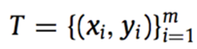
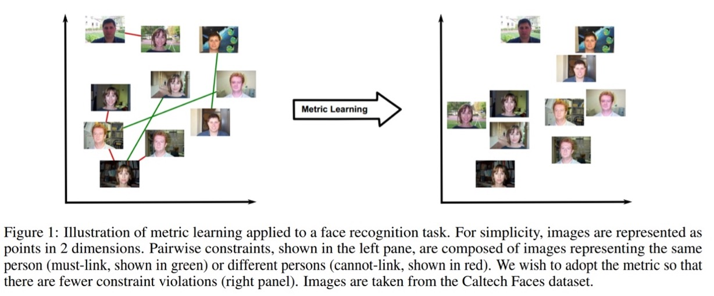

# Metric Learning

## 简介
   在机器学习中，我们经常会遇到度量数据间距离的问题。一般来说，对于可度量的数据，我们可以直接通过欧式距离(Euclidean Distance)，向量内积（Inner Product）或者是余弦相似度（Cosine Similarity）来进行计算。但对于非结构化数据来说，我们却很难进行这样的操作，如计算一段视频和一首音乐的匹配程度。由于数据格式的不同，我们难以直接进行上述的向量运算，但先验知识告诉我们ED(laugh_video, laugh_music) < ED(laugh_video, blue_music), 如何去有效得表征这种”距离”关系呢? 这就是Metric Learning所要研究的课题。
   
   Metric learning全称是 Distance metric learning，它是通过机器学习的形式，根据训练数据，自动构造出一种基于特定任务的度量函数。其常见的任务形式如下：

 
给定如上训练集，X表示样本，Y表示标签。Metric Learning的目标就是学习一个变换函数（线性非线性均可）L将数据点从原始的向量空间映射到一个新的向量空间，在新的向量空间里相似点的距离更近，非相似点的距离更远，使得度量更符合任务的要求。 Deep Metric learning，就是用深度神经网络来拟合这个变换函数。

## 应用
   Metric Learning技术在生活实际中应用广泛，如我们耳熟能详的人脸识别（Face Recognition）、行人重识别（Person ReID）、图像检索（Image Retrieval）、细粒度分类（Fine-gained classification）等.  随着深度学习在工业实践中越来越广泛的应用，目前大家研究的方向基本都偏向于Deep Metric Learning（DML）.  

## 算法
   Metric Learning主要有如下两种学习范式：
### 1.	Classification based:  
   这是一类基于分类标签的Metric Learning方法。这类方法通过将每个样本分类到正确的类别中，来学习有效的特征表示，学习过程中需要每个样本的显式标签参与Loss计算。常见的算法有L2-Softmax, Large-margin Softmax, Angular Softmax, NormFace, AM-Softmax, CosFace, ArcFace等。 
   这类方法也被称作是proxy-based, 因为其本质上优化的是样本和一堆proxies之间的相似度。
### 2.	Pairwise based: 
   这是一类基于样本对的学习范式。他以样本对作为输入，通过直接学习样本对之间的相似度来得到有效的特征表示，常见的算法包括：Contrastive loss, Triplet loss, Lifted-Structure loss, N-pair loss, Histogram loss, Angular loss, Margin-based loss, Multi-Similarity loss等

2021年发表的CircleLoss，从一个全新的视角统一了两种学习范式，让研究人员和从业者对Metric Learning问题有了更进一步的思考。

