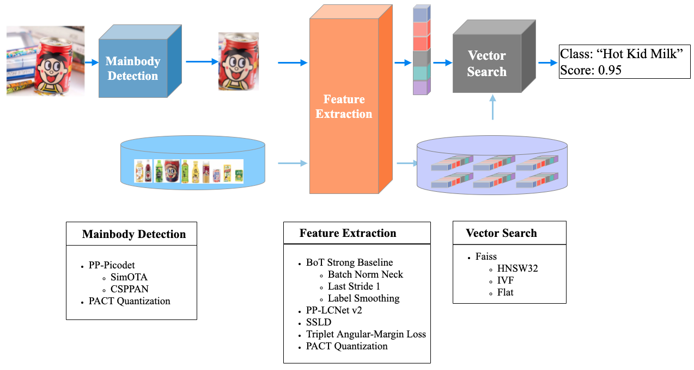

## PP-ShiTuV2图像识别系统

## 目录

- [PP-ShiTuV2简介](#pp-shituv2简介)
  - [数据集介绍](#数据集介绍)
  - [模型训练](#模型训练)
  - [模型评估](#模型评估)
  - [模型推理](#模型推理)
  - [模型部署](#模型部署)
- [模块介绍](#模块介绍)
  - [主体检测模型](#主体检测模型)
  - [特征提取模型](#特征提取模型)
    - [训练数据集优化与扩充](#训练数据集优化与扩充)
    - [骨干网络优化](#骨干网络优化)
    - [网络结构优化](#网络结构优化)
    - [数据增强优化](#数据增强优化)
- [参考文献](#参考文献)

## PP-ShiTuV2简介

PP-ShiTuV2 是基于 PP-ShiTuV1 改进的一个实用轻量级通用图像识别系统，相比 PP-ShiTuV1 具有更高的识别精度、更强的泛化能力以及相近的推理速度<sup>*</sup>。该系统主要针对**训练数据集**、特征提取两个部分进行优化，使用了更优的骨干网络、损失函数与训练策略。使得 PP-ShiTuV2 在多个实际应用场景上的检索性能有显著提升。

<div align="center">

</div>

### 数据集介绍

我们将训练数据进行了合理扩充与优化，更多细节请参考 [PP-ShiTuV2 数据集](../image_recognition_pipeline/feature_extraction.md#4-实验部分)。

下面以 [PP-ShiTuV2](../image_recognition_pipeline/feature_extraction.md#4-实验部分) 的数据集为例，介绍 PP-ShiTuV2 模型的训练、评估、推理流程。

### 模型训练

首先下载好 [PP-ShiTuV2 数据集](../image_recognition_pipeline/feature_extraction.md#4-实验部分) 中的16个数据集并手动进行合并、生成标注文本文件 `train_reg_all_data_v2.txt`，最后放置到 `dataset` 目录下。

合并后的文件夹结构如下所示：

```python
dataset/
├── Aliproduct/ # Aliproduct数据集文件夹
├── SOP/ # SOPt数据集文件夹
├── ...
├── Products-10k/ # Products-10k数据集文件夹
├── ...
└── train_reg_all_data_v2.txt # 标注文本文件
```
生成的 `train_reg_all_data_v2.txt` 内容如下所示：

```log
...
Aliproduct/train/50029/1766228.jpg 50029
Aliproduct/train/50029/1764348.jpg 50029
...
Products-10k/train/88823.jpg 186440
Products-10k/train/88824.jpg 186440
...
```

然后在终端运行以下命令进行训练：

```shell
# 使用0号GPU进行单卡训练
export CUDA_VISIBLE_DEVICES=0
python3.7 tools/train.py \
-c ./ppcls/configs/GeneralRecognitionV2/GeneralRecognitionV2_PPLCNetV2_base.yaml

# 使用0,1,2,3,4,5,6,7号GPU进行8卡分布式训练
export CUDA_VISIBLE_DEVICES=0,1,2,3,4,5,6,7
python3.7 -m paddle.distributed.launch tools/train.py \
-c ./ppcls/configs/GeneralRecognitionV2/GeneralRecognitionV2_PPLCNetV2_base.yaml
```
**注：** 在训练时默认会开启`eval_during_train`，每训练完 `eval_interval` 个epoch就会在配置文件中 `Eval` 指定的数据集上（默认为 Aliproduct ）进行模型评估并计算得到参考指标。

### 模型评估

参考 [模型评估](../image_recognition_pipeline/feature_extraction.md#53-模型评估)

### 模型推理

参考 [Python模型推理](../quick_start/quick_start_recognition.md#22-图像识别体验) 和 [C++ 模型推理](../../../deploy/cpp_shitu/readme.md)

### 模型部署

参考 [模型部署](../inference_deployment/recognition_serving_deploy.md#3-图像识别服务部署)

## 模块介绍

### 主体检测模型

主体检测模型使用 `PicoDet-LCNet_x2_5`，详细信息参考：[picodet_lcnet_x2_5_640_mainbody](../image_recognition_pipeline/mainbody_detection.md)。

### 特征提取模型

#### 训练数据集优化与扩充

在 PP-ShiTuV1 所用训练数据集的基础上，我们去掉了使用范围较小的 iCartoonFace 数据集，同时加入了更多常见、使用范围更广的数据集，如 bird400、Cars、Products-10k、fruits-262。

#### 骨干网络优化

我们将骨干网络从 `PPLCNet_x2_5` 替换成了 [`PPLCNetV2_base`](../models/PP-LCNetV2.md)，相比 `PPLCNet_x2_5`， `PPLCNetV2_base` 基本保持了较高的分类精度，并减少了40%的推理时间<sup>*</sup>。

**注：** <sup>*</sup>推理环境基于 Intel(R) Xeon(R) Gold 6271C CPU @ 2.60GHz 硬件平台，OpenVINO 推理平台。

#### 网络结构优化

我们对 `PPLCNetV2_base` 结构做了微调，并加入了在行人重检测、地标检索、人脸识别等任务上较为通用有效的优化调整。主要包括以下几点：

1. `PPLCNetV2_base` 结构微调：实验发现网络末尾的 [`ReLU`](../../../ppcls/arch/backbone/legendary_models/pp_lcnet_v2.py#L322) 对检索性能有较大影响， [`FC`](../../../ppcls/arch/backbone/legendary_models/pp_lcnet_v2.py#L325) 也会导致检索性能轻微掉点，因此我们去掉了 BackBone 末尾的 `ReLU` 和 `FC`。

2. `last stride=1`：只将最后一个 stage 的 stride 改为1，即不进行下采样，以此增加最后输出的特征图的语义信息，同时不对推理速度产生太大影响。

3. `BN Neck`：在全局池化层后加入一个 `BatchNorm1D` 结构，对特征向量的每个维度进行标准化，使得模型更快地收敛。

    | 模型                                                               | training data     | recall@1%(mAP%) |
    | :----------------------------------------------------------------- | :---------------- | :-------------- |
    | PP-ShiTuV1                                                         | PP-ShiTuV1 数据集 | 63.0(51.5)      |
    | PP-ShiTuV1+`PPLCNetV2_base`+`last_stride=1`+`BNNeck`+`TripletLoss` | PP-ShiTuV1 数据集 | 72.3(60.5)      |

4. `TripletAngularMarginLoss`：我们基于原始的 `TripletLoss` (困难三元组损失)进行了改进，将优化目标从 L2 欧几里得空间更换成余弦空间，并额外加入了 anchor 与 positive/negtive 之间的硬性距离约束，让训练与测试的目标更加接近，提升模型的泛化能力。

    | 模型                                                                            | training data     | recall@1%(mAP%) |
    | :------------------------------------------------------------------------------ | :---------------- | :-------------- |
    | PP-ShiTuV1+`PPLCNetV2_base`+`last_stride=1`+`BNNeck`+`TripletLoss`              | PP-ShiTuV2 数据集 | 71.9(60.2)      |
    | PP-ShiTuV1+`PPLCNetV2_base`+`last_stride=1`+`BNNeck`+`TripletAngularMarginLoss` | PP-ShiTuV2 数据集 | 73.7(61.0)      |

#### 数据增强优化

我们考虑到实际相机拍摄时目标主体可能出现一定的旋转而不一定能保持正立状态，因此我们在数据增强中加入了适当的 [随机旋转增强](../../../ppcls/configs/GeneralRecognitionV2/GeneralRecognitionV2_PPLCNetV2_base.yaml#L117)，以提升模型在真实场景中的检索能力。

结合以上3个优化点，最终在多个数据集的实验结果如下：

  | 模型       | product<sup>*</sup> |
  | :--------- | :------------------ |
  | -          | recall@1%(mAP%)     |
  | PP-ShiTuV1 | 63.0(51.5)          |
  | PP-ShiTuV2 | 73.7(61.0)          |

  | 模型       | Aliproduct      | VeRI-Wild       | LogoDet-3k      | iCartoonFace    | SOP             | Inshop          |
  | :--------- | :-------------- | :-------------- | :-------------- | :-------------- | :-------------- | :-------------- |
  | -          | recall@1%(mAP%) | recall@1%(mAP%) | recall@1%(mAP%) | recall@1%(mAP%) | recall@1%(mAP%) | recall@1%(mAP%) |
  | PP-ShiTuV1 | 83.9(83.2)      | 88.7(60.1)      | 86.1(73.6)      | 84.1(72.3)      | 79.7(58.6)      | 89.1(69.4)      |
  | PP-ShiTuV2 | 84.2(83.3)      | 87.8(68.8)      | 88.0(63.2)      | 53.6(27.5)      | 77.6(55.3)      | 90.8(74.3)      |

  | 模型       | gldv2           | imdb_face       | iNat            | instre          | sketch          | sop<sup>*</sup> |
  | :--------- | :-------------- | :-------------- | :-------------- | :-------------- | :-------------- | :-------------- |
  | -          | recall@1%(mAP%) | recall@1%(mAP%) | recall@1%(mAP%) | recall@1%(mAP%) | recall@1%(mAP%) | recall@1%(mAP%) |
  | PP-ShiTuV1 | 98.2(91.6)      | 28.8(8.42)      | 12.6(6.1)       | 72.0(50.4)      | 27.9(9.5)       | 97.6(90.3)      |
  | PP-ShiTuV2 | 98.1(90.5)      | 35.9(11.2)      | 38.6(23.9)      | 87.7(71.4)      | 39.3(15.6)      | 98.3(90.9)      |

**注：** product数据集是为了验证PP-ShiTu的泛化性能而制作的数据集，所有的数据都没有在训练和测试集中出现。该数据包含8个大类（人脸、化妆品、地标、红酒、手表、车、运动鞋、饮料），299个小类。测试时，使用299个小类的标签进行测试；sop数据集来自[GPR1200: A Benchmark for General-Purpose Content-Based Image Retrieval](https://arxiv.org/abs/2111.13122)，可视为“SOP”数据集的子集。

## 参考文献
1. Schall, Konstantin, et al. "GPR1200: A Benchmark for General-Purpose Content-Based Image Retrieval." International Conference on Multimedia Modeling. Springer, Cham, 2022.
2. Luo, Hao, et al. "A strong baseline and batch normalization neck for deep person re-identification." IEEE Transactions on Multimedia 22.10 (2019): 2597-2609.
