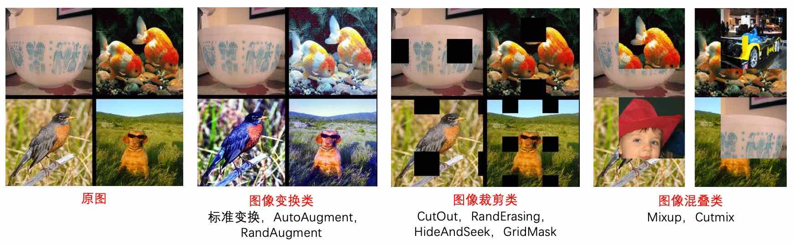

# 一、数据增广

在图像分类任务中，图像数据的增广是一种常用的正则化方法，常用于数据量不足或者模型参数较多的场景。在本章节中，我们将对除 ImageNet 分类任务标准数据增广外的8种数据增广方式进行简单的介绍和对比，用户也可以将这些增广方法应用到自己的任务中，以获得模型精度的提升。这8种数据增广方式在ImageNet上的精度指标如下所示。


# 二、常用数据增广方法

如果没有特殊说明，本章节中所有示例为 ImageNet 分类，并且假设最终输入网络的数据维度为：`[batch-size, 3, 224, 224]`

其中 ImageNet 分类训练阶段的标准数据增广方式分为以下几个步骤：

1. 图像解码：简写为 `ImageDecode`
2. 随机裁剪到长宽均为 224 的图像：简写为 `RandCrop`
3. 水平方向随机翻转：简写为 `RandFlip`
4. 图像数据的归一化：简写为 `Normalize`
5. 图像数据的重排，`[224, 224, 3]` 变为 `[3, 224, 224]`：简写为 `Transpose`
6. 多幅图像数据组成 batch 数据，如 `batch-size` 个 `[3, 224, 224]` 的图像数据拼组成 `[batch-size, 3, 224, 224]`：简写为 `Batch`

相比于上述标准的图像增广方法，研究者也提出了很多改进的图像增广策略，这些策略均是在标准增广方法的不同阶段插入一定的操作，基于这些策略操作所处的不同阶段，我们将其分为了三类：

1. 对 `RandCrop` 后的 224 的图像进行一些变换: AutoAugment，RandAugment
2. 对`Transpose` 后的 224 的图像进行一些裁剪: CutOut，RandErasing，HideAndSeek，GridMask
3. 对 `Batch` 后的数据进行混合: Mixup，Cutmix

增广后的可视化效果如下所示。



具体如下表所示：


| 变换方法        | 输入                        | 输出                        | Auto-<br>Augment\[1\] | Rand-<br>Augment\[2\] | CutOut\[3\] | Rand<br>Erasing\[4\] | HideAnd-<br>Seek\[5\] | GridMask\[6\] | Mixup\[7\] | Cutmix\[8\] |
|-------------|---------------------------|---------------------------|------------------|------------------|-------------|------------------|------------------|---------------|------------|------------|
| Image<br>Decode | Binary                    | (224, 224, 3)<br>uint8      | Y                | Y                | Y           | Y                | Y                | Y             | Y          | Y |
| RandCrop    | (:, :, 3)<br>uint8          | (224, 224, 3)<br>uint8      | Y                | Y                | Y           | Y                | Y                | Y             | Y          | Y |
| **Process**     | (224, 224, 3)<br>uint8      | (224, 224, 3)<br>uint8      | Y                | Y                | \-          | \-               | \-               | \-            | \-         | \- |
| RandFlip    | (224, 224, 3)<br>uint8      | (224, 224, 3)<br>float32    | Y                | Y                | Y           | Y                | Y                | Y             | Y          | Y |
| Normalize   | (224, 224, 3)<br>uint8      | (3, 224, 224)<br>float32    | Y                | Y                | Y           | Y                | Y                | Y             | Y          | Y |
| Transpose   | (224, 224, 3)<br>float32    | (3, 224, 224)<br>float32    | Y                | Y                | Y           | Y                | Y                | Y             | Y          | Y |
| **Process**     | (3, 224, 224)<br>float32    | (3, 224, 224)<br>float32    | \-               | \-               | Y           | Y                | Y                | Y             | \-         | \- |
| Batch       | (3, 224, 224)<br>float32    | (N, 3, 224, 224)<br>float32 | Y                | Y                | Y           | Y                | Y                | Y             | Y          | Y |
| **Process**     | (N, 3, 224, 224)<br>float32 | (N, 3, 224, 224)<br>float32 | \-               | \-               | \-          | \-               | \-               | \-            | Y          | Y |


PaddleClas中集成了上述所有的数据增广策略，每种数据增广策略的参考论文与参考开源代码均在下面的介绍中列出。下文将介绍这些策略的原理与使用方法，并以下图为例，对变换后的效果进行可视化。为了说明问题，本章节中将 `RandCrop` 替换为 `Resize`。

![][test_baseline]

# 三、图像变换类

图像变换类指的是对 `RandCrop` 后的 224 的图像进行一些变换，主要包括

+ AutoAugment
+ RandAugment

## 3.1 AutoAugment

论文地址：[https://arxiv.org/abs/1805.09501v1](https://arxiv.org/abs/1805.09501v1)

开源代码github地址：[https://github.com/DeepVoltaire/AutoAugment](https://github.com/DeepVoltaire/AutoAugment)

不同于常规的人工设计图像增广方式，AutoAugment 是在一系列图像增广子策略的搜索空间中通过搜索算法找到的适合特定数据集的图像增广方案。针对 ImageNet 数据集，最终搜索出来的数据增广方案包含 25 个子策略组合，每个子策略中都包含两种变换，针对每幅图像都随机的挑选一个子策略组合，然后以一定的概率来决定是否执行子策略中的每种变换。

PaddleClas中`AutoAugment`的使用方法如下所示。

```python
from ppcls.data.imaug import DecodeImage
from ppcls.data.imaug import ResizeImage
from ppcls.data.imaug import ImageNetPolicy
from ppcls.data.imaug import transform

size = 224

decode_op = DecodeImage()
resize_op = ResizeImage(size=(size, size))
autoaugment_op = ImageNetPolicy()

ops = [decode_op, resize_op, autoaugment_op]

imgs_dir = 图像路径
fnames = os.listdir(imgs_dir)
for f in fnames:
    data = open(os.path.join(imgs_dir, f)).read()
    img = transform(data, ops)
```

结果如下图所示。

![][test_autoaugment]

## 3.2 RandAugment

论文地址：[https://arxiv.org/pdf/1909.13719.pdf](https://arxiv.org/pdf/1909.13719.pdf)

开源代码github地址：[https://github.com/heartInsert/randaugment](https://github.com/heartInsert/randaugment)


`AutoAugment` 的搜索方法比较暴力，直接在数据集上搜索针对该数据集的最优策略，其计算量很大。在 `RandAugment` 文章中作者发现，一方面，针对越大的模型，越大的数据集，使用 `AutoAugment` 方式搜索到的增广方式产生的收益也就越小；另一方面，这种搜索出的最优策略是针对该数据集的，其迁移能力较差，并不太适合迁移到其他数据集上。

在 `RandAugment` 中，作者提出了一种随机增广的方式，不再像 `AutoAugment` 中那样使用特定的概率确定是否使用某种子策略，而是所有的子策略都会以同样的概率被选择到，论文中的实验也表明这种数据增广方式即使在大模型的训练中也具有很好的效果。


PaddleClas中`RandAugment`的使用方法如下所示。

```python
from ppcls.data.imaug import DecodeImage
from ppcls.data.imaug import ResizeImage
from ppcls.data.imaug import RandAugment
from ppcls.data.imaug import transform

size = 224

decode_op = DecodeImage()
resize_op = ResizeImage(size=(size, size))
randaugment_op = RandAugment()

ops = [decode_op, resize_op, randaugment_op]

imgs_dir = 图像路径
fnames = os.listdir(imgs_dir)
for f in fnames:
    data = open(os.path.join(imgs_dir, f)).read()
    img = transform(data, ops)
```

结果如下图所示。

![][test_randaugment]


# 四、图像裁剪类

图像裁剪类主要是对`Transpose` 后的 224 的图像进行一些裁剪，并将裁剪区域的像素值置为特定的常数（默认为0），主要包括：

+ CutOut
+ RandErasing
+ HideAndSeek
+ GridMask

图像裁剪的这些增广并非一定要放在归一化之后，也有不少实现是放在归一化之前的，也就是直接对 uint8 的图像进行操作，两种方式的差别是：如果直接对 uint8 的图像进行操作，那么再经过归一化之后被裁剪的区域将不再是纯黑或纯白（减均值除方差之后像素值不为0）。而对归一后之后的数据进行操作，裁剪的区域会是纯黑或纯白。

上述的裁剪变换思路是相同的，都是为了解决训练出的模型在有遮挡数据上泛化能力较差的问题，不同的是他们的裁剪方式、区域不太一样。

## 4.1 Cutout

论文地址：[https://arxiv.org/abs/1708.04552](https://arxiv.org/abs/1708.04552)

开源代码github地址：[https://github.com/uoguelph-mlrg/Cutout](https://github.com/uoguelph-mlrg/Cutout)

Cutout 可以理解为 Dropout 的一种扩展操作，不同的是 Dropout 是对图像经过网络后生成的特征进行遮挡，而 Cutout 是直接对输入的图像进行遮挡，相对于Dropout对噪声的鲁棒性更好。作者在论文中也进行了说明，这样做法有以下两点优势：(1) 通过 Cutout 可以模拟真实场景中主体被部分遮挡时的分类场景；(2) 可以促进模型充分利用图像中更多的内容来进行分类，防止网络只关注显著性的图像区域，从而发生过拟合。


PaddleClas中`Cutout`的使用方法如下所示。

```python
from ppcls.data.imaug import DecodeImage
from ppcls.data.imaug import ResizeImage
from ppcls.data.imaug import Cutout
from ppcls.data.imaug import transform

size = 224

decode_op = DecodeImage()
resize_op = ResizeImage(size=(size, size))
cutout_op = Cutout(n_holes=1, length=112)

ops = [decode_op, resize_op, cutout_op]

imgs_dir = 图像路径
fnames = os.listdir(imgs_dir)
for f in fnames:
    data = open(os.path.join(imgs_dir, f)).read()
    img = transform(data, ops)
```

结果如下图所示。

![][test_cutout]

## 4.2 RandomErasing

论文地址：[https://arxiv.org/pdf/1708.04896.pdf](https://arxiv.org/pdf/1708.04896.pdf)

开源代码github地址：[https://github.com/zhunzhong07/Random-Erasing](https://github.com/zhunzhong07/Random-Erasing)

`RandomErasing` 与 `Cutout` 方法类似，同样是为了解决训练出的模型在有遮挡数据上泛化能力较差的问题，作者在论文中也指出，随机裁剪的方式与随机水平翻转具有一定的互补性。作者也在行人再识别（REID）上验证了该方法的有效性。与`Cutout`不同的是，在`RandomErasing`中，图片以一定的概率接受该种预处理方法，生成掩码的尺寸大小与长宽比也是根据预设的超参数随机生成。


PaddleClas中`RandomErasing`的使用方法如下所示。

```python
from ppcls.data.imaug import DecodeImage
from ppcls.data.imaug import ResizeImage
from ppcls.data.imaug import ToCHWImage
from ppcls.data.imaug import RandomErasing
from ppcls.data.imaug import transform

size = 224

decode_op = DecodeImage()
resize_op = ResizeImage(size=(size, size))
randomerasing_op = RandomErasing()

ops = [decode_op, resize_op, tochw_op, randomerasing_op]

imgs_dir = 图像路径
fnames = os.listdir(imgs_dir)
for f in fnames:
    data = open(os.path.join(imgs_dir, f)).read()
    img = transform(data, ops)
    img = img.transpose((1, 2, 0))
```

结果如下图所示。

![][test_randomerassing]


## 4.3 HideAndSeek

论文地址：[https://arxiv.org/pdf/1811.02545.pdf](https://arxiv.org/pdf/1811.02545.pdf)

开源代码github地址：[https://github.com/kkanshul/Hide-and-Seek](https://github.com/kkanshul/Hide-and-Seek)


`HideAndSeek`论文将图像分为若干块区域(patch)，对于每块区域，都以一定的概率生成掩码，不同区域的掩码含义如下图所示。


![][hide_and_seek_mask_expanation]


PaddleClas中`HideAndSeek`的使用方法如下所示。

```python
from ppcls.data.imaug import DecodeImage
from ppcls.data.imaug import ResizeImage
from ppcls.data.imaug import ToCHWImage
from ppcls.data.imaug import HideAndSeek
from ppcls.data.imaug import transform

size = 224

decode_op = DecodeImage()
resize_op = ResizeImage(size=(size, size))
hide_and_seek_op = HideAndSeek()

ops = [decode_op, resize_op, tochw_op, hide_and_seek_op]

imgs_dir = 图像路径
fnames = os.listdir(imgs_dir)
for f in fnames:
    data = open(os.path.join(imgs_dir, f)).read()
    img = transform(data, ops)
    img = img.transpose((1, 2, 0))
```

结果如下图所示。

![][test_hideandseek]


## 4.4 GridMask
论文地址：[https://arxiv.org/abs/2001.04086](https://arxiv.org/abs/2001.04086)

开源代码github地址：[https://github.com/akuxcw/GridMask](https://github.com/akuxcw/GridMask)


作者在论文中指出，此前存在的基于对图像 crop 的方法存在两个问题，如下图所示：

1. 过度删除区域可能造成目标主体大部分甚至全部被删除，或者导致上下文信息的丢失，导致增广后的数据成为噪声数据；
2. 保留过多的区域，对目标主体及上下文基本产生不了什么影响，失去增广的意义。

![][gridmask-0]

因此如果避免过度删除或过度保留成为需要解决的核心问题。


`GridMask`是通过生成一个与原图分辨率相同的掩码，并将掩码进行随机翻转，与原图相乘，从而得到增广后的图像，通过超参数控制生成的掩码网格的大小。


在训练过程中，有两种以下使用方法：
1. 设置一个概率p，从训练开始就对图片以概率p使用`GridMask`进行增广。
2. 一开始设置增广概率为0，随着迭代轮数增加，对训练图片进行`GridMask`增广的概率逐渐增大，最后变为p。

论文中验证上述第二种方法的训练效果更好一些。


PaddleClas中`GridMask`的使用方法如下所示。


```python
from data.imaug import DecodeImage
from data.imaug import ResizeImage
from data.imaug import ToCHWImage
from data.imaug import GridMask
from data.imaug import transform

size = 224

decode_op = DecodeImage()
resize_op = ResizeImage(size=(size, size))
tochw_op = ToCHWImage()
gridmask_op = GridMask(d1=96, d2=224, rotate=1, ratio=0.6, mode=1, prob=0.8)

ops = [decode_op, resize_op, tochw_op, gridmask_op]

imgs_dir = 图像路径
fnames = os.listdir(imgs_dir)
for f in fnames:
    data = open(os.path.join(imgs_dir, f)).read()
    img = transform(data, ops)
    img = img.transpose((1, 2, 0))
```


结果如下图所示。

![][test_gridmask]


# 五、图像混叠

图像混叠主要对 `Batch` 后的数据进行混合，包括：

+ Mixup
+ Cutmix

前文所述的图像变换与图像裁剪都是针对单幅图像进行的操作，而图像混叠是对两幅图像进行融合，生成一幅图像，两种方法的主要区别为混叠的方式不太一样。

## 5.1 Mixup

论文地址：[https://arxiv.org/pdf/1710.09412.pdf](https://arxiv.org/pdf/1710.09412.pdf)

开源代码github地址：[https://github.com/facebookresearch/mixup-cifar10](https://github.com/facebookresearch/mixup-cifar10)

Mixup 是最先提出的图像混叠增广方案，其原理简单、方便实现，不仅在图像分类上，在目标检测上也取得了不错的效果。为了便于实现，通常只对一个 batch 内的数据进行混叠，在 `Cutmix` 中也是如此。

如下是 `imaug` 中的实现，需要指出的是，下述实现会出现对同一幅进行相加的情况，也就是最终得到的图和原图一样，随着 `batch-size` 的增加这种情况出现的概率也会逐渐减小。

PaddleClas中`Mixup`的使用方法如下所示。

```python
from ppcls.data.imaug import DecodeImage
from ppcls.data.imaug import ResizeImage
from ppcls.data.imaug import ToCHWImage
from ppcls.data.imaug import transform
from ppcls.data.imaug import MixupOperator

size = 224

decode_op = DecodeImage()
resize_op = ResizeImage(size=(size, size))
tochw_op = ToCHWImage()
hide_and_seek_op = HideAndSeek()
mixup_op = MixupOperator()
cutmix_op = CutmixOperator()

ops = [decode_op, resize_op, tochw_op]

imgs_dir = 图像路径

batch = []
fnames = os.listdir(imgs_dir)
for idx, f in enumerate(fnames):
    data = open(os.path.join(imgs_dir, f)).read()
    img = transform(data, ops)
    batch.append( (img, idx) ) # fake label

new_batch = mixup_op(batch)
```

结果如下图所示。

![][test_mixup]

## 5.2 Cutmix

论文地址：[https://arxiv.org/pdf/1905.04899v2.pdf](https://arxiv.org/pdf/1905.04899v2.pdf)

开源代码github地址：[https://github.com/clovaai/CutMix-PyTorch](https://github.com/clovaai/CutMix-PyTorch)

与  `Mixup` 直接对两幅图进行相加不一样，`Cutmix` 是从一幅图中随机裁剪出一个 `ROI`，然后覆盖当前图像中对应的区域，代码实现如下所示：

```python
rom ppcls.data.imaug import DecodeImage
from ppcls.data.imaug import ResizeImage
from ppcls.data.imaug import ToCHWImage
from ppcls.data.imaug import transform
from ppcls.data.imaug import CutmixOperator

size = 224

decode_op = DecodeImage()
resize_op = ResizeImage(size=(size, size))
tochw_op = ToCHWImage()
hide_and_seek_op = HideAndSeek()
cutmix_op = CutmixOperator()

ops = [decode_op, resize_op, tochw_op]

imgs_dir = 图像路径

batch = []
fnames = os.listdir(imgs_dir)
for idx, f in enumerate(fnames):
    data = open(os.path.join(imgs_dir, f)).read()
    img = transform(data, ops)
    batch.append( (img, idx) ) # fake label

new_batch = cutmix_op(batch)
```

结果如下图所示。

![][test_cutmix]


# 六、实验

基于PaddleClas，在ImageNet1k数据集上的分类精度如下。

| 模型          | 初始学习率策略  | l2 decay | batch size | epoch | 数据变化策略         | Top1 Acc    | 论文中结论 |
|-------------|------------------|--------------|------------|-------|----------------|------------|----|
| ResNet50 | 0.1/cosine_decay | 0.0001       | 256        | 300   | 标准变换           | 0.7731 | - |
| ResNet50 | 0.1/cosine_decay | 0.0001       | 256        | 300   | AutoAugment    | 0.7795 |  0.7763 |
| ResNet50 | 0.1/cosine_decay | 0.0001       | 256        | 300   | mixup          | 0.7828 |  0.7790 |
| ResNet50 | 0.1/cosine_decay | 0.0001       | 256        | 300   | cutmix         | 0.7839 |  0.7860 |
| ResNet50 | 0.1/cosine_decay | 0.0001       | 256        | 300   | cutout         | 0.7801 |  - |
| ResNet50 | 0.1/cosine_decay | 0.0001       | 256        | 300   | gridmask       | 0.7785 |  0.7790 |
| ResNet50 | 0.1/cosine_decay | 0.0001       | 256        | 300   | random-augment | 0.7770 |  0.7760 |
| ResNet50 | 0.1/cosine_decay | 0.0001       | 256        | 300   | random erasing | 0.7791 |  - |
| ResNet50 | 0.1/cosine_decay | 0.0001       | 256        | 300   | hide and seek  | 0.7743 |  0.7720 |

**注意**：
* 在这里的实验中，为了便于对比，我们将l2 decay固定设置为1e-4，在实际使用中，我们推荐尝试使用更小的l2 decay。结合数据增广，我们发现将l2 decay由1e-4减小为7e-5均能带来至少0.3~0.5%的精度提升。
* 我们目前尚未对不同策略进行组合并验证效果，这一块后续我们会开展更多的对比实验，敬请期待。


# 七、数据增广分类实战

本节将基于ImageNet-1K的数据集详细介绍数据增广实验，如果想快速体验此方法，可以参考[**30分钟玩转PaddleClas**](../../tutorials/quick_start.md)中基于Flowers102的数据增广实验。

## 7.1 参数配置

由于不同的数据增广方式含有不同的超参数，为了便于理解和使用，我们在`configs/DataAugment`里分别列举了8种训练ResNet50的数据增广方式的参数配置文件，用户可以在`tools/run.sh`里直接替换配置文件的路径即可使用。此处分别挑选了图像变换、图像裁剪、图像混叠中的一个示例展示，其他参数配置用户可以自查配置文件。

### RandAugment

`RandAugment`的图像增广方式的配置如下，其中用户需要指定其中的参数`num_layers`与`magnitude`，默认的数值分别是`2`和`5`。`RandAugment`是在uint8的数据格式上转换的，所以其处理过程应该放在归一化操作（`NormalizeImage`）之前。

```yaml
    transforms:
        - DecodeImage:
            to_rgb: True
            to_np: False
            channel_first: False
        - RandCropImage:
            size: 224
        - RandFlipImage:
            flip_code: 1
        - RandAugment:
            num_layers: 2
            magnitude: 5
        - NormalizeImage:
            scale: 1./255.
            mean: [0.485, 0.456, 0.406]
            std: [0.229, 0.224, 0.225]
            order: ''
        - ToCHWImage:
```

### Cutout

`Cutout`的图像增广方式的配置如下，其中用户需要指定其中的参数`n_holes`与`length`，默认的数值分别是`1`和`112`。类似其他图像裁剪类的数据增广方式，`Cutout`既可以在uint8格式的数据上操作，也可以在归一化（`NormalizeImage`）后的数据上操作，此处给出的是在归一化后的操作。

```yaml
    transforms:
        - DecodeImage:
            to_rgb: True
            to_np: False
            channel_first: False
        - RandCropImage:
            size: 224
        - RandFlipImage:
            flip_code: 1
        - NormalizeImage:
            scale: 1./255.
            mean: [0.485, 0.456, 0.406]
            std: [0.229, 0.224, 0.225]
            order: ''
        - Cutout:
            n_holes: 1
            length: 112
        - ToCHWImage:
```

### Mixup

`Mixup`的图像增广方式的配置如下，其中用户需要指定其中的参数`alpha`，默认的数值是`0.2`。类似其他图像混合类的数据增广方式，`Mixup`是在图像做完数据处理后将每个batch内的数据做图像混叠，将混叠后的图像和标签输入网络中训练，所以其是在图像数据处理（图像变换、图像裁剪）后操作。另外，在配置文件中，需要将`use_mix`参数设置为`True`。

```yaml
    transforms:
        - DecodeImage:
            to_rgb: True
            to_np: False
            channel_first: False
        - RandCropImage:
            size: 224
        - RandFlipImage:
            flip_code: 1
        - NormalizeImage:
            scale: 1./255.
            mean: [0.485, 0.456, 0.406]
            std: [0.229, 0.224, 0.225]
            order: ''
        - ToCHWImage:
    mix:
        - MixupOperator:
            alpha: 0.2
```

## 7.2 启动命令

当用户配置完训练环境后，类似于训练其他分类任务，只需要将`tools/run.sh`中的配置文件替换成为相应的数据增广方式的配置文件即可。

其中`run.sh`中的内容如下：

```bash
export PYTHONPATH=path_to_PaddleClas:$PYTHONPATH

python -m paddle.distributed.launch \
    --selected_gpus="0,1,2,3" \
    --log_dir=ResNet50_Cutout \
    tools/train.py \
        -c ./configs/DataAugment/ResNet50_Cutout.yaml
```

运行`run.sh`：

```bash
sh tools/run.sh
```

## 7.3 注意事项

* 在使用图像混叠类的数据处理时，需要将配置文件中的`use_mix`设置为`True`，另外由于图像混叠时需对label进行混叠，无法计算训练数据的准确率，所以在训练过程中没有打印训练准确率。

* 在使用数据增广后，由于训练数据更难，所以训练损失函数可能较大，训练集的准确率相对较低，但其有拥更好的泛化能力，所以验证集的准确率相对较高。

* 在使用数据增广后，模型可能会趋于欠拟合状态，建议可以适当的调小`l2_decay`的值来获得更高的验证集准确率。

* 几乎每一类图像增广均含有超参数，我们只提供了基于ImageNet-1k的超参数，其他数据集需要用户自己调试超参数，具体超参数的含义用户可以阅读相关的论文，调试方法也可以参考训练技巧的章节。


> 如果您觉得此文档对您有帮助，欢迎star我们的项目：[https://github.com/PaddlePaddle/PaddleClas](https://github.com/PaddlePaddle/PaddleClas)


# 参考文献

[1] Cubuk E D, Zoph B, Mane D, et al. Autoaugment: Learning augmentation strategies from data[C]//Proceedings of the IEEE conference on computer vision and pattern recognition. 2019: 113-123.


[2] Cubuk E D, Zoph B, Shlens J, et al. Randaugment: Practical automated data augmentation with a reduced search space[J]. arXiv preprint arXiv:1909.13719, 2019.

[3] DeVries T, Taylor G W. Improved regularization of convolutional neural networks with cutout[J]. arXiv preprint arXiv:1708.04552, 2017.

[4] Zhong Z, Zheng L, Kang G, et al. Random erasing data augmentation[J]. arXiv preprint arXiv:1708.04896, 2017.

[5] Singh K K, Lee Y J. Hide-and-seek: Forcing a network to be meticulous for weakly-supervised object and action localization[C]//2017 IEEE international conference on computer vision (ICCV). IEEE, 2017: 3544-3553.

[6] Chen P. GridMask Data Augmentation[J]. arXiv preprint arXiv:2001.04086, 2020.

[7] Zhang H, Cisse M, Dauphin Y N, et al. mixup: Beyond empirical risk minimization[J]. arXiv preprint arXiv:1710.09412, 2017.

[8] Yun S, Han D, Oh S J, et al. Cutmix: Regularization strategy to train strong classifiers with localizable features[C]//Proceedings of the IEEE International Conference on Computer Vision. 2019: 6023-6032.


[test_baseline]: ../../../images/image_aug/test_baseline.jpeg
[test_autoaugment]: ../../../images/image_aug/test_autoaugment.jpeg
[test_cutout]: ../../../images/image_aug/test_cutout.jpeg
[test_gridmask]: ../../../images/image_aug/test_gridmask.jpeg
[gridmask-0]: ../../../images/image_aug/gridmask-0.png
[test_hideandseek]: ../../../images/image_aug/test_hideandseek.jpeg
[test_randaugment]: ../../../images/image_aug/test_randaugment.jpeg
[test_randomerassing]: ../../../images/image_aug/test_randomerassing.jpeg
[hide_and_seek_mask_expanation]: ../../../images/image_aug/hide-and-seek-visual.png
[test_mixup]: ../../../images/image_aug/test_mixup.png
[test_cutmix]: ../../../images/image_aug/test_cutmix.png
