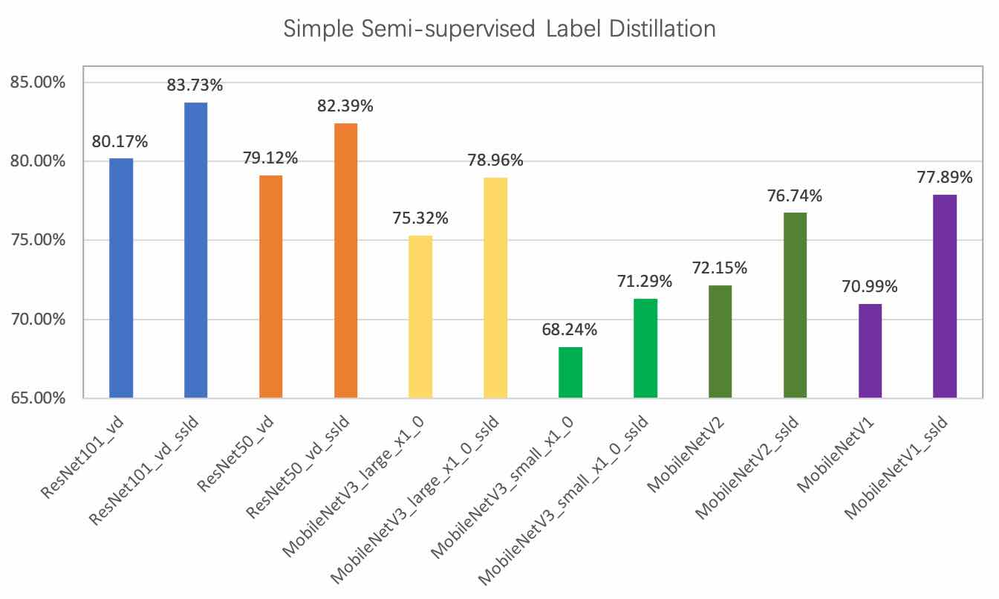
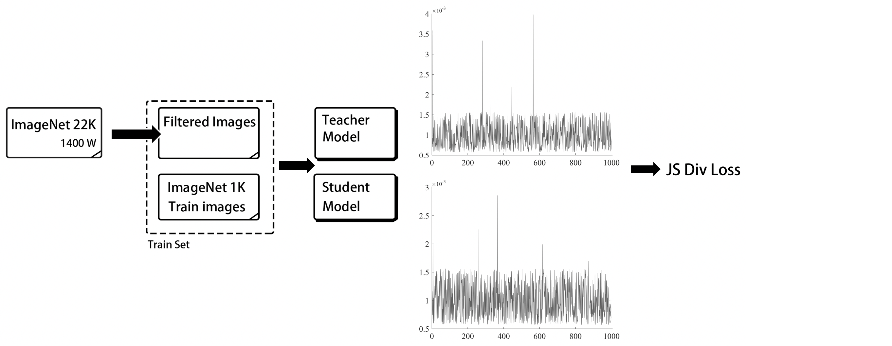
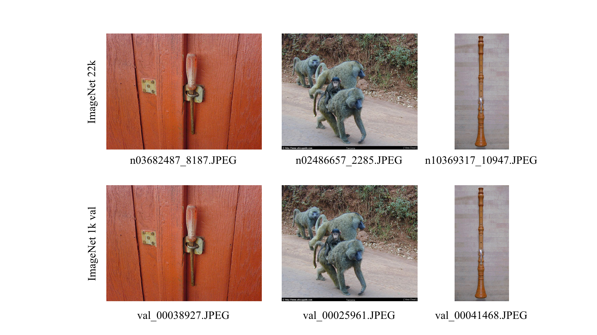

# SSLD 知识蒸馏实战

## 目录

- [1. 算法介绍](#1)
    - [1.1 知识蒸馏简介](#1.1)
    - [1.2 SSLD蒸馏策略](#1.2)
    - [1.3 SKL-UGI蒸馏策略](#1.3)
- [2. SSLD预训练模型库](#2)
- [3. SSLD使用](#3)
    - [3.1 加载SSLD模型进行微调](#3.1)
    - [3.2 使用SSLD方案进行知识蒸馏](#3.2)
- [4. 参考文献](#4)


<a name="1"></a>

## 1. 算法介绍

<a name="1.1"></a>

### 1.1 简介

PaddleClas 融合已有的知识蒸馏方法 [2,3]，提供了一种简单的半监督标签知识蒸馏方案(SSLD，Simple Semi-supervised Label Distillation)，基于 ImageNet1k 分类数据集，在 ResNet_vd 以及 MobileNet 系列上的精度均有超过 3% 的绝对精度提升，具体指标如下图所示。

<div align="center">

</div>

<a name="1.2"></a>

### 1.2 SSLD蒸馏策略

SSLD 的流程图如下图所示。

<div align="center">

</div>

首先，我们从 ImageNet22k 中挖掘出了近 400 万张图片，同时与 ImageNet-1k 训练集整合在一起，得到了一个新的包含 500 万张图片的数据集。然后，我们将学生模型与教师模型组合成一个新的网络，该网络分别输出学生模型和教师模型的预测分布，与此同时，固定教师模型整个网络的梯度，而学生模型可以做正常的反向传播。最后，我们将两个模型的 logits 经过 softmax 激活函数转换为 soft label，并将二者的 soft label 做 JS 散度作为损失函数，用于蒸馏模型训练。

以 MobileNetV3（该模型直接训练，精度为 75.3%）的知识蒸馏为例，该方案的核心策略优化点如下所示。


| 实验ID | 策略               | Top-1 acc |
|:------:|:---------:|:--------:|
| 1    | baseline         | 75.60%    |
| 2    | 更换教师模型精度为82.4%的权重 | 76.00%    |
| 3    | 使用改进的JS散度损失函数    | 76.20%    |
| 4    | 迭代轮数增加至360epoch  | 77.10%    |
| 5    | 添加400W挖掘得到的无标注数据      | 78.50%    |
| 6    | 基于ImageNet1k数据微调 | 78.90%    |

* 注：其中baseline的训练条件为
    * 训练数据：ImageNet1k数据集
    * 损失函数：Cross Entropy Loss
    * 迭代轮数：120epoch


SSLD 蒸馏方案的一大特色就是无需使用图像的真值标签，因此可以任意扩展数据集的大小，考虑到计算资源的限制，我们在这里仅基于 ImageNet22k 数据集对蒸馏任务的训练集进行扩充。在 SSLD 蒸馏任务中，我们使用了 `Top-k per class` 的数据采样方案 [3] 。具体步骤如下。

（1）训练集去重。我们首先基于 SIFT 特征相似度匹配的方式对 ImageNet22k 数据集与 ImageNet1k 验证集进行去重，防止添加的 ImageNet22k 训练集中包含 ImageNet1k 验证集图像，最终去除了 4511 张相似图片。部分过滤的相似图片如下所示。

<div align="center">

</div>

（2）大数据集 soft label 获取，对于去重后的 ImageNet22k 数据集，我们使用 `ResNeXt101_32x16d_wsl` 模型进行预测，得到每张图片的 soft label 。

（3）Top-k 数据选择，ImageNet1k 数据共有 1000 类，对于每一类，找出属于该类并且得分最高的 `k` 张图片，最终得到一个数据量不超过 `1000*k` 的数据集（某些类上得到的图片数量可能少于 `k` 张）。

（4）将该数据集与 ImageNet1k 的训练集融合组成最终蒸馏模型所使用的数据集，数据量为 500 万。


<a name="1.3"></a>

## 1.3 SKL-UGI蒸馏策略

此外，在无标注数据选择的过程中，我们发现使用更加通用的数据，即使不需要严格的数据筛选过程，也可以帮助知识蒸馏任务获得稳定的精度提升，因而提出了SKL-UGI (Symmetrical-KL Unlabeled General Images distillation)知识蒸馏方案。

通用数据可以使用ImageNet数据或者与场景相似的数据集。更多关于SKL-UGI的应用，请参考：[超轻量图像分类方案PULC使用教程](../PULC/PULC_train.md)。


<a name="2"></a>

## 2. 预训练模型库


移动端预训练模型库列表如下所示。

| 模型                      | FLOPs(M) | Params(M) | top-1 acc | SSLD top-1 acc | 精度收益   | 下载链接 |
|-------------------|----------|-----------|----------|---------------|--------|------|
| PPLCNetV2_base          | 604.16     | 6.54       | 77.04%   | 80.10%        | +3.06% |   [链接](https://paddle-imagenet-models-name.bj.bcebos.com/dygraph/legendary_models/PPLCNetV2_base_ssld_pretrained.pdparams)   |
| PPLCNet_x2_5            | 906.49    | 9.04        | 76.60%   | 80.82%        | +4.22% |  [链接](https://paddle-imagenet-models-name.bj.bcebos.com/dygraph/legendary_models/PPLCNet_x2_5_ssld_pretrained.pdparams)    |
| PPLCNet_x1_0            | 160.81    | 2.96         | 71.32%   | 74.39%        | +3.07% |   [链接](https://paddle-imagenet-models-name.bj.bcebos.com/dygraph/legendary_models/PPLCNet_x1_0_ssld_pretrained.pdparams)   |
| PPLCNet_x0_5            | 47.28    | 1.89       | 63.14%   | 66.10%        | +2.96% |   [链接](https://paddle-imagenet-models-name.bj.bcebos.com/dygraph/legendary_models/PPLCNet_x0_5_ssld_pretrained.pdparams)   |
| PPLCNet_x0_25           | 18.43    | 1.52       | 51.86%   | 53.43%        | +1.57% |   [链接](https://paddle-imagenet-models-name.bj.bcebos.com/dygraph/legendary_models/PPLCNet_x0_25_ssld_pretrained.pdparams)   |
| MobileNetV1             | 578.88     | 4.19      | 71.00%   | 77.90%        | +6.90% |   [链接](https://paddle-imagenet-models-name.bj.bcebos.com/dygraph/legendary_models/MobileNetV1_ssld_pretrained.pdparams)   |
| MobileNetV2             | 327.84      | 3.44      | 72.20%   | 76.74%        | +4.54% |   [链接](https://paddle-imagenet-models-name.bj.bcebos.com/dygraph/MobileNetV2_ssld_pretrained.pdparams)   |
| MobileNetV3_large_x1_0  | 229.66     | 5.47      | 75.30%   | 79.00%        | +3.70% |   [链接](https://paddle-imagenet-models-name.bj.bcebos.com/dygraph/legendary_models/MobileNetV3_large_x1_0_ssld_pretrained.pdparams)   |
| MobileNetV3_small_x1_0  | 63.67    | 2.94      | 68.20%   | 71.30%        | +3.10% |   [链接](https://paddle-imagenet-models-name.bj.bcebos.com/dygraph/legendary_models/MobileNetV3_small_x1_0_ssld_pretrained.pdparams)   |
| MobileNetV3_small_x0_35 | 14.56    | 1.66      | 53.00%   | 55.60%        | +2.60% |   [链接](https://paddle-imagenet-models-name.bj.bcebos.com/dygraph/legendary_models/MobileNetV3_small_x0_35_ssld_pretrained.pdparams)   |
| GhostNet_x1_3_ssld      | 236.89     | 7.30       | 75.70%   | 79.40%        | +3.70% |   [链接](https://paddle-imagenet-models-name.bj.bcebos.com/dygraph/GhostNet_x1_3_ssld_pretrained.pdparams)   |

* 注：其中的`top-1 acc`表示使用普通训练方式得到的模型精度，`SSLD top-1 acc`表示使用SSLD知识蒸馏训练策略得到的模型精度。


服务端预训练模型库列表如下所示。

| 模型                   | FLOPs(G) | Params(M) | top-1 acc | SSLD top-1 acc | 精度收益   | 下载链接                                                                                      |
|----------------------|----------|-----------|----------|---------------|--------|-------------------------------------------------------------------------------------------|
| PPHGNet_base         | 25.14    | 71.62     | -   | 85.00% | - | [链接](https://paddle-imagenet-models-name.bj.bcebos.com/dygraph/legendary_models/PPHGNet_base_ssld_pretrained.pdparams) |
| PPHGNet_small        | 8.53     | 24.38     | 81.50%   | 83.80% | +2.30% | [链接](https://paddle-imagenet-models-name.bj.bcebos.com/dygraph/legendary_models/PPHGNet_small_ssld_pretrained.pdparams) |
| PPHGNet_tiny         | 4.54     | 14.75     | 79.83%   | 81.95% | +2.12% | [链接](https://paddle-imagenet-models-name.bj.bcebos.com/dygraph/legendary_models/PPHGNet_tiny_ssld_pretrained.pdparams) |
| ResNet50_vd          | 8.67     | 25.58     | 79.10%   | 83.00% | +3.90% | [链接](https://paddle-imagenet-models-name.bj.bcebos.com/dygraph/ResNet50_vd_ssld_pretrained.pdparams) |
| ResNet101_vd         | 16.1     | 44.57     | 80.20%   | 83.70% | +3.50% | [链接](https://paddle-imagenet-models-name.bj.bcebos.com/dygraph/legendary_models/ResNet101_vd_ssld_pretrained.pdparams) |
| ResNet34_vd          | 7.39     | 21.82     | 76.00%   | 79.70% | +3.70% | [链接](https://paddle-imagenet-models-name.bj.bcebos.com/dygraph/ResNet34_vd_ssld_pretrained.pdparams) |
| Res2Net50_vd_26w_4s  | 8.37     | 25.06     | 79.80%   | 83.10% | +3.30% | [链接](https://paddle-imagenet-models-name.bj.bcebos.com/dygraph/Res2Net50_vd_26w_4s_ssld_pretrained.pdparams) |
| Res2Net101_vd_26w_4s | 16.67    | 45.22     | 80.60%   | 83.90% | +3.30% | [链接](https://paddle-imagenet-models-name.bj.bcebos.com/dygraph/Res2Net101_vd_26w_4s_ssld_pretrained.pdparams) |
| Res2Net200_vd_26w_4s | 31.49    | 76.21     | 81.20%   | 85.10% | +3.90% | [链接](https://paddle-imagenet-models-name.bj.bcebos.com/dygraph/Res2Net200_vd_26w_4s_ssld_pretrained.pdparams) |
| HRNet_W18_C          | 4.14     | 21.29     | 76.90%   | 81.60% | +4.70% | [链接](https://paddle-imagenet-models-name.bj.bcebos.com/dygraph/legendary_models/_ssld_pretrained.pdparams) |
| HRNet_W48_C          | 34.58    | 77.47     | 79.00%   | 83.60% | +4.60% | [链接](https://paddle-imagenet-models-name.bj.bcebos.com/dygraph/legendary_models/HRNet_W48_C_ssld_pretrained.pdparams) |
| SE_HRNet_W64_C       | 57.83    | 128.97    | -        | 84.70% |   -     | [链接](https://paddle-imagenet-models-name.bj.bcebos.com/dygraph/legendary_models/SE_HRNet_W64_C_ssld_pretrained.pdparams) |


<a name="3"></a>

## 3. SSLD使用方法

<a name="3.1"></a>  

### 3.1 加载SSLD模型进行微调

如果希望直接使用预训练模型，可以在训练的时候，加入参数`-o Arch.pretrained=True -o Arch.use_ssld=True`，表示使用基于SSLD的预训练模型，示例如下所示。

```shell
# 单机单卡训练
python3 tools/train.py -c ppcls/configs/ImageNet/ResNet/ResNet50_vd.yaml -o Arch.pretrained=True -o Arch.use_ssld=True
# 单机多卡训练
python3 -m paddle.distributed.launch --gpus="0,1,2,3" tools/train.py -c ppcls/configs/ImageNet/ResNet/ResNet50_vd.yaml -o Arch.pretrained=True -o Arch.use_ssld=True
```

<a name="3.2"></a>

### 3.2 使用SSLD方案进行知识蒸馏

相比于其他大多数知识蒸馏算法，SSLD摆脱对数据标注的依赖，通过引入无标注数据，可以进一步提升模型精度。

对于无标注数据，需要按照与有标注数据完全相同的整理方式，将文件与当前有标注的数据集放在相同目录下，将其标签值记为`0`，假设整理的标签文件名为`train_list_unlabel.txt`，则可以通过下面的命令生成用于SSLD训练的标签文件。

```shell
cat train_list.txt train_list_unlabel.txt > train_list_all.txt
```

更多关于图像分类任务的数据标签说明，请参考：[PaddleClas图像分类数据集格式说明](../data_preparation/classification_dataset.md#1-数据集格式说明)

PaddleClas中集成了PULC超轻量图像分类实用方案，里面包含SSLD ImageNet预训练模型的使用以及更加通用的无标签数据的知识蒸馏方案，更多详细信息，请参考[PULC超轻量图像分类实用方案使用教程](../PULC/PULC_train.md)。

<a name="4"></a>

## 4. 参考文献

[1] Hinton G, Vinyals O, Dean J. Distilling the knowledge in a neural network[J]. arXiv preprint arXiv:1503.02531, 2015.

[2] Bagherinezhad H, Horton M, Rastegari M, et al. Label refinery: Improving imagenet classification through label progression[J]. arXiv preprint arXiv:1805.02641, 2018.

[3] Yalniz I Z, Jégou H, Chen K, et al. Billion-scale semi-supervised learning for image classification[J]. arXiv preprint arXiv:1905.00546, 2019.

[4] Touvron H, Vedaldi A, Douze M, et al. Fixing the train-test resolution discrepancy[C]//Advances in Neural Information Processing Systems. 2019: 8250-8260.
