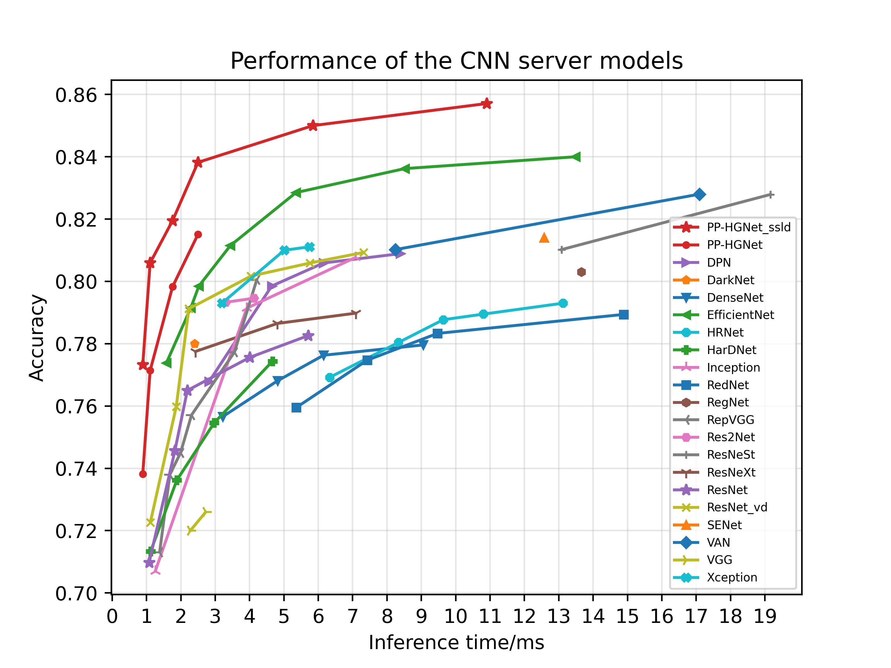
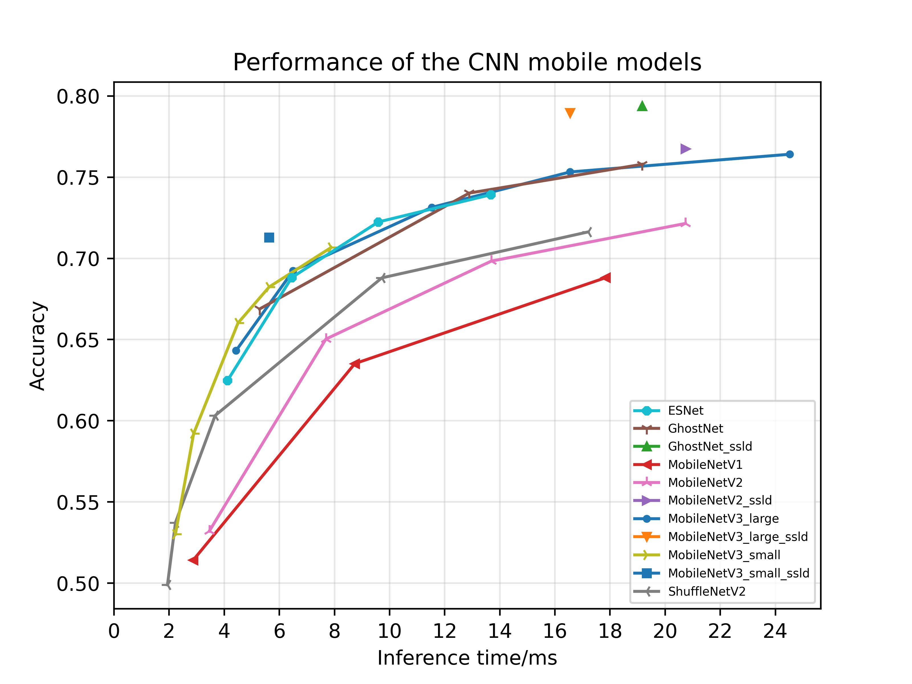
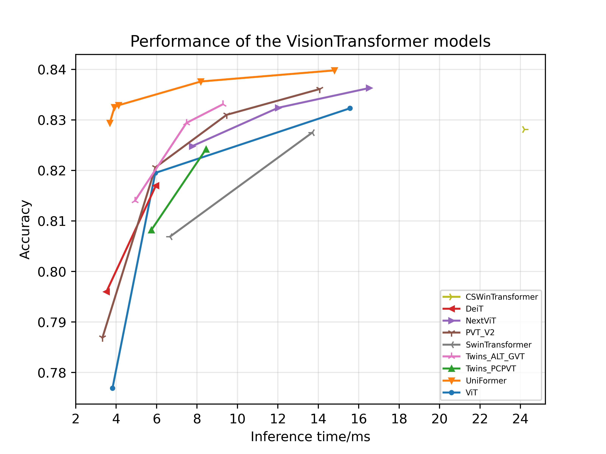

<!-- 简体中文 | [English](../../en/algorithm_introduction/ImageNet_models.md) -->

# ImageNet 预训练模型库

## 目录

- [模型库概览图](#Overview)
- [SSLD 知识蒸馏预训练模型](#SSLD)
  - [服务器端知识蒸馏模型](#SSLD_server)
  - [移动端知识蒸馏模型](#SSLD_mobile)
  - [Intel CPU 端知识蒸馏模型](#SSLD_intel_cpu)
- [PP-LCNet & PP-LCNetV2 系列](#PPLCNet)
- [PP-HGNet 系列](#PPHGNet)
- [ResNet 系列](#ResNet)
- [移动端系列](#Mobile)
- [SEResNeXt 与 Res2Net 系列](#SEResNeXt_Res2Net)
- [DPN 与 DenseNet 系列](#DPN&DenseNet)
- [HRNet 系列](#HRNet)
- [Inception 系列](#Inception)
- [EfficientNet 与 ResNeXt101_wsl 系列](#EfficientNetRes&NeXt101_wsl)
- [ResNeSt 与 RegNet 系列](#ResNeSt&RegNet)
- [ViT_and_DeiT 系列](#ViT&DeiT)
- [RepVGG 系列](#RepVGG)
- [MixNet 系列](#MixNet)
- [ReXNet 系列](#ReXNet)
- [SwinTransformer 系列](#SwinTransformer)
- [LeViT 系列](#LeViT)
- [Twins 系列](#Twins)
- [HarDNet 系列](#HarDNet)
- [DLA 系列](#DLA)
- [RedNet 系列](#RedNet)
- [TNT 系列](#TNT)
- [CSwinTransformer 系列](#CSwinTransformer)
- [PVTV2 系列](#PVTV2)
- [MobileViT 系列](#MobileViT)
- [其他模型](#Others)
- [参考文献](#reference)

## 模型库概览图

基于 ImageNet1k 分类数据集，PaddleClas 支持 37 个系列分类网络结构以及对应的 217 个图像分类预训练模型，训练技巧、每个系列网络结构的简单介绍和性能评估将在相应章节展现，下面所有的速度指标评估环境如下：
* Arm CPU 的评估环境基于骁龙 855(SD855)。
* Intel CPU 的评估环境基于 Intel(R) Xeon(R) Gold 6148。
* GPU 评估环境基于 V100 机器，在 FP32+TensorRT 配置下运行 2100 次测得（去除前 100 次的 warmup 时间）。
* FLOPs 与 Params 通过 `paddle.flops()` 计算得到（PaddlePaddle 版本为 2.2）

常见服务器端模型的精度指标与其预测耗时的变化曲线如下图所示。

常见移动端模型的精度指标与其预测耗时的变化曲线如下图所示。

部分VisionTransformer模型的精度指标与其预测耗时的变化曲线如下图所示.

## SSLD 知识蒸馏预训练模型
基于 SSLD 知识蒸馏的预训练模型列表如下所示，更多关于 SSLD 知识蒸馏方案的介绍可以参考：[SSLD 知识蒸馏文档](./knowledge_distillation.md)。

### 服务器端知识蒸馏模型

| 模型                  | Top-1 Acc | Reference Top-1 Acc | Acc gain | time(ms) bs=1 | time(ms) bs=4 | time(ms) bs=8 | FLOPs(G) | Params(M) | 预训练模型下载地址 | inference模型下载地址 |
|---------------------|-----------|-----------|---------------|----------------|-----------|----------|-----------|-----------------------------------|-----------------------------------|-----------------------------------|
| ResNet34_vd_ssld         | 0.797    | 0.760  | 0.037  | 2.00             | 3.28             | 5.84              | 3.93     | 21.84     | [下载链接](https://paddle-imagenet-models-name.bj.bcebos.com/dygraph/legendary_models/ResNet34_vd_ssld_pretrained.pdparams)&emsp;&emsp; | [下载链接](https://paddle-imagenet-models-name.bj.bcebos.com/dygraph/inference/ResNet34_vd_ssld_infer.tar)&emsp;&emsp; |
| ResNet50_vd_ssld | 0.830    | 0.792    | 0.039 | 2.60             | 4.86             | 7.63              | 4.35     | 25.63     | [下载链接](https://paddle-imagenet-models-name.bj.bcebos.com/dygraph/legendary_models/ResNet50_vd_ssld_pretrained.pdparams) | [下载链接](https://paddle-imagenet-models-name.bj.bcebos.com/dygraph/inference/ResNet50_vd_ssld_infer.tar) |
| ResNet101_vd_ssld   | 0.837    | 0.802    | 0.035 | 4.43             | 8.25             | 12.60     | 8.08     | 44.67     | [下载链接](https://paddle-imagenet-models-name.bj.bcebos.com/dygraph/legendary_models/ResNet101_vd_ssld_pretrained.pdparams)   | [下载链接](https://paddle-imagenet-models-name.bj.bcebos.com/dygraph/inference/ResNet101_vd_ssld_infer.tar) |
| Res2Net50_vd_26w_4s_ssld | 0.831    | 0.798    | 0.033 | 3.59             | 6.35             | 9.50              | 4.28     | 25.76     | [下载链接](https://paddle-imagenet-models-name.bj.bcebos.com/dygraph/Res2Net50_vd_26w_4s_ssld_pretrained.pdparams) | [下载链接](https://paddle-imagenet-models-name.bj.bcebos.com/dygraph/inference/Res2Net50_vd_26w_4s_ssld_infer.tar) |
| Res2Net101_vd_ 26w_4s_ssld | 0.839    | 0.806    | 0.033 | 6.34             | 11.02            | 16.13             | 8.35    | 45.35     | [下载链接](https://paddle-imagenet-models-name.bj.bcebos.com/dygraph/Res2Net101_vd_26w_4s_ssld_pretrained.pdparams) | [下载链接](https://paddle-imagenet-models-name.bj.bcebos.com/dygraph/inference/Res2Net101_vd_26w_4s_ssld_infer.tar) |
| Res2Net200_vd_ 26w_4s_ssld | 0.851    | 0.812    | 0.049 | 11.45            | 19.77            | 28.81             | 15.77    | 76.44     | [下载链接](https://paddle-imagenet-models-name.bj.bcebos.com/dygraph/Res2Net200_vd_26w_4s_ssld_pretrained.pdparams) | [下载链接](https://paddle-imagenet-models-name.bj.bcebos.com/dygraph/inference/Res2Net200_vd_26w_4s_ssld_infer.tar) |
| HRNet_W18_C_ssld | 0.812    | 0.769   | 0.043 | 6.66             | 8.94             | 11.95             | 4.32     | 21.35     | [下载链接](https://paddle-imagenet-models-name.bj.bcebos.com/dygraph/legendary_models/HRNet_W18_C_ssld_pretrained.pdparams) | [下载链接](https://paddle-imagenet-models-name.bj.bcebos.com/dygraph/inference/HRNet_W18_C_ssld_infer.tar) |
| HRNet_W48_C_ssld | 0.836    | 0.790   | 0.046  | 11.07            | 17.06            | 27.28             | 17.34    | 77.57     | [下载链接](https://paddle-imagenet-models-name.bj.bcebos.com/dygraph/legendary_models/HRNet_W48_C_ssld_pretrained.pdparams) | [下载链接](https://paddle-imagenet-models-name.bj.bcebos.com/dygraph/inference/HRNet_W48_C_ssld_infer.tar) |
| SE_HRNet_W64_C_ssld | 0.848    |  -    |  - | 17.11            | 26.87            |    43.24 | 29.00    | 129.12    | [下载链接](https://paddle-imagenet-models-name.bj.bcebos.com/dygraph/legendary_models/SE_HRNet_W64_C_ssld_pretrained.pdparams) | [下载链接](https://paddle-imagenet-models-name.bj.bcebos.com/dygraph/inference/SE_HRNet_W64_C_ssld_infer.tar) |
| PPHGNet_tiny_ssld | 0.8195    |  0.7983  |  0.021 |  1.77            |       -     |  -       | 4.54        | 14.75        | [下载链接](https://paddle-imagenet-models-name.bj.bcebos.com/dygraph/legendary_models/PPHGNet_tiny_ssld_pretrained.pdparams) | [下载链接](https://paddle-imagenet-models-name.bj.bcebos.com/dygraph/inference/PPHGNet_tiny_ssld_infer.tar) |
| PPHGNet_small_ssld | 0.8382    |  0.8151  |  0.023 | 2.52            | -           |    -  | 8.53       | 24.38           | [下载链接](https://paddle-imagenet-models-name.bj.bcebos.com/dygraph/legendary_models/PPHGNet_small_ssld_pretrained.pdparams) | [下载链接](https://paddle-imagenet-models-name.bj.bcebos.com/dygraph/inference/PPHGNet_small_ssld_infer.tar) |

### 移动端知识蒸馏模型

| 模型                  | Top-1 Acc | Reference Top-1 Acc | Acc gain | SD855 time(ms) bs=1, thread=1 | SD855 time(ms) bs=1, thread=2 | SD855 time(ms) bs=1, thread=4 | FLOPs(M) | Params(M) | 模型大小(M) | 预训练模型下载地址 | inference模型下载地址 |
|---------------------|-----------|-----------|---------------|----------------|-----------|----------|-----------|-----------------------------------|-----------------------------------|-----------------------------------|-----------------------------------|
| MobileNetV1_ssld   | 0.779    | 0.710    | 0.069 | 30.24                            | 17.86                             | 10.30                             | 578.88     | 4.25      | 16      | [下载链接](https://paddle-imagenet-models-name.bj.bcebos.com/dygraph/legendary_models/MobileNetV1_ssld_pretrained.pdparams)                 | [下载链接](https://paddle-imagenet-models-name.bj.bcebos.com/dygraph/inference/MobileNetV1_ssld_infer.tar) |
| MobileNetV2_ssld                 | 0.767    | 0.722  | 0.045  | 20.74                            | 12.71                             | 8.10                              | 327.84      | 3.54      | 14      | [下载链接](https://paddle-imagenet-models-name.bj.bcebos.com/dygraph/MobileNetV2_ssld_pretrained.pdparams)                 | [下载链接](https://paddle-imagenet-models-name.bj.bcebos.com/dygraph/inference/MobileNetV2_ssld_infer.tar) |
| MobileNetV3_small_x0_35_ssld          | 0.556    | 0.530 | 0.026   | 2.23 | 1.66 | 1.43 | 14.56    | 1.67      | 6.9     | [下载链接](https://paddle-imagenet-models-name.bj.bcebos.com/dygraph/legendary_models/MobileNetV3_small_x0_35_ssld_pretrained.pdparams)          | [下载链接](https://paddle-imagenet-models-name.bj.bcebos.com/dygraph/inference/MobileNetV3_small_x0_35_ssld_infer.tar) |
| MobileNetV3_large_x1_0_ssld      | 0.790    | 0.753  | 0.036  | 16.55                            | 10.09                             | 6.84                              | 229.66     | 5.50      | 21      | [下载链接](https://paddle-imagenet-models-name.bj.bcebos.com/dygraph/legendary_models/MobileNetV3_large_x1_0_ssld_pretrained.pdparams)      | [下载链接](https://paddle-imagenet-models-name.bj.bcebos.com/dygraph/inference/MobileNetV3_large_x1_0_ssld_infer.tar) |
| MobileNetV3_small_x1_0_ssld      | 0.713    | 0.682  |  0.031  | 5.63                             | 3.65                              | 2.60                              | 63.67    | 2.95      | 12      | [下载链接](https://paddle-imagenet-models-name.bj.bcebos.com/dygraph/legendary_models/MobileNetV3_small_x1_0_ssld_pretrained.pdparams)      | [下载链接](https://paddle-imagenet-models-name.bj.bcebos.com/dygraph/inference/MobileNetV3_small_x1_0_ssld_infer.tar) |
| GhostNet_x1_3_ssld                    | 0.794    | 0.757   | 0.037 | 19.16                            | 12.25     | 9.40     | 236.89     | 7.38       | 29      | [下载链接](https://paddle-imagenet-models-name.bj.bcebos.com/dygraph/GhostNet_x1_3_ssld_pretrained.pdparams)               | [下载链接](https://paddle-imagenet-models-name.bj.bcebos.com/dygraph/inference/GhostNet_x1_3_ssld_infer.tar) |

### Intel CPU 端知识蒸馏模型

| 模型                  | Top-1 Acc | Reference Top-1 Acc | Acc gain |  Intel-Xeon-Gold-6148 time(ms) bs=1 | FLOPs(M) | Params(M)  | 预训练模型下载地址 | inference模型下载地址 |
|---------------------|-----------|-----------|---------------|----------------|----------|-----------|-----------------------------------|-----------------------------------|
| PPLCNet_x0_5_ssld   | 0.661    | 0.631    | 0.030 | 2.05     | 47.28     |   1.89   | [下载链接](https://paddle-imagenet-models-name.bj.bcebos.com/dygraph/legendary_models/PPLCNet_x0_5_ssld_pretrained.pdparams)                 | [下载链接](https://paddle-imagenet-models-name.bj.bcebos.com/dygraph/inference/PPLCNet_x0_5_ssld_infer.tar) |
| PPLCNet_x1_0_ssld   | 0.744    | 0.713    | 0.033 | 2.46     | 160.81     |   2.96  | [下载链接](https://paddle-imagenet-models-name.bj.bcebos.com/dygraph/legendary_models/PPLCNet_x1_0_ssld_pretrained.pdparams)                 | [下载链接](https://paddle-imagenet-models-name.bj.bcebos.com/dygraph/inference/PPLCNet_x1_0_ssld_infer.tar) |
| PPLCNet_x2_5_ssld   | 0.808    | 0.766    | 0.042 | 5.39     | 906.49     |   9.04  | [下载链接](https://paddle-imagenet-models-name.bj.bcebos.com/dygraph/legendary_models/PPLCNet_x2_5_ssld_pretrained.pdparams)                 | [下载链接](https://paddle-imagenet-models-name.bj.bcebos.com/dygraph/inference/PPLCNet_x2_5_ssld_infer.tar) |

* 注: `Reference Top-1 Acc` 表示 PaddleClas 基于 ImageNet1k 数据集训练得到的预训练模型精度。

## PP-LCNet & PP-LCNetV2 系列 [[28](#ref28)]

PP-LCNet 系列模型的精度、速度指标如下表所示，更多关于该系列的模型介绍可以参考：[PP-LCNet 系列模型文档](../models/PP-LCNet.md)，[PP-LCNetV2 系列模型文档](../models/PP-LCNetV2.md)。

| 模型           | Top-1 Acc | Top-5 Acc | time(ms)* bs=1 | FLOPs(M) | Params(M) | 预训练模型下载地址 | inference模型下载地址 |
|:--:|:--:|:--:|:--:|----|----|----|:--:|
| PPLCNet_x0_25        |0.5186           | 0.7565   | 1.74 | 18.25    | 1.52  | [下载链接](https://paddle-imagenet-models-name.bj.bcebos.com/dygraph/legendary_models/PPLCNet_x0_25_pretrained.pdparams) | [下载链接](https://paddle-imagenet-models-name.bj.bcebos.com/dygraph/inference/PPLCNet_x0_25_infer.tar) |
| PPLCNet_x0_35        |0.5809           | 0.8083   | 1.92 | 29.46    | 1.65  | [下载链接](https://paddle-imagenet-models-name.bj.bcebos.com/dygraph/legendary_models/PPLCNet_x0_35_pretrained.pdparams) | [下载链接](https://paddle-imagenet-models-name.bj.bcebos.com/dygraph/inference/PPLCNet_x0_35_infer.tar) |
| PPLCNet_x0_5         |0.6314           | 0.8466   | 2.05 | 47.28    | 1.89  | [下载链接](https://paddle-imagenet-models-name.bj.bcebos.com/dygraph/legendary_models/PPLCNet_x0_5_pretrained.pdparams) | [下载链接](https://paddle-imagenet-models-name.bj.bcebos.com/dygraph/inference/PPLCNet_x0_5_infer.tar) |
| PPLCNet_x0_75        |0.6818           | 0.8830   | 2.29 | 98.82    | 2.37  | [下载链接](https://paddle-imagenet-models-name.bj.bcebos.com/dygraph/legendary_models/PPLCNet_x0_75_pretrained.pdparams) | [下载链接](https://paddle-imagenet-models-name.bj.bcebos.com/dygraph/inference/PPLCNet_x0_75_infer.tar) |
| PPLCNet_x1_0         |0.7132           | 0.9003   | 2.46 | 160.81   | 2.96  | [下载链接](https://paddle-imagenet-models-name.bj.bcebos.com/dygraph/legendary_models/PPLCNet_x1_0_pretrained.pdparams) | [下载链接](https://paddle-imagenet-models-name.bj.bcebos.com/dygraph/inference/PPLCNet_x1_0_infer.tar) |
| PPLCNet_x1_5         |0.7371           | 0.9153   | 3.19 | 341.86   | 4.52  | [下载链接](https://paddle-imagenet-models-name.bj.bcebos.com/dygraph/legendary_models/PPLCNet_x1_5_pretrained.pdparams) | [下载链接](https://paddle-imagenet-models-name.bj.bcebos.com/dygraph/inference/PPLCNet_x1_5_infer.tar) |
| PPLCNet_x2_0         |0.7518           | 0.9227   | 4.27 | 590   | 6.54  | [下载链接](https://paddle-imagenet-models-name.bj.bcebos.com/dygraph/legendary_models/PPLCNet_x2_0_pretrained.pdparams) | [下载链接](https://paddle-imagenet-models-name.bj.bcebos.com/dygraph/inference/PPLCNet_x2_0_infer.tar) |
| PPLCNet_x2_5         |0.7660           | 0.9300   | 5.39 | 906   | 9.04  | [下载链接](https://paddle-imagenet-models-name.bj.bcebos.com/dygraph/legendary_models/PPLCNet_x2_5_pretrained.pdparams) | [下载链接](https://paddle-imagenet-models-name.bj.bcebos.com/dygraph/inference/PPLCNet_x2_5_infer.tar) |

| 模型           | Top-1 Acc | Top-5 Acc | time(ms)** bs=1 | FLOPs(M) | Params(M) | 预训练模型下载地址 | inference模型下载地址 |
|:--:|:--:|:--:|:--:|----|----|----|:--:|
| PPLCNetV2_base  | 77.04 | 93.27 | 4.32 | 604 | 6.6 | [下载链接](https://paddle-imagenet-models-name.bj.bcebos.com/dygraph/legendary_models/PPLCNetV2_base_pretrained.pdparams) | [下载链接](https://paddle-imagenet-models-name.bj.bcebos.com/dygraph/inference/PPLCNetV2_base_infer.tar) |

*: 基于 Intel-Xeon-Gold-6148 硬件平台与 PaddlePaddle 推理平台。

**: 基于 Intel-Xeon-Gold-6271C 硬件平台与 OpenVINO 2021.4.2 推理平台。

## PP-HGNet 系列

PP-HGNet 系列模型的精度、速度指标如下表所示，更多关于该系列的模型介绍可以参考：[PP-HGNet 系列模型文档](../models/PP-HGNet.md)。

| 模型  | Top-1 Acc | Top-5 Acc | time(ms) bs=1 | time(ms) bs=4 | time(ms) bs=8 | FLOPs(G) | Params(M) | 预训练模型下载地址 | inference模型下载地址 |
| ---  | --- | --- | --- | --- | --- | --- | --- | --- | --- |
| PPHGNet_tiny | 0.7983    |  0.9504    | 1.77            |       -     |  -       | 4.54        | 14.75        | [下载链接](https://paddle-imagenet-models-name.bj.bcebos.com/dygraph/legendary_models/PPHGNet_tiny_pretrained.pdparams) | [下载链接](https://paddle-imagenet-models-name.bj.bcebos.com/dygraph/inference/PPHGNet_tiny_infer.tar) |
| PPHGNet_tiny_ssld | 0.8195    |  0.9612  |  1.77            |       -     |  -       | 4.54        | 14.75        | [下载链接](https://paddle-imagenet-models-name.bj.bcebos.com/dygraph/legendary_models/PPHGNet_tiny_ssld_pretrained.pdparams) | [下载链接](https://paddle-imagenet-models-name.bj.bcebos.com/dygraph/inference/PPHGNet_tiny_ssld_infer.tar) |
| PPHGNet_small | 0.8151    |  0.9582    |  2.52            | -           |    -  | 8.53       | 24.38           | [下载链接](https://paddle-imagenet-models-name.bj.bcebos.com/dygraph/legendary_models/PPHGNet_small_pretrained.pdparams) | [下载链接](https://paddle-imagenet-models-name.bj.bcebos.com/dygraph/inference/PPHGNet_small_infer.tar) |
| PPHGNet_small_ssld | 0.8382    |  0.9681  | 2.52            | -           |    -  | 8.53       | 24.38           | [下载链接](https://paddle-imagenet-models-name.bj.bcebos.com/dygraph/legendary_models/PPHGNet_small_ssld_pretrained.pdparams) | [下载链接](https://paddle-imagenet-models-name.bj.bcebos.com/dygraph/inference/PPHGNet_small_ssld_infer.tar) |
| PPHGNet_base_ssld | 0.8500    |  0.9735  | 5.97            | -           |    -  | 25.14       | 71.62           | [下载链接](https://paddle-imagenet-models-name.bj.bcebos.com/dygraph/legendary_models/PPHGNet_base_ssld_pretrained.pdparams) | [下载链接](https://paddle-imagenet-models-name.bj.bcebos.com/dygraph/inference/PPHGNet_base_ssld_infer.tar) |

## ResNet 系列 [[1](#ref1)]

ResNet 及其 Vd 系列模型的精度、速度指标如下表所示，更多关于该系列的模型介绍可以参考：[ResNet 及其 Vd 系列模型文档](../models/ResNet_and_vd.md)。

| 模型                  | Top-1 Acc | Top-5 Acc | time(ms) bs=1 | time(ms) bs=4 | time(ms) bs=8 | FLOPs(G) | Params(M) | 预训练模型下载地址                              | inference模型下载地址                      |
|---------------------|-----------|-----------|-----------------------|----------------------|----------|-----------|----------------------------------------------------------------------------------------------|----------------------------------------------------------------------------------------------|----------------------------------------------------------------------------------------------|
| ResNet18            | 0.7098    | 0.8992    | 1.22             | 2.19             | 3.63         | 1.83     | 11.70     | [下载链接](https://paddle-imagenet-models-name.bj.bcebos.com/dygraph/legendary_models/ResNet18_pretrained.pdparams)            | [下载链接](https://paddle-imagenet-models-name.bj.bcebos.com/dygraph/inference/ResNet18_infer.tar) |
| ResNet18_vd         | 0.7226    | 0.9080    | 1.26             | 2.28             | 3.89         | 2.07     | 11.72     | [下载链接](https://paddle-imagenet-models-name.bj.bcebos.com/dygraph/legendary_models/ResNet18_vd_pretrained.pdparams)         | [下载链接](https://paddle-imagenet-models-name.bj.bcebos.com/dygraph/inference/ResNet18_vd_infer.tar) |
| ResNet34            | 0.7457    | 0.9214    | 1.97             | 3.25             | 5.70         | 3.68     | 21.81     | [下载链接](https://paddle-imagenet-models-name.bj.bcebos.com/dygraph/legendary_models/ResNet34_pretrained.pdparams)            | [下载链接](https://paddle-imagenet-models-name.bj.bcebos.com/dygraph/inference/ResNet34_infer.tar) |
| ResNet34_vd         | 0.7598    | 0.9298    | 2.00             | 3.28             | 5.84         | 3.93     | 21.84     | [下载链接](https://paddle-imagenet-models-name.bj.bcebos.com/dygraph/legendary_models/ResNet34_vd_pretrained.pdparams)         | [下载链接](https://paddle-imagenet-models-name.bj.bcebos.com/dygraph/inference/ResNet34_vd_infer.tar) |
| ResNet34_vd_ssld         | 0.7972    | 0.9490    | 2.00             | 3.28             | 5.84              | 3.93     | 21.84     | [下载链接](https://paddle-imagenet-models-name.bj.bcebos.com/dygraph/legendary_models/ResNet34_vd_ssld_pretrained.pdparams)         | [下载链接](https://paddle-imagenet-models-name.bj.bcebos.com/dygraph/inference/ResNet34_vd_ssld_infer.tar) |
| ResNet50            | 0.7650    | 0.9300    | 2.54             | 4.79             | 7.40         | 4.11     | 25.61     | [下载链接](https://paddle-imagenet-models-name.bj.bcebos.com/dygraph/legendary_models/ResNet50_pretrained.pdparams)            | [下载链接](https://paddle-imagenet-models-name.bj.bcebos.com/dygraph/inference/ResNet50_infer.tar) |
| ResNet50_vc         | 0.7835    | 0.9403    | 2.57             | 4.83             | 7.52         | 4.35     | 25.63     | [下载链接](https://paddle-imagenet-models-name.bj.bcebos.com/dygraph/ResNet50_vc_pretrained.pdparams)         | [下载链接](https://paddle-imagenet-models-name.bj.bcebos.com/dygraph/inference/ResNet50_vc_infer.tar) |
| ResNet50_vd         | 0.7912    | 0.9444    | 2.60             | 4.86             | 7.63         | 4.35     | 25.63     | [下载链接](https://paddle-imagenet-models-name.bj.bcebos.com/dygraph/legendary_models/ResNet50_vd_pretrained.pdparams)         | [下载链接](https://paddle-imagenet-models-name.bj.bcebos.com/dygraph/inference/ResNet50_vd_infer.tar) |
| ResNet101           | 0.7756    | 0.9364    | 4.37             | 8.18             | 12.38       | 7.83    | 44.65     | [下载链接](https://paddle-imagenet-models-name.bj.bcebos.com/dygraph/legendary_models/ResNet101_pretrained.pdparams)           | [下载链接](https://paddle-imagenet-models-name.bj.bcebos.com/dygraph/inference/ResNet101_infer.tar) |
| ResNet101_vd        | 0.8017    | 0.9497    | 4.43             | 8.25             | 12.60       | 8.08     | 44.67     | [下载链接](https://paddle-imagenet-models-name.bj.bcebos.com/dygraph/legendary_models/ResNet101_vd_pretrained.pdparams)        | [下载链接](https://paddle-imagenet-models-name.bj.bcebos.com/dygraph/inference/ResNet101_vd_infer.tar) |
| ResNet152           | 0.7826    | 0.9396    | 6.05             | 11.41            | 17.33       | 11.56    | 60.34     | [下载链接](https://paddle-imagenet-models-name.bj.bcebos.com/dygraph/legendary_models/ResNet152_pretrained.pdparams)           | [下载链接](https://paddle-imagenet-models-name.bj.bcebos.com/dygraph/inference/ResNet152_infer.tar) |
| ResNet152_vd        | 0.8059    | 0.9530    | 6.11             | 11.51            | 17.59       | 11.80    | 60.36     | [下载链接](https://paddle-imagenet-models-name.bj.bcebos.com/dygraph/legendary_models/ResNet152_vd_pretrained.pdparams)        | [下载链接](https://paddle-imagenet-models-name.bj.bcebos.com/dygraph/inference/ResNet152_vd_infer.tar) |
| ResNet200_vd        | 0.8093    | 0.9533    | 7.70             | 14.57            | 22.16       | 15.30    | 74.93     | [下载链接](https://paddle-imagenet-models-name.bj.bcebos.com/dygraph/legendary_models/ResNet200_vd_pretrained.pdparams)        | [下载链接](https://paddle-imagenet-models-name.bj.bcebos.com/dygraph/inference/ResNet200_vd_infer.tar) |
| ResNet50_vd_ ssld | 0.8300    | 0.9640    | 2.60             | 4.86             | 7.63              | 4.35     | 25.63     | [下载链接](https://paddle-imagenet-models-name.bj.bcebos.com/dygraph/legendary_models/ResNet50_vd_ssld_pretrained.pdparams) | [下载链接](https://paddle-imagenet-models-name.bj.bcebos.com/dygraph/inference/ResNet50_vd_ssld_infer.tar) |
| ResNet101_vd_ ssld   | 0.8373    | 0.9669    | 4.43             | 8.25             | 12.60             | 8.08     | 44.67     | [下载链接](https://paddle-imagenet-models-name.bj.bcebos.com/dygraph/legendary_models/ResNet101_vd_ssld_pretrained.pdparams)   | [下载链接](https://paddle-imagenet-models-name.bj.bcebos.com/dygraph/inference/ResNet101_vd_ssld_infer.tar) |

## 移动端系列 [[3](#ref3)][[4](#ref4)][[5](#ref5)][[6](#ref6)][[23](#ref23)]

移动端系列模型的精度、速度指标如下表所示，更多关于该系列的模型介绍可以参考：[移动端系列模型文档](../models/Mobile.md)。

| 模型          | Top-1 Acc | Top-5 Acc | SD855 time(ms) bs=1, thread=1 | SD855 time(ms) bs=1, thread=2 | SD855 time(ms) bs=1, thread=4 | FLOPs(M) | Params(M) | 模型大小(M) | 预训练模型下载地址 | inference模型下载地址 |
|----------------------------------|-----------|-----------|------------------------|----------|-----------|---------|-----------------------------------------------------------------------------------------------------------|-----------------------------------------------------------------------------------------------------------|-----------------------------------------------------------------------------------------------------------|-----------------------------------------------------------------------------------------------------------|
| MobileNetV1_ x0_25                | 0.5143    | 0.7546    | 2.88 | 1.82  | 1.26  | 43.56     | 0.48      | 1.9     | [下载链接](https://paddle-imagenet-models-name.bj.bcebos.com/dygraph/legendary_models/MobileNetV1_x0_25_pretrained.pdparams)                | [下载链接](https://paddle-imagenet-models-name.bj.bcebos.com/dygraph/inference/MobileNetV1_x0_25_infer.tar) |
| MobileNetV1_ x0_5                 | 0.6352    | 0.8473    | 8.74                             | 5.26                              | 3.09                              | 154.57     | 1.34      | 5.2     | [下载链接](https://paddle-imagenet-models-name.bj.bcebos.com/dygraph/legendary_models/MobileNetV1_x0_5_pretrained.pdparams)                 | [下载链接](https://paddle-imagenet-models-name.bj.bcebos.com/dygraph/inference/MobileNetV1_x0_5_infer.tar) |
| MobileNetV1_ x0_75                | 0.6881    | 0.8823    | 17.84 | 10.61 | 6.21 | 333.00     | 2.60      | 10      | [下载链接](https://paddle-imagenet-models-name.bj.bcebos.com/dygraph/legendary_models/MobileNetV1_x0_75_pretrained.pdparams)                | [下载链接](https://paddle-imagenet-models-name.bj.bcebos.com/dygraph/inference/MobileNetV1_x0_75_infer.tar) |
| MobileNetV1                      | 0.7099    | 0.8968    | 30.24 | 17.86 | 10.30 | 578.88     | 4.25      | 16      | [下载链接](https://paddle-imagenet-models-name.bj.bcebos.com/dygraph/legendary_models/MobileNetV1_pretrained.pdparams)                      | [下载链接](https://paddle-imagenet-models-name.bj.bcebos.com/dygraph/inference/MobileNetV1_infer.tar) |
| MobileNetV1_ ssld                 | 0.7789    | 0.9394    | 30.24                            | 17.86                             | 10.30                             | 578.88     | 4.25      | 16      | [下载链接](https://paddle-imagenet-models-name.bj.bcebos.com/dygraph/legendary_models/MobileNetV1_ssld_pretrained.pdparams)                 | [下载链接](https://paddle-imagenet-models-name.bj.bcebos.com/dygraph/inference/MobileNetV1_ssld_infer.tar) |
| MobileNetV2_ x0_25                | 0.5321    | 0.7652    | 3.46 | 2.51 | 2.03 | 34.18     | 1.53       | 6.1     | [下载链接](https://paddle-imagenet-models-name.bj.bcebos.com/dygraph/MobileNetV2_x0_25_pretrained.pdparams)                | [下载链接](https://paddle-imagenet-models-name.bj.bcebos.com/dygraph/inference/MobileNetV2_x0_25_infer.tar) |
| MobileNetV2_ x0_5                 | 0.6503    | 0.8572    | 7.69 | 4.92  | 3.57  | 99.48     | 1.98      | 7.8     | [下载链接](https://paddle-imagenet-models-name.bj.bcebos.com/dygraph/MobileNetV2_x0_5_pretrained.pdparams)                 | [下载链接](https://paddle-imagenet-models-name.bj.bcebos.com/dygraph/inference/MobileNetV2_x0_5_infer.tar) |
| MobileNetV2_ x0_75                | 0.6983    | 0.8901    | 13.69 | 8.60 | 5.82 | 197.37     | 2.65      | 10      | [下载链接](https://paddle-imagenet-models-name.bj.bcebos.com/dygraph/MobileNetV2_x0_75_pretrained.pdparams)                | [下载链接](https://paddle-imagenet-models-name.bj.bcebos.com/dygraph/inference/MobileNetV2_x0_75_infer.tar) |
| MobileNetV2                      | 0.7215    | 0.9065    | 20.74 | 12.71 | 8.10 | 327.84      | 3.54      | 14      | [下载链接](https://paddle-imagenet-models-name.bj.bcebos.com/dygraph/MobileNetV2_pretrained.pdparams)                      | [下载链接](https://paddle-imagenet-models-name.bj.bcebos.com/dygraph/inference/MobileNetV2_infer.tar) |
| MobileNetV2_ x1_5                 | 0.7412    | 0.9167    | 40.79 | 24.49 | 15.50 | 702.35     | 6.90      | 26      | [下载链接](https://paddle-imagenet-models-name.bj.bcebos.com/dygraph/MobileNetV2_x1_5_pretrained.pdparams)                 | [下载链接](https://paddle-imagenet-models-name.bj.bcebos.com/dygraph/inference/MobileNetV2_x1_5_infer.tar) |
| MobileNetV2_ x2_0                 | 0.7523    | 0.9258    | 67.50 | 40.03 | 25.55 | 1217.25     | 11.33     | 43      | [下载链接](https://paddle-imagenet-models-name.bj.bcebos.com/dygraph/MobileNetV2_x2_0_pretrained.pdparams)                 | [下载链接](https://paddle-imagenet-models-name.bj.bcebos.com/dygraph/inference/MobileNetV2_x2_0_infer.tar) |
| MobileNetV2_ ssld                 | 0.7674    | 0.9339    | 20.74                            | 12.71                             | 8.10                              | 327.84      | 3.54      | 14      | [下载链接](https://paddle-imagenet-models-name.bj.bcebos.com/dygraph/MobileNetV2_ssld_pretrained.pdparams)                 | [下载链接](https://paddle-imagenet-models-name.bj.bcebos.com/dygraph/inference/MobileNetV2_ssld_infer.tar) |
| MobileNetV3_ large_x1_25          | 0.7641    | 0.9295    | 24.52 | 14.76 | 9.89 | 362.70    | 7.47      | 29      | [下载链接](https://paddle-imagenet-models-name.bj.bcebos.com/dygraph/legendary_models/MobileNetV3_large_x1_25_pretrained.pdparams)          | [下载链接](https://paddle-imagenet-models-name.bj.bcebos.com/dygraph/inference/MobileNetV3_large_x1_25_infer.tar) |
| MobileNetV3_ large_x1_0           | 0.7532    | 0.9231    | 16.55 | 10.09 | 6.84 | 229.66     | 5.50      | 21      | [下载链接](https://paddle-imagenet-models-name.bj.bcebos.com/dygraph/legendary_models/MobileNetV3_large_x1_0_pretrained.pdparams)           | [下载链接](https://paddle-imagenet-models-name.bj.bcebos.com/dygraph/inference/MobileNetV3_large_x1_0_infer.tar) |
| MobileNetV3_ large_x0_75          | 0.7314    | 0.9108    | 11.53  | 7.06  | 4.94  | 151.70    | 3.93      | 16      | [下载链接](https://paddle-imagenet-models-name.bj.bcebos.com/dygraph/legendary_models/MobileNetV3_large_x0_75_pretrained.pdparams)          | [下载链接](https://paddle-imagenet-models-name.bj.bcebos.com/dygraph/inference/MobileNetV3_large_x0_75_infer.tar) |
| MobileNetV3_ large_x0_5           | 0.6924    | 0.8852    | 6.50 | 4.22  | 3.15 | 71.83    | 2.69      | 11      | [下载链接](https://paddle-imagenet-models-name.bj.bcebos.com/dygraph/legendary_models/MobileNetV3_large_x0_5_pretrained.pdparams)           | [下载链接](https://paddle-imagenet-models-name.bj.bcebos.com/dygraph/inference/MobileNetV3_large_x0_5_infer.tar) |
| MobileNetV3_ large_x0_35          | 0.6432    | 0.8546    | 4.43 | 3.11  | 2.41 | 40.90    | 2.11       | 8.6     | [下载链接](https://paddle-imagenet-models-name.bj.bcebos.com/dygraph/legendary_models/MobileNetV3_large_x0_35_pretrained.pdparams)          | [下载链接](https://paddle-imagenet-models-name.bj.bcebos.com/dygraph/inference/MobileNetV3_large_x0_35_infer.tar) |
| MobileNetV3_ small_x1_25          | 0.7067    | 0.8951    | 7.88   | 4.91  | 3.45  | 100.07    | 3.64      | 14      | [下载链接](https://paddle-imagenet-models-name.bj.bcebos.com/dygraph/legendary_models/MobileNetV3_small_x1_25_pretrained.pdparams)          | [下载链接](https://paddle-imagenet-models-name.bj.bcebos.com/dygraph/inference/MobileNetV3_small_x1_25_infer.tar) |
| MobileNetV3_ small_x1_0           | 0.6824    | 0.8806    | 5.63   | 3.65  | 2.60 | 63.67    | 2.95      | 12      | [下载链接](https://paddle-imagenet-models-name.bj.bcebos.com/dygraph/legendary_models/MobileNetV3_small_x1_0_pretrained.pdparams)           | [下载链接](https://paddle-imagenet-models-name.bj.bcebos.com/dygraph/inference/MobileNetV3_small_x1_0_infer.tar) |
| MobileNetV3_ small_x0_75          | 0.6602    | 0.8633    | 4.50  | 2.96  | 2.19  | 46.02    | 2.38      | 9.6     | [下载链接](https://paddle-imagenet-models-name.bj.bcebos.com/dygraph/legendary_models/MobileNetV3_small_x0_75_pretrained.pdparams)          | [下载链接](https://paddle-imagenet-models-name.bj.bcebos.com/dygraph/inference/MobileNetV3_small_x0_75_infer.tar) |
| MobileNetV3_ small_x0_5           | 0.5921    | 0.8152    | 2.89 | 2.04 | 1.62  | 22.60    | 1.91       | 7.8     | [下载链接](https://paddle-imagenet-models-name.bj.bcebos.com/dygraph/legendary_models/MobileNetV3_small_x0_5_pretrained.pdparams)           | [下载链接](https://paddle-imagenet-models-name.bj.bcebos.com/dygraph/inference/MobileNetV3_small_x0_5_infer.tar) |
| MobileNetV3_ small_x0_35          | 0.5303    | 0.7637    | 2.23  | 1.66    | 1.43   | 14.56    | 1.67      | 6.9     | [下载链接](https://paddle-imagenet-models-name.bj.bcebos.com/dygraph/legendary_models/MobileNetV3_small_x0_35_pretrained.pdparams)          | [下载链接](https://paddle-imagenet-models-name.bj.bcebos.com/dygraph/inference/MobileNetV3_small_x0_35_infer.tar) |
| MobileNetV3_ small_x0_35_ssld          | 0.5555    | 0.7771    | 2.23 | 1.66 | 1.43 | 14.56    | 1.67      | 6.9     | [下载链接](https://paddle-imagenet-models-name.bj.bcebos.com/dygraph/legendary_models/MobileNetV3_small_x0_35_ssld_pretrained.pdparams)          | [下载链接](https://paddle-imagenet-models-name.bj.bcebos.com/dygraph/inference/MobileNetV3_small_x0_35_ssld_infer.tar) |
| MobileNetV3_ large_x1_0_ssld      | 0.7896    | 0.9448    | 16.55                            | 10.09                             | 6.84                              | 229.66     | 5.50      | 21      | [下载链接](https://paddle-imagenet-models-name.bj.bcebos.com/dygraph/legendary_models/MobileNetV3_large_x1_0_ssld_pretrained.pdparams)      | [下载链接](https://paddle-imagenet-models-name.bj.bcebos.com/dygraph/inference/MobileNetV3_large_x1_0_ssld_infer.tar) |
| MobileNetV3_small_ x1_0_ssld      | 0.7129    | 0.9010    | 5.63                             | 3.65                              | 2.60                              | 63.67    | 2.95      | 12      | [下载链接](https://paddle-imagenet-models-name.bj.bcebos.com/dygraph/legendary_models/MobileNetV3_small_x1_0_ssld_pretrained.pdparams)      | [下载链接](https://paddle-imagenet-models-name.bj.bcebos.com/dygraph/inference/MobileNetV3_small_x1_0_ssld_infer.tar) |
| ShuffleNetV2                     | 0.6880    | 0.8845    | 9.72  | 5.97   | 4.13    | 148.86     | 2.29      | 9       | [下载链接](https://paddle-imagenet-models-name.bj.bcebos.com/dygraph/ShuffleNetV2_x1_0_pretrained.pdparams)                     | [下载链接](https://paddle-imagenet-models-name.bj.bcebos.com/dygraph/inference/ShuffleNetV2_x1_0_infer.tar) |
| ShuffleNetV2_ x0_25               | 0.4990    | 0.7379    | 1.94    | 1.53   | 1.43    | 18.95     | 0.61       | 2.7     | [下载链接](https://paddle-imagenet-models-name.bj.bcebos.com/dygraph/ShuffleNetV2_x0_25_pretrained.pdparams)               | [下载链接](https://paddle-imagenet-models-name.bj.bcebos.com/dygraph/inference/ShuffleNetV2_x0_25_infer.tar) |
| ShuffleNetV2_ x0_33               | 0.5373    | 0.7705    | 2.23 | 1.70 | 1.79   | 24.04     | 0.65      | 2.8     | [下载链接](https://paddle-imagenet-models-name.bj.bcebos.com/dygraph/ShuffleNetV2_x0_33_pretrained.pdparams)               | [下载链接](https://paddle-imagenet-models-name.bj.bcebos.com/dygraph/inference/ShuffleNetV2_x0_33_infer.tar) |
| ShuffleNetV2_ x0_5                | 0.6032    | 0.8226    | 3.67   | 2.63   | 2.06   | 42.58     | 1.37      | 5.6     | [下载链接](https://paddle-imagenet-models-name.bj.bcebos.com/dygraph/ShuffleNetV2_x0_5_pretrained.pdparams)                | [下载链接](https://paddle-imagenet-models-name.bj.bcebos.com/dygraph/inference/ShuffleNetV2_x0_5_infer.tar) |
| ShuffleNetV2_ x1_5                | 0.7163    | 0.9015    | 17.21 | 10.56 | 6.81  | 301.35     | 3.53      | 14      | [下载链接](https://paddle-imagenet-models-name.bj.bcebos.com/dygraph/ShuffleNetV2_x1_5_pretrained.pdparams)                | [下载链接](https://paddle-imagenet-models-name.bj.bcebos.com/dygraph/inference/ShuffleNetV2_x1_5_infer.tar) |
| ShuffleNetV2_ x2_0                | 0.7315    | 0.9120    | 31.21 | 18.98 | 11.65 | 571.70     | 7.40      | 28      | [下载链接](https://paddle-imagenet-models-name.bj.bcebos.com/dygraph/ShuffleNetV2_x2_0_pretrained.pdparams)                | [下载链接](https://paddle-imagenet-models-name.bj.bcebos.com/dygraph/inference/ShuffleNetV2_x2_0_infer.tar) |
| ShuffleNetV2_ swish               | 0.7003    | 0.8917    | 31.21 | 9.06 | 5.74 | 148.86     | 2.29      | 9.1     | [下载链接](https://paddle-imagenet-models-name.bj.bcebos.com/dygraph/ShuffleNetV2_swish_pretrained.pdparams)               | [下载链接](https://paddle-imagenet-models-name.bj.bcebos.com/dygraph/inference/ShuffleNetV2_swish_infer.tar) |
| GhostNet_ x0_5                    | 0.6688    | 0.8695    | 5.28   | 3.95   | 3.29  | 46.15    | 2.60       | 10      | [下载链接](https://paddle-imagenet-models-name.bj.bcebos.com/dygraph/GhostNet_x0_5_pretrained.pdparams)               | [下载链接](https://paddle-imagenet-models-name.bj.bcebos.com/dygraph/inference/GhostNet_x0_5_infer.tar) |
| GhostNet_ x1_0                    | 0.7402    | 0.9165    | 12.89 | 8.66 | 6.72 | 148.78    | 5.21       | 20      | [下载链接](https://paddle-imagenet-models-name.bj.bcebos.com/dygraph/GhostNet_x1_0_pretrained.pdparams)               | [下载链接](https://paddle-imagenet-models-name.bj.bcebos.com/dygraph/inference/GhostNet_x1_0_infer.tar) |
| GhostNet_ x1_3                    | 0.7579    | 0.9254    | 19.16 | 12.25 | 9.40 | 236.89     | 7.38       | 29      | [下载链接](https://paddle-imagenet-models-name.bj.bcebos.com/dygraph/GhostNet_x1_3_pretrained.pdparams)               | [下载链接](https://paddle-imagenet-models-name.bj.bcebos.com/dygraph/inference/GhostNet_x1_3_infer.tar) |
| GhostNet_ x1_3_ssld                    | 0.7938    | 0.9449    | 19.16                            | 12.25                             | 9.40                              | 236.89     | 7.38       | 29      | [下载链接](https://paddle-imagenet-models-name.bj.bcebos.com/dygraph/GhostNet_x1_3_ssld_pretrained.pdparams)               | [下载链接](https://paddle-imagenet-models-name.bj.bcebos.com/dygraph/inference/GhostNet_x1_3_ssld_infer.tar) |
| ESNet_x0_25 | 0.6248 | 0.8346 |4.12|2.97|2.51| 30.85 | 2.83 | 11 |[下载链接](https://paddle-imagenet-models-name.bj.bcebos.com/dygraph/legendary_models/ESNet_x0_25_pretrained.pdparams) |[下载链接](https://paddle-imagenet-models-name.bj.bcebos.com/dygraph/inference/ESNet_x0_25_infer.tar) |
| ESNet_x0_5 | 0.6882 | 0.8804 |6.45|4.42|3.35| 67.31 | 3.25 | 13 |[下载链接](https://paddle-imagenet-models-name.bj.bcebos.com/dygraph/legendary_models/ESNet_x0_5_pretrained.pdparams)               |[下载链接](https://paddle-imagenet-models-name.bj.bcebos.com/dygraph/inference/ESNet_x0_5_infer.tar)               |
| ESNet_x0_75 | 0.7224 | 0.9045 |9.59|6.28|4.52| 123.74 | 3.87 | 15 |[下载链接](https://paddle-imagenet-models-name.bj.bcebos.com/dygraph/legendary_models/ESNet_x0_75_pretrained.pdparams)               |[下载链接](https://paddle-imagenet-models-name.bj.bcebos.com/dygraph/inference/ESNet_x0_75_infer.tar)               |
| ESNet_x1_0 | 0.7392 | 0.9140 |13.67|8.71|5.97| 197.33 | 4.64 | 18 |[下载链接](https://paddle-imagenet-models-name.bj.bcebos.com/dygraph/legendary_models/ESNet_x1_0_pretrained.pdparams)               |[下载链接](https://paddle-imagenet-models-name.bj.bcebos.com/dygraph/inference/ESNet_x1_0_infer.tar)               |

## SEResNeXt 与 Res2Net 系列 [[7](#ref7)][[8](#ref8)][[9](#ref9)]

SEResNeXt 与 Res2Net 系列模型的精度、速度指标如下表所示，更多关于该系列的模型介绍可以参考：[SEResNeXt 与 Res2Net 系列模型文档](../models/SEResNext_and_Res2Net.md)。

| 模型                  | Top-1 Acc | Top-5 Acc | time(ms) bs=1 | time(ms) bs=4 | time(ms) bs=8 | FLOPs(G) | Params(M) | 预训练模型下载地址                              | inference模型下载地址               |
|---------------------------|-----------|-----------|-----------------------|----------------------|----------|-----------|----------------------------------------------------------------------------------------------------|----------------------------------------------------------------------------------------------------|----------------------------------------------------------------------------------------------------|
| Res2Net50_ 26w_4s          | 0.7933    | 0.9457    | 3.52             | 6.23             | 9.30         | 4.28     | 25.76      | [下载链接](https://paddle-imagenet-models-name.bj.bcebos.com/dygraph/Res2Net50_26w_4s_pretrained.pdparams)          | [下载链接](https://paddle-imagenet-models-name.bj.bcebos.com/dygraph/inference/Res2Net50_26w_4s_infer.tar) |
| Res2Net50_vd_ 26w_4s       | 0.7975    | 0.9491    | 3.59             | 6.35             | 9.50         | 4.52     | 25.78     | [下载链接](https://paddle-imagenet-models-name.bj.bcebos.com/dygraph/Res2Net50_vd_26w_4s_pretrained.pdparams)       | [下载链接](https://paddle-imagenet-models-name.bj.bcebos.com/dygraph/inference/Res2Net50_vd_26w_4s_infer.tar) |
| Res2Net50_ 14w_8s          | 0.7946    | 0.9470    | 4.39             | 7.21             | 10.38       | 4.20     | 25.12     | [下载链接](https://paddle-imagenet-models-name.bj.bcebos.com/dygraph/Res2Net50_14w_8s_pretrained.pdparams)          | [下载链接](https://paddle-imagenet-models-name.bj.bcebos.com/dygraph/inference/Res2Net50_14w_8s_infer.tar) |
| Res2Net101_vd_ 26w_4s      | 0.8064    | 0.9522    | 6.34             | 11.02            | 16.13       | 8.35    | 45.35     | [下载链接](https://paddle-imagenet-models-name.bj.bcebos.com/dygraph/Res2Net101_vd_26w_4s_pretrained.pdparams)      | [下载链接](https://paddle-imagenet-models-name.bj.bcebos.com/dygraph/inference/Res2Net101_vd_26w_4s_infer.tar) |
| Res2Net200_vd_ 26w_4s      | 0.8121    | 0.9571    | 11.45            | 19.77            | 28.81       | 15.77    | 76.44     | [下载链接](https://paddle-imagenet-models-name.bj.bcebos.com/dygraph/Res2Net200_vd_26w_4s_pretrained.pdparams)      | [下载链接](https://paddle-imagenet-models-name.bj.bcebos.com/dygraph/inference/Res2Net200_vd_26w_4s_infer.tar) |
| Res2Net200_vd_ 26w_4s_ssld | 0.8513    | 0.9742    | 11.45            | 19.77            | 28.81             | 15.77    | 76.44     | [下载链接](https://paddle-imagenet-models-name.bj.bcebos.com/dygraph/Res2Net200_vd_26w_4s_ssld_pretrained.pdparams) | [下载链接](https://paddle-imagenet-models-name.bj.bcebos.com/dygraph/inference/Res2Net200_vd_26w_4s_ssld_infer.tar) |
| ResNeXt50_ 32x4d           | 0.7775    | 0.9382    | 5.07             | 8.49             | 12.02        | 4.26     | 25.10     | [下载链接](https://paddle-imagenet-models-name.bj.bcebos.com/dygraph/ResNeXt50_32x4d_pretrained.pdparams)           | [下载链接](https://paddle-imagenet-models-name.bj.bcebos.com/dygraph/inference/ResNeXt50_32x4d_infer.tar) |
| ResNeXt50_vd_ 32x4d        | 0.7956    | 0.9462    | 5.29             | 8.68             | 12.33       | 4.50     | 25.12     | [下载链接](https://paddle-imagenet-models-name.bj.bcebos.com/dygraph/ResNeXt50_vd_32x4d_pretrained.pdparams)        | [下载链接](https://paddle-imagenet-models-name.bj.bcebos.com/dygraph/inference/ResNeXt50_vd_32x4d_infer.tar) |
| ResNeXt50_ 64x4d           | 0.7843    | 0.9413    | 9.39             | 13.97            | 20.56        | 8.02    | 45.29     | [下载链接](https://paddle-imagenet-models-name.bj.bcebos.com/dygraph/ResNeXt50_64x4d_pretrained.pdparams)           | [下载链接](https://paddle-imagenet-models-name.bj.bcebos.com/dygraph/inference/ResNeXt50_64x4d_infer.tar) |
| ResNeXt50_vd_ 64x4d        | 0.8012    | 0.9486    | 9.75             | 14.14            | 20.84       | 8.26    | 45.31     | [下载链接](https://paddle-imagenet-models-name.bj.bcebos.com/dygraph/ResNeXt50_vd_64x4d_pretrained.pdparams)        | [下载链接](https://paddle-imagenet-models-name.bj.bcebos.com/dygraph/inference/ResNeXt50_vd_64x4d_infer.tar) |
| ResNeXt101_ 32x4d          | 0.7865    | 0.9419    | 11.34            | 16.78            | 22.80       | 8.01    | 44.32     | [下载链接](https://paddle-imagenet-models-name.bj.bcebos.com/dygraph/ResNeXt101_32x4d_pretrained.pdparams)          | [下载链接](https://paddle-imagenet-models-name.bj.bcebos.com/dygraph/inference/ResNeXt101_32x4d_infer.tar) |
| ResNeXt101_vd_ 32x4d       | 0.8033    | 0.9512    | 11.36            | 17.01            | 23.07       | 8.25    | 44.33     | [下载链接](https://paddle-imagenet-models-name.bj.bcebos.com/dygraph/ResNeXt101_vd_32x4d_pretrained.pdparams)       | [下载链接](https://paddle-imagenet-models-name.bj.bcebos.com/dygraph/inference/ResNeXt101_vd_32x4d_infer.tar) |
| ResNeXt101_ 64x4d          | 0.7835    | 0.9452    | 21.57            | 28.08            | 39.49       | 15.52    | 83.66     | [下载链接](https://paddle-imagenet-models-name.bj.bcebos.com/dygraph/ResNeXt101_64x4d_pretrained.pdparams)          | [下载链接](https://paddle-imagenet-models-name.bj.bcebos.com/dygraph/inference/ResNeXt101_64x4d_infer.tar) |
| ResNeXt101_vd_ 64x4d       | 0.8078    | 0.9520    | 21.57            | 28.22            | 39.70       | 15.76    | 83.68     | [下载链接](https://paddle-imagenet-models-name.bj.bcebos.com/dygraph/ResNeXt101_vd_64x4d_pretrained.pdparams)       | [下载链接](https://paddle-imagenet-models-name.bj.bcebos.com/dygraph/inference/ResNeXt101_vd_64x4d_infer.tar) |
| ResNeXt152_ 32x4d          | 0.7898    | 0.9433    | 17.14            | 25.11            | 33.79       | 11.76    | 60.15     | [下载链接](https://paddle-imagenet-models-name.bj.bcebos.com/dygraph/ResNeXt152_32x4d_pretrained.pdparams)          | [下载链接](https://paddle-imagenet-models-name.bj.bcebos.com/dygraph/inference/ResNeXt152_32x4d_infer.tar) |
| ResNeXt152_vd_ 32x4d       | 0.8072    | 0.9520    | 16.99            | 25.29            | 33.85       | 12.01    | 60.17      | [下载链接](https://paddle-imagenet-models-name.bj.bcebos.com/dygraph/ResNeXt152_vd_32x4d_pretrained.pdparams)       | [下载链接](https://paddle-imagenet-models-name.bj.bcebos.com/dygraph/inference/ResNeXt152_vd_32x4d_infer.tar) |
| ResNeXt152_ 64x4d          | 0.7951    | 0.9471    | 33.07            | 42.05            | 59.13       | 23.03    | 115.27    | [下载链接](https://paddle-imagenet-models-name.bj.bcebos.com/dygraph/ResNeXt152_64x4d_pretrained.pdparams)          | [下载链接](https://paddle-imagenet-models-name.bj.bcebos.com/dygraph/inference/ResNeXt152_64x4d_infer.tar) |
| ResNeXt152_vd_ 64x4d       | 0.8108    | 0.9534    | 33.30            | 42.41            | 59.42       | 23.27    | 115.29   | [下载链接](https://paddle-imagenet-models-name.bj.bcebos.com/dygraph/ResNeXt152_vd_64x4d_pretrained.pdparams)       | [下载链接](https://paddle-imagenet-models-name.bj.bcebos.com/dygraph/inference/ResNeXt152_vd_64x4d_infer.tar) |
| SE_ResNet18_vd            | 0.7333    | 0.9138    | 1.48             | 2.70             | 4.32         | 2.07     | 11.81      | [下载链接](https://paddle-imagenet-models-name.bj.bcebos.com/dygraph/SE_ResNet18_vd_pretrained.pdparams)            | [下载链接](https://paddle-imagenet-models-name.bj.bcebos.com/dygraph/inference/SE_ResNet18_vd_infer.tar) |
| SE_ResNet34_vd            | 0.7651    | 0.9320    | 2.42             | 3.69             | 6.29         | 3.93     | 22.00     | [下载链接](https://paddle-imagenet-models-name.bj.bcebos.com/dygraph/SE_ResNet34_vd_pretrained.pdparams)            | [下载链接](https://paddle-imagenet-models-name.bj.bcebos.com/dygraph/inference/SE_ResNet34_vd_infer.tar) |
| SE_ResNet50_vd            | 0.7952    | 0.9475    | 3.11             | 5.99             | 9.34        | 4.36     | 28.16     | [下载链接](https://paddle-imagenet-models-name.bj.bcebos.com/dygraph/SE_ResNet50_vd_pretrained.pdparams)            | [下载链接](https://paddle-imagenet-models-name.bj.bcebos.com/dygraph/inference/SE_ResNet50_vd_infer.tar) |
| SE_ResNeXt50_ 32x4d        | 0.7844    | 0.9396    | 6.39             | 11.01            | 14.94         | 4.27     | 27.63     | [下载链接](https://paddle-imagenet-models-name.bj.bcebos.com/dygraph/SE_ResNeXt50_32x4d_pretrained.pdparams)        | [下载链接](https://paddle-imagenet-models-name.bj.bcebos.com/dygraph/inference/SE_ResNeXt50_32x4d_infer.tar) |
| SE_ResNeXt50_vd_ 32x4d     | 0.8024    | 0.9489    | 7.04             | 11.57            | 16.01       | 5.64    | 27.76     | [下载链接](https://paddle-imagenet-models-name.bj.bcebos.com/dygraph/SE_ResNeXt50_vd_32x4d_pretrained.pdparams)     | [下载链接](https://paddle-imagenet-models-name.bj.bcebos.com/dygraph/inference/SE_ResNeXt50_vd_32x4d_infer.tar) |
| SE_ResNeXt101_ 32x4d       | 0.7939    | 0.9443    | 13.31            | 21.85            | 28.77       | 8.03    | 49.09     | [下载链接](https://paddle-imagenet-models-name.bj.bcebos.com/dygraph/SE_ResNeXt101_32x4d_pretrained.pdparams)       | [下载链接](https://paddle-imagenet-models-name.bj.bcebos.com/dygraph/inference/SE_ResNeXt101_32x4d_infer.tar) |
| SENet154_vd               | 0.8140    | 0.9548    | 34.83            | 51.22            | 69.74       | 24.45    | 122.03    | [下载链接](https://paddle-imagenet-models-name.bj.bcebos.com/dygraph/SENet154_vd_pretrained.pdparams)               | [下载链接](https://paddle-imagenet-models-name.bj.bcebos.com/dygraph/inference/SENet154_vd_infer.tar) |

## DPN 与 DenseNet 系列 [[14](#ref14)][[15](#ref15)]

DPN 与 DenseNet 系列模型的精度、速度指标如下表所示，更多关于该系列的模型介绍可以参考：[DPN 与 DenseNet 系列模型文档](../models/DPN_DenseNet.md)。

| 模型                  | Top-1 Acc | Top-5 Acc | time(ms) bs=1 | time(ms) bs=4 | time(ms) bs=8 | FLOPs(G) | Params(M) | 预训练模型下载地址                              | inference模型下载地址 |
|-------------|-----------|-----------|-----------------------|----------------------|----------|-----------|--------------------------------------------------------------------------------------|-------------|-------------|
| DenseNet121 | 0.7566    | 0.9258    | 3.40             | 6.94             | 9.17         | 2.87     | 8.06      | [下载链接](https://paddle-imagenet-models-name.bj.bcebos.com/dygraph/DenseNet121_pretrained.pdparams) | [下载链接](https://paddle-imagenet-models-name.bj.bcebos.com/dygraph/inference/DenseNet121_infer.tar) |
| DenseNet161 | 0.7857    | 0.9414    | 7.06             | 14.37            | 19.55       | 7.79    | 28.90     | [下载链接](https://paddle-imagenet-models-name.bj.bcebos.com/dygraph/DenseNet161_pretrained.pdparams) | [下载链接](https://paddle-imagenet-models-name.bj.bcebos.com/dygraph/inference/DenseNet161_infer.tar) |
| DenseNet169 | 0.7681    | 0.9331    | 5.00             | 10.29            | 12.84       | 3.40     | 14.31     | [下载链接](https://paddle-imagenet-models-name.bj.bcebos.com/dygraph/DenseNet169_pretrained.pdparams) | [下载链接](https://paddle-imagenet-models-name.bj.bcebos.com/dygraph/inference/DenseNet169_infer.tar) |
| DenseNet201 | 0.7763    | 0.9366    | 6.38             | 13.72            | 17.17       | 4.34     | 20.24     | [下载链接](https://paddle-imagenet-models-name.bj.bcebos.com/dygraph/DenseNet201_pretrained.pdparams) | [下载链接](https://paddle-imagenet-models-name.bj.bcebos.com/dygraph/inference/DenseNet201_infer.tar) |
| DenseNet264 | 0.7796    | 0.9385    | 9.34             | 20.95            | 25.41       | 5.82    | 33.74     | [下载链接](https://paddle-imagenet-models-name.bj.bcebos.com/dygraph/DenseNet264_pretrained.pdparams) | [下载链接](https://paddle-imagenet-models-name.bj.bcebos.com/dygraph/inference/DenseNet264_infer.tar) |
| DPN68       | 0.7678    | 0.9343    | 8.18             | 11.40            | 14.82       | 2.35     | 12.68     | [下载链接](https://paddle-imagenet-models-name.bj.bcebos.com/dygraph/DPN68_pretrained.pdparams)       | [下载链接](https://paddle-imagenet-models-name.bj.bcebos.com/dygraph/inference/DPN68_infer.tar) |
| DPN92       | 0.7985    | 0.9480    | 12.48            | 20.04            | 25.10       | 6.54    | 37.79     | [下载链接](https://paddle-imagenet-models-name.bj.bcebos.com/dygraph/DPN92_pretrained.pdparams)       | [下载链接](https://paddle-imagenet-models-name.bj.bcebos.com/dygraph/inference/DPN92_infer.tar) |
| DPN98       | 0.8059    | 0.9510    | 14.70            | 25.55            | 35.12       | 11.728    | 61.74     | [下载链接](https://paddle-imagenet-models-name.bj.bcebos.com/dygraph/DPN98_pretrained.pdparams)       | [下载链接](https://paddle-imagenet-models-name.bj.bcebos.com/dygraph/inference/DPN98_infer.tar) |
| DPN107      | 0.8089    | 0.9532    | 19.46            | 35.62            | 50.22       | 18.38    | 87.13     | [下载链接](https://paddle-imagenet-models-name.bj.bcebos.com/dygraph/DPN107_pretrained.pdparams)      | [下载链接](https://paddle-imagenet-models-name.bj.bcebos.com/dygraph/inference/DPN107_infer.tar) |
| DPN131      | 0.8070    | 0.9514    | 19.64            | 34.60            | 47.42       | 16.09    | 79.48     | [下载链接](https://paddle-imagenet-models-name.bj.bcebos.com/dygraph/DPN131_pretrained.pdparams)      | [下载链接](https://paddle-imagenet-models-name.bj.bcebos.com/dygraph/inference/DPN131_infer.tar) |

## HRNet 系列 [[13](#ref13)]

HRNet 系列模型的精度、速度指标如下表所示，更多关于该系列的模型介绍可以参考：[HRNet 系列模型文档](../models/HRNet.md)。

| 模型          | Top-1 Acc | Top-5 Acc | time(ms) bs=1 | time(ms) bs=4 | time(ms) bs=8 | FLOPs(G) | Params(M) | 预训练模型下载地址                      | inference模型下载地址             |
|-------------|-----------|-----------|------------------|------------------|----------|-----------|--------------------------------------------------------------------------------------|--------------------------------------------------------------------------------------|--------------------------------------------------------------------------------------|
| HRNet_W18_C | 0.7692    | 0.9339    | 6.66             | 8.94             | 11.95   | 4.32     | 21.35     | [下载链接](https://paddle-imagenet-models-name.bj.bcebos.com/dygraph/legendary_models/HRNet_W18_C_pretrained.pdparams) | [下载链接](https://paddle-imagenet-models-name.bj.bcebos.com/dygraph/inference/HRNet_W18_C_infer.tar) |
| HRNet_W18_C_ssld | 0.81162    | 0.95804    | 6.66             | 8.94             | 11.95             | 4.32     | 21.35     | [下载链接](https://paddle-imagenet-models-name.bj.bcebos.com/dygraph/legendary_models/HRNet_W18_C_ssld_pretrained.pdparams) | [下载链接](https://paddle-imagenet-models-name.bj.bcebos.com/dygraph/inference/HRNet_W18_C_ssld_infer.tar) |
| HRNet_W30_C | 0.7804    | 0.9402    | 8.61             | 11.40            | 15.23   | 8.15   | 37.78     | [下载链接](https://paddle-imagenet-models-name.bj.bcebos.com/dygraph/legendary_models/HRNet_W30_C_pretrained.pdparams) | [下载链接](https://paddle-imagenet-models-name.bj.bcebos.com/dygraph/inference/HRNet_W30_C_infer.tar) |
| HRNet_W32_C | 0.7828    | 0.9424    | 8.54             | 11.58            | 15.57   | 8.97    | 41.30     | [下载链接](https://paddle-imagenet-models-name.bj.bcebos.com/dygraph/legendary_models/HRNet_W32_C_pretrained.pdparams) | [下载链接](https://paddle-imagenet-models-name.bj.bcebos.com/dygraph/inference/HRNet_W32_C_infer.tar) |
| HRNet_W40_C | 0.7877    | 0.9447    | 9.83             | 15.02            | 20.92   | 12.74    | 57.64     | [下载链接](https://paddle-imagenet-models-name.bj.bcebos.com/dygraph/legendary_models/HRNet_W40_C_pretrained.pdparams) | [下载链接](https://paddle-imagenet-models-name.bj.bcebos.com/dygraph/inference/HRNet_W40_C_infer.tar) |
| HRNet_W44_C | 0.7900    | 0.9451    | 10.62            | 16.18            | 25.92   | 14.94    | 67.16     | [下载链接](https://paddle-imagenet-models-name.bj.bcebos.com/dygraph/legendary_models/HRNet_W44_C_pretrained.pdparams) | [下载链接](https://paddle-imagenet-models-name.bj.bcebos.com/dygraph/inference/HRNet_W44_C_infer.tar) |
| HRNet_W48_C | 0.7895    | 0.9442    | 11.07            | 17.06            | 27.28   | 17.34    | 77.57     | [下载链接](https://paddle-imagenet-models-name.bj.bcebos.com/dygraph/legendary_models/HRNet_W48_C_pretrained.pdparams) | [下载链接](https://paddle-imagenet-models-name.bj.bcebos.com/dygraph/inference/HRNet_W48_C_infer.tar) |
| HRNet_W48_C_ssld | 0.8363    | 0.9682    | 11.07            | 17.06            | 27.28             | 17.34    | 77.57     | [下载链接](https://paddle-imagenet-models-name.bj.bcebos.com/dygraph/legendary_models/HRNet_W48_C_ssld_pretrained.pdparams) | [下载链接](https://paddle-imagenet-models-name.bj.bcebos.com/dygraph/inference/HRNet_W48_C_ssld_infer.tar) |
| HRNet_W64_C | 0.7930    | 0.9461    | 13.82            | 21.15            | 35.51    | 28.97    | 128.18    | [下载链接](https://paddle-imagenet-models-name.bj.bcebos.com/dygraph/legendary_models/HRNet_W64_C_pretrained.pdparams) | [下载链接](https://paddle-imagenet-models-name.bj.bcebos.com/dygraph/inference/HRNet_W64_C_infer.tar) |
| SE_HRNet_W64_C_ssld | 0.8475    |  0.9726    | 17.11            | 26.87            |    43.24 | 29.00    | 129.12    | [下载链接](https://paddle-imagenet-models-name.bj.bcebos.com/dygraph/legendary_models/SE_HRNet_W64_C_ssld_pretrained.pdparams) | [下载链接](https://paddle-imagenet-models-name.bj.bcebos.com/dygraph/inference/SE_HRNet_W64_C_ssld_infer.tar) |

## Inception 系列 [[10](#ref10)][[11](#ref11)][[12](#ref12)][[26](#ref26)]

Inception 系列模型的精度、速度指标如下表所示，更多关于该系列的模型介绍可以参考：[Inception 系列模型文档](../models/Inception.md)。

| 模型                  | Top-1 Acc | Top-5 Acc | time(ms) bs=1 | time(ms) bs=4 | time(ms) bs=8 | FLOPs(G) | Params(M) | 预训练模型下载地址                              | inference模型下载地址                     |
|--------------------|-----------|-----------|-----------------------|----------------------|----------|-----------|---------------------------------------------------------------------------------------------|---------------------------------------------------------------------------------------------|---------------------------------------------------------------------------------------------|
| GoogLeNet          | 0.7070    | 0.8966    | 1.41             | 3.25             | 5.00         | 1.44     | 11.54      | [下载链接](https://paddle-imagenet-models-name.bj.bcebos.com/dygraph/GoogLeNet_pretrained.pdparams)          | [下载链接](https://paddle-imagenet-models-name.bj.bcebos.com/dygraph/inference/GoogLeNet_infer.tar) |
| Xception41         | 0.7930    | 0.9453    | 3.58             | 8.76             | 16.61       | 8.57    | 23.02     | [下载链接](https://paddle-imagenet-models-name.bj.bcebos.com/dygraph/Xception41_pretrained.pdparams)         | [下载链接](https://paddle-imagenet-models-name.bj.bcebos.com/dygraph/inference/Xception41_infer.tar) |
| Xception41_deeplab | 0.7955    | 0.9438    | 3.81             | 9.16             | 17.20       | 9.28    | 27.08     | [下载链接](https://paddle-imagenet-models-name.bj.bcebos.com/dygraph/Xception41_deeplab_pretrained.pdparams) | [下载链接](https://paddle-imagenet-models-name.bj.bcebos.com/dygraph/inference/Xception41_deeplab_infer.tar) |
| Xception65         | 0.8100    | 0.9549    | 5.45             | 12.78            | 24.53       | 13.25    | 36.04     | [下载链接](https://paddle-imagenet-models-name.bj.bcebos.com/dygraph/Xception65_pretrained.pdparams)         | [下载链接](https://paddle-imagenet-models-name.bj.bcebos.com/dygraph/inference/Xception65_infer.tar) |
| Xception65_deeplab | 0.8032    | 0.9449    | 5.65             | 13.08            | 24.61       | 13.96    | 40.10     | [下载链接](https://paddle-imagenet-models-name.bj.bcebos.com/dygraph/Xception65_deeplab_pretrained.pdparams) | [下载链接](https://paddle-imagenet-models-name.bj.bcebos.com/dygraph/inference/Xception65_deeplab_infer.tar) |
| Xception71         | 0.8111    | 0.9545    | 6.19             | 15.34            | 29.21       | 16.21    | 37.86     | [下载链接](https://paddle-imagenet-models-name.bj.bcebos.com/dygraph/Xception71_pretrained.pdparams)         | [下载链接](https://paddle-imagenet-models-name.bj.bcebos.com/dygraph/inference/Xception71_infer.tar) |
| InceptionV3        | 0.7914    | 0.9459    | 4.78             | 8.53             | 12.28        | 5.73    | 23.87     | [下载链接](https://paddle-imagenet-models-name.bj.bcebos.com/dygraph/legendary_models/InceptionV3_pretrained.pdparams)        | [下载链接](https://paddle-imagenet-models-name.bj.bcebos.com/dygraph/inference/InceptionV3_infer.tar) |
| InceptionV4        | 0.8077    | 0.9526    | 8.93             | 15.17            | 21.56       | 12.29    | 42.74     | [下载链接](https://paddle-imagenet-models-name.bj.bcebos.com/dygraph/InceptionV4_pretrained.pdparams)        | [下载链接](https://paddle-imagenet-models-name.bj.bcebos.com/dygraph/inference/InceptionV4_infer.tar) |

## EfficientNet 与 ResNeXt101_wsl 系列 [[16](#ref16)][[17](#ref17)]

EfficientNet 与 ResNeXt101_wsl 系列模型的精度、速度指标如下表所示，更多关于该系列的模型介绍可以参考：[EfficientNet 与 ResNeXt101_wsl 系列模型文档](../models/EfficientNet_and_ResNeXt101_wsl.md)。

| 模型                        | Top-1 Acc | Top-5 Acc | time(ms) bs=1 | time(ms) bs=4 | time(ms) bs=8 | FLOPs(G) | Params(M) | 预训练模型下载地址                                    | inference模型下载地址                           |
|---------------------------|-----------|-----------|------------------|------------------|----------|-----------|----------------------------------------------------------------------------------------------------|----------------------------------------------------------------------------------------------------|----------------------------------------------------------------------------------------------------|
| ResNeXt101_ 32x8d_wsl      | 0.8255    | 0.9674    | 13.55            | 23.39            | 36.18   | 16.48    | 88.99     | [下载链接](https://paddle-imagenet-models-name.bj.bcebos.com/dygraph/ResNeXt101_32x8d_wsl_pretrained.pdparams)      | [下载链接](https://paddle-imagenet-models-name.bj.bcebos.com/dygraph/inference/ResNeXt101_32x8d_wsl_infer.tar) |
| ResNeXt101_ 32x16d_wsl     | 0.8424    | 0.9726    | 21.96            | 38.35            | 63.29   | 36.26    | 194.36    | [下载链接](https://paddle-imagenet-models-name.bj.bcebos.com/dygraph/ResNeXt101_32x16d_wsl_pretrained.pdparams)     | [下载链接](https://paddle-imagenet-models-name.bj.bcebos.com/dygraph/inference/ResNeXt101_32x16d_wsl_infer.tar) |
| ResNeXt101_ 32x32d_wsl     | 0.8497    | 0.9759    | 37.28            | 76.50            | 121.56 | 87.28   | 469.12    | [下载链接](https://paddle-imagenet-models-name.bj.bcebos.com/dygraph/ResNeXt101_32x32d_wsl_pretrained.pdparams)     | [下载链接](https://paddle-imagenet-models-name.bj.bcebos.com/dygraph/inference/ResNeXt101_32x32d_wsl_infer.tar) |
| ResNeXt101_ 32x48d_wsl     | 0.8537    | 0.9769    | 55.07            | 124.39           | 205.01 | 153.57   | 829.26     | [下载链接](https://paddle-imagenet-models-name.bj.bcebos.com/dygraph/ResNeXt101_32x48d_wsl_pretrained.pdparams)     | [下载链接](https://paddle-imagenet-models-name.bj.bcebos.com/dygraph/inference/ResNeXt101_32x48d_wsl_infer.tar) |
| Fix_ResNeXt101_ 32x48d_wsl | 0.8626    | 0.9797    | 55.01            | 122.63           | 204.66 | 313.41   | 829.26     | [下载链接](https://paddle-imagenet-models-name.bj.bcebos.com/dygraph/Fix_ResNeXt101_32x48d_wsl_pretrained.pdparams) | [下载链接](https://paddle-imagenet-models-name.bj.bcebos.com/dygraph/inference/Fix_ResNeXt101_32x48d_wsl_infer.tar) |
| EfficientNetB0            | 0.7738    | 0.9331    | 1.96             | 3.71             | 5.56     | 0.40     | 5.33       | [下载链接](https://paddle-imagenet-models-name.bj.bcebos.com/dygraph/EfficientNetB0_pretrained.pdparams)            | [下载链接](https://paddle-imagenet-models-name.bj.bcebos.com/dygraph/inference/EfficientNetB0_infer.tar) |
| EfficientNetB1            | 0.7915    | 0.9441    | 2.88             | 5.40             | 7.63     | 0.71     | 7.86      | [下载链接](https://paddle-imagenet-models-name.bj.bcebos.com/dygraph/EfficientNetB1_pretrained.pdparams)            | [下载链接](https://paddle-imagenet-models-name.bj.bcebos.com/dygraph/inference/EfficientNetB1_infer.tar) |
| EfficientNetB2            | 0.7985    | 0.9474    | 3.26             | 6.20             | 9.17    | 1.02     | 9.18      | [下载链接](https://paddle-imagenet-models-name.bj.bcebos.com/dygraph/EfficientNetB2_pretrained.pdparams)            | [下载链接](https://paddle-imagenet-models-name.bj.bcebos.com/dygraph/inference/EfficientNetB2_infer.tar) |
| EfficientNetB3            | 0.8115    | 0.9541    | 4.52             | 8.85             | 13.54   | 1.88     | 12.324     | [下载链接](https://paddle-imagenet-models-name.bj.bcebos.com/dygraph/EfficientNetB3_pretrained.pdparams)            | [下载链接](https://paddle-imagenet-models-name.bj.bcebos.com/dygraph/inference/EfficientNetB3_infer.tar) |
| EfficientNetB4            | 0.8285    | 0.9623    | 6.78             | 15.47            | 24.95   | 4.51     | 19.47     | [下载链接](https://paddle-imagenet-models-name.bj.bcebos.com/dygraph/EfficientNetB4_pretrained.pdparams)            | [下载链接](https://paddle-imagenet-models-name.bj.bcebos.com/dygraph/inference/EfficientNetB4_infer.tar) |
| EfficientNetB5            | 0.8362    | 0.9672    | 10.97            | 27.24            | 45.93   | 10.51    | 30.56     | [下载链接](https://paddle-imagenet-models-name.bj.bcebos.com/dygraph/EfficientNetB5_pretrained.pdparams)            | [下载链接](https://paddle-imagenet-models-name.bj.bcebos.com/dygraph/inference/EfficientNetB5_infer.tar) |
| EfficientNetB6            | 0.8400    | 0.9688    | 17.09            | 43.32            | 76.90          | 19.47    | 43.27        | [下载链接](https://paddle-imagenet-models-name.bj.bcebos.com/dygraph/EfficientNetB6_pretrained.pdparams)            | [下载链接](https://paddle-imagenet-models-name.bj.bcebos.com/dygraph/inference/EfficientNetB6_infer.tar) |
| EfficientNetB7            | 0.8430    | 0.9689    | 25.91            | 71.23            | 128.20         | 38.45    | 66.66     | [下载链接](https://paddle-imagenet-models-name.bj.bcebos.com/dygraph/EfficientNetB7_pretrained.pdparams)            | [下载链接](https://paddle-imagenet-models-name.bj.bcebos.com/dygraph/inference/EfficientNetB7_infer.tar) |
| EfficientNetB0_ small      | 0.7580    | 0.9258    | 1.24             | 2.59             | 3.92     | 0.40     | 4.69      | [下载链接](https://paddle-imagenet-models-name.bj.bcebos.com/dygraph/EfficientNetB0_small_pretrained.pdparams)      | [下载链接](https://paddle-imagenet-models-name.bj.bcebos.com/dygraph/inference/EfficientNetB0_small_infer.tar) |

## ResNeSt 与 RegNet 系列 [[24](#ref24)][[25](#ref25)]

ResNeSt 与 RegNet 系列模型的精度、速度指标如下表所示，更多关于该系列的模型介绍可以参考：[ResNeSt 与 RegNet 系列模型文档](../models/ResNeSt_RegNet.md)。

| 模型                   | Top-1 Acc | Top-5 Acc | time(ms) bs=1 | time(ms) bs=4 | time(ms) bs=8 | FLOPs(G) | Params(M) | 预训练模型下载地址                                      | inference模型下载地址                          |
|------------------------|-----------|-----------|------------------|------------------|----------|-----------|------------------------------------------------------------------------------------------------------|------------------------------------------------------------------------------------------------------|------------------------------------------------------------------------------------------------------|
| ResNeSt50_ fast_1s1x64d | 0.8035    | 0.9528    | 2.73             | 5.33             | 8.24           | 4.36     | 26.27      | [下载链接](https://paddle-imagenet-models-name.bj.bcebos.com/dygraph/ResNeSt50_fast_1s1x64d_pretrained.pdparams) | [下载链接](https://paddle-imagenet-models-name.bj.bcebos.com/dygraph/inference/ResNeSt50_fast_1s1x64d_infer.tar) |
| ResNeSt50              | 0.8083    | 0.9542    | 7.36             | 10.23            | 13.84          | 5.40    | 27.54      | [下载链接](https://paddle-imagenet-models-name.bj.bcebos.com/dygraph/ResNeSt50_pretrained.pdparams)              | [下载链接](https://paddle-imagenet-models-name.bj.bcebos.com/dygraph/inference/ResNeSt50_infer.tar) |
| RegNetX_4GF            | 0.785     | 0.9416    | 6.46             | 8.48             |      11.45     | 4.00        | 22.23      | [下载链接](https://paddle-imagenet-models-name.bj.bcebos.com/dygraph/RegNetX_4GF_pretrained.pdparams)            | [下载链接](https://paddle-imagenet-models-name.bj.bcebos.com/dygraph/inference/RegNetX_4GF_infer.tar) |

## ViT_and_DeiT 系列 [[31](#ref31)][[32](#ref32)]

ViT(Vision Transformer) 与 DeiT（Data-efficient Image Transformers）系列模型的精度、速度指标如下表所示. 更多关于该系列模型的介绍可以参考： [ViT_and_DeiT 系列模型文档](../models/ViT_and_DeiT.md)。

| 模型                  | Top-1 Acc | Top-5 Acc | time(ms) bs=1 | time(ms) bs=4 | time(ms) bs=8 | FLOPs(G) | Params(M) | 预训练模型下载地址 | inference模型下载地址 |
|------------------------|-----------|-----------|------------------|------------------|----------|------------------------|------------------------|------------------------|------------------------|
| ViT_small_ patch16_224 | 0.7769  | 0.9342   | 3.71             | 9.05             | 16.72             |   9.41   | 48.60 | [下载链接](https://paddle-imagenet-models-name.bj.bcebos.com/dygraph/ViT_small_patch16_224_pretrained.pdparams) | [下载链接](https://paddle-imagenet-models-name.bj.bcebos.com/dygraph/inference/ViT_small_patch16_224_infer.tar) |
| ViT_base_ patch16_224 | 0.8195   | 0.9617   | 6.12             | 14.84            | 28.51             |  16.85   | 86.42 | [下载链接](https://paddle-imagenet-models-name.bj.bcebos.com/dygraph/ViT_base_patch16_224_pretrained.pdparams) | [下载链接](https://paddle-imagenet-models-name.bj.bcebos.com/dygraph/inference/ViT_base_patch16_224_infer.tar) |
| ViT_base_ patch16_384 | 0.8414  | 0.9717   | 14.15            | 48.38            | 95.06             |    49.35     | 86.42 | [下载链接](https://paddle-imagenet-models-name.bj.bcebos.com/dygraph/ViT_base_patch16_384_pretrained.pdparams) | [下载链接](https://paddle-imagenet-models-name.bj.bcebos.com/dygraph/inference/ViT_base_patch16_384_infer.tar) |
| ViT_base_ patch32_384 | 0.8176   | 0.9613   | 4.94             | 13.43            | 24.08             | 12.66 | 88.19 | [下载链接](https://paddle-imagenet-models-name.bj.bcebos.com/dygraph/ViT_base_patch32_384_pretrained.pdparams) | [下载链接](https://paddle-imagenet-models-name.bj.bcebos.com/dygraph/inference/ViT_base_patch32_384_infer.tar) |
| ViT_large_ patch16_224 | 0.8323  | 0.9650   | 15.53            | 49.50            | 94.09             | 59.65 | 304.12 | [下载链接](https://paddle-imagenet-models-name.bj.bcebos.com/dygraph/ViT_large_patch16_224_pretrained.pdparams) | [下载链接](https://paddle-imagenet-models-name.bj.bcebos.com/dygraph/inference/ViT_large_patch16_224_infer.tar) |
|ViT_large_ patch16_384| 0.8513 | 0.9736    | 39.51            | 152.46           | 304.06            | 174.70   | 304.12    | [下载链接](https://paddle-imagenet-models-name.bj.bcebos.com/dygraph/ViT_large_patch16_384_pretrained.pdparams) | [下载链接](https://paddle-imagenet-models-name.bj.bcebos.com/dygraph/inference/ViT_large_patch16_384_infer.tar) |
|ViT_large_ patch32_384| 0.8153 | 0.9608    | 11.44            | 36.09            | 70.63             | 44.24    | 306.48    | [下载链接](https://paddle-imagenet-models-name.bj.bcebos.com/dygraph/ViT_large_patch32_384_pretrained.pdparams) | [下载链接](https://paddle-imagenet-models-name.bj.bcebos.com/dygraph/inference/ViT_large_patch32_384_infer.tar) |

| 模型                  | Top-1 Acc | Top-5 Acc | time(ms) bs=1 | time(ms) bs=4 | time(ms) bs=8 | FLOPs(G) | Params(M) | 预训练模型下载地址 | inference模型下载地址 |
|------------------------|-----------|-----------|------------------|------------------|----------|------------------------|------------------------|------------------------|------------------------|
| DeiT_tiny_ patch16_224 | 0.718 | 0.910 | 3.61        | 3.94            | 6.10            |   1.07   | 5.68 | [下载链接](https://paddle-imagenet-models-name.bj.bcebos.com/dygraph/DeiT_tiny_patch16_224_pretrained.pdparams) | [下载链接](https://paddle-imagenet-models-name.bj.bcebos.com/dygraph/inference/DeiT_tiny_patch16_224_infer.tar) |
| DeiT_small_ patch16_224 | 0.796 | 0.949 | 3.61 | 6.24            | 10.49           |  4.24   | 21.97 | [下载链接](https://paddle-imagenet-models-name.bj.bcebos.com/dygraph/DeiT_small_patch16_224_pretrained.pdparams) | [下载链接](https://paddle-imagenet-models-name.bj.bcebos.com/dygraph/inference/DeiT_small_patch16_224_infer.tar) |
| DeiT_base_ patch16_224 | 0.817 | 0.957 | 6.13             | 14.87            |      28.50      |    16.85     | 86.42 | [下载链接](https://paddle-imagenet-models-name.bj.bcebos.com/dygraph/DeiT_base_patch16_224_pretrained.pdparams) | [下载链接](https://paddle-imagenet-models-name.bj.bcebos.com/dygraph/inference/DeiT_base_patch16_224_infer.tar) |
| DeiT_base_ patch16_384 | 0.830 | 0.962 | 14.12            | 48.80            | 97.60 | 49.35 | 86.42 | [下载链接](https://paddle-imagenet-models-name.bj.bcebos.com/dygraph/DeiT_base_patch16_384_pretrained.pdparams) | [下载链接](https://paddle-imagenet-models-name.bj.bcebos.com/dygraph/inference/DeiT_base_patch16_384_infer.tar) |
| DeiT_tiny_ distilled_patch16_224 | 0.741 | 0.918 | 3.51             | 4.05             | 6.03 | 1.08 | 5.87 | [下载链接](https://paddle-imagenet-models-name.bj.bcebos.com/dygraph/DeiT_tiny_distilled_patch16_224_pretrained.pdparams) | [下载链接](https://paddle-imagenet-models-name.bj.bcebos.com/dygraph/inference/DeiT_tiny_distilled_patch16_224_infer.tar) |
| DeiT_small_ distilled_patch16_224 | 0.809 | 0.953 | 3.70             | 6.20             | 10.53 | 4.26 | 22.36 | [下载链接](https://paddle-imagenet-models-name.bj.bcebos.com/dygraph/DeiT_small_distilled_patch16_224_pretrained.pdparams) | [下载链接](https://paddle-imagenet-models-name.bj.bcebos.com/dygraph/inference/DeiT_small_distilled_patch16_224_infer.tar) |
| DeiT_base_ distilled_patch16_224 | 0.831 | 0.964 | 6.17             | 14.94            | 28.58 | 16.93 | 87.18 | [下载链接](https://paddle-imagenet-models-name.bj.bcebos.com/dygraph/DeiT_base_distilled_patch16_224_pretrained.pdparams) | [下载链接](https://paddle-imagenet-models-name.bj.bcebos.com/dygraph/inference/DeiT_base_distilled_patch16_224_infer.tar) |
| DeiT_base_ distilled_patch16_384 | 0.851 | 0.973 | 14.12            | 48.76            | 97.09 | 49.43 | 87.18 | [下载链接](https://paddle-imagenet-models-name.bj.bcebos.com/dygraph/DeiT_base_distilled_patch16_384_pretrained.pdparams) | [下载链接](https://paddle-imagenet-models-name.bj.bcebos.com/dygraph/inference/DeiT_base_distilled_patch16_384_infer.tar) |

## RepVGG 系列 [[36](#ref36)]

关于 RepVGG 系列模型的精度、速度指标如下表所示，更多介绍可以参考：[RepVGG 系列模型文档](../models/RepVGG.md)。

| 模型                     | Top-1 Acc | Top-5 Acc | time(ms) bs=1 | time(ms) bs=4 | time(ms) bs=8 | FLOPs(G) | Params(M) | 预训练模型下载地址 | inference模型下载地址 |
|------------------------|-----------|-----------|------------------|------------------|----------|-----------|------------------------------------------------------------------------------------------------------|------------------------------------------------------------------------------------------------------|------------------------------------------------------------------------------------------------------|
| RepVGG_A0   | 0.7131    | 0.9016    |  |  |  | 1.36 | 8.31 | [下载链接](https://paddle-imagenet-models-name.bj.bcebos.com/dygraph/RepVGG_A0_pretrained.pdparams) | [下载链接](https://paddle-imagenet-models-name.bj.bcebos.com/dygraph/inference/RepVGG_A0_infer.tar) |
| RepVGG_A1   | 0.7380    | 0.9146    |  |  |  | 2.37 | 12.79 | [下载链接](https://paddle-imagenet-models-name.bj.bcebos.com/dygraph/RepVGG_A1_pretrained.pdparams) | [下载链接](https://paddle-imagenet-models-name.bj.bcebos.com/dygraph/inference/RepVGG_A1_infer.tar) |
| RepVGG_A2   | 0.7571    | 0.9264    |  |  |  | 5.12 | 25.50 | [下载链接](https://paddle-imagenet-models-name.bj.bcebos.com/dygraph/RepVGG_A2_pretrained.pdparams) | [下载链接](https://paddle-imagenet-models-name.bj.bcebos.com/dygraph/inference/RepVGG_A2_infer.tar) |
| RepVGG_B0   | 0.7450    | 0.9213    |  |  |  | 3.06 | 14.34 | [下载链接](https://paddle-imagenet-models-name.bj.bcebos.com/dygraph/RepVGG_B0_pretrained.pdparams) | [下载链接](https://paddle-imagenet-models-name.bj.bcebos.com/dygraph/inference/RepVGG_B0_infer.tar) |
| RepVGG_B1   | 0.7773    | 0.9385    |  |  |  | 11.82 | 51.83 | [下载链接](https://paddle-imagenet-models-name.bj.bcebos.com/dygraph/RepVGG_B1_pretrained.pdparams) | [下载链接](https://paddle-imagenet-models-name.bj.bcebos.com/dygraph/inference/RepVGG_B1_infer.tar) |
| RepVGG_B2   | 0.7813    | 0.9410    |  |  |  | 18.38 | 80.32 | [下载链接](https://paddle-imagenet-models-name.bj.bcebos.com/dygraph/RepVGG_B2_pretrained.pdparams) | [下载链接](https://paddle-imagenet-models-name.bj.bcebos.com/dygraph/inference/RepVGG_B2_infer.tar) |
| RepVGG_B1g2 | 0.7732    | 0.9359    |  |  |  | 8.82 | 41.36 | [下载链接](https://paddle-imagenet-models-name.bj.bcebos.com/dygraph/RepVGG_B1g2_pretrained.pdparams) | [下载链接](https://paddle-imagenet-models-name.bj.bcebos.com/dygraph/inference/RepVGG_B1g2_infer.tar) |
| RepVGG_B1g4 | 0.7675    | 0.9335    |  |  |  | 7.31 | 36.13 | [下载链接](https://paddle-imagenet-models-name.bj.bcebos.com/dygraph/RepVGG_B1g4_pretrained.pdparams) | [下载链接](https://paddle-imagenet-models-name.bj.bcebos.com/dygraph/inference/RepVGG_B1g4_infer.tar) |
| RepVGG_B2g4 | 0.7881    | 0.9448    |  |  |  | 11.34 | 55.78 | [下载链接](https://paddle-imagenet-models-name.bj.bcebos.com/dygraph/RepVGG_B2g4_pretrained.pdparams) | [下载链接](https://paddle-imagenet-models-name.bj.bcebos.com/dygraph/inference/RepVGG_B2g4_infer.tar) |
| RepVGG_B3g4 | 0.7965    | 0.9485    |  |  |  | 16.07 | 75.63 | [下载链接](https://paddle-imagenet-models-name.bj.bcebos.com/dygraph/RepVGG_B3g4_pretrained.pdparams) | [下载链接](https://paddle-imagenet-models-name.bj.bcebos.com/dygraph/inference/RepVGG_B3g4_infer.tar) |

## MixNet 系列 [[29](#ref29)]

关于 MixNet 系列模型的精度、速度指标如下表所示，更多介绍可以参考：[MixNet 系列模型文档](../models/MixNet.md)。

| 模型     | Top-1 Acc | Top-5 Acc | time(ms) bs=1 | time(ms) bs=4 | time(ms) bs=8 | FLOPs(M) | Params(M) | 预训练模型下载地址                                           | inference模型下载地址                                        |
| -------- | --------- | --------- | ---------------- | ---------------- | ----------------- | -------- | --------- | ------------------------------------------------------------ | ------------------------------------------------------------ |
| MixNet_S | 0.7628    | 0.9299    | 2.31             | 3.63             | 5.20              | 252.977  | 4.167     | [下载链接](https://paddle-imagenet-models-name.bj.bcebos.com/dygraph/MixNet_S_pretrained.pdparams) | [下载链接](https://paddle-imagenet-models-name.bj.bcebos.com/dygraph/inference/MixNet_S_infer.tar) |
| MixNet_M | 0.7767    | 0.9364    | 2.84             | 4.60             | 6.62              | 357.119  | 5.065     | [下载链接](https://paddle-imagenet-models-name.bj.bcebos.com/dygraph/MixNet_M_pretrained.pdparams) | [下载链接](https://paddle-imagenet-models-name.bj.bcebos.com/dygraph/inference/MixNet_M_infer.tar) |
| MixNet_L | 0.7860    | 0.9437    | 3.16             | 5.55             | 8.03              | 579.017  | 7.384     | [下载链接](https://paddle-imagenet-models-name.bj.bcebos.com/dygraph/MixNet_L_pretrained.pdparams) | [下载链接](https://paddle-imagenet-models-name.bj.bcebos.com/dygraph/inference/MixNet_L_infer.tar) |

## ReXNet 系列 [[30](#ref30)]

关于 ReXNet 系列模型的精度、速度指标如下表所示，更多介绍可以参考：[ReXNet 系列模型文档](../models/ReXNet.md)。

| 模型       | Top-1 Acc | Top-5 Acc | time(ms) bs=1 | time(ms) bs=4 | time(ms) bs=8 | FLOPs(G) | Params(M) | 预训练模型下载地址 | inference模型下载地址 |
| ---------- | --------- | --------- | ---------------- | ---------------- | -------- | --------- | ------------------------------------------------------------ | ------------------------------------------------------------ | ------------------------------------------------------------ |
| ReXNet_1_0 | 0.7746    | 0.9370    | 3.08 | 4.15 | 5.49 | 0.415    | 4.84     | [下载链接](https://paddle-imagenet-models-name.bj.bcebos.com/dygraph/ReXNet_1_0_pretrained.pdparams) | [下载链接](https://paddle-imagenet-models-name.bj.bcebos.com/dygraph/inference/ReXNet_1_0_infer.tar) |
| ReXNet_1_3 | 0.7913    | 0.9464    | 3.54 | 4.87 | 6.54 | 0.68    | 7.61     | [下载链接](https://paddle-imagenet-models-name.bj.bcebos.com/dygraph/ReXNet_1_3_pretrained.pdparams) | [下载链接](https://paddle-imagenet-models-name.bj.bcebos.com/dygraph/inference/ReXNet_1_3_infer.tar) |
| ReXNet_1_5 | 0.8006    | 0.9512    | 3.68 | 5.31 | 7.38 | 0.90    | 9.79     | [下载链接](https://paddle-imagenet-models-name.bj.bcebos.com/dygraph/ReXNet_1_5_pretrained.pdparams) | [下载链接](https://paddle-imagenet-models-name.bj.bcebos.com/dygraph/inference/ReXNet_1_5_infer.tar) |
| ReXNet_2_0 | 0.8122    | 0.9536    | 4.30 | 6.54 | 9.19 | 1.56    | 16.45    | [下载链接](https://paddle-imagenet-models-name.bj.bcebos.com/dygraph/ReXNet_2_0_pretrained.pdparams) | [下载链接](https://paddle-imagenet-models-name.bj.bcebos.com/dygraph/inference/ReXNet_2_0_infer.tar) |
| ReXNet_3_0 | 0.8209    | 0.9612    | 5.74 | 9.49 | 13.62 | 3.44    | 34.83    | [下载链接](https://paddle-imagenet-models-name.bj.bcebos.com/dygraph/ReXNet_3_0_pretrained.pdparams) | [下载链接](https://paddle-imagenet-models-name.bj.bcebos.com/dygraph/inference/ReXNet_3_0_infer.tar) |

## SwinTransformer 系列 [[27](#ref27)]

关于 SwinTransformer 系列模型的精度、速度指标如下表所示，更多介绍可以参考：[SwinTransformer 系列模型文档](../models/SwinTransformer.md)。

| 模型       | Top-1 Acc | Top-5 Acc | time(ms) bs=1 | time(ms) bs=4 | time(ms) bs=8 | FLOPs(G) | Params(M) | 预训练模型下载地址                                               | inference模型下载地址                                      |
| ---------- | --------- | --------- | ---------------- | ---------------- | -------- | --------- | ------------------------------------------------------------ | ------------------------------------------------------------ | ------------------------------------------------------------ |
| SwinTransformer_tiny_patch4_window7_224    | 0.8069 | 0.9534 | 6.59 | 9.68 | 16.32 | 4.35  | 28.26   | [下载链接](https://paddle-imagenet-models-name.bj.bcebos.com/dygraph/SwinTransformer_tiny_patch4_window7_224_pretrained.pdparams) | [下载链接](https://paddle-imagenet-models-name.bj.bcebos.com/dygraph/inference/SwinTransformer_tiny_patch4_window7_224_infer.tar) |
| SwinTransformer_small_patch4_window7_224   | 0.8275 | 0.9613 | 12.54 | 17.07 | 28.08 | 8.51  | 49.56   | [下载链接](https://paddle-imagenet-models-name.bj.bcebos.com/dygraph/SwinTransformer_small_patch4_window7_224_pretrained.pdparams) | [下载链接](https://paddle-imagenet-models-name.bj.bcebos.com/dygraph/inference/SwinTransformer_small_patch4_window7_224_infer.tar) |
| SwinTransformer_base_patch4_window7_224    | 0.8300 | 0.9626 | 13.37 | 23.53 | 39.11 | 15.13 | 87.70   | [下载链接](https://paddle-imagenet-models-name.bj.bcebos.com/dygraph/SwinTransformer_base_patch4_window7_224_pretrained.pdparams) | [下载链接](https://paddle-imagenet-models-name.bj.bcebos.com/dygraph/inference/SwinTransformer_base_patch4_window7_224_infer.tar) |
| SwinTransformer_base_patch4_window12_384   | 0.8439 | 0.9693 | 19.52 | 64.56 | 123.30 | 44.45 | 87.70   | [下载链接](https://paddle-imagenet-models-name.bj.bcebos.com/dygraph/SwinTransformer_base_patch4_window12_384_pretrained.pdparams) | [下载链接](https://paddle-imagenet-models-name.bj.bcebos.com/dygraph/inference/SwinTransformer_base_patch4_window12_384_infer.tar) |
| SwinTransformer_base_patch4_window7_224[1]     | 0.8487 | 0.9746 | 13.53 | 23.46 | 39.13 | 15.13 | 87.70   | [下载链接](https://paddle-imagenet-models-name.bj.bcebos.com/dygraph/SwinTransformer_base_patch4_window7_224_22kto1k_pretrained.pdparams) | [下载链接](https://paddle-imagenet-models-name.bj.bcebos.com/dygraph/inference/SwinTransformer_base_patch4_window7_224_infer.tar) |
| SwinTransformer_base_patch4_window12_384[1]    | 0.8642 | 0.9807 | 19.65 | 64.72 | 123.42 | 44.45 | 87.70   | [下载链接](https://paddle-imagenet-models-name.bj.bcebos.com/dygraph/SwinTransformer_base_patch4_window12_384_22kto1k_pretrained.pdparams) | [下载链接](https://paddle-imagenet-models-name.bj.bcebos.com/dygraph/inference/SwinTransformer_base_patch4_window12_384_infer.tar) |
| SwinTransformer_large_patch4_window7_224[1]    | 0.8596 | 0.9783 | 15.74 | 38.57 | 71.49 | 34.02 | 196.43  | [下载链接](https://paddle-imagenet-models-name.bj.bcebos.com/dygraph/SwinTransformer_large_patch4_window7_224_22kto1k_pretrained.pdparams) | [下载链接](https://paddle-imagenet-models-name.bj.bcebos.com/dygraph/inference/SwinTransformer_large_patch4_window7_224_22kto1k_infer.tar) |
| SwinTransformer_large_patch4_window12_384[1]   | 0.8719 | 0.9823 | 32.61 | 116.59 | 223.23 | 99.97 | 196.43 | [下载链接](https://paddle-imagenet-models-name.bj.bcebos.com/dygraph/SwinTransformer_large_patch4_window12_384_22kto1k_pretrained.pdparams) | [下载链接](https://paddle-imagenet-models-name.bj.bcebos.com/dygraph/inference/SwinTransformer_large_patch4_window12_384_22kto1k_infer.tar) |

[1]：基于 ImageNet22k 数据集预训练，然后在 ImageNet1k 数据集迁移学习得到。

## LeViT 系列 [[33](#ref33)]

关于 LeViT 系列模型的精度、速度指标如下表所示，更多介绍可以参考：[LeViT 系列模型文档](../models/LeViT.md)。

| 模型       | Top-1 Acc | Top-5 Acc | time(ms) bs=1 | time(ms) bs=4 | time(ms) bs=8 | FLOPs(M) | Params(M) | 预训练模型下载地址                                               | inference模型下载地址                                      |
| ---------- | --------- | --------- | ---------------- | ---------------- | -------- | --------- | ------------------------------------------------------------ | ------------------------------------------------------------ | ------------------------------------------------------------ |
| LeViT_128S | 0.7598    | 0.9269    |                  |                  |                  | 281    | 7.42     | [下载链接](https://paddle-imagenet-models-name.bj.bcebos.com/dygraph/LeViT_128S_pretrained.pdparams) | [下载链接](https://paddle-imagenet-models-name.bj.bcebos.com/dygraph/inference/LeViT_128S_infer.tar) |
| LeViT_128 | 0.7810    | 0.9371    |                  |                  |                  | 365    | 8.87     | [下载链接](https://paddle-imagenet-models-name.bj.bcebos.com/dygraph/LeViT_128_pretrained.pdparams) | [下载链接](https://paddle-imagenet-models-name.bj.bcebos.com/dygraph/inference/LeViT_128_infer.tar) |
| LeViT_192 | 0.7934    | 0.9446    |                  |                  |                  | 597    | 10.61     | [下载链接](https://paddle-imagenet-models-name.bj.bcebos.com/dygraph/LeViT_192_pretrained.pdparams) | [下载链接](https://paddle-imagenet-models-name.bj.bcebos.com/dygraph/inference/LeViT_192_infer.tar) |
| LeViT_256 | 0.8085    | 0.9497    |                  |                  |                  | 1049    | 18.45    | [下载链接](https://paddle-imagenet-models-name.bj.bcebos.com/dygraph/LeViT_256_pretrained.pdparams) | [下载链接](https://paddle-imagenet-models-name.bj.bcebos.com/dygraph/inference/LeViT_256_infer.tar) |
| LeViT_384 | 0.8191   | 0.9551    |                  |                  |                  | 2234    | 38.45    | [下载链接](https://paddle-imagenet-models-name.bj.bcebos.com/dygraph/LeViT_384_pretrained.pdparams) | [下载链接](https://paddle-imagenet-models-name.bj.bcebos.com/dygraph/inference/LeViT_384_infer.tar) |

**注**：与 Reference 的精度差异源于数据预处理不同及未使用蒸馏的 head 作为输出。

## Twins 系列 [[34](#ref34)]

关于 Twins 系列模型的精度、速度指标如下表所示，更多介绍可以参考：[Twins 系列模型文档](../models/Twins.md)。

| 模型       | Top-1 Acc | Top-5 Acc | time(ms) bs=1 | time(ms) bs=4 | time(ms) bs=8 | FLOPs(G) | Params(M) | 预训练模型下载地址                                               | inference模型下载地址                                      |
| ---------- | --------- | --------- | ---------------- | ---------------- | -------- | --------- | ------------------------------------------------------------ | ------------------------------------------------------------ | ------------------------------------------------------------ |
| pcpvt_small | 0.8082    | 0.9552    | 7.32 | 10.51 | 15.27 |3.67    | 24.06    | [下载链接](https://paddle-imagenet-models-name.bj.bcebos.com/dygraph/pcpvt_small_pretrained.pdparams) | [下载链接](https://paddle-imagenet-models-name.bj.bcebos.com/dygraph/inference/pcpvt_small_infer.tar) |
| pcpvt_base | 0.8242    | 0.9619    | 12.20 | 16.22 | 23.16 | 6.44    | 43.83    | [下载链接](https://paddle-imagenet-models-name.bj.bcebos.com/dygraph/pcpvt_base_pretrained.pdparams) | [下载链接](https://paddle-imagenet-models-name.bj.bcebos.com/dygraph/inference/pcpvt_base_infer.tar) |
| pcpvt_large | 0.8273    | 0.9650    | 16.47 | 22.90 | 32.73 | 9.50    | 60.99     | [下载链接](https://paddle-imagenet-models-name.bj.bcebos.com/dygraph/pcpvt_large_pretrained.pdparams) | [下载链接](https://paddle-imagenet-models-name.bj.bcebos.com/dygraph/inference/pcpvt_large_infer.tar) |
| alt_gvt_small | 0.8140    | 0.9546    | 6.94 | 9.01 | 12.27 |2.81   | 24.06   | [下载链接](https://paddle-imagenet-models-name.bj.bcebos.com/dygraph/alt_gvt_small_pretrained.pdparams) | [下载链接](https://paddle-imagenet-models-name.bj.bcebos.com/dygraph/inference/alt_gvt_small_infer.tar) |
| alt_gvt_base | 0.8294   | 0.9621    | 9.37 | 15.02 | 24.54 | 8.34   | 56.07   | [下载链接](https://paddle-imagenet-models-name.bj.bcebos.com/dygraph/alt_gvt_base_pretrained.pdparams) | [下载链接](https://paddle-imagenet-models-name.bj.bcebos.com/dygraph/inference/alt_gvt_base_infer.tar) |
| alt_gvt_large | 0.8331   | 0.9642    | 11.76 | 22.08 | 35.12 | 14.81   | 99.27    | [下载链接](https://paddle-imagenet-models-name.bj.bcebos.com/dygraph/alt_gvt_large_pretrained.pdparams) | [下载链接](https://paddle-imagenet-models-name.bj.bcebos.com/dygraph/inference/alt_gvt_large_infer.tar) |

**注**：与 Reference 的精度差异源于数据预处理不同。

## HarDNet 系列 [[37](#ref37)]

关于 HarDNet 系列模型的精度、速度指标如下表所示，更多介绍可以参考：[HarDNet 系列模型文档](../models/HarDNet.md)。

| 模型       | Top-1 Acc | Top-5 Acc | time(ms) bs=1 | time(ms) bs=4 | time(ms) bs=8 | FLOPs(G) | Params(M) | 预训练模型下载地址 | inference模型下载地址 |
| ---------- | --------- | --------- | ---------------- | ---------------- | -------- | --------- | ------------------------------------------------------------ | ------------------------------------------------------------ | ------------------------------------------------------------ |
| HarDNet39_ds | 0.7133    |0.8998    | 1.40 | 2.30 | 3.33 | 0.44   |  3.51    | [下载链接](https://paddle-imagenet-models-name.bj.bcebos.com/dygraph/HarDNet39_ds_pretrained.pdparams) | [下载链接](https://paddle-imagenet-models-name.bj.bcebos.com/dygraph/inference/HarDNet39_ds_infer.tar) |
| HarDNet68_ds |0.7362    | 0.9152   | 2.26 | 3.34 | 5.06 | 0.79   | 4.20 | [下载链接](https://paddle-imagenet-models-name.bj.bcebos.com/dygraph/HarDNet68_ds_pretrained.pdparams) | [下载链接](https://paddle-imagenet-models-name.bj.bcebos.com/dygraph/inference/HarDNet68_ds_infer.tar) |
| HarDNet68| 0.7546   | 0.9265   | 3.58 | 8.53 | 11.58 | 4.26   | 17.58    | [下载链接](https://paddle-imagenet-models-name.bj.bcebos.com/dygraph/HarDNet68_pretrained.pdparams) | [下载链接](https://paddle-imagenet-models-name.bj.bcebos.com/dygraph/inference/HarDNet68_infer.tar) |
| HarDNet85 | 0.7744   | 0.9355   | 6.24 | 14.85 | 20.57 | 9.09   | 36.69  | [下载链接](https://paddle-imagenet-models-name.bj.bcebos.com/dygraph/HarDNet85_pretrained.pdparams) | [下载链接](https://paddle-imagenet-models-name.bj.bcebos.com/dygraph/inference/HarDNet85_infer.tar) |

## DLA 系列 [[38](#ref38)]

关于 DLA 系列模型的精度、速度指标如下表所示，更多介绍可以参考：[DLA 系列模型文档](../models/DLA.md)。

| 模型       | Top-1 Acc | Top-5 Acc | time(ms) bs=1 | time(ms) bs=4 | time(ms) bs=8 | FLOPs(G) | Params(M) | 预训练模型下载地址 | inference模型下载地址 |
| ---------- | --------- | --------- | ---------------- | ---------------- | -------- | --------- | ------------------------------------------------------------ | ------------------------------------------------------------ | ------------------------------------------------------------ |
| DLA102 | 0.7893    |0.9452    | 4.95 | 8.08 | 12.40 | 7.19   |  33.34    | [下载链接](https://paddle-imagenet-models-name.bj.bcebos.com/dygraph/DLA102_pretrained.pdparams) | [下载链接](https://paddle-imagenet-models-name.bj.bcebos.com/dygraph/inference/DLA102_infer.tar) |
| DLA102x2 |0.7885    | 0.9445  | 19.58 | 23.97 | 31.37 | 9.34   | 41.42 | [下载链接](https://paddle-imagenet-models-name.bj.bcebos.com/dygraph/DLA102x2_pretrained.pdparams) | [下载链接](https://paddle-imagenet-models-name.bj.bcebos.com/dygraph/inference/DLA102x2_infer.tar) |
| DLA102x| 0.781   | 0.9400   | 11.12 | 15.60 | 20.37 | 5.89  | 26.40    | [下载链接](https://paddle-imagenet-models-name.bj.bcebos.com/dygraph/DLA102x_pretrained.pdparams) | [下载链接](https://paddle-imagenet-models-name.bj.bcebos.com/dygraph/inference/DLA102x_infer.tar) |
| DLA169 | 0.7809  | 0.9409   | 7.70 | 12.25 | 18.90 | 11.59  | 53.50  | [下载链接](https://paddle-imagenet-models-name.bj.bcebos.com/dygraph/DLA169_pretrained.pdparams) | [下载链接](https://paddle-imagenet-models-name.bj.bcebos.com/dygraph/inference/DLA169_infer.tar) |
| DLA34 | 0.7603   | 0.9298    | 1.83 | 3.37 | 5.98 | 3.07   |  15.76    | [下载链接](https://paddle-imagenet-models-name.bj.bcebos.com/dygraph/DLA34_pretrained.pdparams) | [下载链接](https://paddle-imagenet-models-name.bj.bcebos.com/dygraph/inference/DLA34_infer.tar) |
| DLA46_c |0.6321   | 0.853   | 1.06 | 2.08 | 3.23 | 0.54   | 1.31 | [下载链接](https://paddle-imagenet-models-name.bj.bcebos.com/dygraph/DLA46_c_pretrained.pdparams) | [下载链接](https://paddle-imagenet-models-name.bj.bcebos.com/dygraph/inference/DLA46_c_infer.tar) |
| DLA60 | 0.7610   | 0.9292   | 2.78 | 5.36 | 8.29 | 4.26   | 22.08    | [下载链接](https://paddle-imagenet-models-name.bj.bcebos.com/dygraph/DLA60_pretrained.pdparams) | [下载链接](https://paddle-imagenet-models-name.bj.bcebos.com/dygraph/inference/DLA60_infer.tar) |
| DLA60x_c | 0.6645   | 0.8754   | 1.79 | 3.68 | 5.19 | 0.59   | 1.33  | [下载链接](https://paddle-imagenet-models-name.bj.bcebos.com/dygraph/DLA60x_c_pretrained.pdparams) | [下载链接](https://paddle-imagenet-models-name.bj.bcebos.com/dygraph/inference/DLA60x_c_infer.tar) |
| DLA60x | 0.7753  | 0.9378  | 5.98 | 9.24 | 12.52 | 3.54   | 17.41  | [下载链接](https://paddle-imagenet-models-name.bj.bcebos.com/dygraph/DLA60x_pretrained.pdparams) | [下载链接](https://paddle-imagenet-models-name.bj.bcebos.com/dygraph/inference/DLA60x_infer.tar) |

## RedNet 系列 [[39](#ref39)]

关于 RedNet 系列模型的精度、速度指标如下表所示，更多介绍可以参考：[RedNet 系列模型文档](../models/RedNet.md)。

| 模型       | Top-1 Acc | Top-5 Acc | time(ms) bs=1 | time(ms) bs=4 | time(ms) bs=8 | FLOPs(G) | Params(M) | 预训练模型下载地址 | inference模型下载地址 |
| ---------- | --------- | --------- | ---------------- | ---------------- | -------- | --------- | ------------------------------------------------------------ | ------------------------------------------------------------ | ------------------------------------------------------------ |
| RedNet26 | 0.7595   |0.9319  | 4.45 | 15.16 | 29.03 | 1.69   |  9.26    | [下载链接](https://paddle-imagenet-models-name.bj.bcebos.com/dygraph/RedNet26_pretrained.pdparams) | [下载链接](https://paddle-imagenet-models-name.bj.bcebos.com/dygraph/inference/RedNet26_infer.tar) |
| RedNet38 |0.7747  | 0.9356  | 6.24 | 21.39 | 41.26 | 2.14   | 12.43 | [下载链接](https://paddle-imagenet-models-name.bj.bcebos.com/dygraph/RedNet38_pretrained.pdparams) | [下载链接](https://paddle-imagenet-models-name.bj.bcebos.com/dygraph/inference/RedNet38_infer.tar) |
| RedNet50| 0.7833  | 0.9417   | 8.04 | 27.71 | 53.73 | 2.61   | 15.60    | [下载链接](https://paddle-imagenet-models-name.bj.bcebos.com/dygraph/RedNet50_pretrained.pdparams) | [下载链接](https://paddle-imagenet-models-name.bj.bcebos.com/dygraph/inference/RedNet50_infer.tar) |
| RedNet101 | 0.7894  | 0.9436   | 13.07 | 44.12 | 83.28 | 4.59  | 25.76 | [下载链接](https://paddle-imagenet-models-name.bj.bcebos.com/dygraph/RedNet101_pretrained.pdparams) | [下载链接](https://paddle-imagenet-models-name.bj.bcebos.com/dygraph/inference/RedNet101_infer.tar) |
| RedNet152 | 0.7917  | 0.9440   | 18.66 | 63.27 | 119.48 | 6.57  | 34.14  | [下载链接](https://paddle-imagenet-models-name.bj.bcebos.com/dygraph/RedNet152_pretrained.pdparams) | [下载链接](https://paddle-imagenet-models-name.bj.bcebos.com/dygraph/inference/RedNet152_infer.tar) |

## TNT 系列 [[35](#ref35)]

关于 TNT 系列模型的精度、速度指标如下表所示，更多介绍可以参考：[TNT 系列模型文档](../models/TNT.md)。

| 模型       | Top-1 Acc | Top-5 Acc | time(ms) bs=1 | time(ms) bs=4 | FLOPs(G) | Params(M) | 预训练模型下载地址                                               | inference模型下载地址                                      |
| ---------- | --------- | --------- | ---------------- | ---------------- | -------- | --------- | ------------------------------------------------------------ | ------------------------------------------------------------ |
| TNT_small | 0.8121   |0.9563  |                  |                  | 4.83   |  23.68    | [下载链接](https://paddle-imagenet-models-name.bj.bcebos.com/dygraph/TNT_small_pretrained.pdparams) | [下载链接](https://paddle-imagenet-models-name.bj.bcebos.com/dygraph/inference/TNT_small_infer.tar) |

**注**：TNT 模型的数据预处理部分 `NormalizeImage` 中的 `mean` 与 `std` 均为 0.5。

## CSWinTransformer 系列 [[40](#ref40)]

关于 CSWinTransformer 系列模型的精度、速度指标如下表所示，更多介绍可以参考：[CSWinTransformer 系列模型文档](../models/CSWinTransformer.md)。

| 模型       | Top-1 Acc | Top-5 Acc | time(ms) bs=1 | time(ms) bs=4 | time(ms) bs=8 | FLOPs(G) | Params(M) | 预训练模型下载地址                                               | inference模型下载地址                                      |
| ---------- | --------- | --------- | ---------------- | ---------------- | -------- | --------- | ------------------------------------------------------------ | ------------------------------------------------------------ | ------------------------------------------------------------ |
| CSWinTransformer_tiny_224    | 0.8281 | 0.9628 | - | - | - | 4.1  | 22   | [下载链接](https://paddle-imagenet-models-name.bj.bcebos.com/dygraph/CSWinTransformer_tiny_224_pretrained.pdparams) | [下载链接](https://paddle-imagenet-models-name.bj.bcebos.com/dygraph/inference/CSWinTransformer_tiny_224_infer.tar) |
| CSWinTransformer_small_224   | 0.8358 | 0.9658 | - | - | - | 6.4 | 35  | [下载链接](https://paddle-imagenet-models-name.bj.bcebos.com/dygraph/CSWinTransformer_small_224_pretrained.pdparams) | [下载链接](https://paddle-imagenet-models-name.bj.bcebos.com/dygraph/inference/CSWinTransformer_small_224_infer.tar) |
| CSWinTransformer_base_224    | 0.8420 | 0.9692 | - | - | - | 14.3 | 77   | [下载链接](https://paddle-imagenet-models-name.bj.bcebos.com/dygraph/CSWinTransformer_base_224_pretrained.pdparams) | [下载链接](https://paddle-imagenet-models-name.bj.bcebos.com/dygraph/inference/CSWinTransformer_base_224_infer.tar) |
| CSWinTransformer_large_224   | 0.8643 | 0.9799 | - | - | - | 32.2 | 173.3   | [下载链接](https://paddle-imagenet-models-name.bj.bcebos.com/dygraph/CSWinTransformer_large_224_pretrained.pdparams) | [下载链接](https://paddle-imagenet-models-name.bj.bcebos.com/dygraph/inference/CSWinTransformer_large_224_infer.tar) |
| CSWinTransformer_base_384     | 0.8550 | 0.9749 | - | - |- | 42.2 | 77   | [下载链接](https://paddle-imagenet-models-name.bj.bcebos.com/dygraph/CSWinTransformer_base_384_pretrained.pdparams) | [下载链接](https://paddle-imagenet-models-name.bj.bcebos.com/dygraph/inference/CSWinTransformer_base_384_infer.tar) |
| CSWinTransformer_large_384    | 0.8748 | 0.9833 | - | - | - | 94.7 | 173.3 | [下载链接](https://paddle-imagenet-models-name.bj.bcebos.com/dygraph/CSWinTransformer_large_384_pretrained.pdparams) | [下载链接](https://paddle-imagenet-models-name.bj.bcebos.com/dygraph/inference/CSWinTransformer_large_384_infer.tar) |

## PVTV2 系列 [[41](#ref41)]

关于 PVTV2 系列模型的精度、速度指标如下表所示，更多介绍可以参考：[PVTV2 系列模型文档](../models/PVTV2.md)。

| 模型       | Top-1 Acc | Top-5 Acc | time(ms) bs=1 | time(ms) bs=4 | time(ms) bs=8 | FLOPs(G) | Params(M) | 预训练模型下载地址                                               | inference模型下载地址                                      |
| ---------- | --------- | --------- | ---------------- | ---------------- | -------- | --------- | ------------------------------------------------------------ | ------------------------------------------------------------ | ------------------------------------------------------------ |
| PVT_V2_B0    | 0.705 | 0.902 | - | - | - | 0.53  | 3.7   | [下载链接](https://paddle-imagenet-models-name.bj.bcebos.com/dygraph/PVT_V2_B0_pretrained.pdparams) | [下载链接](https://paddle-imagenet-models-name.bj.bcebos.com/dygraph/inference/PVT_V2_B0_infer.tar) |
| PVT_V2_B1   |  0.787 | 0.945 | - | - | - | 2.0 | 14.0  | [下载链接](https://paddle-imagenet-models-name.bj.bcebos.com/dygraph/PVT_V2_B1_pretrained.pdparams) | [下载链接](https://paddle-imagenet-models-name.bj.bcebos.com/dygraph/inference/PVT_V2_B1_infer.tar) |
| PVT_V2_B2    | 0.821 | 0.960 | - | - | - | 3.9 | 25.4   | [下载链接](https://paddle-imagenet-models-name.bj.bcebos.com/dygraph/PVT_V2_B2_pretrained.pdparams) | [下载链接](https://paddle-imagenet-models-name.bj.bcebos.com/dygraph/inference/PVT_V2_B2_infer.tar) |
| PVT_V2_B2_Linear   | 0.821 | 0.961 | - | - | - | 3.8 | 22.6   | [下载链接](https://paddle-imagenet-models-name.bj.bcebos.com/dygraph/PVT_V2_B2_Linear_pretrained.pdparams) | [下载链接](https://paddle-imagenet-models-name.bj.bcebos.com/dygraph/inference/PVT_V2_B2_Linear_infer.tar) |
| PVT_V2_B3     | 0.831 | 0.965 | - | - |- | 6.7 | 45.2   | [下载链接](https://paddle-imagenet-models-name.bj.bcebos.com/dygraph/PVT_V2_B3_pretrained.pdparams) | [下载链接](https://paddle-imagenet-models-name.bj.bcebos.com/dygraph/inference/PVT_V2_B3_infer.tar) |
| PVT_V2_B4    | 0.836 | 0.967 | - | - | - | 9.8 | 62.6 | [下载链接](https://paddle-imagenet-models-name.bj.bcebos.com/dygraph/PVT_V2_B4_pretrained.pdparams) | [下载链接](https://paddle-imagenet-models-name.bj.bcebos.com/dygraph/inference/PVT_V2_B4_infer.tar) |
| PVT_V2_B5    | 0.837 | 0.966 | - | - | - | 11.4 | 82.0 | [下载链接](https://paddle-imagenet-models-name.bj.bcebos.com/dygraph/PVT_V2_B5_pretrained.pdparams) | [下载链接](https://paddle-imagenet-models-name.bj.bcebos.com/dygraph/inference/PVT_V2_B5_infer.tar) |

## MobileViT 系列 [[42](#ref42)]

关于 MobileViT 系列模型的精度、速度指标如下表所示，更多介绍可以参考：[MobileViT 系列模型文档](../models/MobileViT.md)。

| 模型       | Top-1 Acc | Top-5 Acc | time(ms) bs=1 | time(ms) bs=4 | time(ms) bs=8 | FLOPs(M) | Params(M) | 预训练模型下载地址                                               | inference模型下载地址                                      |
| ---------- | --------- | --------- | ---------------- | ---------------- | -------- | --------- | ------------------------------------------------------------ | ------------------------------------------------------------ | ------------------------------------------------------------ |
|  MobileViT_XXS    | 0.6867 | 0.8878 | - | - | - | 337.24  |  1.28   | [下载链接](https://paddle-imagenet-models-name.bj.bcebos.com/dygraph/MobileViT_XXS_pretrained.pdparams) | [下载链接](https://paddle-imagenet-models-name.bj.bcebos.com/dygraph/inference/MobileViT_XXS_infer.tar) |
|  MobileViT_XS    | 0.7454 | 0.9227 | - | - | - | 930.75  |  2.33   | [下载链接](https://paddle-imagenet-models-name.bj.bcebos.com/dygraph/MobileViT_XS_pretrained.pdparams) | [下载链接](https://paddle-imagenet-models-name.bj.bcebos.com/dygraph/inference/MobileViT_XS_infer.tar) |
|  MobileViT_S    | 0.7814 | 0.9413 | - | - | - | 1849.35  |   5.59   | [下载链接](https://paddle-imagenet-models-name.bj.bcebos.com/dygraph/MobileViT_S_pretrained.pdparams) | [下载链接](https://paddle-imagenet-models-name.bj.bcebos.com/dygraph/inference/MobileViT_S_infer.tar) |

## 其他模型

关于 AlexNet [[18](#ref18)]、SqueezeNet 系列 [[19](#ref19)]、VGG 系列 [[20](#ref20)]、DarkNet53 [[21](#ref21)] 等模型的精度、速度指标如下表所示，更多介绍可以参考：[其他模型文档](../models/Others.md)。

| 模型                     | Top-1 Acc | Top-5 Acc | time(ms) bs=1 | time(ms) bs=4 | time(ms) bs=8 | FLOPs(G) | Params(M) | 预训练模型下载地址 | inference模型下载地址 |
|------------------------|-----------|-----------|------------------|------------------|----------|-----------|------------------------------------------------------------------------------------------------------|------------------------------------------------------------------------------------------------------|------------------------------------------------------------------------------------------------------|
| AlexNet       | 0.567 | 0.792 | 0.81 | 1.50             | 2.33 | 0.71 | 61.10 | [下载链接](https://paddle-imagenet-models-name.bj.bcebos.com/dygraph/AlexNet_pretrained.pdparams) | [下载链接](https://paddle-imagenet-models-name.bj.bcebos.com/dygraph/inference/AlexNet_infer.tar) |
| SqueezeNet1_0 | 0.596 | 0.817 | 0.68             | 1.64             | 2.62    | 0.78 | 1.25 | [下载链接](https://paddle-imagenet-models-name.bj.bcebos.com/dygraph/SqueezeNet1_0_pretrained.pdparams) | [下载链接](https://paddle-imagenet-models-name.bj.bcebos.com/dygraph/inference/SqueezeNet1_0_infer.tar) |
| SqueezeNet1_1 | 0.601 | 0.819 | 0.62             | 1.30             | 2.09 | 0.35   | 1.24 | [下载链接](https://paddle-imagenet-models-name.bj.bcebos.com/dygraph/SqueezeNet1_1_pretrained.pdparams) | [下载链接](https://paddle-imagenet-models-name.bj.bcebos.com/dygraph/inference/SqueezeNet1_1_infer.tar) |
| VGG11 | 0.693 | 0.891 | 1.72             | 4.15             | 7.24 | 7.61 | 132.86 | [下载链接](https://paddle-imagenet-models-name.bj.bcebos.com/dygraph/legendary_models/VGG11_pretrained.pdparams) | [下载链接](https://paddle-imagenet-models-name.bj.bcebos.com/dygraph/inference/VGG11_infer.tar) |
| VGG13 | 0.700 | 0.894 | 2.02             | 5.28             | 9.54 | 11.31 | 133.05 | [下载链接](https://paddle-imagenet-models-name.bj.bcebos.com/dygraph/legendary_models/VGG13_pretrained.pdparams) | [下载链接](https://paddle-imagenet-models-name.bj.bcebos.com/dygraph/inference/VGG13_infer.tar) |
| VGG16 | 0.720 | 0.907 | 2.48             | 6.79             | 12.33 | 15.470 | 138.35 | [下载链接](https://paddle-imagenet-models-name.bj.bcebos.com/dygraph/legendary_models/VGG16_pretrained.pdparams) | [下载链接](https://paddle-imagenet-models-name.bj.bcebos.com/dygraph/inference/VGG16_infer.tar) |
| VGG19 | 0.726 | 0.909 | 2.93             | 8.28             | 15.21 | 19.63 | 143.66 | [下载链接](https://paddle-imagenet-models-name.bj.bcebos.com/dygraph/legendary_models/VGG19_pretrained.pdparams) | [下载链接](https://paddle-imagenet-models-name.bj.bcebos.com/dygraph/inference/VGG19_infer.tar) |
| DarkNet53 | 0.780 | 0.941 | 2.79 | 6.42 | 10.89 | 9.31 | 41.65 | [下载链接](https://paddle-imagenet-models-name.bj.bcebos.com/dygraph/DarkNet53_pretrained.pdparams) | [下载链接](https://paddle-imagenet-models-name.bj.bcebos.com/dygraph/inference/DarkNet53_infer.tar) |

## 参考文献

<a name="ref1">[1]</a> He K, Zhang X, Ren S, et al. Deep residual learning for image recognition[C]//Proceedings of the IEEE conference on computer vision and pattern recognition. 2016: 770-778.

<a name="ref2">[2]</a> He T, Zhang Z, Zhang H, et al. Bag of tricks for image classification with convolutional neural networks[C]//Proceedings of the IEEE Conference on Computer Vision and Pattern Recognition. 2019: 558-567.

<a name="ref3">[3]</a> Howard A, Sandler M, Chu G, et al. Searching for mobilenetv3[C]//Proceedings of the IEEE International Conference on Computer Vision. 2019: 1314-1324.

<a name="ref4">[4]</a> Sandler M, Howard A, Zhu M, et al. Mobilenetv2: Inverted residuals and linear bottlenecks[C]//Proceedings of the IEEE conference on computer vision and pattern recognition. 2018: 4510-4520.

<a name="ref5">[5]</a> Howard A G, Zhu M, Chen B, et al. Mobilenets: Efficient convolutional neural networks for mobile vision applications[J]. arXiv preprint arXiv:1704.04861, 2017.

<a name="ref6">[6]</a> Ma N, Zhang X, Zheng H T, et al. Shufflenet v2: Practical guidelines for efficient cnn architecture design[C]//Proceedings of the European Conference on Computer Vision (ECCV). 2018: 116-131.

<a name="ref7">[7]</a> Xie S, Girshick R, Dollár P, et al. Aggregated residual transformations for deep neural networks[C]//Proceedings of the IEEE conference on computer vision and pattern recognition. 2017: 1492-1500.

<a name="ref8">[8]</a> Hu J, Shen L, Sun G. Squeeze-and-excitation networks[C]//Proceedings of the IEEE conference on computer vision and pattern recognition. 2018: 7132-7141.

<a name="ref9">[9]</a> Gao S, Cheng M M, Zhao K, et al. Res2net: A new multi-scale backbone architecture[J]. IEEE transactions on pattern analysis and machine intelligence, 2019.

<a name="ref10">[10]</a> Szegedy C, Liu W, Jia Y, et al. Going deeper with convolutions[C]//Proceedings of the IEEE conference on computer vision and pattern recognition. 2015: 1-9.

<a name="ref11">[11]</a> Szegedy C, Ioffe S, Vanhoucke V, et al. Inception-v4, inception-resnet and the impact of residual connections on learning[C]//Thirty-first AAAI conference on artificial intelligence. 2017.

<a name="ref12">[12]</a> Chollet F. Xception: Deep learning with depthwise separable convolutions[C]//Proceedings of the IEEE conference on computer vision and pattern recognition. 2017: 1251-1258.

<a name="ref13">[13]</a> Wang J, Sun K, Cheng T, et al. Deep high-resolution representation learning for visual recognition[J]. arXiv preprint arXiv:1908.07919, 2019.

<a name="ref14">[14]</a> Chen Y, Li J, Xiao H, et al. Dual path networks[C]//Advances in neural information processing systems. 2017: 4467-4475.

<a name="ref15">[15]</a> Huang G, Liu Z, Van Der Maaten L, et al. Densely connected convolutional networks[C]//Proceedings of the IEEE conference on computer vision and pattern recognition. 2017: 4700-4708.

<a name="ref16">[16]</a> Tan M, Le Q V. Efficientnet: Rethinking model scaling for convolutional neural networks[J]. arXiv preprint arXiv:1905.11946, 2019.

<a name="ref17">[17]</a> Mahajan D, Girshick R, Ramanathan V, et al. Exploring the limits of weakly supervised pretraining[C]//Proceedings of the European Conference on Computer Vision (ECCV). 2018: 181-196.

<a name="ref18">[18]</a> Krizhevsky A, Sutskever I, Hinton G E. Imagenet classification with deep convolutional neural networks[C]//Advances in neural information processing systems. 2012: 1097-1105.

<a name="ref19">[19]</a> Iandola F N, Han S, Moskewicz M W, et al. SqueezeNet: AlexNet-level accuracy with 50x fewer parameters and< 0.5 MB model size[J]. arXiv preprint arXiv:1602.07360, 2016.

<a name="ref20">[20]</a> Simonyan K, Zisserman A. Very deep convolutional networks for large-scale image recognition[J]. arXiv preprint arXiv:1409.1556, 2014.

<a name="ref21">[21]</a> Redmon J, Divvala S, Girshick R, et al. You only look once: Unified, real-time object detection[C]//Proceedings of the IEEE conference on computer vision and pattern recognition. 2016: 779-788.

<a name="ref22">[22]</a> Ding X, Guo Y, Ding G, et al. Acnet: Strengthening the kernel skeletons for powerful cnn via asymmetric convolution blocks[C]//Proceedings of the IEEE International Conference on Computer Vision. 2019: 1911-1920.

<a name="ref23">[23]</a> Han K, Wang Y, Tian Q, et al. GhostNet: More features from cheap operations[C]//Proceedings of the IEEE/CVF Conference on Computer Vision and Pattern Recognition. 2020: 1580-1589.

<a name="ref24">[24]</a> Zhang H, Wu C, Zhang Z, et al. Resnest: Split-attention networks[J]. arXiv preprint arXiv:2004.08955, 2020.

<a name="ref25">[25]</a> Radosavovic I, Kosaraju R P, Girshick R, et al. Designing network design spaces[C]//Proceedings of the IEEE/CVF Conference on Computer Vision and Pattern Recognition. 2020: 10428-10436.

<a name="ref26">[26]</a> C.Szegedy, V.Vanhoucke, S.Ioffe, J.Shlens, and Z.Wojna. Rethinking the inception architecture for computer vision. arXiv preprint arXiv:1512.00567, 2015.

<a name="ref27">[27]</a> Ze Liu, Yutong Lin, Yue Cao, Han Hu, Yixuan Wei, Zheng Zhang, Stephen Lin and Baining Guo. Swin Transformer: Hierarchical Vision Transformer using Shifted Windows.

<a name="ref28">[28]</a>Cheng Cui, Tingquan Gao, Shengyu Wei, Yuning Du, Ruoyu Guo, Shuilong Dong, Bin Lu, Ying Zhou, Xueying Lv, Qiwen Liu, Xiaoguang Hu, Dianhai Yu, Yanjun Ma. PP-LCNet: A Lightweight CPU Convolutional Neural Network.

<a name="ref29">[29]</a>Mingxing Tan, Quoc V. Le. MixConv: Mixed Depthwise Convolutional Kernels.

<a name="ref30">[30]</a>Dongyoon Han, Sangdoo Yun, Byeongho Heo, YoungJoon Yoo. Rethinking Channel Dimensions for Efficient Model Design.

<a name="ref31">[31]</a>Alexey Dosovitskiy, Lucas Beyer, Alexander Kolesnikov, Dirk Weissenborn, Xiaohua Zhai, Thomas Unterthiner, Mostafa Dehghani, Matthias Minderer, Georg Heigold, Sylvain Gelly, Jakob Uszkoreit, Neil Houlsby. AN IMAGE IS WORTH 16X16 WORDS:
TRANSFORMERS FOR IMAGE RECOGNITION AT SCALE.

<a name="ref32">[32]</a>Hugo Touvron, Matthieu Cord, Matthijs Douze, Francisco Massa, Alexandre Sablayrolles, Herve Jegou. Training data-efficient image transformers & distillation through attention.

<a name="ref33">[33]</a>Benjamin Graham, Alaaeldin El-Nouby, Hugo Touvron, Pierre Stock, Armand Joulin, Herve Jegou, Matthijs Douze. LeViT: a Vision Transformer in ConvNet’s Clothing for Faster Inference.

<a name="ref34">[34]</a>Xiangxiang Chu, Zhi Tian, Yuqing Wang, Bo Zhang, Haibing Ren, Xiaolin Wei, Huaxia Xia, Chunhua Shen. Twins: Revisiting the Design of Spatial Attention in Vision Transformers.

<a name="ref35">[35]</a>Kai Han, An Xiao, Enhua Wu, Jianyuan Guo, Chunjing Xu, Yunhe Wang. Transformer in Transformer.

<a name="ref36">[36]</a>Xiaohan Ding, Xiangyu Zhang, Ningning Ma, Jungong Han, Guiguang Ding, Jian Sun. RepVGG: Making VGG-style ConvNets Great Again.

<a name="ref37">[37]</a>Ping Chao, Chao-Yang Kao, Yu-Shan Ruan, Chien-Hsiang Huang, Youn-Long Lin. HarDNet: A Low Memory Traffic Network.

<a name="ref38">[38]</a>Fisher Yu, Dequan Wang, Evan Shelhamer, Trevor Darrell. Deep Layer Aggregation.

<a name="ref39">[39]</a>Duo Lim Jie Hu, Changhu Wang, Xiangtai Li, Qi She, Lei Zhu, Tong Zhang, Qifeng Chen. Involution: Inverting the Inherence of Convolution for Visual Recognition.

<a name="ref40">[40]</a>Xiaoyi Dong, Jianmin Bao, Dongdong Chen, Weiming Zhang, Nenghai Yu, Lu Yuan, Dong Chen, Baining Guo. CSWin Transformer: A General Vision Transformer Backbone with Cross-Shaped Windows.

<a name="ref41">[41]</a>Wenhai Wang, Enze Xie, Xiang Li, Deng-Ping Fan, Kaitao Song, Ding Liang, Tong Lu, Ping Luo, Ling Shao. PVTv2: Improved Baselines with Pyramid Vision Transformer.

<a name="ref42">[42]</a>Sachin Mehta, Mohammad Rastegari. MobileViT: Light-weight, General-purpose, and Mobile-friendly Vision Transformer.
