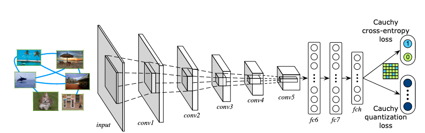
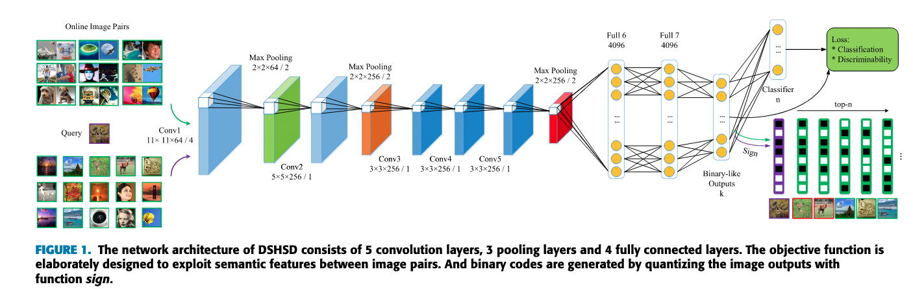
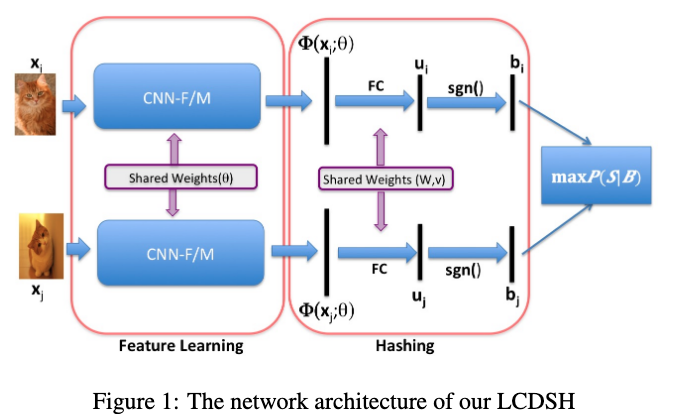

# Deep Hashing算法介绍
----
## 目录

* [1. 简介](#1)
* [2. 算法介绍](#2)
    * [2.1 DCH](#2.1)
    * [2.2 DSHSD](#2.2)
    * [2.3 LCDSH](#2.3)
* [3. 快速体验](#3)
* [4. 总结及建议](#4)

## 1. 简介

最近邻搜索是指在数据库中查找与查询数据距离最近的点，在计算机视觉、推荐系统、机器学习等领域中广泛使用。在PP-ShiTu中，输入图像经过主体检测模型去掉背景后，再经过特征提取模型提取特征，之后经过检索得到检索图像等类别。在这个过程中，一般来说，提取的特征是float32数据类型。当离线特征库中存储的feature比较多时，就占用较大的存储空间，同时检索过程也会变慢。如果利用哈希编码将特征由float32转成0或者1表示的二值特征，那么不仅降低存储空间，同时也能大大加快检索速度。

## 2. 算法介绍

目前PaddleClas中，主要复现了三种DeepHash的方法，分别是：[DCH](http://ise.thss.tsinghua.edu.cn/~mlong/doc/deep-cauchy-hashing-cvpr18.pdf)，[DSHSD](https://ieeexplore.ieee.org/document/8648432/), [LCDSH](https://www.ijcai.org/Proceedings/2017/0499.pdf)。以下做简要介绍。

## 2.1 DCH

此方法基于柯西分布，提出一种成对的交叉熵损失函数，能够较好的得到紧密的hamming特征。在多个数据集上取得较好的结果。详见[论文](http://ise.thss.tsinghua.edu.cn/~mlong/doc/deep-cauchy-hashing-cvpr18.pdf)。方法示意图如下：

## 2.2 DSHSD

DSHSD主要创新点在于，在保证分布一致性的情况下消除差异。首先，作者利用平滑投影函数来放松离散约束，而不是使用任何量化正则化器，其中平滑量是可调整的。其次，在平滑投影和特征分布之间建立数学联系，以保持分布的一致性。进而提出了一种多语义信息融合方法，使hash码学习后能够保留更多的语义信息，从而加快训练收敛速度。其方法在在CIFAR-10、NUS-WIDE和ImageNet数据集上的大量实验表现良好。具体可查看[论文](https://ieeexplore.ieee.org/stamp/stamp.jsp?tp=&arnumber=8648432)。

## 2.3 LCDSH

LCDSH是一种局部约束深度监督哈希算法。该方案通过学习图像对之间的相似特征使得，哈希码保持了DCNN特征的分布，从而有利于准确的图像检索。具体可查看[论文](https://www.ijcai.org/Proceedings/2017/0499.pdf)。

## 3. 快速体验

这个三个哈希算法的配置文件具体位置：
`DCH`: ppcls/configs/DeepHash/DCH.yaml
`DSHSD`: ppcls/configs/DeepHash/DSHSD.yaml
`LCDSH`: ppcls/configs/DeepHash/LCDSH.yaml

具体训练方法，请参考[分类模型训练文档](../models_training/classification.md)

## 4. 总结及建议

不同的DeepHash方法，具有不同特性。可以分别对不同的哈希方法进行尝试，选取最合适自己数据集的方法。
