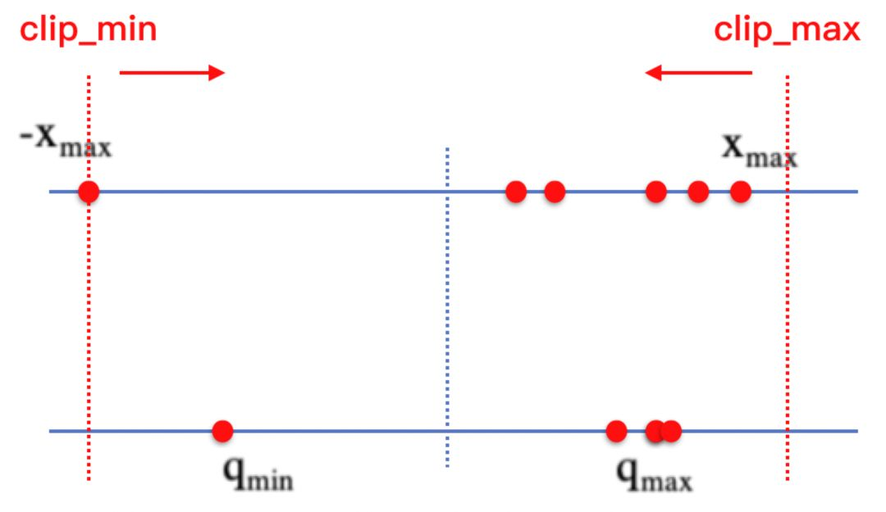
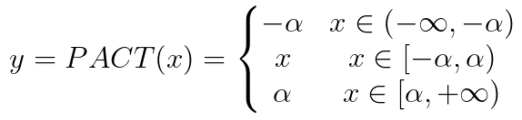

# 模型裁剪、量化算法介绍

深度学习因其计算复杂度或参数冗余，在一些场景和设备上限制了相应的模型部署，需要借助模型压缩、优化加速、异构计算等方法突破瓶颈。模型压缩算法能够有效降低参数冗余，从而减少存储占用、通信带宽和计算复杂度，有助于深度学习的应用部署。其中模型量化、裁剪应用比较广泛。在 PaddleClas 中，主要应该应用以下两种算法。

- 量化方法：PACT 量化
- 裁剪：FPGM 裁剪

其中具体算法参数请参考 [PaddeSlim](https://github.com/PaddlePaddle/PaddleSlim/)。

## 目录

* [1. PACT 量化方法](#1)
* [2. FPGM 裁剪](#2)

## 1. PACT 量化方法

模型量化主要包括两个部分，一是对权重 Weight 量化，一是针对激活值 Activation 量化。同时对两部分进行量化，才能获得最大的计算效率收益。权重可以借助网络正则化等手段，让权重分布尽量紧凑，减少离群点、不均匀分布情况发生，而对于激活值还缺乏有效的手段。

**PACT 量化（PArameterized Clipping acTivation**是一种新的量化方法，该方法通过在量化激活值之前去掉一些离群点，将模型量化带来的精度损失降到最低，甚至比原模型准确率更高。提出方法的背景是作者发现：“在运用权重量化方案来量化 activation 时，激活值的量化结果和全精度结果相差较大”。作者发现，activation 的量化可能引起的误差很大(相较于 weight 基本在 0 到 1 范围内，activation 的值的范围是无限大的，这是 RELU 的结果)，所以提出**截断式 RELU** 的激活函数。该截断的上界，即$α$ 是可学习的参数，这保证了每层能够通过训练学习到不一样的量化范围，最大程度降低量化带来的舍入误差。其中量化的示意图如下图所示，**PACT** 解决问题的方法是，不断裁剪激活值范围，使得激活值分布收窄，从而降低量化映射损失。**PACT** 通过对激活数值做裁剪，从而减少激活分布中的离群点，使量化模型能够得到一个更合理的量化 scale，降低量化损失。

**PACT** 量化公式如下：

可以看出 PACT 思想是用上述量化代替 *ReLU* 函数，对大于零的部分进行一个截断操作，截断阈值为$a$。但是在*PaddleSlim*中对上述公式做了进一步的改进，其改进如下：

经过如上改进后，在激活值和待量化的 OP（卷积，全连接等）之间插入 *PACT* 预处理，不只对大于 0 的分布进行截断，同时也对小于 0 的部分做同样的限制，从而更好地得到待量化的范围，降低量化损失。同时，截断阈值是一个可训练的参数，在量化训练过程中，模型会自动的找到一个合理的截断阈值，从而进一步降低量化精度损失。

算法具体参数请参考 PaddleSlim 中[参数介绍](https://github.com/PaddlePaddle/PaddleSlim/blob/release/2.0.0/docs/zh_cn/api_cn/dygraph/quanter/qat.rst#qat)。

## 2. FPGM 裁剪

模型剪枝是减小模型大小，提升预测效率的一种非常重要的手段。在之前的网络剪枝文章中一般将网络 filter 的范数作为其重要性度量，**范数值较小的代表的 filter 越不重要**，将其从网络中裁剪掉，反之也就越重要。而**FPGM**认为之前的方法要依赖如下两点

- filter 的范数偏差应该比较大，这样重要和非重要的 filter 才可以很好区分开
- 不重要的 filter 的范数应该足够的小

基于此，**FPGM**利用层中 filter 的几何中心特性，由于那些靠近中心的 filter 可以被其它的表达，因而可以将其剔除，从而避免了上面提到的两点剪枝条件，从信息的冗余度出发，而不是选择范数少的进行剪枝。下图展示了 **FPGM** 方法与之前方法的不同，具体细节请详看[论文](https://openaccess.thecvf.com/content_CVPR_2019/papers/He_Filter_Pruning_via_Geometric_Median_for_Deep_Convolutional_Neural_Networks_CVPR_2019_paper.pdf)。

算法具体参数请参考 PaddleSlim 中[参数介绍](https://github.com/PaddlePaddle/PaddleSlim/blob/release/2.0.0/docs/zh_cn/api_cn/dygraph/pruners/fpgm_filter_pruner.rst#fpgmfilterpruner)。
