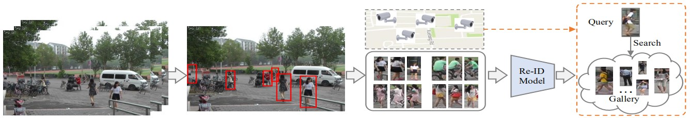
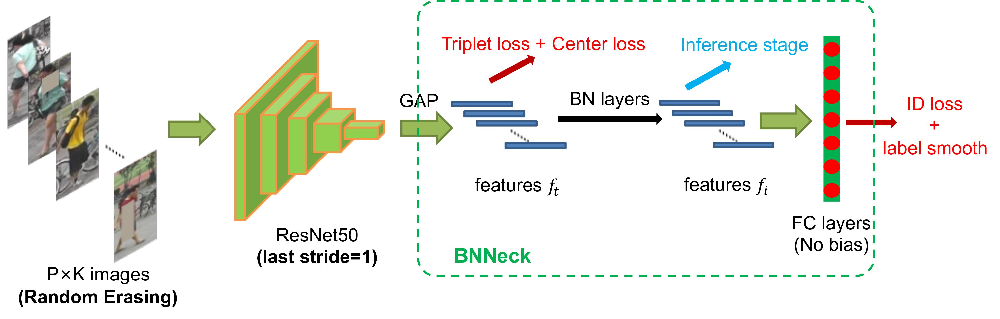

简体中文 | [English](../../en/algorithm_introduction/reid.md)

# ReID行人重识别

## 目录

- [1. 算法/应用场景简介](#1-算法应用场景简介)
- [2. 常用数据集与指标](#2-常用数据集与指标)
  - [2.1 常用数据集](#21-常用数据集)
  - [2.2 常用指标](#22-常用指标)
- [3. ReID算法](#3-reid算法)
  - [3.1 ReID strong-baseline](#31-reid-strong-baseline)
    - [3.1.1 原理介绍](#311-原理介绍)
    - [3.1.2 精度指标](#312-精度指标)
    - [3.1.3 数据准备](#313-数据准备)
    - [3.1.4 模型训练](#314-模型训练)
- [4. 模型评估与推理部署](#4-模型评估与推理部署)
  - [4.1 模型评估](#41-模型评估)
  - [4.2 模型推理](#42-模型推理)
    - [4.2.1 推理模型准备](#421-推理模型准备)
    - [4.2.2 基于 Python 预测引擎推理](#422-基于-python-预测引擎推理)
    - [4.2.3 基于 C++ 预测引擎推理](#423-基于-c-预测引擎推理)
  - [4.3 服务化部署](#43-服务化部署)
  - [4.4 端侧部署](#44-端侧部署)
  - [4.5 Paddle2ONNX 模型转换与预测](#45-paddle2onnx-模型转换与预测)
- [5. 总结](#5-总结)
  - [5.1 方法总结与对比](#51-方法总结与对比)
  - [5.2 使用建议/FAQ](#52-使用建议faq)
- [6. 参考资料](#6-参考资料)

### 1. 算法/应用场景简介

行人重识别（Person re-identification, Re-ID）也称行人再识别，作为跨镜头的行人检索问题被广泛研究。给定某一个摄像机拍摄下的行人图片，目标是判断该行人是否在不同相机或者不同时间段拍摄的画面中出现过。给定的行人数据可以是一张图片，也可以是视频帧，甚至可以是一段文字描述。近年来，公共安全领域对该技术的应用需求日益增加，行人重识别在智能监控技术中的影响也越来越大。

目前行人重识别仍然是一个具有挑战性的任务，尤其是不同的视点、分辨率、光照变化、遮挡情况、多模态，以及复杂的相机环境与背景、标注数据噪声等问题，给识别算法带来了很大的不确定性。另外，在实际落地时，拍摄相机可能会发生变化，大规模的检索库、数据集的分布偏移、未知的场景、模型增量更新以及检索人物的服装变化，这同样增加了不少困难。

早期的行人重识别工作主要关注手工设计特征提取算子，包括加入人体姿态特征，或者距离度量函数的学习。随着深度学习技术的发展，行人重识也取得了巨大的进步。总的来说，行人重识别整个过程包括5个步骤：1)数据采集，2)行人位置框标注，3)行人类别标注，4)模型训练，5)行人检索(模型测试)。



### 2. 常用数据集与指标

#### 2.1 常用数据集

| Dataset     |  #ID   | #Image | #cam  |
| :---------- | :----: | :----: | :---: |
| VIPeR       |  632   |  1264  |   2   |
| iLIDS       |  119   |  476   |   2   |
| GRID        |  250   |  1275  |   8   |
| PRID2011    |  200   |  1134  |   2   |
| CUHK01      |  971   |  3884  |   2   |
| CUHK02      |  1816  |  7264  |  10   |
| CUHK03      |  1467  | 13164  |   2   |
| Market-1501 |  1501  | 32668  |   6   |
| DukeMTMC    |  1404  | 36411  |   8   |
| Airport     | 39902  | 39902  |   6   |
| MSMT17      | 126441 | 126441 |  15   |

#### 2.2 常用指标

1. CMC曲线

    公式如下：
    $$ CMC(K)=\frac{1}{N} \sum_{i=1}^{N} \begin{cases} 1,  & \text{if $label_i \in Top{K}(result_i)$} \\\\ 0, & \text{if $label_i \notin Top{K}(result_i)$} \end{cases} $$

    其中$N$为查询样本的数量，$result_i$为每个查询样本检索结果的标签集合，根据公式可以将CMC曲线理解为Top1-Acc、Top2-Acc、...、TopK-Acc构成的数组，显然这是一个单调不降的曲线。其中常见的Rank-1、Top1-Acc指标即是指CMC(1)

2. mAP指标

    假设使用一个查询样本，返回了一组查询结果，那么按照以下公式，逐个考虑前K个查询结果，对于每个K，算出其精确率Precision和召回率Recall。
    $$\begin{align} precision&=\frac{|\\{同类别图片\\} \cap \\{前K个查询结果\\}|}{|\\{前K个查询结果\\}|} \\\\ recall&=\frac{|\\{同类别图片\\} \cap \\{前K个查询结果\\}|}{|\\{同类别图片\\}|} \end{align}$$
    将得到的多组(Precision, Recall)化成曲线图，该曲线与坐标轴围成的面积，称为Average Precision(AP)，
    对于每个样本，计算其AP值，然后取平均，就得到了mAP指标。
### 3. ReID算法

#### 3.1 ReID strong-baseline

论文出处：[Bag of Tricks and A Strong Baseline for Deep Person Re-identification](https://openaccess.thecvf.com/content_CVPRW_2019/papers/TRMTMCT/Luo_Bag_of_Tricks_and_a_Strong_Baseline_for_Deep_Person_CVPRW_2019_paper.pdf)



##### 3.1.1 原理介绍

作者以普遍使用的基于 ResNet50 的行人重识别模型为基础，探索并总结了以下几种有效且适用性较强的优化方法，大幅度提高了在多个行人重识别数据集上的指标。

1. Warmup：在训练一开始让学习率从一个较小值逐渐升高后再开始下降，有利于梯度下降优化时的稳定性，从而找到更优的参数模型。
2. Random erasing augmentation：随机区域擦除，通过数据增强来提升模型的泛化能力。
3. Label smoothing：标签平滑，提升模型的泛化能力。
4. Last stride=1：设定特征提取模块的最后一个stage的下采样为1，增大输出特征图的分辨率来保留更多细节，提升模型的分类能力。
5. BNNeck：特征向量输入分类头之前先经过BNNeck，让特征在超球体表面服从正态分布，减少了同时优化IDLoss和TripLetLoss的难度。
6. Center loss：给每个类别一个可学习的聚类中心，训练时让类内特征靠近聚类中心，减少类内差异，增大类间差异。
7. Reranking：在检索时考虑查询图像的近邻候选对象，根据候选对象的近邻图像的是否也含有查询图像的情况来优化距离矩阵，最终提升检索精度。

##### 3.1.2 精度指标

以下表格总结了复现的ReID strong-baseline的3种配置在 Market1501 数据集上的精度指标，

| 配置文件                         | recall@1(\%) | mAP(\%) | 参考recall@1(\%) | 参考mAP(\%) | 预训练模型下载地址                                                                                                                      | inference模型下载地址                                                                                                          |
| -------------------------------- | ------------ | ------- | ---------------- | ----------- | --------------------------------------------------------------------------------------------------------------------------------------- | ------------------------------------------------------------------------------------------------------------------------------ |
| baseline.yaml                    | 88.45        | 74.37   | 87.7             | 74.0        | [下载链接](https://paddle-imagenet-models-name.bj.bcebos.com/dygraph/rec/reid/pretrain/baseline_pretrained.pdparams)                    | [下载链接](https://paddle-imagenet-models-name.bj.bcebos.com/dygraph/rec/reid/inference/baseline_infer.tar)                    |
| softmax_triplet.yaml             | 94.29        | 85.57   | 94.1             | 85.7        | [下载链接](https://paddle-imagenet-models-name.bj.bcebos.com/dygraph/rec/reid/pretrain/softmax_triplet_pretrained.pdparams)             | [下载链接](https://paddle-imagenet-models-name.bj.bcebos.com/dygraph/rec/reid/inference/softmax_triplet_infer.tar)             |
| softmax_triplet_with_center.yaml | 94.50        | 85.82   | 94.5             | 85.9        | [下载链接](https://paddle-imagenet-models-name.bj.bcebos.com/dygraph/rec/reid/pretrain/softmax_triplet_with_center_pretrained.pdparams) | [下载链接](https://paddle-imagenet-models-name.bj.bcebos.com/dygraph/rec/reid/inference/softmax_triplet_with_center_infer.tar) |

注：上述参考指标由使用作者开源的代码在我们的设备上训练多次得到，由于系统环境、torch版本、CUDA版本不同等原因，与作者提供的指标可能存在略微差异。

接下来主要以`softmax_triplet_with_center.yaml`配置和训练好的模型文件为例，展示在 Market1501 数据集上进行训练、测试、推理的过程。

##### 3.1.3 数据准备

下载 [Market-1501-v15.09.15.zip](https://pan.baidu.com/s/1ntIi2Op?_at_=1654142245770) 数据集，解压到`PaddleClas/dataset/`下，并组织成以下文件结构：

  ```shell
  PaddleClas/dataset/market1501
  └── Market-1501-v15.09.15/
      ├── bounding_box_test/     # gallery集图片
      ├── bounding_box_train/    # 训练集图片
      ├── gt_bbox/
      ├── gt_query/
      ├── query/                 # query集图片
      ├── generate_anno.py
      ├── bounding_box_test.txt  # gallery集路径
      ├── bounding_box_train.txt # 训练集路径
      ├── query.txt              # query集路径
      └── readme.txt
  ```

##### 3.1.4 模型训练

1. 执行以下命令开始训练

    单卡训练：
    ```shell
    python3.7 tools/train.py -c ./ppcls/configs/reid/strong_baseline/softmax_triplet_with_center.yaml
    ```

    多卡训练：

    多卡训练需修改训练配置的采样器字段以适配分布式训练，如下所示：
    ```yaml
    sampler:
      name: PKSampler
      batch_size: 64
      sample_per_id: 4
      drop_last: False
      sample_method: id_avg_prob
      shuffle: True
    ```
    然后执行以下命令：
    ```shell
    export CUDA_VISIBLE_DEVICES=0,1,2,3
    python3.7 -m paddle.distributed.launch --gpus="0,1,2,3" tools/train.py \
    -c ./ppcls/configs/reid/strong_baseline/softmax_triplet_with_center.yaml
    ```
    注：单卡训练大约需要1个小时。

2. 查看训练日志和保存的模型参数文件

    训练过程中会在屏幕上实时打印loss等指标信息，同时会保存日志文件`train.log`、模型参数文件`*.pdparams`、优化器参数文件`*.pdopt`等内容到`Global.output_dir`指定的文件夹下，默认在`PaddleClas/output/RecModel/`文件夹下。

### 4. 模型评估与推理部署

#### 4.1 模型评估

准备用于评估的`*.pdparams`模型参数文件，可以使用训练好的模型，也可以使用[2.1.4 模型训练](#214-模型训练)中保存的模型。

- 以训练过程中保存的`latest.pdparams`为例，执行如下命令即可进行评估。

  ```shell
  python3.7 tools/eval.py \
  -c ./ppcls/configs/reid/strong_baseline/softmax_triplet_with_center.yaml \
  -o Global.pretrained_model="./output/RecModel/latest"
  ```

- 以训练好的模型为例，下载 [softmax_triplet_with_center_pretrained.pdparams](https://paddle-imagenet-models-name.bj.bcebos.com/dygraph/rec/reid/pretrain/softmax_triplet_with_center_pretrained.pdparams) 到 `PaddleClas/pretrained_models` 文件夹中，执行如下命令即可进行评估。

  ```shell
  # 下载模型
  cd PaddleClas
  mkdir pretrained_models
  cd pretrained_models
  wget https://paddle-imagenet-models-name.bj.bcebos.com/dygraph/rec/reid/pretrain/softmax_triplet_with_center_pretrained.pdparams
  cd ..
  # 评估
  python3.7 tools/eval.py \
  -c ppcls/configs/reid/strong_baseline/softmax_triplet_with_center.yaml \
  -o Global.pretrained_model="pretrained_models/softmax_triplet_with_center_pretrained"
  ```
  注：`pretrained_model` 后填入的地址不需要加 `.pdparams` 后缀，在程序运行时会自动补上。

- 查看输出结果
  ```log
  ...
  ...
  ppcls INFO: unique_endpoints {''}
  ppcls INFO: Found /root/.paddleclas/weights/resnet50-19c8e357_torch2paddle.pdparams
  ppcls INFO: gallery feature calculation process: [0/125]
  ppcls INFO: gallery feature calculation process: [20/125]
  ppcls INFO: gallery feature calculation process: [40/125]
  ppcls INFO: gallery feature calculation process: [60/125]
  ppcls INFO: gallery feature calculation process: [80/125]
  ppcls INFO: gallery feature calculation process: [100/125]
  ppcls INFO: gallery feature calculation process: [120/125]
  ppcls INFO: Build gallery done, all feat shape: [15913, 2048], begin to eval..
  ppcls INFO: query feature calculation process: [0/27]
  ppcls INFO: query feature calculation process: [20/27]
  ppcls INFO: Build query done, all feat shape: [3368, 2048], begin to eval..
  ppcls INFO: re_ranking=False
  ppcls INFO: [Eval][Epoch 0][Avg]recall1: 0.94507, recall5: 0.98248, mAP: 0.85827
  ```
  默认评估日志保存在`PaddleClas/output/RecModel/eval.log`中，可以看到我们提供的 `softmax_triplet_with_center_pretrained.pdparams` 模型在 Market1501 数据集上的评估指标为recall@1=0.94507，recall@5=0.98248，mAP=0.85827

- 使用re-ranking功能提升评估精度

  re-ranking的主要思想是利用检索库之间的相互关系来进一步优化检索结果，比较广泛使用的是k-reciprocal算法。在PaddleClas中在评估时开启re-ranking来提升最终的检索精度。
  如下所示，在评估命令中加上 `-o Global.re_ranking=True` 即可开启该功能。
  ```bash
  python3.7 tools/eval.py \
  -c ppcls/configs/reid/strong_baseline/softmax_triplet_with_center.yaml \
  -o Global.pretrained_model="pretrained_models/softmax_triplet_with_center_pretrained" \
  -o Global.re_ranking=True
  ```
  查看输出结果
  ```log
  ...
  ...
  ppcls INFO: unique_endpoints {''}
  ppcls INFO: Found /root/.paddleclas/weights/resnet50-19c8e357_torch2paddle.pdparams
  ppcls INFO: gallery feature calculation process: [0/125]
  ppcls INFO: gallery feature calculation process: [20/125]
  ppcls INFO: gallery feature calculation process: [40/125]
  ppcls INFO: gallery feature calculation process: [60/125]
  ppcls INFO: gallery feature calculation process: [80/125]
  ppcls INFO: gallery feature calculation process: [100/125]
  ppcls INFO: gallery feature calculation process: [120/125]
  ppcls INFO: Build gallery done, all feat shape: [15913, 2048], begin to eval..
  ppcls INFO: query feature calculation process: [0/27]
  ppcls INFO: query feature calculation process: [20/27]
  ppcls INFO: Build query done, all feat shape: [3368, 2048], begin to eval..
  ppcls INFO: re_ranking=True
  ppcls WARNING: re_ranking=True,Recallk.descending has been set to False
  ppcls WARNING: re_ranking=True,mAP.descending has been set to False
  ppcls INFO: using GPU to compute original distance
  ppcls INFO: starting re_ranking
  ppcls INFO: [Eval][Epoch 0][Avg]recall1: 0.95546, recall5: 0.97743, mAP: 0.94252
  ```
  可以看到开启re-ranking后，评估指标为recall@1=0.95546，recall@5=0.97743，mAP=0.94252，可以发现该算法对mAP指标的提升比较明显(0.85827->0.94252)。

  **注**：目前re-ranking的计算复杂度较高，因此默认不启用。

#### 4.2 模型推理

##### 4.2.1 推理模型准备

可以将训练过程中保存的模型文件转换成 inference 模型并推理，或者使用我们提供的转换好的 inference 模型直接进行推理
  - 将训练过程中保存的模型文件转换成 inference 模型，同样以 `latest.pdparams` 为例，执行以下命令进行转换
    ```shell
    python3.7 tools/export_model.py \
    -c ppcls/configs/reid/strong_baseline/softmax_triplet_with_center.yaml \
    -o Global.pretrained_model="output/RecModel/latest" \
    -o Global.save_inference_dir="./deploy/softmax_triplet_with_center_infer"
    ```

  - 或者下载并解压我们提供的 inference 模型
    ```shell
    cd PaddleClas/deploy
    wget https://paddle-imagenet-models-name.bj.bcebos.com/dygraph/rec/reid/inference/softmax_triplet_with_center_infer.tar
    tar xf softmax_triplet_with_center_infer.tar
    cd ../
    ```

##### 4.2.2 基于 Python 预测引擎推理

  1. 修改 `PaddleClas/deploy/configs/inference_rec.yaml`
      - 将 `infer_imgs:` 后的路径段改为 Market1501 中 query 文件夹下的任意一张图片路径（下方配置使用的是`0294_c1s1_066631_00.jpg`图片的路径）
      - 将 `rec_inference_model_dir:` 后的字段改为解压出来的 softmax_triplet_with_center_infer 文件夹路径
      - 将 `transform_ops:` 字段下的预处理配置改为 `softmax_triplet_with_center.yaml` 中`Eval.Query.dataset` 下的预处理配置

      ```yaml
      Global:
        infer_imgs: "../dataset/market1501/Market-1501-v15.09.15/query/0294_c1s1_066631_00.jpg"
        rec_inference_model_dir: "./softmax_triplet_with_center_infer"
        batch_size: 1
        use_gpu: False
        enable_mkldnn: True
        cpu_num_threads: 10
        enable_benchmark: False
        use_fp16: False
        ir_optim: True
        use_tensorrt: False
        gpu_mem: 8000
        enable_profile: False

      RecPreProcess:
        transform_ops:
          - ResizeImage:
              size: [128, 256]
              return_numpy: False
              interpolation: "bilinear"
              backend: "pil"
          - ToTensor:
          - Normalize:
              mean: [0.485, 0.456, 0.406]
              std: [0.229, 0.224, 0.225]

      RecPostProcess: null
      ```

  2. 执行推理命令

       ```shell
       cd PaddleClas/deploy/
       python3.7 python/predict_rec.py -c ./configs/inference_rec.yaml
       ```

  3. 查看输出结果，实际结果为一个长度2048的向量，表示输入图片经过模型转换后得到的特征向量

       ```log
       0294_c1s1_066631_00.jpg:        [ 0.01806974  0.00476423 -0.00508293 ...  0.03925538  0.00377574
        -0.00849029]
       ```
        推理时的输出向量储存在[predict_rec.py](../../../deploy/python/predict_rec.py#L134-L135)的`result_dict`变量中。

  4. 批量预测，将配置文件中`infer_imgs:`后的路径改为为文件夹即可，如`../dataset/market1501/Market-1501-v15.09.15/query`，会预测并逐个输出query下所有图片的特征向量。

##### 4.2.3 基于 C++ 预测引擎推理

PaddleClas 提供了基于 C++ 预测引擎推理的示例，您可以参考[服务器端 C++ 预测](../inference_deployment/cpp_deploy.md)来完成相应的推理部署。如果您使用的是 Windows 平台，可以参考基于 Visual Studio 2019 Community CMake 编译指南完成相应的预测库编译和模型预测工作。

#### 4.3 服务化部署

Paddle Serving 提供高性能、灵活易用的工业级在线推理服务。Paddle Serving 支持 RESTful、gRPC、bRPC 等多种协议，提供多种异构硬件和多种操作系统环境下推理解决方案。更多关于Paddle Serving 的介绍，可以参考Paddle Serving 代码仓库。

PaddleClas 提供了基于 Paddle Serving 来完成模型服务化部署的示例，您可以参考[模型服务化部署](../inference_deployment/paddle_serving_deploy.md)来完成相应的部署工作。

#### 4.4 端侧部署

Paddle Lite 是一个高性能、轻量级、灵活性强且易于扩展的深度学习推理框架，定位于支持包括移动端、嵌入式以及服务器端在内的多硬件平台。更多关于 Paddle Lite 的介绍，可以参考Paddle Lite 代码仓库。

PaddleClas 提供了基于 Paddle Lite 来完成模型端侧部署的示例，您可以参考[端侧部署](../inference_deployment/paddle_lite_deploy.md)来完成相应的部署工作。

#### 4.5 Paddle2ONNX 模型转换与预测

Paddle2ONNX 支持将 PaddlePaddle 模型格式转化到 ONNX 模型格式。通过 ONNX 可以完成将 Paddle 模型到多种推理引擎的部署，包括TensorRT/OpenVINO/MNN/TNN/NCNN，以及其它对 ONNX 开源格式进行支持的推理引擎或硬件。更多关于 Paddle2ONNX 的介绍，可以参考Paddle2ONNX 代码仓库。

PaddleClas 提供了基于 Paddle2ONNX 来完成 inference 模型转换 ONNX 模型并作推理预测的示例，您可以参考[Paddle2ONNX 模型转换与预测](../../../deploy/paddle2onnx/readme.md)来完成相应的部署工作。

### 5. 总结

#### 5.1 方法总结与对比

上述算法能快速地迁移至多数的ReID模型中，能进一步提升ReID模型的性能。

#### 5.2 使用建议/FAQ

Market1501 数据集比较小，可以尝试训练多次取最高精度。

### 6. 参考资料

1. [Bag of Tricks and A Strong Baseline for Deep Person Re-identification](https://openaccess.thecvf.com/content_CVPRW_2019/papers/TRMTMCT/Luo_Bag_of_Tricks_and_a_Strong_Baseline_for_Deep_Person_CVPRW_2019_paper.pdf)
2. [michuanhaohao/reid-strong-baseline](https://github.com/michuanhaohao/reid-strong-baseline)
3. [行人重识别数据集之 Market1501 数据集_star_function的博客-CSDN博客_market1501数据集](https://blog.csdn.net/qq_39220334/article/details/121470106)
4. [Deep Learning for Person Re-identification:A Survey and Outlook](https://arxiv.org/abs/2001.04193)
5. [ReID任务中的CMC和mAP](https://wrong.wang/blog/20190223-reid%E4%BB%BB%E5%8A%A1%E4%B8%AD%E7%9A%84cmc%E5%92%8Cmap/)
