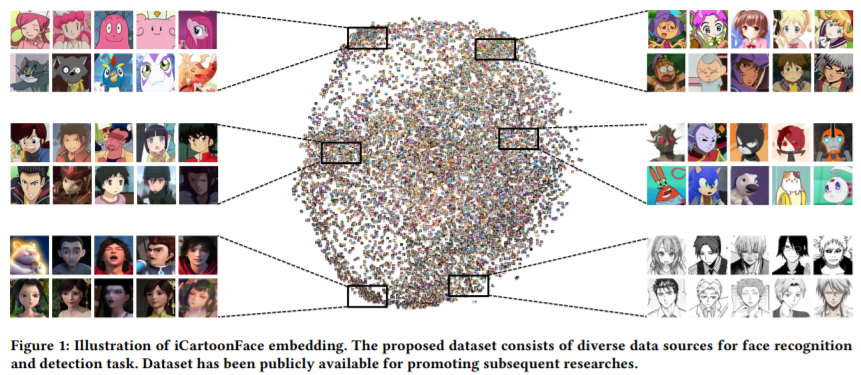

# 动漫人物识别
## 简介
   自七十年代以来，人脸识别已经成为了计算机视觉和生物识别领域研究最多的主题之一。近年来，传统的人脸识别方法已经被基于卷积神经网络（CNN）的深度学习方法代替。目前，人脸识别技术广泛应用于安防、商业、金融、智慧自助终端、娱乐等各个领域。而在行业应用强烈需求的推动下，动漫媒体越来越受到关注，动漫人物的人脸识别也成为一个新的研究领域。

## 数据集
### iCartoonFace数据集
近日，来自爱奇艺的一项新研究提出了一个新的基准数据集，名为iCartoonFace。该数据集由 5013 个动漫角色的 389678 张图像组成，并带有 ID、边界框、姿势和其他辅助属性。 iCartoonFace 是目前图像识别领域规模最大的卡通媒体数据集，而且质量高、注释丰富、内容全面，其中包含相似图像、有遮挡的图像以及外观有变化的图像。
与其他数据集相比，iCartoonFace无论在图像数量还是实体数量上，均具有明显领先的优势:

论文地址：https://arxiv.org/pdf/1907.1339

### 数据预处理

相比于人脸识别任务，动漫人物头像的配饰、道具、发型等因素可以显著提升识别的准确率，因此在原数据集标注框的基础上，长、宽各expand为之前的2倍，并做截断处理，得到了目前训练所有的数据集。
训练集： 5013类，389678张图像； 验证集： query2500张，gallery20000张。训练时，对数据所做的预处理如下：
- 图像`Resize`到224
- 随机水平翻转
- Normalize：归一化到0~1

## 参数设置

详见[配置文件](../../../ppcls/configs/Cartoonface/ResNet50_icartoon.yaml)。

