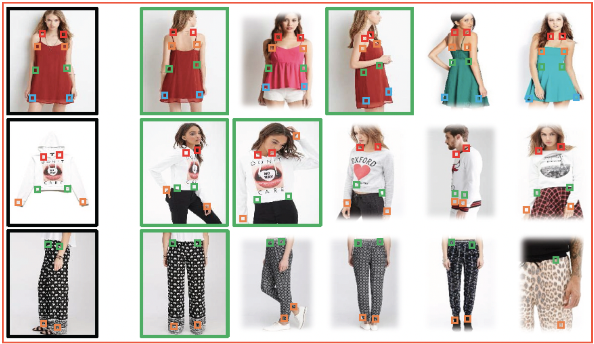

# 商品识别

商品识别技术，是现如今应用非常广的一个领域。拍照购物的方式已经被很多人所采纳，无人结算台已经走入各大超市，无人超市更是如火如荼，这背后都是以商品识别技术作为支撑。商品识别技术大概是"商品检测+商品识别"这样的流程，商品检测模块负责检测出潜在的商品区域，商品识别模型负责将商品检测模块检测出的主体进行识别。识别模块多采用检索的方式，根据查询图片和底库图片进行相似度排序获得预测类别。此文档主要对商品图片的特征提取部分进行相关介绍，内容包括：

-  数据集及预处理方式
-  Backbone的具体设置
-  Loss函数的相关设置

## 1 Aliproduct

### 1 数据集

Aliproduct数据是天池竞赛开源的一个数据集，也是目前开源的最大的商品数据集，其有5万多个标识类别，约250万训练图片。相关数据介绍参考[原论文](https://arxiv.org/abs/2008.05359)。

### 2 图像预处理

- 图像`Resize`到224x224
- 图像`RandomFlip`
- Normlize：图像归一化  

### 3 Backbone的具体设置

具体是用`ResNet50_vd`作为backbone，主要做了如下修改：

 - 使用ImageNet预训练模型

 - 在GAP后、分类层前加入一个512维的embedding FC层，没有做BatchNorm和激活。

### 4 Loss的设置

在Aliproduct商品识别中，使用了[CELoss](../../../ppcls/loss/celoss.py)训练, 为了获得更加鲁棒的特征，后续会使用其他Loss参与训练，敬请期待。

全部的超参数及具体配置：[ResNet50_vd_Aliproduct.yaml](../../../ppcls/configs/Products/ResNet50_vd_Aliproduct.yaml)

## 2 Inshop

### 1 数据集

Inshop数据集是DeepFashion的子集，其是香港中文大学开放的一个large-scale服装数据集，Inshop数据集是其中服装检索数据集，涵盖了大量买家秀的服装。相关数据介绍参考[原论文](https://openaccess.thecvf.com/content_cvpr_2016/papers/Liu_DeepFashion_Powering_Robust_CVPR_2016_paper.pdf)。

### 2 图像预处理

数据增强是训练大规模
- 图像`Resize`到224x224
- 图像`RandomFlip`
- Normlize：图像归一化
- [RandomErasing](https://arxiv.org/pdf/1708.04896v2.pdf)

### 3 Backbone的具体设置

具体是用`ResNet50_vd`作为backbone，主要做了如下修改：

 - 使用ImageNet预训练模型

 - 在GAP后、分类层前加入一个512维的embedding FC层，没有做BatchNorm和激活。
 
 - 分类层采用[Arcmargin Head](../../../ppcls/arch/gears/arcmargin.py)，具体原理可参考[原论文](https://arxiv.org/pdf/1801.07698.pdf)。
   
### 4 Loss的设置

在Inshop商品识别中，使用了[CELoss](../../../ppcls/loss/celoss.py)和[TripletLossV2](../../../ppcls/loss/triplet.py)联合训练。

全部的超参数及具体配置：[ResNet50_vd_Inshop.yaml](../../../ppcls/configs/Products/ResNet50_vd_Inshop.yaml)
