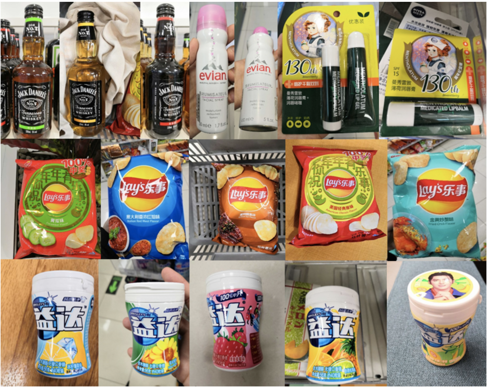

# 商品识别

商品识别技术，是现如今应用非常广的一个领域。拍照购物的方式已经被很多人所采纳，无人结算台已经走入各大超市，无人超市更是如火如荼，这背后都是以商品识别技术作为支撑。商品识别技术大概是"商品检测+商品识别"这样的流程，商品检测模块负责检测出潜在的商品区域，商品识别模型负责将商品检测模块检测出的主体进行识别。识别模块多采用检索的方式，根据查询图片和底库图片进行相似度排序获得预测类别。此文档主要对商品图片的特征提取部分进行相关介绍。

## 1 算法介绍

算法整体流程，详见[特征学习](./feature_learning.md)整体流程。

整体设置详见: [ResNet50_vd_Aliproduct.yaml](../../../ppcls/configs/Products/ResNet50_vd_Aliproduct.yaml)

具体细节如下所示。

### 1.1数据增强

- 图像`RandomCrop`到224x224
- 图像`RandomFlip`
- Normlize：图像归一化  

### 1.2 Backbone的具体设置

具体是用`ResNet50_vd`作为backbone，使用ImageNet预训练模型

### 1.3 Neck部分

加入一个512维的embedding FC层，没有做BatchNorm和激活。

### 1.4 Metric Learning相关Loss的设置

目前使用了[CELoss](../../../ppcls/loss/celoss.py)训练, 为了获得更加鲁棒的特征，后续会使用其他Loss参与训练，敬请期待。

## 2 实验结果

此方案在Aliproduct[1]数据集上进行实验。此数据集是天池竞赛开源的一个数据集，也是目前开源的最大的商品数据集，其有5万多个标识类别，约250万训练图片。

在此数据上，单模型Top 1 Acc：85.67%。

## 3 参考文献

[1] Weakly Supervised Learning with Side Information for Noisy Labeled Images. ECCV, 2020.
