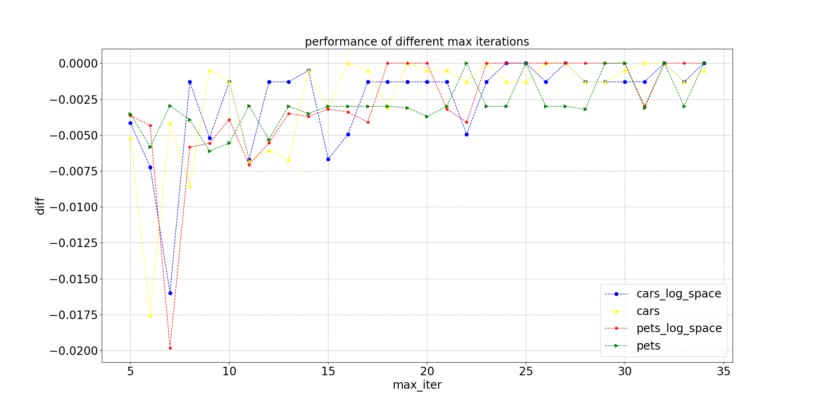

# 迁移学习

迁移学习是机器学习领域的一个重要分支，在文本、图像等各种领域都广泛应用，此处我们主要介绍的是在计算机视觉领域的迁移学习，也就是我们常说的域迁移，比如将 ImageNet 分类模型迁移到我们自己场景的图像分类任务上，如花卉分类。

## 一、 超参搜索

ImageNet 作为业界常用的图像分类数据被大家广泛使用，已经总结出一系列经验性的超参数，使用这些超参数往往能够得到不错的训练精度，而这些经验性的参数往往不能很好的迁移到业务自己的应用场景中，为了获得更好的模型，往往需要经过大量的训练任务来找到合适的超参数。为了降低用户的调参成本，我们提供两种常用的超参数搜索方法。

### 1.1 Grid Search

网格搜索，即穷举搜索，通过查找搜索空间内所有的点，确定最优值。方法简单有效，但耗费计算资源及时间，尤其是当搜索空间越大时，调优的超参数越多。

### 1.2 贝叶斯搜索

贝叶斯搜索，即贝叶斯优化，在搜索空间中随机选取超参数点，采用高斯过程，即根据上一个超参数点的结果，更新当前的先验信息，计算前面n个超参数点的后验概率分布，得到搜索空间中每一个超参数点的期望均值和方差，其中期望均值越大表示接近最优指标的可能性越大，方差越大表示不确定性越大。通常将选择期望均值大的超参数点称为exporitation，选择方差大的超参数点称为exploration。在贝叶斯优化中通过定义acquisition function权衡期望均值和方差。贝叶斯搜索认为当前选择的超参数点是处于最大值可能出现的位置。

------

基于上述两种搜索方案，我们在8个开源数据集上将固定一组参数实验以及两种搜索方案做了对比实验，参照[1]的实验方案，我们对4个超参数进行搜索，搜索空间及实验结果如下所示：

- 固定参数：

初始学习率lr=0.003，l2 decay=1e-4，label smoothing=False，mixup=False

- 超参搜索空间：

初始学习率lr: [0.1, 0.03, 0.01, 0.003, 0.001, 0.0003, 0.0001]

L2 decay: [1e-3, 3e-4, 1e-4, 3e-5, 1e-5, 3e-6, 1e-6]

Label smoothing: [False, True]

Mixup: [False, True]

网格搜索的搜索次数为196次，而贝叶斯搜索通过设置最大迭代次数（max_iter）和是否重复搜索（de_duplication）来确定搜索次数。

- 精度对比:

| 数据集             | 固定参数 | 网格搜索 | 贝叶斯搜索 |
| ------------------ | -------- | -------- | ---------- |
| Oxford-IIIT-Pets   | 93.64%   | 94.55%   | 94.04%     |
| Oxford-102-Flowers | 96.08%   | 97.69%   | 97.49%     |
| Food101            | 87.07%   | 87.52%   | 87.33%     |
| SUN397             | 63.27%   | 64.84%   | 64.55%     |
| Caltech101         | 91.71%   | 92.54%   | 92.16%     |
| DTD                | 76.87%   | 77.53%   | 77.47%     |
| Stanford Cars      | 85.14%   | 92.72%   | 92.72%     |
| FGVC Aircraft      | 80.32%   | 88.45%   | 88.36%     |

- 搜索次数对比:

| 数据集             | 网格搜索 | 贝叶斯搜索 |
| ------------------ | -------- | ---------- |
| Oxford-IIIT-Pets   | 196      | 20         |
| Oxford-102-Flowers | 196      | 20         |
| Food101            | 196      | 23         |
| SUN397             | 196      | 20         |
| Caltech101         | 196      | 14         |
| DTD                | 196      | 13         |
| Stanford Cars      | 196      | 25         |
| FGVC Aircraft      | 196      | 20         |

- 贝叶斯搜索次数与精度的关系：

通过设置不同的max_iter获取贝叶斯搜索到的超参对应的精度，计算与网格搜索最优精度的差异。除此之外，通过设置log_space=True，对初始学习率和l2 decay计算log10的值，使得选取的超参数在数值上为等间隔分布，与log_space=False进行对比，搜索空间参数分布以及对比结果如下：

- log_space=False搜索空间：

初始学习率lr: [0.1, 0.03, 0.01, 0.003, 0.001, 0.0003, 0.0001]

L2 decay: [1e-3, 3e-4, 1e-4, 3e-5, 1e-5, 3e-6, 1e-6]

- log_space=True搜索空间：

初始学习率lr: [-1.0, -1.5, -2.0, -2.5, -3.0, -3.5, -4.0]

L2 decay: [-3.0, -3.5, -4.0, -4.5, -5.0, -5.5, -6.0]

- 通过上述的实验进一步验证了贝叶斯搜索相比网格搜索，当设置的搜索次数越大，精度更能平稳地趋近最优精度。在减少搜索次数10倍左右条件下，贝叶斯搜索精度下降为0%~0.4%。
- log_space=False搜索空间和log_space=False搜索空间在精度上差异不大，说明贝叶斯优化能够有效地应对非等间隔的超参数分布。
- 当搜索空间进一步扩大时，例如将是否进行AutoAugment，RandAugment，Cutout， Cutmix以及Dropout这些正则化策略作为选择时，贝叶斯搜索能够在获取较优精度的前提下，有效地降低搜索次数。

## 二、 大规模分类模型

在实际应用中，由于训练数据的匮乏，往往将ImageNet1k数据集训练的分类模型作为预训练模型，进行图像分类的迁移学习。为了进一步助力解决实际问题，百度开源了自研的大规模分类预训练模型，其中大规模分类数据包含10w类别，训练数据规模为4300w。目前已有ResNet50_vd，ResNet101_vd，MobileNetV3_large_1.0x以及ResNext101等模型，由于数据规模较大，往往在大模型上更能发挥10w类别数据的优势。

我们基于三种模型，分别为ImageNet 预训练的模型、大规模分类预训练模型和蒸馏模型，采用网格搜索方式，训练轮数设置为120epochs，在4个开源数据集上（Oxford-102-Flowers，Food101，DTD和Caltech101）进行对比实验，对比结果如下：

| 模型                         | 网格搜索 |
| ---------------------------- | -------- |
| ImageNet模型 (ResNet50_vd)   | baseline |
| 大规模分类模型 (ResNet50_vd) | +1.035%  |
| 蒸馏模型（ResNet50_vd）      | +1.6%    |

| 模型                          | 网格搜索 |
| ----------------------------- | -------- |
| ImageNet 模型(ResNet101_vd)   | baseline |
| 大规模分类模型 (ResNet101_vd) | +1.398%  |

除此之外，我们还在10个自有采集的数据集上进行迁移学习实验，采用一组固定参数以及网格搜索方式，其中训练轮数设置为20epochs，实验数据集参数以及模型精度的对比结果如下：

固定参数：

初始学习率lr=0.001，l2 decay=1e-4，label smoothing=False，mixup=False

| 数据集          | 数据统计                                  | **ImageNet预训练模型  固定参数Top-1/参数搜索Top-1** | **大规模分类预训练模型 固定参数Top-1/参数搜索Top-1** |
| --------------- | ----------------------------------------- | -------------------------------------------------------- | --------------------------------------------------------- |
| D01花卉         | class:102 train:5789 valid:2396 | 0.7779/0.9883                                            | 0.9892/0.9954                                             |
| D02植物叶子     | class:6 train:7969 valid:3385   | 0.6864/0.7747                                            | 0.7651/0.7678                                             |
| D03花卉         | class:5 train:3035 valid:1285   | 0.9299/0.9505                                            | 0.9550/0.9627                                             |
| D04手绘简笔画   | Class:18 train:1007 valid:432   | 0.8795/0.9196                                            | 0.9107/0.9219                                             |
| D05二维码       | class:3 train:522 valid:212     | 0.9643/0.9643                                            | 0.9545/0.9643                                             |
| D06植物叶子     | class:6 train:5256 valid:2278   | 0.8212/0.8482                                            | 0.8385/0.8659                                             |
| D07集装箱车辆   | Class:115 train:4879 valid:2094 | 0.6230/0.9556                                            | 0.9524/0.9702                                             |
| D08椅子         | class:5 train:169 valid:78      | 0.8557/0.9688                                            | 0.9077/0.9792                                             |
| D09橘子表皮形态 | class:3 train:191 valid:86      | 0.4394/0.4886                                            | 0.3712/0.4839                                             |
| D10地质         | class:4 train:671 valid:296     | 0.5719/0.8094                                            | 0.6781/0.8219                                             |

- 通过上述的实验验证了当使用一组固定参数时，相比于ImageNet预训练模型，使用大规模分类模型作为预训练模型在大多数情况下能够提升迁移学习的精度，通过参数搜索可以进一步提升精度。

# 参考文献

[1] Kornblith, Simon, Jonathon Shlens, and Quoc V. Le. "Do better imagenet models transfer better?." *Proceedings of the IEEE conference on computer vision and pattern recognition*. 2019.

[2] Kolesnikov, Alexander, et al. "Large Scale Learning of General Visual Representations for Transfer." *arXiv preprint arXiv:1912.11370* (2019).
