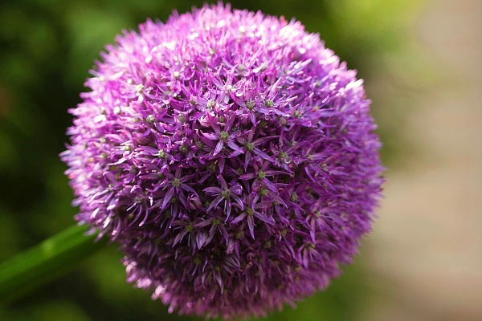
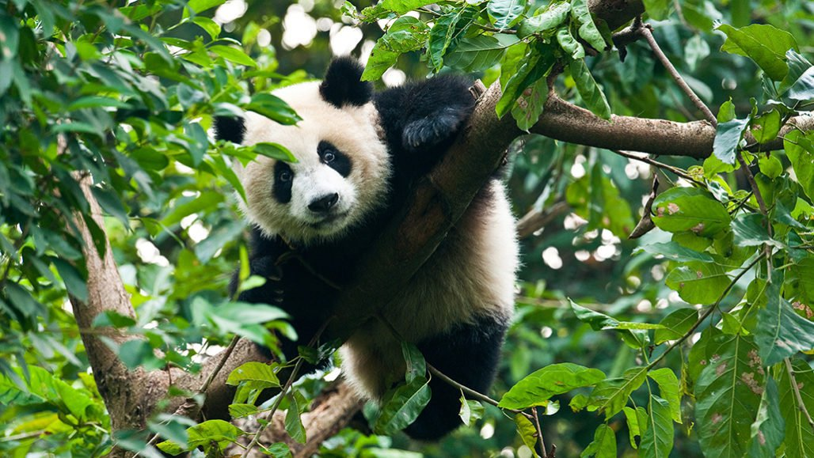
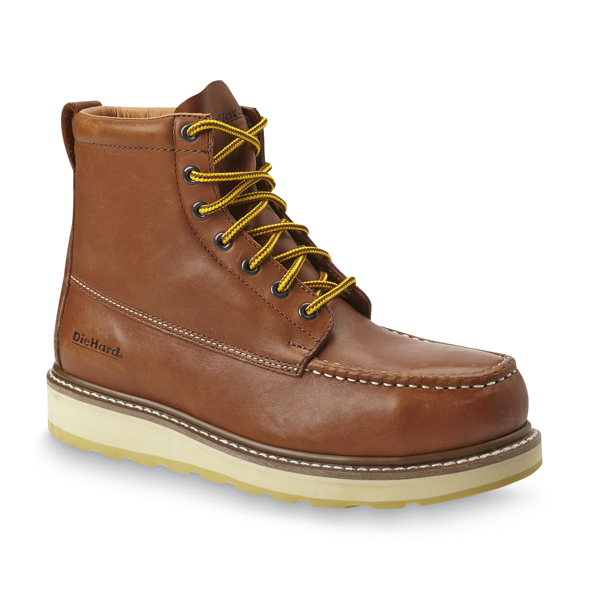
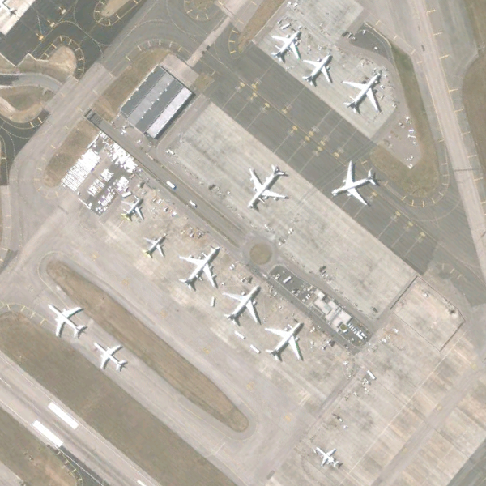
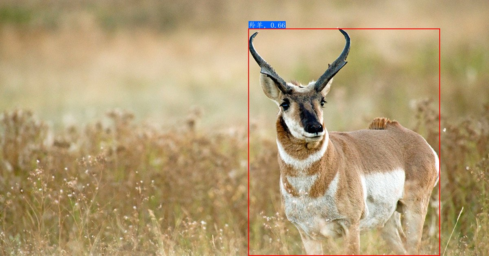

# PP-ShiTu应用场景介绍

该文档介绍了PP-ShiTu提供的各种应用场景库简介、下载链接以及使用简介。

## 目录

- [1. 应用场景介绍](#1-应用场景介绍)
  - [1.1 场景库介绍](#11-场景库介绍)
  - [1.2 场景库下载](#12-场景库下载)

- [2. 使用说明](#2-使用说明)
  - [2.1 环境配置](#21-环境配置)
  - [2.2 下载、解压场景库数据](#22-下载解压场景库数据)
  - [2.3 准备模型](#23-准备模型)
  - [2.4 场景库识别与检索](#24-场景库识别与检索)
    - [2.4.1 识别单张图像](#241-识别单张图像)
    - [2.4.2 基于文件夹的批量识别](#242-基于文件夹的批量识别)


<a name="1. 应用场景介绍"></a>

## 1. 应用场景介绍

<a name="1.1 场景库介绍"></a>

### 1.1 场景库介绍

PP-ShiTu对原数据集进行了`Gallery`库和`Query`库划分，并生成了对应的`Index`索引库，具体应用场景介绍和下载地址如下表所示。

| 类别 | 场景 |示例图|场景简介|Recall@1|场景库下载地址|原数据集下载地址|
|:---:|:---:|:---:|:---:|:---:|:---:|-----|
| 动植物 | 花 |  |104种花细分类识别 | 0.9788 | [104flowers](https://paddle-imagenet-models-name.bj.bcebos.com/dygraph/rec/data/PP-ShiTuV2_application_dataset/104flowers.tar) | [原数据下载地址](https://www.kaggle.com/datasets/msheriey/104-flowers-garden-of-eden) |
| 动植物 | 蝴蝶     |  |              75种蝴蝶细分类识别              |  0.9360  |                 [下载地址](#12-场景库下载)                  | [原数据下载地址](https://www.kaggle.com/datasets/gpiosenka/butterfly-images40-species) |
| 动植物 | 野外植物 |  |                 32种野外植物识别，包括雏菊、蒲公英等                 |  0.9758  |                 [下载地址](#12-场景库下载)                  | [原数据下载地址](https://www.kaggle.com/datasets/ryanpartridge01/wild-edible-plants) |
| 动植物 | 动物 |  |90种动物识别，包括斑马、羚羊等 | 0.9078 | [AnimalImageDataset](https://paddle-imagenet-models-name.bj.bcebos.com/dygraph/rec/data/PP-ShiTuV2_application_dataset/AnimalImageDataset.tar) | [原数据下载地址](https://www.kaggle.com/datasets/iamsouravbanerjee/animal-image-dataset-90-different-animals) |
| 动植物 | 狗识别 |  |69种狗细分类识别，包括柴犬等 | 0.9606 | [下载地址](#12-场景库下载) | [原数据下载地址](https://www.kaggle.com/datasets/gpiosenka/70-dog-breedsimage-data-set) |
| 动植物 | 鸟类 |  |400种各种姿态的鸟细分类识别 | 0.9673 | [下载地址](#12-场景库下载) | [原数据下载地址](https://www.kaggle.com/datasets/gpiosenka/100-bird-species) |
| 商品 | 坚果     |  |               10种坚果种类识别，包括开心果、核桃、腰果等               |  0.9412  |                 [下载地址](#12-场景库下载)                  | [原数据下载地址](https://www.kaggle.com/datasets/gpiosenka/tree-nuts-image-classification) |
| 商品 | 蔬菜     |  |                 116种蔬菜识别，包括菠菜、胡萝卜、玉米等               |  0.8929  |                 [下载地址](#12-场景库下载)                  | [原数据下载地址](https://www.kaggle.com/datasets/zhaoyj688/vegfru) |
| 商品 | 时装     |  |       23种时尚商品识别，包括首饰、挎包、化妆品等       |  0.9555  | [FashionProductImageSmall](https://paddle-imagenet-models-name.bj.bcebos.com/dygraph/rec/data/PP-ShiTuV2_application_dataset/FashionProductImageSmall.tar) | [原数据下载地址](https://www.kaggle.com/datasets/paramaggarwal/fashion-product-images-small) |
| 商品 | 鞋子     |  |        6种鞋子识别，包括靴子、足球鞋等        |  0.9000  |                 [下载地址](#12-场景库下载)                  | [原数据下载地址](https://www.kaggle.com/datasets/noobyogi0100/shoe-dataset) |
| 商品 | 乐器     |  |             30种不同乐器种类识别             |  0.9467  |                 [下载地址](#12-场景库下载)                  | [原数据下载地址](https://www.kaggle.com/datasets/gpiosenka/musical-instruments-image-classification) |
| 商品 | 宝石 |  | 27种宝石识别，包括萤石、翡翠等 | 0.9653 | [下载地址](#12-场景库下载) | [原数据下载地址](https://www.kaggle.com/datasets/lsind18/gemstones-images) |
| 商品 | 球类     |  |                 26种球型物体识别，包括弹珠、足球等                 |  0.9769  | [Balls](https://paddle-imagenet-models-name.bj.bcebos.com/dygraph/rec/data/PP-ShiTuV2_application_dataset/Balls.tar) | [原数据下载地址](https://www.kaggle.com/datasets/gpiosenka/balls-image-classification) |
| 交通 | 交通工具 |  |          9种交通工具粗分类识别，包括车、船等          |  0.9307  | [Vechicles](https://paddle-imagenet-models-name.bj.bcebos.com/dygraph/rec/data/PP-ShiTuV2_application_dataset/Vechicles.tar) | [原数据下载地址](https://www.kaggle.com/datasets/rishabkoul1/vechicle-dataset) |
| 交通 | 船 |  |6种船种类识别，包括游轮、帆船等 |0.9242 | [下载地址](#12-场景库下载) | [原数据下载地址](https://www.kaggle.com/datasets/imsparsh/dockship-boat-type-classification) |
| 交通 | 航拍场景 |  |      30种航拍场景识别，如机场、火车站等      |  0.9797  |                 [下载地址](#12-场景库下载)                  | [原数据下载地址](https://www.kaggle.com/datasets/jiayuanchengala/aid-scene-classification-datasets) |
| 其他 | 巴黎建筑 |  |11个巴黎建筑识别，如：巴黎铁塔、圣母院等 | 1.000 | [下载地址](#12-场景库下载) | [原数据下载地址](https://www.kaggle.com/datasets/skylord/oxbuildings) |
| 其他 | 天气 |  |10种天气场景识别，如：雨天、打雷、下雪等 | 0.9924 | [下载地址](#12-场景库下载) | [原数据下载地址](https://www.kaggle.com/datasets/jehanbhathena/weather-dataset) |
| 其他 | 垃圾 |  |12种垃圾分类识别 | 0.9845 | [下载地址](#12-场景库下载) | [原数据下载地址](https://www.kaggle.com/datasets/mostafaabla/garbage-classification) |
| 其他 | 运动种类 |  |100种运动图像识别 | 0.9413 | [下载地址](#12-场景库下载) | [原数据下载地址](https://www.kaggle.com/datasets/gpiosenka/sports-classification) |
| 其他 | 宝可梦   |  |              150种宝可梦神奇宝贝识别，包括皮卡丘、喷火龙等              |  0.9236  |                 [下载地址](#12-场景库下载)                  | [原数据下载地址](https://www.kaggle.com/datasets/lantian773030/pokemonclassification) |

<a name="1.2 场景库下载"></a>

### 1.2 场景库下载

如需下载已经整理后的场景库数据集，可以扫描下方二维码，关注公众号填写问卷后，加入PaddleClas官方交流群获取**20G重磅图像分类学习大礼包**，**内含上述所有场景库数据集**、**垂类模型集合**（包括人员出入管理、生鲜品识别、商品识别等）、70+前沿图像分类与识别论文、历次发版课程视频与优质社区项目等

<div align="center">
  
</div>
<a name="2. 使用说明"></a>

## 2. 使用说明

<a name="2.1 环境配置"></a>

### 2.1 环境配置
- 安装：请先参考文档[环境准备](../../installation.md)配置PaddleClas运行环境
- 进入`deploy`运行目录，本部分所有内容与命令均需要在`deploy`目录下运行，可以通过下面命令进入`deploy`目录。
```shell
cd deploy
```


<a name="2.2 下载、解压场景库数据"></a>

### 2.2 下载、解压场景库数据
首先创建存放场景库的地址`deploy/datasets`:

```shell
mkdir datasets
```
下载并解压对应场景库到`deploy/datasets`中。
```shell
cd datasets

# 下载并解压场景库数据
wget {场景库下载链接} && tar -xf {压缩包的名称}
```
以`dataset_name`为例，解压完毕后，`datasets/dataset_name`文件夹下应有如下文件结构：
```shel
├── dataset_name/
│   ├── Gallery/
│   ├── Index/
│   ├── Query/
│   ├── gallery_list.txt/
│   ├── query_list.txt/
│   ├── label_list.txt/
├── ...
```
其中，`Gallery`文件夹中存放的是用于构建索引库的原始图像，`Index`表示基于原始图像构建得到的索引库信息，`Query`文件夹存放的是用于检索的图像列表，`gallery_list.txt`和`query_list.txt`分别为索引库和检索图像的标签文件，`label_list.txt`是标签的中英文对照文件（注意：商标场景库文件不包含中英文对照文件）。

<a name="2.3 准备识别模型"></a>

### 2.3 准备模型
创建存放模型的文件夹`deploy/models`，并下载轻量级主体检测、识别模型，命令如下：
```shell
cd ..
mkdir models
cd models

# 下载检测模型并解压
# wget {检测模型下载链接} && tar -xf {检测模型压缩包名称}
wget https://paddle-imagenet-models-name.bj.bcebos.com/dygraph/rec/models/inference/PP-ShiTuV2/general_PPLCNetV2_base_pretrained_v1.0_infer.tar && tar -xf general_PPLCNetV2_base_pretrained_v1.0_infer.tar

# 下载识别 inference 模型并解压
#wget {识别模型下载链接} && tar -xf {识别模型压缩包名称}
wget https://paddle-imagenet-models-name.bj.bcebos.com/dygraph/rec/models/inference/picodet_PPLCNet_x2_5_mainbody_lite_v1.0_infer.tar && tar -xf picodet_PPLCNet_x2_5_mainbody_lite_v1.0_infer.tar
```

解压完成后，`models`文件夹下有如下文件结构：
```
├── inference_model_name
│   ├── inference.pdiparams
│   ├── inference.pdiparams.info
│   └── inference.pdmodel
└── det_model_name
    ├── inference.pdiparams
    ├── inference.pdiparams.info
    └── inference.pdmodel
```

<a name="2.4 场景库识别与检索"></a>

### 2.4 场景库识别与检索

以`动物识别`场景为例，展示识别和检索过程（如果希望尝试其他场景库的识别与检索效果，在下载解压好对应的场景库数据和模型后，替换对应的配置文件即可完成预测）。

注意，此部分使用了`faiss`作为检索库，安装方法如下：
```shell
pip install faiss-cpu==1.7.1post2
```

若使用时，不能正常引用，则`uninstall`之后，重新`install`，尤其是在windows下。

<a name="2.4.1 识别单张图像"></a>

#### 2.4.1 识别单张图像

假设需要测试`./datasets/AnimalImageDataset/Query/羚羊/0a37838e99.jpg`这张图像识别和检索效果。

首先分别修改配置文件`./configs/inference_general.yaml`中的`Global.det_inference_model_dir`和`Global.rec_inference_model_dir`字段为对应的检测和识别模型文件夹，以及修改测试图像地址字段`Global.infer_imgs`示例如下：

```shell
Global:
  infer_imgs: './datasets/AnimalImageDataset/Query/羚羊/0a37838e99.jpg'
  det_inference_model_dir: './models/picodet_PPLCNet_x2_5_mainbody_lite_v1.0_infer.tar'
  rec_inference_model_dir: './models/general_PPLCNetV2_base_pretrained_v1.0_infer.tar'
```

并修改配置文件`./configs/inference_general.yaml`中的`IndexProcess.index_dir`字段为对应场景index库地址：

```shell
IndexProcess:
  index_dir:'./datasets/AnimalImageDataset/Index/'
```


运行下面的命令，对图像`./datasets/AnimalImageDataset/Query/羚羊/0a37838e99.jpg`进行识别与检索

```shell
# 使用下面的命令使用 GPU 进行预测
python3.7 python/predict_system.py -c configs/inference_general.yaml

# 使用下面的命令使用 CPU 进行预测
python3.7 python/predict_system.py -c configs/inference_general.yaml -o Global.use_gpu=False
```

最终输出结果如下：
```
[{'bbox': [609, 70, 1079, 629], 'rec_docs': '羚羊', 'rec_scores': 0.6571544}]
```
其中`bbox`表示检测出的主体所在位置，`rec_docs`表示索引库中与检测框最为相似的类别，`rec_scores`表示对应的置信度。
检测的可视化结果也保存在`output`文件夹下，对于本张图像，识别结果可视化如下所示。



<a name="2.4.2 基于文件夹的批量识别"></a>

#### 2.4.2 基于文件夹的批量识别

如果希望预测文件夹内的图像，可以直接修改配置文件中`Global.infer_imgs`字段，也可以通过下面的`-o`参数修改对应的配置。

```shell
# 使用下面的命令使用 GPU 进行预测，如果希望使用 CPU 预测，可以在命令后面添加 -o Global.use_gpu=False
python3.7 python/predict_system.py -c configs/inference_general.yaml -o Global.infer_imgs="./datasets/AnimalImageDataset/Query/羚羊"
```
终端中会输出该文件夹内所有图像的识别结果，如下所示。
```
...
[{'bbox': [0, 0, 1200, 675], 'rec_docs': '羚羊', 'rec_scores': 0.6153812}]
[{'bbox': [0, 0, 275, 183], 'rec_docs': '羚羊', 'rec_scores': 0.77218026}]
[{'bbox': [264, 79, 1088, 850], 'rec_docs': '羚羊', 'rec_scores': 0.81452656}]
[{'bbox': [0, 0, 188, 268], 'rec_docs': '羚羊', 'rec_scores': 0.637074}]
[{'bbox': [118, 41, 235, 161], 'rec_docs': '羚羊', 'rec_scores': 0.67315465}]
[{'bbox': [0, 0, 175, 287], 'rec_docs': '羚羊', 'rec_scores': 0.68271667}]
[{'bbox': [0, 0, 310, 163], 'rec_docs': '羚羊', 'rec_scores': 0.6706451}]
...
```
所有图像的识别结果可视化图像也保存在`output`文件夹内。
