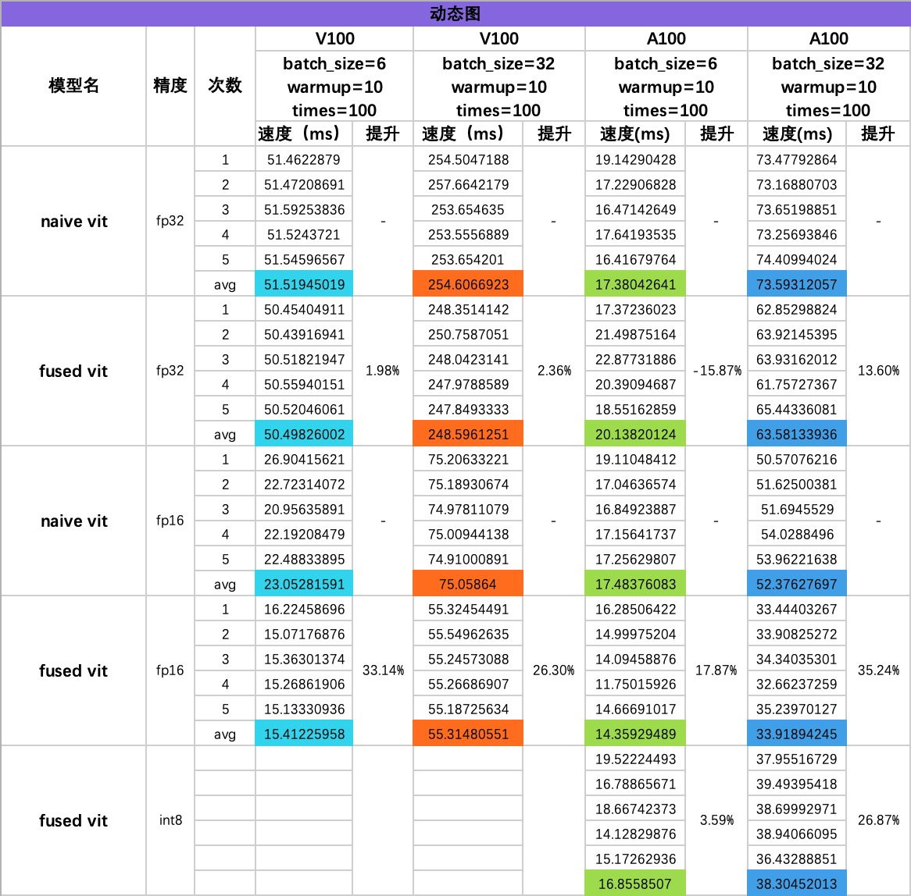
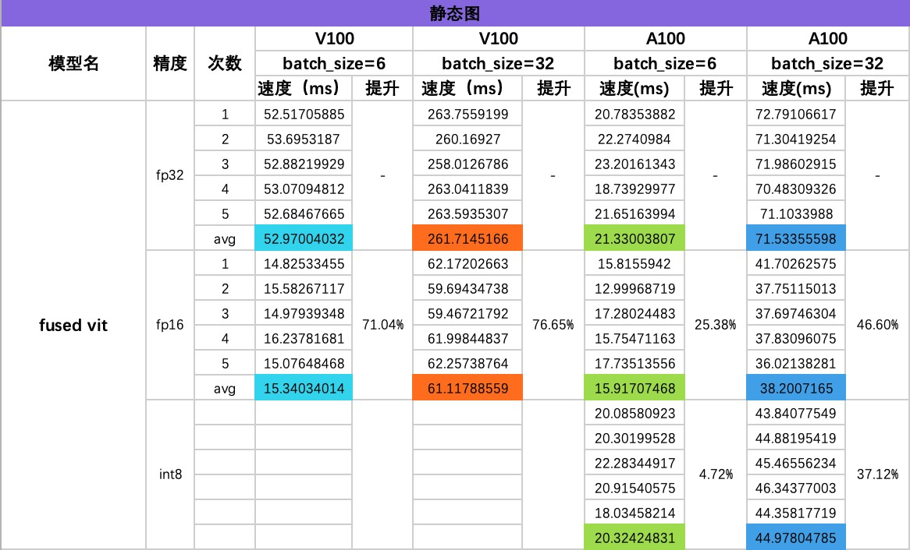

# Fused Vision Transformer 高性能推理使用

PaddleClas 中已经添加高性能推理模型相关实现，支持：

| Model                                                                                           | FP16 | Wint8 | Wint4 | PTQ |
|-------------------------------------------------------------------------------------------------|------|-------|-------|-----|
| [Fused Vision Transformer](../../../ppcls/arch/backbone/model_zoo/fused_vision_transformer.py)  | ✅    | ✅    | ✅    | ❌  |

* 支持以下`fused_vit`类型
  * `Fused_ViT_small_patch16_224`
  * `Fused_ViT_base_patch16_224`
  * `Fused_ViT_base_patch16_384`
  * `Fused_ViT_base_patch32_384`
  * `Fused_ViT_large_patch16_224`
  * `Fused_ViT_large_patch16_384`
  * `Fused_ViT_large_patch32_384`
* 预训练权重来自Vision Transformer对应权重

## 安装自定义算子库

PaddleClas 针对于 Fused Vision Transformer 系列编写了高性能自定义算子，提升模型在推理和解码过程中的性能。

```shell
cd ./PaddleClas/csrc
pip install -r requirements.txt
python setup_cuda.py install
```

## 静态图推理

* 模型导出

```python
from paddleclas import (
    Fused_ViT_large_patch16_224,
    Fused_ViT_large_patch32_384
)
import paddle

if __name__ == "__main__":
    dtype = "float16"
    paddle.set_default_dtype(dtype)
    path = "/your/path/fused_384_fp16/static_model"
    model = Fused_ViT_large_patch32_384(pretrained=True, class_num=1000)
    model.eval()
    model = paddle.jit.to_static(
        model,
        input_spec=[
            paddle.static.InputSpec(
                shape=[None] + [3, 384, 384],
                dtype=dtype
            )
        ]
    )
    paddle.jit.save(model, path)
```

* 模型推理

```python
from paddle.inference import create_predictor
from paddle.inference import PrecisionType
from paddle.inference import Config
from paddleclas_ops import (
    qkv_transpose_split,
    transpose_remove_padding
)
import paddle
import numpy as np

from paddleclas import (
    Fused_ViT_large_patch32_384,
)

def run(predictor, img):
    # copy img data to input tensor
    input_names = predictor.get_input_names()
    for i, name in enumerate(input_names):
        input_tensor = predictor.get_input_handle(name)
        input_tensor.reshape(img[i].shape)
        input_tensor.copy_from_cpu(img[i])
    
    # do the inference
    predictor.run()

    results = []
    # get out data from output tensor
    output_names = predictor.get_output_names()
    for i, name in enumerate(output_names):
        output_tensor = predictor.get_output_handle(name)
        output_data = output_tensor.copy_to_cpu()
        results.append(output_data)
    return results

def static_infer(model_file, params_file, images):
    config = Config(model_file, params_file)
    config.enable_memory_optim()
    config.enable_use_gpu(1000, 0)
    
    predictor = create_predictor(config)

    output = run(predictor, [images])
    
    return output

def main_fp16():
    dtype = "float16"
    N, C, H, W = (1, 3, 384, 384)
    images = np.random.rand(N, C, H, W).astype(dtype)

    # fp32 static infer
    model_file = "/your/path/fused_384_fp16/static_model.pdmodel"
    params_file = "/your/path/fused_384_fp16/static_model.pdiparams"
    static_fp16_output = static_infer(model_file, params_file, images)

if __name__ == "__main__":
    main_fp16()
```

## 动态图推理

### FP16

* `fused_vit`通过`paddle.set_default_dtype`来设置`weight`的数据类型

```python
import paddle
 
from paddleclas import (
    Fused_ViT_large_patch32_384,
)

if __name__ == '__main__':
    dtype = "float16"
    N, C, H, W = (1, 3, 384, 384)
    images = paddle.randn([N, C, H, W]).cast(dtype)
    paddle.set_default_dtype(dtype)

    # ----- Fused Model -----
    fused_model = Fused_ViT_large_patch32_384(pretrained=True, class_num=1000)
    fused_output = fused_model(images)
    print(fused_output)
```

### Weight Only Int8/Int4 推理

> weight only int4 存在精度问题

* 参数介绍：
  * `use_weight_only`：使用 weight only 推理，默认为 False
  * `quant_type`：weight only 类型，默认为`weight_only_int8`，可选`weight_only_int4`

```python
import paddle
 
from paddleclas import (
    Fused_ViT_large_patch32_384,
)

if __name__ == '__main__':
    dtype = "float16"
    N, C, H, W = (1, 3, 384, 384)
    images = paddle.randn([N, C, H, W]).cast(dtype)
    paddle.set_default_dtype(dtype)

    # ----- 8 bits Quanted Model -----
    quanted_model_8 = Fused_ViT_large_patch32_384(pretrained=True, class_num=1000, use_weight_only=True)
    quanted_output_8 = quanted_model_8(images)
    print(quanted_output_8)

    # ----- 4 bits Quanted Model -----
    quanted_model_4 = Fused_ViT_large_patch32_384(pretrained=True, class_num=1000, use_weight_only=True, quant_type="weight_only_int4")
    quanted_output_4 = quanted_model_4(images)
    print(quanted_output_4)
```

## 性能数据
### 测试代码

```python
from paddle.inference import create_predictor
from paddle.inference import PrecisionType
from paddle.inference import Config
from paddleclas_ops import (
    qkv_transpose_split,
    transpose_remove_padding
)
import paddle
import numpy as np
import time
 
from paddleclas import (
    Fused_ViT_large_patch16_224,
    Fused_ViT_large_patch32_384,
    ViT_large_patch16_224,
    ViT_large_patch32_384,
)
 
paddle.seed(42)
np.random.seed(42)
 
warmup_time = 10
test_time = 100
 
def run(predictor, img):
    # copy img data to input tensor
    input_names = predictor.get_input_names()
    for i, name in enumerate(input_names):
        input_tensor = predictor.get_input_handle(name)
        input_tensor.reshape(img[i].shape)
        input_tensor.copy_from_cpu(img[i])
    
    # do the inference
    predictor.run()
 
    results = []
    # get out data from output tensor
    output_names = predictor.get_output_names()
    for i, name in enumerate(output_names):
        output_tensor = predictor.get_output_handle(name)
        output_data = output_tensor.copy_to_cpu()
        results.append(output_data)
    return results
 
def static_infer(model_file, params_file, images):
    config = Config(model_file, params_file)
    config.enable_memory_optim()
    config.enable_use_gpu(1000, 0)
    
    predictor = create_predictor(config)
 
    # warmup
    for i in range(warmup_time):
        result = run(predictor, [images])
    
    # test
    paddle.device.cuda.synchronize()
    time_begin = time.time()
    for i in range(test_time):
        output = run(predictor, [images])
    paddle.device.cuda.synchronize()
    time_end = time.time()
    print(f"input size: {images.shape}, dtype: {images.dtype}, Description: static model, Avg Time: {(time_end - time_begin) / test_time * 1000} ms")
    return output
 
def dynamic_infer(model, images, description):
    # warmup
    for i in range(warmup_time):
        output = model(images)
    
    # test
    paddle.device.cuda.synchronize()
    time_begin = time.time()
    for i in range(test_time):
        output = model(images)
    paddle.device.cuda.synchronize()
    time_end = time.time()
    print(f"input size: {images.shape}, dtype: {images.dtype}, Description: {description}, Avg Time: {(time_end - time_begin) / test_time * 1000} ms")
    return output
 
def main_fp32():
    N, C, H, W = (1, 3, 384, 384)
    # fp32
    dtype = "float32"
    paddle.set_default_dtype(dtype)
    images = np.random.rand(N, C, H, W).astype(dtype)
    images_tensor = paddle.to_tensor(images, dtype=dtype)
    
    # fp32 origin
    origin_model = ViT_large_patch32_384(pretrained=True, class_num=1000)
    origin_output = dynamic_infer(origin_model, images_tensor, "Origin")
    # print(origin_output)
 
    # fp32 fused
    fused_fp32_model = Fused_ViT_large_patch32_384(pretrained=True, class_num=1000)
    fused_fp32_output = dynamic_infer(fused_fp32_model, images_tensor, "Fused fp32")
    # print(fused_fp32_output)
 
    # fp32 static infer
    model_file = "/your/path/fused_384_fp32/static_model.pdmodel"
    params_file = "/your/path/fused_384_fp32/static_model.pdiparams"
    static_fp32_output = static_infer(model_file, params_file, images)
    # print(static_fp32_output)
 
def main_fp16():
    N, C, H, W = (1, 3, 384, 384)
    # fp16
    dtype = "float16"
    paddle.set_default_dtype(dtype)
    images = np.random.rand(N, C, H, W).astype(dtype)
    images_tensor = paddle.to_tensor(images, dtype=dtype)
 
    # fp16 origin
    #   need change code in /paddleclas/ppcls/utils/save_load.py load_dygraph_pretrain
    # origin_model = ViT_large_patch32_384(pretrained=True, class_num=1000)
    # origin_output = dynamic_infer(origin_model, images_tensor, "Origin")
    # print(origin_output)

    # fp16 fused
    fused_fp16_model = Fused_ViT_large_patch32_384(pretrained=True, class_num=1000)
    fused_fp16_output = dynamic_infer(fused_fp16_model, images_tensor, "Fused fp16")
    # print(fused_fp16_output)
 
    # fp16 static infer
    model_file = "/your/path/fused_384_fp16/static_model.pdmodel"
    params_file = "/your/path/fused_384_fp16/static_model.pdiparams"
    static_fp16_output = static_infer(model_file, params_file, images)
    # print(static_fp16_output)
 
    # wint8
    quanted_8_model = Fused_ViT_large_patch32_384(pretrained=True, class_num=1000, use_weight_only=True)
    quanted_8_output = dynamic_infer(quanted_8_model, images_tensor, "8bits Fused Quanted")
    # print(quanted_8_output)
 
if __name__ == "__main__":
    main_fp32()
    main_fp16()
```

### 性能数据—动态图



* 此处的提升是与`naive vit`对应精度实现的对比

### 性能数据—静态图



* 此处的提升是与`fused vit fp32`的对比