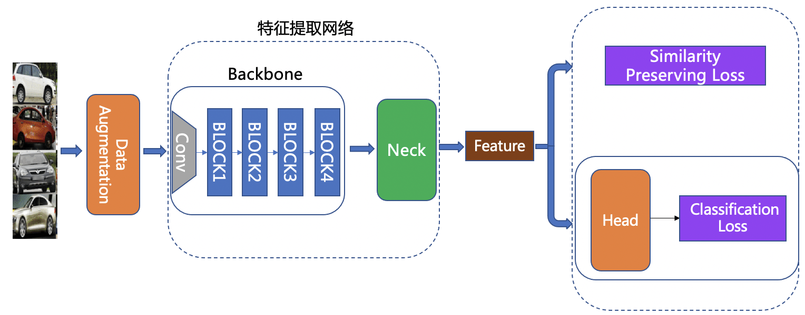
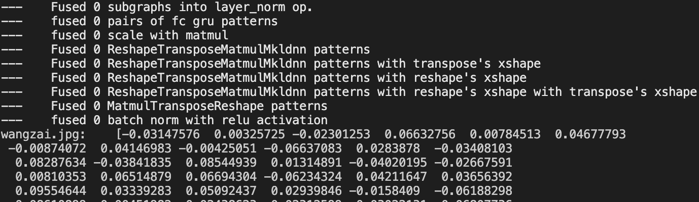

简体中文|[English](../../en/image_recognition_pipeline/feature_extraction_en.md)
# 特征提取

## 目录

- [1. 摘要](#1-摘要)
- [2. 介绍](#2-介绍)
- [3. 方法](#3-方法)
  - [3.1 Backbone](#31-backbone)
  - [3.2 Neck](#32-neck)
  - [3.3 Head](#33-head)
  - [3.4 Loss](#34-loss)
- [4. 实验部分](#4-实验部分)
- [5. 自定义特征提取](#5-自定义特征提取)
  - [5.1 数据准备](#51-数据准备)
  - [5.2 模型训练](#52-模型训练)
  - [5.3 模型评估](#53-模型评估)
  - [5.4 模型推理](#54-模型推理)
    - [5.4.1 导出推理模型](#541-导出推理模型)
    - [5.4.2 获取特征向量](#542-获取特征向量)
- [6. 总结](#6-总结)
- [7. 参考文献](#7-参考文献)

<a name="1"></a>

## 1. 摘要

特征提取是图像识别中的关键一环，它的作用是将输入的图片转化为固定维度的特征向量，用于后续的[向量检索](./vector_search.md)。一个好的特征需要具备“相似度保持性”，即相似度高的图片对，其特征的相似度也比较高（特征空间中的距离比较近），相似度低的图片对，其特征相似度要比较低（特征空间中的距离比较远）。为此[Deep Metric Learning](../algorithm_introduction/metric_learning.md)领域内提出了不少方法用以研究如何通过深度学习来获得具有强表征能力的特征。

<a name="2"></a>

## 2. 介绍

为了图像识别任务的灵活定制，我们将整个网络分为 Backbone、 Neck、 Head 以及 Loss 部分，整体结构如下图所示:

图中各个模块的功能为:

- **Backbone**: 用于提取输入图像初步特征的骨干网络，一般由配置文件中的 [`Backbone`](../../../ppcls/configs/GeneralRecognition/GeneralRecognition_PPLCNet_x2_5.yaml#L26-L29) 以及 [`BackboneStopLayer`](../../../ppcls/configs/GeneralRecognition/GeneralRecognition_PPLCNet_x2_5.yaml#L30-L31) 字段共同指定。
- **Neck**: 用以特征增强及特征维度变换。可以是一个简单的 FC Layer，用来做特征维度变换；也可以是较复杂的 FPN 结构，用以做特征增强，一般由配置文件中的 [`Neck`](../../../ppcls/configs/GeneralRecognition/GeneralRecognition_PPLCNet_x2_5.yaml#L32-L35)字段指定。
- **Head**: 用来将 feature 转化为 logits，让模型在训练阶段能以分类任务的形式进行训练。除了常用的 FC Layer 外，还可以替换为 cosmargin, arcmargin, circlemargin 等模块，一般由配置文件中的 [`Head`](../../../ppcls/configs/GeneralRecognition/GeneralRecognition_PPLCNet_x2_5.yaml#L36-L41)字段指定。
- **Loss**: 指定所使用的 Loss 函数。我们将 Loss 设计为组合 loss 的形式，可以方便地将 Classification Loss 和 Metric learning Loss 组合在一起，一般由配置文件中的 [`Loss`](../../../ppcls/configs/GeneralRecognition/GeneralRecognition_PPLCNet_x2_5.yaml#L44-L50)字段指定。

<a name="3"></a>

## 3. 方法

### 3.1 Backbone

Backbone 部分采用了 [PP_LCNet_x2_5](../models/PP-LCNet.md)，其针对Intel CPU端的性能优化探索了多个有效的结构设计方案，最终实现了在不增加推理时间的情况下，进一步提升模型的性能，最终大幅度超越现有的 SOTA 模型。

### 3.2 Neck

Neck 部分采用了 [FC Layer](../../../ppcls/arch/gears/fc.py)，对 Backbone 抽取得到的特征进行降维，减少了特征存储的成本与计算量。

### 3.3 Head

Head 部分选用 [ArcMargin](../../../ppcls/arch/gears/arcmargin.py)，在训练时通过指定margin，增大同类特征之间的角度差异再进行分类，进一步提升抽取特征的表征能力。

### 3.4 Loss

Loss 部分选用 [Cross entropy loss](../../../ppcls/loss/celoss.py)，在训练时以分类任务的损失函数来指导网络进行优化。详细的配置文件见[通用识别配置文件](../../../ppcls/configs/GeneralRecognition/GeneralRecognition_PPLCNet_x2_5.yaml)。

<a name="4"></a>

## 4. 实验部分

训练数据为如下 7 个公开数据集的汇总：

|    数据集    | 数据量  |  类别数  |   场景   |                                  数据集地址                                  |
| :----------: | :-----: | :------: | :------: | :--------------------------------------------------------------------------: |
|  Aliproduct  | 2498771 |  50030   |   商品   |  [地址](https://retailvisionworkshop.github.io/recognition_challenge_2020/)  |
|    GLDv2     | 1580470 |  81313   |   地标   |           [地址](https://github.com/cvdfoundation/google-landmark)           |
|  VeRI-Wild   | 277797  |  30671   |   车辆   |                [地址](https://github.com/PKU-IMRE/VERI-Wild)                 |
|  LogoDet-3K  | 155427  |   3000   |   Logo   |          [地址](https://github.com/Wangjing1551/LogoDet-3K-Dataset)          |
| iCartoonFace | 389678  |   5013   | 动漫人物 | [地址](http://challenge.ai.iqiyi.com/detail?raceId=5def69ace9fcf68aef76a75d) |
|     SOP      |  59551  |  11318   |   商品   |          [地址](https://cvgl.stanford.edu/projects/lifted_struct/)           |
|    Inshop    |  25882  |   3997   |   商品   |        [地址](http://mmlab.ie.cuhk.edu.hk/projects/DeepFashion.html)         |
|  **Total**   | **5M**  | **185K** |   ----   |                                     ----                                     |

最终的模型效果如下表所示:

|              模型               | Aliproduct | VeRI-Wild | LogoDet-3K | iCartoonFace |  SOP  | Inshop | Latency(ms) |
| :-----------------------------: | :--------: | :-------: | :--------: | :----------: | :---: | :----: | :---------: |
| GeneralRecognition_PPLCNet_x2_5 |   0.839    |   0.888   |   0.861    |    0.841     | 0.793 | 0.892  |     5.0     |

* 预训练模型地址：[通用识别预训练模型](https://paddle-imagenet-models-name.bj.bcebos.com/dygraph/rec/models/pretrain/general_PPLCNet_x2_5_pretrained_v1.0.pdparams)
* 采用的评测指标为：`Recall@1`
* 速度评测机器的 CPU 具体信息为：`Intel(R) Xeon(R) Gold 6148 CPU @ 2.40GHz`
* 速度指标的评测条件为： 开启 MKLDNN, 线程数设置为 10

<a name="5"></a>

## 5. 自定义特征提取

自定义特征提取，是指依据自己的任务，重新训练特征提取模型。

下面基于`GeneralRecognition_PPLCNet_x2_5.yaml`配置文件，介绍主要的四个步骤：1）数据准备；2）模型训练；3）模型评估；4）模型推理


<a name="5.1"></a>

### 5.1 数据准备

首先需要基于任务定制自己的数据集。数据集格式与文件结构详见[数据集格式说明](../data_preparation/recognition_dataset.md)。

准备完毕之后还需要在配置文件中修改数据配置相关的内容, 主要包括数据集的地址以及类别数量。对应到配置文件中的位置如下所示：

- 修改类别数：
  ```yaml
    Head:
      name: ArcMargin
      embedding_size: 512
      class_num: 185341    # 此处表示类别数
  ```
- 修改训练数据集配置：
  ```yaml
    Train:
      dataset:
        name: ImageNetDataset
        image_root: ./dataset/     # 此处表示train数据所在的目录
        cls_label_path: ./dataset/train_reg_all_data.txt  # 此处表示train数据集label文件的地址
  ```
- 修改评估数据集中query数据配置：
  ```yaml
      Query:
        dataset:
          name: VeriWild
          image_root: ./dataset/Aliproduct/    # 此处表示query数据集所在的目录
          cls_label_path: ./dataset/Aliproduct/val_list.txt    # 此处表示query数据集label文件的地址
  ```
- 修改评估数据集中gallery数据配置：
  ```yaml
      Gallery:
        dataset:
          name: VeriWild
          image_root: ./dataset/Aliproduct/    # 此处表示gallery数据集所在的目录
          cls_label_path: ./dataset/Aliproduct/val_list.txt   # 此处表示gallery数据集label文件的地址
  ```

<a name="5.2"></a>

### 5.2 模型训练

模型训练主要包括启动训练和断点恢复训练的功能

- 单机单卡训练
  ```shell
  export CUDA_VISIBLE_DEVICES=0
  python3.7 tools/train.py \
  -c ppcls/configs/GeneralRecognition/GeneralRecognition_PPLCNet_x2_5.yaml
  ```
- 单机多卡训练
  ```shell
  export CUDA_VISIBLE_DEVICES=0,1,2,3
  python3.7 -m paddle.distributed.launch \
  --gpus="0,1,2,3" tools/train.py \
  -c ppcls/configs/GeneralRecognition/GeneralRecognition_PPLCNet_x2_5.yaml
  ```
**注意：**
配置文件中默认采用`在线评估`的方式，如果你想加快训练速度，可以关闭`在线评估`功能，只需要在上述命令的后面，增加 `-o Global.eval_during_train=False`。

训练完毕后，在 output 目录下会生成最终模型文件 `latest.pdparams`，`best_model.pdarams` 和训练日志文件 `train.log`。其中，`best_model` 保存了当前评测指标下的最佳模型，`latest` 用来保存最新生成的模型, 方便在任务中断的情况下从断点位置恢复训练。通过在上述训练命令的末尾加上`-o Global.checkpoint="path_to_resume_checkpoint"`即可从断点恢复训练，示例如下。

- 单机单卡断点恢复训练
  ```shell
  export CUDA_VISIBLE_DEVICES=0
  python3.7 tools/train.py \
  -c ppcls/configs/GeneralRecognition/GeneralRecognition_PPLCNet_x2_5.yaml \
  -o Global.checkpoint="output/RecModel/latest"
  ```
- 单机多卡断点恢复训练
  ```shell
  export CUDA_VISIBLE_DEVICES=0,1,2,3
  python3.7 -m paddle.distributed.launch \
  --gpus="0,1,2,3" tools/train.py \
  -c ppcls/configs/GeneralRecognition/GeneralRecognition_PPLCNet_x2_5.yaml \
  -o Global.checkpoint="output/RecModel/latest"
  ```

<a name="5.3"></a>

### 5.3 模型评估

除了训练过程中对模型进行的在线评估，也可以手动启动评估程序来获得指定的模型的精度指标。

- 单卡评估
  ```shell
  export CUDA_VISIBLE_DEVICES=0
  python3.7 tools/eval.py \
  -c ppcls/configs/GeneralRecognition/GeneralRecognition_PPLCNet_x2_5.yaml \
  -o Global.pretrained_model="output/RecModel/best_model"
  ```

- 多卡评估
  ```shell
  export CUDA_VISIBLE_DEVICES=0,1,2,3
  python3.7 -m paddle.distributed.launch \
  --gpus="0,1,2,3" tools/eval.py \
  -c  ppcls/configs/GeneralRecognition/GeneralRecognition_PPLCNet_x2_5.yaml \
  -o  Global.pretrained_model="output/RecModel/best_model"
  ```
**注：** 建议使用多卡评估。该方式可以利用多卡并行计算快速得到全部数据的特征，能够加速评估的过程。

<a name="5.4"></a>

### 5.4 模型推理

推理过程包括两个步骤： 1）导出推理模型；2）模型推理以获取特征向量

#### 5.4.1 导出推理模型

首先需要将 `*.pdparams` 模型文件转换成 inference 格式，转换命令如下。
```shell
python3.7 tools/export_model.py \
-c ppcls/configs/GeneralRecognition/GeneralRecognition_PPLCNet_x2_5.yaml \
-o Global.pretrained_model="output/RecModel/best_model"
```
生成的推理模型默认位于 `PaddleClas/inference` 目录，里面包含三个文件，分别为 `inference.pdmodel`、`inference.pdiparams`、`inference.pdiparams.info`。
其中`inference.pdmodel` 用来存储推理模型的结构, `inference.pdiparams` 和 `inference.pdiparams.info` 用来存储推理模型相关的参数信息。

#### 5.4.2 获取特征向量

使用上一步转换得到的 inference 格式模型，将输入图片转换为对应的特征向量，推理命令如下。

```shell
cd deploy
python3.7 python/predict_rec.py \
-c configs/inference_rec.yaml \
-o Global.rec_inference_model_dir="../inference"
```
得到的特征输出格式如下图所示：


在实际使用过程中，仅仅得到特征可能并不能满足业务需求。如果想进一步通过特征检索来进行图像识别，可以参照文档[向量检索](./vector_search.md)。

<a name="6"></a>

## 6. 总结

特征提取模块作为图像识别中的关键一环，在网络结构的设计，损失函数的选取上有很大的改进空间。不同的数据集类型有各自不同的特点，如行人重识别、商品识别、人脸识别数据集的分布、图片内容都不尽相同。学术界根据这些特点提出了各种各样的方法，如PCB、MGN、ArcFace、CircleLoss、TripletLoss等，围绕的还是增大类间差异、减少类内差异的最终目标，从而有效地应对各种真实场景数据。

<a name="7"></a>

## 7. 参考文献

1. [PP-LCNet: A Lightweight CPU Convolutional Neural Network](https://arxiv.org/pdf/2109.15099.pdf)
2. [ArcFace: Additive Angular Margin Loss for Deep Face Recognition](https://arxiv.org/abs/1801.07698)
